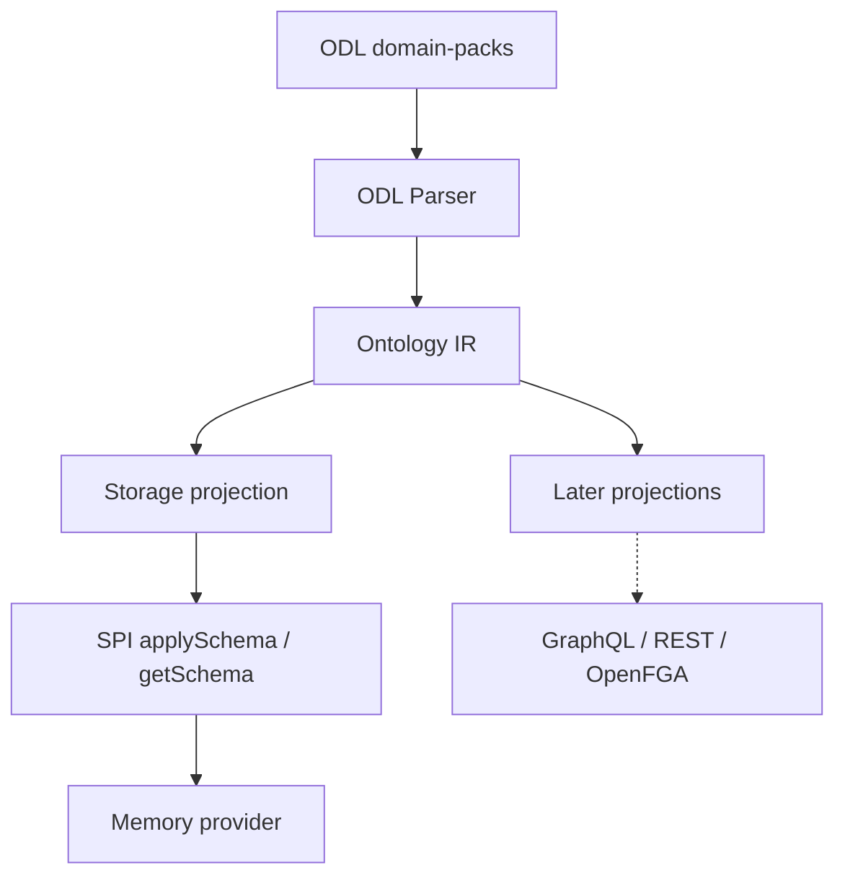

# Requirements: Go Phase 1 — SPI, ODL Parser, Ontology IR

## Summary

Deliver a Go-native Open Foundry Runtime foundation in this repository: Ontology IR as the semantic core, an ODL parser that lowers into that IR, and a protocol-compatible SPI with a schema-only memory path proven on `domain-packs/supply-chain`.

## Problem Frame

The current TypeScript stack already has three partial representations — ODL parse AST (`ParsedSchema`), storage schema (`OntologySchema`), and separate action manifests — but no first-class Ontology IR. `docs/design/draft.md` frames Phase 1 of a Go Runtime as SPI → ODL Parser → Ontology IR, and treats GraphQL as a later projection rather than the core. Without an IR-first Go foundation, later engine, query, and API work re-binds to SDL or storage shapes and repeats the TS coupling.

## Key Decisions

- **Go-native Runtime, protocol-compatible.** Reimplement against ODL/SPI contracts; do not translate the TypeScript codebase line-by-line.
- **IR contract first.** Define Ontology IR and SPI surfaces before optimizing for parse parity theater or storage-shaped shortcuts.
- **Complete TBox in IR; Action signatures only.** Object/link/action/enum/interface/scalar semantics live in IR; YAML effects and Action Runtime stay out of Phase 1.
- **Full SPI interface, schema-only implementation.** Align the Go `StorageProvider` surface with the existing SPI; Phase 1 implements `applySchema` / `getSchema` (plus whatever the interface requires for a honest unimplemented remainder).
- **In-repo Go module using existing packs.** Ship under a new top-level Go directory in this monorepo and reuse `domain-packs/**/*.odl` for acceptance.
- **Single gold pack.** Phase 1 acceptance is `domain-packs/supply-chain` end-to-end; other packs are stretch, not the gate.

## Requirements

**Ontology IR**

- R1. Ontology IR is the semantic source of truth for Phase 1 TBox: namespace, object types, link types, action type signatures, enums, interfaces, scalars, and field-level semantic roles (at least primary, property, param, link navigation, computed).
- R2. Ontology IR is not a GraphQL SDL AST. Downstream consumers must not need GraphQL document nodes to interpret types, links, or actions.
- R3. Action types in IR carry parameter signatures only. Action YAML manifests, effects, preconditions, side effects, and undo are out of Phase 1.

**ODL Parser**

- R4. The Go ODL parser accepts the Open Foundry ODL dialect used by existing domain packs (GraphQL SDL plus Open Foundry directives) and lowers successfully into Ontology IR.
- R5. Parser + lower must load and merge the schema files declared by `domain-packs/supply-chain` into one Ontology IR instance suitable for projection and validation.

**SPI and storage projection**

- R6. Go SPI defines a `StorageProvider` (or equivalent) interface aligned with the existing TypeScript SPI contract surface, including schema and non-schema operations.
- R7. Non-schema SPI methods may be unimplemented in Phase 1, but must fail in a documented, consistent way rather than silently no-oping.
- R8. Ontology IR projects to a storage schema equivalent in role to today's `OntologySchema` (versioned object/link definitions with properties and indexes), applying the same omission rules for primary identity, computed fields, and link-navigation fields.
- R9. A memory (or fixture) storage provider implements `applySchema` and `getSchema` against that projection and proves the path with the supply-chain gold pack.

**Delivery and compatibility**

- R10. Phase 1 code lives in a new Go directory in this repository and can consume `domain-packs/supply-chain` without copying pack sources into the Go tree.
- R11. Success is protocol/runtime foundation readiness, not GraphQL, REST, Postgres, or engine object CRUD.

## Key Flows

- F1. Gold-pack compile and apply
  - **Trigger:** Operator or test runs Phase 1 validate/apply against `domain-packs/supply-chain`.
  - **Actors:** Go ODL toolchain, Ontology IR, memory storage provider.
  - **Steps:** Read pack schema files → parse ODL → lower to Ontology IR → validate IR → project storage schema → `applySchema` → `getSchema` returns applied schema.
  - **Outcome:** Supply-chain TBox is resident in IR and applied to storage schema state.
  - **Covered by:** R4, R5, R8, R9

## Acceptance Examples

- AE1. Supply-chain parse to IR
  - **Covers:** R1, R4, R5
  - **Given:** `domain-packs/supply-chain` schema files on disk
  - **When:** the Go parser+lower runs
  - **Then:** IR contains the pack's object types, link types, action signatures, and enums needed to describe that pack's TBox

- AE2. Storage projection omits non-persistent fields
  - **Covers:** R8
  - **Given:** an IR object type with primary, computed, and link-navigation fields alongside ordinary properties
  - **When:** storage projection runs
  - **Then:** the storage schema keeps ordinary properties/indexes and omits primary identity, computed, and link-navigation fields

- AE3. applySchema round-trip
  - **Covers:** R6, R9
  - **Given:** a storage schema projected from supply-chain IR
  - **When:** memory provider `applySchema` then `getSchema` runs
  - **Then:** the returned schema matches the applied projection for object/link definitions

- AE4. Unimplemented SPI surface
  - **Covers:** R6, R7
  - **Given:** the Go StorageProvider interface exposes non-schema methods
  - **When:** a caller invokes a non-schema method on the Phase 1 memory provider
  - **Then:** the call fails with a documented unimplemented error

## Success Criteria

- Supply-chain gold path is automated: parse → IR → project → `applySchema` / `getSchema`.
- Ontology IR can be inspected without reference to GraphQL AST types.
- SPI interface coverage is complete enough that Phase 2 can implement object/link lifecycle without rewriting the contract.
- A planner can schedule Phase 2 Engine work without inventing Phase 1 scope.

## Scope Boundaries

**In scope**

- Go SPI contract alignment
- ODL parse + lower to Ontology IR
- Storage projection and memory `applySchema` / `getSchema`
- Supply-chain acceptance path
- In-repo Go module layout

**Deferred for later**

- Query IR / Action IR runtime
- Action YAML manifests and effects execution
- GraphQL / REST / FHIR / OpenFGA generators as product surfaces
- PostgreSQL + AGE providers
- Ontology Engine object/link lifecycle beyond schema apply
- Multi-pack gold alignment and bit-exact TS fixture diff as a hard gate

**Outside this Phase's identity**

- Line-by-line TypeScript port
- Making GraphQL the semantic core again

## Dependencies / Assumptions

- Existing `domain-packs/supply-chain` ODL remains a valid protocol reference for Phase 1.
- TypeScript `StorageProvider` / `OntologySchema` / `ParsedSchema` semantics are the compatibility north star; Go may differ in types and packaging.
- Memory/fixture storage is sufficient to prove schema apply; durable DB is Phase 3+.
- Exact Go module path/directory name is a planning detail, not a product fork.

## Outstanding Questions

**Deferred to Planning**

- Exact Go module path and package layout under the new top-level directory
- Which GraphQL/ODL Go parser stack to use, if any
- How strictly storage projection should golden-diff against TS `toOntologySchema` output versus behaviorally matching omission rules
- Whether a minimal CLI (`validate` / `apply-schema`) ships inside Phase 1 or tests alone satisfy R9

## Sources / Research

- `docs/design/draft.md` — Phase 1 order SPI → ODL Parser → Ontology IR; IR as Go core; later Ontology IR + Query IR + Action IR framing
- `packages/odl/src/parser/types.ts` — current `ParsedSchema` AST
- `packages/spi/src/ontology.ts` — `OntologySchema` storage projection
- `packages/spi/src/storage-provider.ts` — `applySchema` / `getSchema`
- `packages/api/src/schema-loader.ts` — TS ParsedSchema → OntologySchema conversion rules
- `domain-packs/supply-chain/schema/` — Phase 1 gold pack
- Grounding dossier from brainstorm scan (local scratch): quotes confirming no existing `OntologyIR` type in repo
