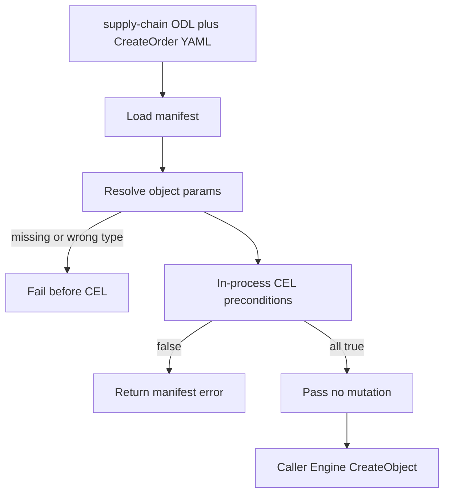

# Requirements: Go Phase 4 — CEL Preconditions and Action Manifest Parse

## Summary

Go Runtime loads the supply-chain `CreateOrder` YAML manifest, resolves object parameters through Engine/SPI, and evaluates CEL preconditions in-process with fixture actor roles. After preconditions pass, callers still apply effects with handwritten Engine verbs. This phase does not execute YAML effects.

---

## Problem Frame

Phases 1–3 gave the Go Runtime Ontology IR (action signatures only), Engine object/link verbs, and a memory SPI transaction. Pack loading still skips action YAML. CEL lives only as a gRPC sidecar under `packages/cel-evaluator`, not inside the Runtime. Domain packs already declare kinetic behavior in YAML (`docs/open-foundry-spec-v2.md` §5), so Go can create objects by verb but cannot yet decide whether a pack action is allowed.

`docs/design/draft.md` lists Phase 4 as CEL → Action Runtime → Transaction / Compensation. The TS Action Framework also runs effects, side-effects, undo, audit, and emit. Those legs stay out until an executor exists. The gap to close now is: pack YAML enters the Runtime, and CreateOrder preconditions evaluate to true or false.

---

## Key Decisions

- **Parser and CEL preconditions, not an Executor.** Phase 4 proves that CreateOrder's rules can be loaded and evaluated. YAML effects are not applied by the Runtime.
- **In-process CEL, not the sidecar.** Gold-path evaluation runs inside the Go Runtime process. The existing gRPC evaluator remains a reference, not a runtime dependency of this phase.
- **Fixture `actor.hasRole`, not OpenFGA.** Callers supply actor roles on the action context. CEL `actor.hasRole` reads that fixture so unmodified pack YAML can evaluate. ReBAC stays a later phase.
- **Runtime resolves object params.** Callers pass parameter IDs plus actor and scalars. The Runtime loads declared object-typed params via Engine/SPI before CEL runs.
- **CreateOrder is the only gold gate.** ShipOrder, ReceiveShipment, and CancelOrder are stretch. They must not block the phase.
- **Extra YAML fields load and are ignored.** `sideEffects`, `rollback`, `reversible`, and `undo` parse so stock pack files load. They are not executed and do not fail load.
- **No action-scoped transaction wrapping.** Phase 3 SPI transactions stay as they are. Preconditions are not held in a transaction until handwritten verbs run. That race is an accepted limitation.
- **No Action IR and no load-time CEL typecheck.** Manifests parse into an executable precondition form. Compile-time CEL checking against Ontology IR is deferred.

---

## Actors

- A1. Gold-path caller (test or operator): submits CreateOrder params and fixture roles, then applies Engine verbs by hand if preconditions pass.
- A2. Action precondition runtime: loads YAML, resolves object params, evaluates CEL.
- A3. Ontology Engine / SPI: supplies resolved objects and accepts handwritten verbs after a pass.

---

## Requirements

**Manifest load**

- R1. The Runtime loads action YAML from `domain-packs/supply-chain` without copying pack sources into the Go tree.
- R2. A loaded CreateOrder manifest matches the Ontology IR `CreateOrder` action signature by name.
- R3. Fields the phase does not execute (`sideEffects`, `rollback`, `reversible`, `undo`) parse successfully and are ignored at evaluation time.

**Parameter resolution**

- R4. Object-typed `@param` fields are resolved through Engine/SPI to object snapshots before CEL runs. CreateOrder requires `supplier` and `product`.
- R5. A missing or wrong-type object param fails before CEL evaluation, with a distinct failure from a false precondition.

**CEL preconditions**

- R6. Preconditions evaluate in-process against snapshots captured at resolve time. Expressions do not re-read storage during evaluation.
- R7. The CEL environment exposes `params`, `actor`, `now`, and each `@param` as a top-level variable (`supplier`, `product`, and CreateOrder scalars).
- R8. `actor.hasRole(role)` is true iff `role` is in the caller-supplied fixture role list. No OpenFGA (or other ReBAC) call is made.
- R9. Every precondition must evaluate to true. On failure, the Runtime returns the manifest `error` string for the first false precondition and applies no Engine verbs.

**Handoff after a pass**

- R10. A successful evaluation does not mutate ontology state. The caller applies effects with Engine verbs (CreateOrder: `CreateObject` of `PurchaseOrder`).
- R11. Success is protocol/runtime readiness for later Action execution, not GraphQL/REST action APIs, event buses, or compensation.

---

## Key Flows

- F1. CreateOrder gold path
  - **Trigger:** Caller evaluates CreateOrder against `domain-packs/supply-chain` with valid supplier/product IDs, quantity > 0, supplier not on probation, and a fixture role of `procurement_manager` or `supply_chain_admin`.
  - **Actors:** A1, A2, A3
  - **Steps:** Load pack ODL + CreateOrder YAML → resolve supplier and product → evaluate CEL preconditions → return pass → caller `CreateObject` PurchaseOrder.
  - **Outcome:** Preconditions pass; a PurchaseOrder exists only because the caller wrote the Engine verb.
  - **Covered by:** R1, R2, R4, R7, R8, R10

- F2. Precondition rejection
  - **Trigger:** Same as F1 except a precondition is false (probation supplier, quantity ≤ 0, or fixture role missing).
  - **Actors:** A1, A2
  - **Steps:** Load and resolve succeed → CEL returns false → Runtime returns that precondition's `error` string.
  - **Outcome:** No Engine verb is implied; ontology state is unchanged by the evaluation.
  - **Covered by:** R9, R10

- F3. Unresolved object param
  - **Trigger:** Caller passes a supplier or product ID that does not exist (or is the wrong object type).
  - **Actors:** A1, A2, A3
  - **Steps:** Load YAML → resolve fails → CEL does not run.
  - **Outcome:** Failure is distinguishable from F2.
  - **Covered by:** R5

---

## Acceptance Examples

- AE1. Unmodified CreateOrder YAML loads
  - **Covers:** R1, R2, R3
  - **Given:** `domain-packs/supply-chain/actions/create-order.yaml` on disk
  - **When:** the Runtime loads the gold pack's action manifests
  - **Then:** CreateOrder is bound to the IR action signature and the file's `sideEffects` / `rollback` / `reversible` fields do not fail load

- AE2. Fixture role lets the role precondition pass
  - **Covers:** R7, R8, R9
  - **Given:** resolved supplier with `tier != 'PROBATION'`, `params.quantity > 0`, fixture roles including `procurement_manager`
  - **When:** CreateOrder preconditions evaluate
  - **Then:** evaluation passes

- AE3. Missing fixture role fails with the manifest error
  - **Covers:** R8, R9
  - **Given:** the same objects and scalars as AE2, fixture roles that include neither `procurement_manager` nor `supply_chain_admin`
  - **When:** CreateOrder preconditions evaluate
  - **Then:** evaluation fails with `Only procurement managers or supply chain admins can create orders`

- AE4. Object param resolve fails before CEL
  - **Covers:** R4, R5
  - **Given:** a CreateOrder submission whose supplier ID is unknown
  - **When:** evaluation is requested
  - **Then:** resolve fails and no CEL precondition `error` string is returned as the primary failure

- AE5. Pass does not create the order
  - **Covers:** R10
  - **Given:** AE2 would pass
  - **When:** evaluation returns success and the caller does not invoke Engine
  - **Then:** no PurchaseOrder is created

- AE6. Caller completes CreateOrder by hand
  - **Covers:** R10, R11
  - **Given:** AE2 passed
  - **When:** the caller `CreateObject`s a PurchaseOrder with the intended fields
  - **Then:** the object exists; that write is not performed by YAML effect execution

---

## Success Criteria

- CreateOrder gold path is automated: load YAML → resolve params → in-process CEL → pass/fail, with a separate handwritten `CreateObject` after pass.
- Unmodified `create-order.yaml` loads; ignored kinetic fields do not execute.
- A planner can schedule an Action Executor phase without inventing Phase 4's parse/eval behavior or its exclusions.

---

## Scope Boundaries

**In scope**

- Load supply-chain action YAML and bind CreateOrder to Ontology IR
- In-process CEL evaluation of CreateOrder preconditions
- Fixture `actor.hasRole`
- Resolve object-typed params via Engine/SPI
- Gold-path handwritten Engine verb after a pass

**Deferred for later**

- Action Executor (apply YAML `effects` in manifest order)
- Wrapping those effects in one SPI transaction, plus compensation / `ROLLBACK_ALL`
- Action undo / reverse manifests (`docs/open-foundry-spec-v2.md` §5.6)
- Side-effects (events, webhooks), audit records, CloudEvent emit
- Authorise and Consent pipeline steps; OpenFGA / ReBAC
- Action IR as a third IR; load-time CEL typecheck against Ontology IR
- CEL functions not required by CreateOrder (`has_link`, `count_links`, `actor.hasPermission`)
- ShipOrder / ReceiveShipment / CancelOrder as acceptance gates
- Engine event emission still stubbed from Phase 3
- GraphQL / REST action APIs and ToolRegistry
- PostgreSQL / AGE providers

**Outside this Phase's identity**

- Line-by-line TypeScript Action Engine port
- Keeping CEL evaluation on a required gRPC sidecar for the gold path
- Treating handwritten Engine verbs as a substitute for a future Executor — they are the Phase 4 handoff, not the end state of Action Runtime

---

## Dependencies / Assumptions

- Phases 1–3 remain the foundation: Ontology IR action signatures, pack ODL load, Engine lifecycle verbs, memory SPI (including `BeginTransaction`, unused by this phase's gold path).
- `domain-packs/supply-chain/actions/create-order.yaml` stays the protocol reference: `actor.hasRole`, `supplier.tier`, `params.quantity`, `reversible: false`, `onSideEffectFailure: LOG_AND_CONTINUE`.
- Memory storage is enough to resolve objects and to prove the handwritten `CreateObject`.
- Spec §5.3 pipeline steps after Preconditions are out of scope; skipping them is a phase cut, not a spec rewrite.
- Race between precondition evaluation and later handwritten verbs is accepted; closing it belongs to the Executor phase.

---

## Outstanding Questions

**Deferred to Planning**

- How in-process CEL is embedded (reuse evaluator code vs a Runtime-local evaluator)
- Whether pack manifests declare an actions list or the loader discovers `actions/*.yaml`
- Error types for resolve failure vs precondition failure vs CEL runtime errors
- Whether stretch manifests get parse-only tests without evaluation gates
- How much of spec §5.2.1 beyond CreateOrder (`now` timestamp representation, null guards) must be implemented vs stubbed

---

## Sources / Research

- `docs/design/draft.md` — Phase 4 order CEL → Action Runtime → Transaction / Compensation; embed CEL rather than port it
- `docs/open-foundry-spec-v2.md` — §3.4 action maps to one transaction; §5 Action Framework; §5.2 CEL environment; §5.3 pipeline; §5.6 undo
- `docs/brainstorms/2026-08-10-go-phase1-ontology-ir-requirements.md` — Action YAML and effects deferred from Phase 1
- `docs/plans/2026-08-11-002-feat-go-phase3-full-spi-surface-plan.md` — memory SPI transactions exist; event emit still later
- `packages/actions/src/executor/action-executor.ts` — TS pipeline and single-transaction effect loop (reference, not this phase)
- `packages/cel-evaluator/` — existing Go CEL sidecar with cel-go; gold path must not require it over gRPC
- `runtime/pack/loader.go` — loads ODL only; does not load action YAML
- `runtime/ir/ontology.go` — `ActionType` is params only
- `runtime/go.mod` — no in-process CEL dependency today
- `domain-packs/supply-chain/schema/actions.odl` — CreateOrder signature
- `domain-packs/supply-chain/actions/create-order.yaml` — gold manifest
