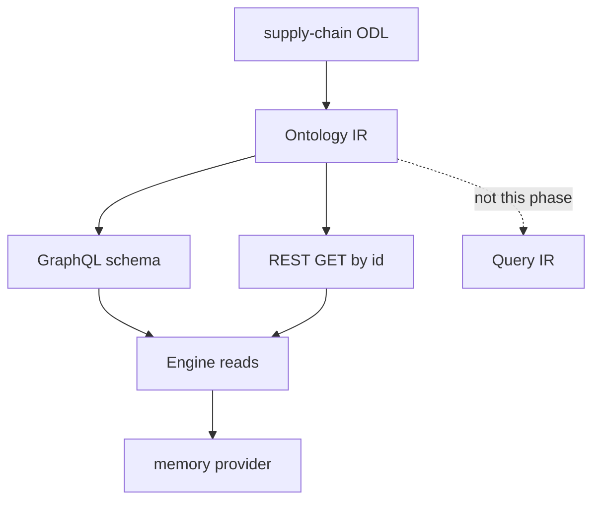

# Requirements: Go Phase 6 — Read-Only GraphQL API and REST GET

## Summary

Go Runtime exposes a read-only GraphQL HTTP API generated from Ontology IR, served over Engine plus the memory storage provider. The gold pack is `domain-packs/supply-chain`: get-by-id, filtered/paginated lists, aggregates, per-type search, nested link fields, and LAZY `@computed` on read. REST proves a second projection with GET by id only.

---

## Problem Frame

Phases 1–4 delivered Ontology IR, Engine lifecycle verbs, a full memory SPI (including query/aggregate/search/links), and CEL preconditions. There is still no HTTP or GraphQL surface in `runtime/`. TypeScript `packages/api` generates GraphQL, REST, and subscriptions from ODL, with resolvers calling Engine `ObjectManager` / `LinkManager` and mutations going through an Action executor that Go does not have.

`docs/design/draft.md` places GraphQL / REST / WebSocket in Phase 6 and treats GraphQL as a projection of Ontology IR, not the semantic core. Phase 5 (OpenFGA / consent / audit) has not landed in Go. Engine event emission is still stubbed, so subscriptions have no source. This phase ships a read API that can be integration-tested against memory, without pretending the write or security pipeline exists.

---

## Key Decisions

- **Read-only gold.** GraphQL queries and one REST GET are in. Mutations, Action HTTP, and WebSocket subscriptions are out.
- **GraphQL is the product this phase; REST is an existence proof.** GraphQL carries get, list, filter, Relay pagination, aggregate, `searchFoos`, and nested links. REST only implements GET by id for the same objects.
- **No auth, omit security fields.** Requests carry tenant (and other test `RequestContext`) from the caller. Generated schema does not include `_redactedFields` or `_consentRestricted`. ODL nullability is kept; the spec redaction-nullable transform waits for Phase 5.
- **IR → GraphQL, resolvers → Engine.** Schema is generated from Ontology IR, not from GraphQL AST. Resolvers call Engine read verbs, not SPI directly. Query IR is not introduced.
- **Follow memory search capability, but only per-type search.** Memory advertises `supportsFullTextSearch = true`, so `searchFoos` is generated. `searchAll` and `typeahead` stay deferred despite spec §8.1.5 listing all three as MUST.
- **LAZY computed is in.** Read paths evaluate `@computed(cache: LAZY)` needed by the gold pack (Facility `currentUtilization` via `countLinks`). This phase extends Engine reads, not only HTTP.
- **Single gold pack, all ObjectTypes.** Every supply-chain ObjectType gets the generated query surface. Other packs are stretch.

---

## Actors

- A1. Gold-path caller (test or operator): issues GraphQL over HTTP and REST GET against a Runtime wired to memory, with a tenant in request context.
- A2. API projection: builds the GraphQL schema from Ontology IR and maps operations onto Engine reads.
- A3. Engine plus memory provider: executes get, query, aggregate, search, link expansion, and LAZY computed evaluation.

---

## Requirements

**Projection and transport**

- R1. GraphQL schema for this phase is generated from Ontology IR. Consumers of the schema generator must not need GraphQL AST nodes from the ODL parse.
- R2. The Runtime serves that schema over HTTP GraphQL. Gold-path tests exercise the HTTP surface, not only in-process execute.
- R3. REST exposes GET by id for each generated ObjectType as a second projection of the same Engine get. List, links, history, aggregate, health, and action POST are out.
- R4. GraphQL and REST reads go through Engine. They do not call the storage provider directly.

**Generated GraphQL surface**

- R5. For each ObjectType `Foo` in the loaded supply-chain IR, the schema includes get-by-id, filtered list with Relay-style pagination, and aggregate, matching the roles in `docs/open-foundry-spec-v2.md` §8.1.1 (plus aggregate, which TS already ships).
- R6. Because the memory provider advertises full-text search, each ObjectType also gets per-type `searchFoos`. `searchAll` and `typeahead` are not generated.
- R7. Mutation and Subscription root fields are omitted from the generated schema.
- R8. `_redactedFields` and `_consentRestricted` are omitted. Field nullability follows ODL, not the spec redaction envelope.
- R9. ObjectType link-navigation fields are present and resolved through Engine link reads (for example `product { supplier { name } }`).

**Engine read path**

- R10. Engine exposes the read verbs this API needs: get, query, aggregate, search, and link listing/expansion. Query/aggregate/search may pass through to SPI the way TypeScript `ObjectManager` does, after any Engine-owned read enrichment.
- R11. On object reads that return a type with LAZY `@computed` fields, Engine evaluates those functions and merges the results before the API returns the object. Gold pack: Facility `currentUtilization` from `countLinks` over `InventoryAt`.
- R12. Missing objects fail as not-found on both GraphQL get-by-id and REST GET by id. Cross-tenant misses stay not-found, same as Engine get.

**Integration**

- R13. Gold path uses the in-repo memory provider as the storage backend. PostgreSQL is out.
- R14. Callers supply tenant (and any other `RequestContext` fields Engine already requires). There is no authenticate / authorise / consent / redact pipeline.
- R15. Success is a working read API over memory, not protocol-complete spec §8 and not an api-gateway with FHIR, SDK, or governance.

---

## Key Flows

- F1. GraphQL get and nested link
  - **Trigger:** Caller queries a Product (or other gold type) by id and selects a nested supplier (or other link field).
  - **Actors:** A1, A2, A3
  - **Steps:** HTTP GraphQL → Engine get → resolve link fields via Engine → return scalars and nested objects.
  - **Outcome:** The linked object's requested fields are present. No SPI call originates in the API layer.
  - **Covered by:** R2, R4, R9, R10

- F2. List, aggregate, and per-type search
  - **Trigger:** Caller lists a type with filter and pagination, runs an aggregate, or runs `searchFoos`.
  - **Actors:** A1, A2, A3
  - **Steps:** HTTP GraphQL → Engine query / aggregate / search → memory SPI.
  - **Outcome:** Results reflect memory semantics (filters, page info, aggregate groups, token search). `searchAll` / `typeahead` are absent from the schema.
  - **Covered by:** R5, R6, R10

- F3. LAZY computed on read
  - **Trigger:** Caller reads a Facility that has InventoryAt links.
  - **Actors:** A1, A2, A3
  - **Steps:** Engine get (or nested get) evaluates `countLinks` and sets `currentUtilization`.
  - **Outcome:** The field is a count of active InventoryAt links, not null and not omitted from the schema.
  - **Covered by:** R11

- F4. REST GET by id
  - **Trigger:** Caller GETs `/api/v1/{objectType}/{id}` for a supply-chain object that exists in the same tenant.
  - **Actors:** A1, A2, A3
  - **Steps:** REST → Engine get → response body with the object's fields (including LAZY computed when applicable).
  - **Outcome:** Same object as GraphQL get-by-id. Unknown id is not-found.
  - **Covered by:** R3, R12, R14

---

## Acceptance Examples

- AE1. IR-generated get
  - **Covers:** R1, R2, R5
  - **Given:** supply-chain pack loaded into Ontology IR and applied to memory
  - **When:** GraphQL `product(id:)` runs over HTTP for a stored Product
  - **Then:** scalar/property fields return; the schema did not require GraphQL AST to generate `product` / `products`

- AE2. Nested link
  - **Covers:** R9, R4
  - **Given:** a Product linked to a Supplier via SuppliesProduct
  - **When:** GraphQL requests `product { supplier { name } }`
  - **Then:** the supplier name is returned from Engine link resolution

- AE3. Filter and pagination
  - **Covers:** R5
  - **Given:** multiple Products in the tenant
  - **When:** `products(filter:, first:, after:)` runs
  - **Then:** the connection includes edges, pageInfo, and totalCount consistent with the filter

- AE4. Aggregate
  - **Covers:** R5, R10
  - **Given:** Facilities (or another gold type) with numeric fields
  - **When:** the generated aggregate field runs
  - **Then:** Engine aggregate returns groups matching memory `AggregateObjects`

- AE5. searchFoos present; cross-type search absent
  - **Covers:** R6
  - **Given:** memory capabilities report full-text search
  - **When:** the generated schema is inspected
  - **Then:** per-type search exists; `searchAll` and `typeahead` do not

- AE6. Facility computed
  - **Covers:** R11
  - **Given:** a Facility with N active InventoryAt links
  - **When:** GraphQL or REST get returns that Facility
  - **Then:** `currentUtilization` equals N

- AE7. REST existence proof
  - **Covers:** R3, R12
  - **Given:** the same Product as AE1
  - **When:** REST GET by id succeeds and GET of an unknown id runs
  - **Then:** the success body matches GraphQL get; unknown id is not-found; list/links/history routes are not mounted as gold

- AE8. Schema omits writes, subscriptions, and security envelopes
  - **Covers:** R7, R8
  - **Given:** the generated GraphQL schema
  - **When:** it is inspected
  - **Then:** no Action mutations, no `*Changed` subscriptions, no `_redactedFields` / `_consentRestricted`

- AE9. Unauthenticated tenant context
  - **Covers:** R14
  - **Given:** a request with tenant in context and no auth token
  - **When:** a gold query runs
  - **Then:** it is not rejected for missing authentication

---

## Success Criteria

- Supply-chain gold path is automated over HTTP: load pack → apply memory schema → seed objects/links → GraphQL get/list/aggregate/searchFoos/nested links, plus REST GET by id.
- Facility `currentUtilization` is correct after LAZY evaluation.
- A planner can schedule Query IR, subscriptions, Action HTTP, and Phase 5 security without inventing this phase's read-only cuts.

---

## Scope Boundaries

**In scope**

- GraphQL HTTP generated from Ontology IR for all supply-chain ObjectTypes
- List filter, Relay pagination, aggregate, per-type search
- Nested link resolvers
- Engine read verbs plus LAZY `@computed` (`countLinks`)
- REST GET by id as a second projection
- Memory provider as the integration backend

**Deferred for later**

- WebSocket / GraphQL Subscriptions (no EventBus yet)
- Action mutations and Action Executor
- OpenFGA, consent, field redaction, `_redactedFields` / `_consentRestricted`, redaction-nullable schema transform
- `searchAll`, `typeahead`, and BM25 ranking (memory token search is enough for `searchFoos`)
- REST list, links, history, aggregate, `/health`
- Query IR and additional query languages (SPARQL / Cypher)
- FHIR, CDM, SDK generation, OpenAPI/AsyncAPI dumps
- Rate limits, query complexity, and other API governance
- PostgreSQL / AGE providers

**Outside this Phase's identity**

- Line-by-line port of `packages/api`
- Treating GraphQL SDL as the semantic source of truth
- Shipping an authenticated api-gateway

---

## Dependencies / Assumptions

- Phases 1–4 remain the foundation: Ontology IR, pack load, Engine lifecycle, memory SPI including `QueryObjects` / `AggregateObjects` / `SearchObjects` / `GetLinks`, CEL unused by this read-only gold path.
- Memory `SupportsFullTextSearch: true` stays true; if a future provider advertises false, that deployment omits `searchFoos`.
- Memory search ranking stays the current token-count behaviour; spec BM25 is not a gold gate.
- Engine today has get/create/update/delete for objects and links only. This phase adds the read verbs TypeScript `ObjectManager.query` / `aggregate` / `search` (and link listing) already pass through to SPI.
- Spec §8.1.5's MUST for `searchAll` and `typeahead` is a documented phase cut, not a spec rewrite.
- Skipping authenticate / authorise / consent is a phase cut, same posture as Phase 4 fixture roles.

---

## Outstanding Questions

**Deferred to Planning**

- GraphQL HTTP stack and how tests bind a server to memory Engine
- Relay cursor encoding and filter/orderBy mapping from GraphQL input onto SPI `FilterExpression` / `QueryOptions`
- Whether nested links batch or resolve per field; cardinality ONE vs MANY return shape
- Where `countLinks` runs (Engine get enrichment vs a dedicated computed evaluator)
- GraphQL error envelope vs REST not-found encoding
- Whether EAGER `@computed` exists in the gold pack and must be evaluated too (supply-chain gold is LAZY `countLinks`)

---

## Sources / Research

- `docs/design/draft.md` — Phase 6 GraphQL / REST / WebSocket; GraphQL is an IR projection; dynamic resolvers rather than static codegen as the hard problem
- `docs/open-foundry-spec-v2.md` — §8.1 generated queries, §8.1.4 subscriptions, §8.1.5 search MUST three fields, §8.2 REST
- `docs/brainstorms/2026-08-10-go-phase1-ontology-ir-requirements.md` — Ontology IR is not GraphQL AST; GraphQL deferred
- `docs/brainstorms/2026-08-18-go-phase4-cel-action-requirements.md` — no Action HTTP; no OpenFGA; Engine events still stubbed
- `docs/plans/2026-08-11-002-feat-go-phase3-full-spi-surface-plan.md` — memory query/aggregate/search/links; events deferred
- `packages/api/src/graphql/resolver-generator.ts` — get/query/aggregate/search/subscriptions; security pipeline; ActionExecutor mutations
- `packages/api/src/rest/route-generator.ts` — REST list/get/links/history/aggregate/actions
- `packages/engine/src/objects/object-manager.ts` — query/aggregate/search pass through to SPI
- `runtime/engine/engine.go` — get/create/update/delete only; LAZY computed TODO; event emit TODO
- `runtime/storage/memory/provider.go` — `SupportsFullTextSearch: true`
- `runtime/odl/lower.go` — IR does not retain GraphQL AST
- `domain-packs/supply-chain/schema/facility.odl` — `currentUtilization` LAZY `countLinks`
