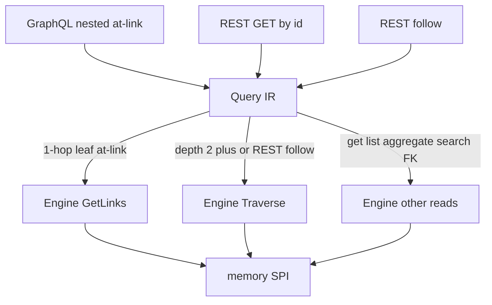

# Requirements: Go Phase 6 — Query IR, Nested Traverse, and REST Follow

## Summary

Go Phase 6 读路径改为 GraphQL 与 REST 都编译成 Query IR，再打 Engine。GraphQL 多跳仍是嵌套 `@link`。当前对象上的 1 跳叶子走 `GetLinks`；更深的每条线性全路径走 `Traverse`。对外通用图查询只上 REST follow。SPI 增加沿途对象集合，`nodes` 仍表示终点。

---

## Problem Frame

Phase 6 origin（`docs/brainstorms/2026-08-20-go-phase6-graphql-rest-requirements.md`）把 GraphQL 做成 IR 投影，resolver 直接打 Engine，并写明不引入 Query IR。计划把嵌套 `@link` 做成逐字段 `GetLinks` + `GetObject`，接受 N+1。

SPI 已有 `Traverse`（线性 `TraversalPath`，`nodes` 仅为最后一步目标）。Go Engine 未暴露该动词。GraphQL 选择集是树，不是一条 path。1 跳金路径 `product { suppliers { name } }` 用 `GetLinks` 就够，但 2 跳无法一次走完，中间对象也拼不回选择树。

`docs/design/draft.md` 把 Ontology IR、Query IR、Action IR 列为 Runtime 三个核心中间表示。本文件把 Query IR 提前进 Phase 6，并让 REST 承担通用图查询，而不是把 SPI 形状的 `traverse` 挂到 GraphQL `type Query`。

未在本文推翻的 origin 决策仍然有效：只读、无鉴权、memory 金路径、无 Mutation/Subscription、无 `searchAll` / `typeahead`、LAZY `countLinks`、无 `_redactedFields`。

---

## Key Decisions

- **Query IR 覆盖全部本 Phase 读。** GraphQL 的 get / list / aggregate / search / 嵌套 `@link`，以及 REST GET by id 与 REST follow，都先编成 Query IR 再执行。不保留「部分 resolver 直打 Engine」的第二执行器。
- **GraphQL 不暴露通用图查询。** 客户端多跳仍写嵌套 `@link`。不生成 `Query.traverse` 或 ObjectType 上的 `follow`。
- **REST 承担通用图查询。** follow 的 path 是起点类型上已声明的 `@link` 字段名序列，不是 SPI 的 `linkType` + `direction`。REST 从 origin 的「仅 GET by id」变成 GET by id + follow。
- **GetLinks 只用于当前对象上的 1 跳叶子。** 该对象选择集里，没有再嵌套 `@link` 的导航字段走 `GetLinks`（含多个 1 跳兄弟）。任一更深路径从该对象对每条线性全路径各一次 `Traverse`。分叉不共享前缀。
- **SPI `nodes` 语义不变。** 增加沿途对象集合供拼 GraphQL/REST 树。旧 `nodes` 仍是终点。Go 与 TS 的 SPI 类型一起加字段，避免契约分叉。TS GraphQL planner 本轮不做。
- **读仍经 Engine。** Query IR 的执行目标是 Engine 动词（含本轮补上的 `Traverse` 透传），投影层不直连 SPI。
- **隐式 FK 不是 traverse。** 对象型属性仍编成 `GetObject`。
- **REST follow 一律 `Traverse`。** 即使 path 只有 1 跳，也不走 `GetLinks`。GraphQL 的 1 跳叶子规则只作用于嵌套 `@link`。

---

## Actors

- A1. Gold-path caller：HTTP GraphQL 与 REST（GET by id、follow），带 tenant 头。
- A2. Query compiler：把 GraphQL 操作或 REST 请求编成 Query IR。
- A3. Engine + memory：执行 get / query / aggregate / search / GetLinks / Traverse，并求值 LAZY computed。

---

## Requirements

**Query IR**

- R1. Runtime 引入 Query IR，作为本 Phase 所有对外读的唯一编译目标。
- R2. GraphQL get-by-id、Relay 列表、aggregate、per-type search、嵌套 `@link`，以及对象型 FK 展开，均编成 Query IR 后执行。
- R3. REST GET by id 编成与 GraphQL get-by-id 同类的 Query IR（同一 Engine get）。
- R4. REST follow 编成 Query IR 的 traverse 形态；path 逐步解析为 Ontology IR 上的 `@link`（字段名 → link type 与 direction）。非法字段名失败，不静默跳过。

**GraphQL nested `@link`**

- R5. 公开 GraphQL schema 仍按 origin 生成嵌套 `@link` 字段。不生成根级通用图查询字段。
- R6. 对选择集中某个已解析对象：其 `@link` 子字段若均为 1 跳叶子（目标上不再选 `@link`），每个这样的字段走 `GetLinks`。
- R7. 同一对象上若某 `@link` 子字段的选择集还包含 `@link`，则为该字段下每条线性全路径从该对象各执行一次 `Traverse`。`a { b { c {…} d {…} } }` 是两次 traverse（`a→b→c` 与 `a→b→d`），不在 `b` 上改回 `GetLinks`，不合并共享前缀。
- R8. 混排时按字段分类：`a { b { name } c { d { name } } }` 中 `b` 走 `GetLinks`，`c→d` 走 `Traverse`。
- R9. 用 `Traverse` 的结果装配选择树：终点来自 `nodes`，沿途对象来自新增集合，父子关系来自 `edges`。同一 id 出现在两次 traverse 中时按 id 去重。中间对象上选中的标量必须出现在响应里。

**REST follow**

- R10. 平台提供 REST 通用图查询：从某 ObjectType 实例出发，按 `@link` 字段名路径走到终点对象集合。
- R11. follow 的 path 不得使用未在起点类型（及沿途类型）上声明的导航字段。
- R12. follow 始终编译为 `Traverse`，包括单步 path。

**SPI and Engine**

- R13. `TraversalResult` 增加沿途对象集合；既有 `nodes`（终点）、`edges`（沿途边）、`totalCount` 含义不变。
- R14. Engine 暴露 `Traverse`，透传到 SPI，供 Query IR 执行。
- R15. 投影层不调用 storage provider。

**Gold pack**

- R16. 扩展 `domain-packs/supply-chain`，使某条 HTTP 金路径成为至少 2 跳的 `@link` 链（可复用已有 LinkType 并补导航字段）。
- R17. 该 2 跳金路径必须实际执行 `Traverse`，不能用逐跳 `GetLinks` 蒙混。
- R18. origin 的 1 跳 `product { suppliers { name } }` 仍成立，且走 `GetLinks`。

**Carry-forward**

- R19. origin R1–R8、R11–R15 未与上文冲突的部分继续有效（IR→SDL、HTTP GraphQL、无 Mutation/Subscription、无安全信封、memory、tenant 头、LAZY computed、缺失为 GraphQL `null` / REST 404）。

---

## Key Flows

- F1. GraphQL 1 跳叶子
  - **Trigger:** `product { suppliers { name } }`
  - **Actors:** A1, A2, A3
  - **Steps:** GraphQL → Query IR → 对 Product 的 `suppliers` 判定为 1 跳叶子 → Engine `GetLinks` → 装配 Supplier。
  - **Outcome:** 与 origin F1 相同的响应形状；执行器是 `GetLinks` 不是 `Traverse`。
  - **Covered by:** R2, R6, R18

- F2. GraphQL 2 跳线性链
  - **Trigger:** 金 pack 上新增的 2 跳嵌套 `@link` 查询。
  - **Actors:** A1, A2, A3
  - **Steps:** GraphQL → Query IR → 一条 `TraversalPath` → Engine `Traverse` → 用 `nodes` + 沿途集合 + `edges` 装配中间层与终点。
  - **Outcome:** 中间与终点上选中的标量都在响应中；存储侧发生一次多跳 traverse。
  - **Covered by:** R7, R9, R16, R17

- F3. GraphQL 分叉
  - **Trigger:** `a { b { c { … } d { … } } }` 且 `c`、`d` 均为 `@link`。
  - **Actors:** A2, A3
  - **Steps:** 两条全路径各一次 `Traverse`；按 id 去重后装配。
  - **Outcome:** 不把 `c`/`d` 当成 `b` 上的 1 跳叶子 `GetLinks`。
  - **Covered by:** R7, R9

- F4. REST GET by id
  - **Trigger:** `GET /api/v1/{lowerFirst(typeName)}/{id}`
  - **Actors:** A1, A2, A3
  - **Steps:** REST → Query IR（get）→ Engine get。
  - **Outcome:** 与 GraphQL get 同一 Engine 读；不直连 SPI。
  - **Covered by:** R3, R15

- F5. REST follow
  - **Trigger:** 调用方对某实例提交 `@link` 字段名路径。
  - **Actors:** A1, A2, A3
  - **Steps:** REST → Query IR traverse → 解析字段名为 `TraversalStep` → Engine `Traverse`。
  - **Outcome:** 返回路径终点对象（及装配所需的沿途数据）。未知字段名失败。
  - **Covered by:** R4, R10, R11, R12

---

## Acceptance Examples

- AE1. **Covers R6, R18.** Given 已 seed 的 Product 与 SuppliesProduct links。When GraphQL `product { suppliers { name } }`。Then 响应含 supplier 名；执行是 `GetLinks` 不是 `Traverse`。

- AE2. **Covers R7, R9, R16, R17.** Given supply-chain 上新增的 2 跳 `@link` 链与对应 links。When HTTP GraphQL 选中中间与终点标量。Then 两层字段都有值；该请求执行 `Traverse`。

- AE3. **Covers R7, R9.** Given `a { b { c { id } d { id } } }` 且两条链都有数据。When 执行该查询。Then 两次 `Traverse`；`b` 只出现一次；`c` 与 `d` 均出现。不在 `b` 上对 `c`/`d` 调 `GetLinks`。

- AE4. **Covers R8.** Given `a { b { name } c { d { name } } }`。When 执行。Then `b` 走 `GetLinks`，`a→c→d` 走 `Traverse`。

- AE5. **Covers R3, R15.** Given 某 Product id。When REST GET 与 GraphQL get 同一 id。Then 标量一致；两者都经 Query IR，不直连 SPI。

- AE6. **Covers R4, R10, R12.** Given 与 AE2 相同的 2 跳链。When REST follow 使用那两个 `@link` 字段名。Then 终点与 GraphQL 2 跳查询的终点一致；执行为 `Traverse`。

- AE7. **Covers R4, R11.** Given 合法起点。When follow path 含起点类型上不存在的字段名。Then 请求失败，不返回部分路径结果。

- AE8. **Covers R13.** Given 一次 2 跳 `Traverse`。Then `nodes` 仅为终点；沿途集合含中间对象；`edges` 含两跳的边。旧的「仅终点」断言仍然成立。

- AE9. **Covers R5.** Given 生成的 GraphQL SDL。Then 无根字段 `traverse` / `follow`。嵌套 `@link` 仍在 ObjectType 上。

---

## Success Criteria

- Phase 6 HTTP 金路径在 memory 上同时证明：1 跳 GraphQL 走 `GetLinks`、2 跳 GraphQL 走 `Traverse`、REST GET 与 REST follow 都经 Query IR。
- 规划可将本文与 origin 一并消费；冲突处以本文为准（Query IR 引入、REST 含 follow、嵌套执行规则）。

---

## Scope Boundaries

**In scope**

- Query IR 作为本 Phase 读编译目标
- Engine `Traverse` 透传
- SPI 沿途对象加法字段（Go 与 TS 类型）
- GraphQL 嵌套 `@link` 的 GetLinks / Traverse 分类与树装配
- REST GET by id 走 Query IR
- REST follow（`@link` 字段名路径）
- supply-chain 补 2 跳导航与 HTTP 金路径

**Deferred for later**

- GraphQL 根级 `traverse` / ObjectType `follow`
- 分叉共享前缀 / 一次树形 SPI
- 多起点 DataLoader 批量化
- 鉴权、consent、字段红线
- TS GraphQL/REST planner
- REST list / links / history / aggregate
- `searchAll`、typeahead、Query complexity
- SPARQL / Cypher 作为 Query IR 的其它前端

**Outside this phase's identity**

- 把 SPI `TraversalPath` 直接暴露给 GraphQL 客户端
- 把 GraphQL SDL 当成语义源（schema 仍来自 Ontology IR）
- 带鉴权的 api-gateway

---

## Dependencies / Assumptions

- origin Phase 6 的 SDL 形状、tenant 头、Relay cursor、LAZY `countLinks`、memory 金路径仍然适用。
- supply-chain 的 `links.odl` 已有多条 LinkType；2 跳金路径优先加导航字段，而不是先发明新关系。
- `supportsGraphTraversal` 在 memory 上为真；本 Phase 不实现 capability 为 false 时从 schema 省略 follow 的分支。
- 列表查询对每个根对象独立应用 R6–R8；不在本 Phase 合并多个 startId。

---

## Outstanding Questions

**Deferred to Planning**

- Query IR 的具体代数 / 数据结构
- REST follow 的 URL、HTTP 方法与响应信封
- supply-chain 2 跳链选用哪两个 `@link` 字段
- SPI 沿途对象字段的名称
- 嵌套 MANY 的截断上限是否沿用 origin 的 1000

---

## Sources / Research

- Origin: `docs/brainstorms/2026-08-20-go-phase6-graphql-rest-requirements.md`（被本文在 Query IR 与 REST 范围上修正）
- Plan being amended: `docs/plans/2026-08-20-001-feat-go-phase6-graphql-rest-plan.md`（KTD-6 N+1 `GetLinks`；Query IR 被标为过早）
- `docs/design/draft.md` — Ontology IR + Query IR + Action IR
- `docs/open-foundry-spec-v2.md` §3.1 `traverse`、§2.1.3 `@link`、§8.1.1 生成 Query 形状
- `runtime/spi/provider.go` — `Traverse`；`runtime/spi/ontology.go` — `TraversalResult.nodes` 无沿途集合
- `runtime/engine/read.go` — `GetLinks` 透传；无 `Traverse`
- `runtime/api/node.go` — 嵌套 `@link` 逐字段 `GetLinks` + `GetObject`
- `runtime/storage/memory/provider.go` — `Traverse`：`nodes` 为最终 step
- `packages/api/src/graphql/resolver-generator.ts` — TS 同样 `getLinks`，不用 `traverse`
- `domain-packs/supply-chain/schema/product.odl`、`supplier.odl`、`links.odl`
