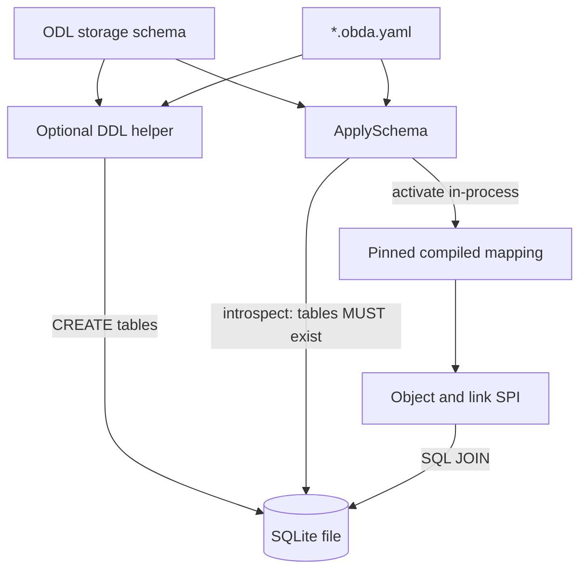

# Requirements: Direct-Native OBDA Identity (No Sidecar)

## Summary

SQLite OBDA 改为 **direct-native**：引擎 `_id` 等于业务表主键（带类型的可逆编码）。删除 sidecar 策略和全部 `of_*` 表。系统字段与 cardinality 落在被映射的业务表上。`ApplySchema` **必须**先确认这些表已经存在。由 ODL 与 OBDA 生成 DDL 并建表只是可选辅助，不能代替、也不能跳过这道存在性检查。`GetLinks` / `Traverse` 走 SQL JOIN。本轮不做 ReBAC，不改 Engine / memory。

---

## Problem Frame

当前 sqliteobda 用 `of_*` 影子表把引擎 id、version、软删和 link 端点与业务主键拆开。Traverse 因此只能对 `of_link_meta` 做逐步查询，无法对业务表 JOIN。FAQ 已选定 direct-native：业务表 PK 存 `EncodeDirect(type, key)`，engine id 与物理主键合一。继续保留 sidecar 会让 JOIN 方案无法落地，也会让「完整 StorageProvider」继续依赖一套 Open Foundry 私有表。

上一份 origin（`docs/brainstorms/2026-08-21-obda-mysql-storage-provider-requirements.md`）把 sidecar 写成缺系统列时的补齐手段。本文件在 identity、系统字段和 schema 生命周期上取代它。SQL 中立 Core、SQLite 第一方言、租户强制、不改 Engine 等未在此推翻的决定仍然有效。

---

## Key Decisions

- **只保留 direct-native。** Mapping 不再接受 `identity.strategy: sidecar` 或 `system.strategy: sidecar`。引擎 `_id` 就是 identity 列里的值。
- **禁止任何 `of_*` 表。** 包括 `of_schema_versions`、`of_mapping_versions`、`of_mapping_activation`、`of_object_meta`、`of_link_meta`、`of_object_history`、`of_link_history`、`of_idempotency`、`of_index_registry`。Provider 不得创建、backfill 或查询它们。
- **表必须事先存在。** `ApplySchema` 对每个 mapped 对象表和 link 表做 live introspect。缺表则失败，不得激活。自动生成的 DDL 文本或「本应被执行的 CREATE」都不能当作表已存在。
- **自动 DDL 是可选辅助。** 调用方可根据 ODL + OBDA 生成并执行建表 DDL（含 cardinality UNIQUE）。这是独立步骤。无论是否刚跑过辅助，`ApplySchema` 仍必须做存在性检查。
- **不 ALTER 已有业务表。** 表在但缺必需要列、或 fingerprint 漂移 → 失败。辅助 DDL 用于空库/新表，不是给旧表补列。
- **系统列可以声明忽略。** identity PK 与 tenant 列始终必填。`version` / `created_at` / `updated_at` / `deleted_at` 可在 mapping 中声明省略；省略则跳过对应 OCC / 软删 / 时间戳写入，不得再靠影子表补。
- **Cardinality 靠业务 link 表上已有 UNIQUE。** `ApplySchema` introspect 缺失则拒绝。辅助 DDL 可以生成这些索引，但激活仍以库里实际存在的索引为准。
- **激活只在进程内。** 无 mapping 注册表。重启后必须再次 `ApplySchema`。进程内仍可缓存 fingerprint，供 `HealthCheck` 漂移检测。
- **Engine 与 memory 不改。** sqlite 返回的 `_id` 是类型信封；memory 仍用裸 UUID。CreateLink 仍可能注入 `_engineLinkId`；sqlite 把它当作编码载荷或忽略，返回的 `_id` 仍是编码后的 PK。
- **本轮不交付持久化历史与 Bulk 幂等。** 对应 SPI 返回不支持。以后若做，用作者声明的普通表，不是 `of_*`。

---

## Actors

- A1. Ontology Engine：经 SPI 读写；本轮不改其 Get-then-write 与 `_engineLinkId` 行为。
- A2. Mapping author：编写 `*.obda.yaml`，声明列、忽略的系统字段、cardinality 对应的物理 UNIQUE。
- A3. Operator / 测试：可选先跑 DDL 辅助；再 `ApplySchema`。负责保证检查时表已在库中。
- A4. sqliteobda provider：编译 mapping、存在性检查、激活、按业务表执行 SPI。

---

## Requirements

**Identity**

- R1. 每个可执行绑定的 identity 策略必须是 `direct`。`sidecar` 在 parse/validate 失败。
- R2. 对象与 link 的 `_id` 等于 identity 列存储值。该值必须是可逆类型信封（现有 `EncodeDirect`：类型 + 有序键，base64url JSON，禁止 delimiter 拼接）。
- R3. `GetLinks` / `Traverse` 只拿一个 id 字符串必须能解码出类型，禁止扫多表猜测。
- R4. Create 在 `insert: generated` 时由 provider 写入 `EncodeDirect(type, UUIDv7)` 到 PK 列。不得另写影子 id。
- R5. Link 拥有独立 `_id`。端点列存对端对象的 engine id（即对端 PK）。禁止只用端点哈希当通用 identity。

**No sidecar**

- R6. Provider 不得创建或使用任何 `of_*` 表。`ApplySchema` 成功后库中不得出现这些表名（测试用空库 + 可选 DDL 辅助验证）。
- R7. 读写、查询、遍历、删除只访问 mapping 声明的业务表。

**Schema existence and optional DDL**

- R8. `ApplySchema` 必须对每个 mapped `relation.kind: table` 做 live introspect。表不存在 → 不得激活。
- R9. 可选辅助：根据 ODL 存储 schema 与 OBDA mapping 生成方言 DDL，并可执行以初始化空库中的对象表、link 表、以及 cardinality 所需 UNIQUE。
- R10. R9 不得关闭或弱化 R8。即使本进程刚生成或执行了 DDL，`ApplySchema` 仍必须对 live 库做存在性检查；检查失败则不得激活。
- R11. `ApplySchema` 不得 `ALTER` 已有业务表，也不得把「生成了 DDL」当成表已存在。
- R12. 表存在但缺 identity / tenant / 未声明忽略却仍被依赖的系统列，或缺 cardinality UNIQUE → 不得激活。

**Native columns and omit**

- R13. identity 列与 tenant 策略所需列（`column` 的物理列，或 `constant` 的绑定）必须存在于表上。
- R14. mapping 可声明省略 `version`、`created_at`、`updated_at`、`deleted_at` 中的任意子集。未省略的列必须存在。
- R15. 省略 `deleted_at` 时：不得软删；`DeleteObject` 的 soft 模式返回不支持错误；Query/GetLinks 不得添加 `deleted_at IS NULL`。
- R16. 省略 `version` 时：不得 CAS。调用方传入非空 `expectedVersion` → 不支持错误，而不是假装冲突。
- R17. 省略的系统列不得用额外表补齐。返回对象上对应 SPI 字段：无 `_deletedAt`；无 version 列时 `_version` 为稳定的 `0`。

**Reads, writes, graph**

- R18. `GetObject` / `GetLink`：`DecodeDirect` 后按 PK 查业务表。类型不匹配、跨租户、缺行 → 与缺失相同的 not-found。
- R19. 未省略 `deleted_at` 时：Get 可返回软删行；Query/GetLinks 默认排除；软删后再 Update → not-found。
- R20. `GetLinks` / `Traverse` 必须用业务 link 表 JOIN 目标对象表的参数化 SQL，不得再对影子表逐步 BFS。超深度拒绝。
- R21. MANY_TO_ONE / ONE_TO_ONE / ONE_TO_MANY 的写冲突必须落到物理 UNIQUE，映射为 `ErrCardinalityViolation`。`LIMIT 1` 不能代替写约束。
- R22. Hard delete 对象：同事务删除该对象作为端点的 link 行，并删除对象行。无 history 表可保留。
- R23. 空 `tenantId` → `ErrTenantRequired`。租户值只来自 `RequestContext`。
- R24. `access: read` 允许查询、拒绝 mutation（`ErrReadOnlyMapping`）。view 不得 `readWrite`。

**SPI this round**

- R25. 本轮 `GetObjectAtVersion` / `GetObjectAtTime` / Query `AsOf*` / `BulkMutate` 返回不支持错误，不得返回 live 行冒充历史，也不得用内存假装幂等。
- R26. `GetSchema` 返回进程内激活快照。重启且未再 `ApplySchema` → `ErrMappingNotActive`。
- R27. 不改 Engine、memory、projection。sqlite 与 memory 在 `_id` 形态上允许分叉。

---

## Key Flows

- F1. Greenfield with optional helper
  - **Trigger:** 空 SQLite 文件，调用方先跑 DDL 辅助再 `ApplySchema`。
  - **Actors:** A3, A4
  - **Steps:** 辅助生成并执行 CREATE；`ApplySchema` introspect 确认表与 UNIQUE 存在；激活进程内 compiled mapping。
  - **Outcome:** 随后 Create/Get 走业务表 PK。库中无 `of_*`。
  - **Covered by:** R8, R9, R10, R6

- F2. ApplySchema without tables
  - **Trigger:** 未建表，或只生成了 DDL 文本未执行。
  - **Actors:** A3, A4
  - **Steps:** `ApplySchema` introspect 发现缺表。
  - **Outcome:** 失败，mapping 未激活。
  - **Covered by:** R8, R10, R11

- F3. Outbound GetLinks JOIN
  - **Trigger:** 已激活；`GetLinks(patientId, AdmittedTo, outbound)`。
  - **Actors:** A1, A4
  - **Steps:** 解码 start id 得类型；JOIN link 表与 Ward 表；tenant 与（若未省略）软删谓词在同一 SQL。
  - **Outcome:** 一页 link，端点 id 为对端 PK。
  - **Covered by:** R3, R20

- F4. Omit deleted_at
  - **Trigger:** mapping 声明省略 `deleted_at`；调用 soft delete。
  - **Actors:** A2, A4
  - **Steps:** 绑定无软删列。
  - **Outcome:** soft delete 不支持；Query 不按删除过滤。
  - **Covered by:** R14, R15

---

## Acceptance Examples

- AE1. Empty DB, helper then ApplySchema
  - **Covers:** R8, R9, R10, R6
  - **Given:** 空文件库；mapping 指向 `patient` / `ward` / `admission`。
  - **When:** 执行 DDL 辅助，再 `ApplySchema`。
  - **Then:** 三张表存在；激活成功；`sqlite_master` 无 `of_` 前缀表；Create Patient 后 Get 的 `_id` 等于 `patient.id` 且 `DecodeDirect` 类型为 Patient。

- AE2. ApplySchema without executing DDL
  - **Covers:** R8, R10, R11
  - **Given:** 空文件库；调用方只拿到生成的 DDL 字符串，不 Exec。
  - **When:** `ApplySchema`。
  - **Then:** 失败；未激活；随后 Get 为 `ErrMappingNotActive`。

- AE3. Missing unique for MANY_TO_ONE
  - **Covers:** R12, R21
  - **Given:** `admission` 表存在但没有 outbound UNIQUE。
  - **When:** `ApplySchema`。
  - **Then:** 不得激活。

- AE4. Soft-deleted endpoint
  - **Covers:** R19
  - **Given:** 未省略 `deleted_at`；Patient 已软删。
  - **When:** `CreateLink` 以该 Patient 为端点。
  - **Then:** `ErrObjectNotFound`，admission 无新行。

- AE5. Engine-visible encoded id
  - **Covers:** R4, R27
  - **Given:** Engine 注入 sqliteobda；`insert: generated`。
  - **When:** `Engine.CreateObject` 再 `CreateLink`。
  - **Then:** 返回的 object/link `_id` 可 `DecodeDirect`；不是 memory 那种裸 UUIDv7 作为 `_id`（Engine 本身未改）。

---

## Scope Boundaries

**Deferred for later**

- 作者自建历史表 / 幂等表（非 `of_*`）上的 temporal 与 Bulk
- Aggregate、Search/FTS、EnsureIndex 收口
- 把 Engine 改为铸造类型信封 id（本轮 sqlite 自行编码即可）
- 第二方言（MySQL）

**Outside this round**

- 遗留库：不能把 PK 改成类型信封、也不能接受存在性检查的 schema
- sidecar / overlay / PostgreSQL+AGE 作为本 provider 的存储
- ReBAC 注入 SQL
- 改 memory、改 projection、改 `docs/open-foundry-spec-v2.md`
- `ApplySchema` 用 ALTER 给旧表补系统列

---

## Success Criteria

- 空库路径：可选 DDL 辅助 + `ApplySchema` 存在性检查通过后，对象/link CRUD 与 JOIN 遍历在真实 SQLite 文件上绿。
- 未建表或未执行 DDL 时 `ApplySchema` 失败。
- 测试库在激活后无任何 `of_*` 表。
- 现有 memory / Engine 测试不因本需求而必须改语义。

---

## Dependencies / Assumptions

- 继续 Go-only SQLite first（`modernc.org/sqlite`）；mapping 仍由 `Open` 注入。
- 假设测试与 operator 能在 `ApplySchema` 之前让表出现：手工 DDL、或可选辅助。
- 假设 link 表 from/to 列类型与对象 PK 一致（同一编码字符串），因此 JOIN 是等值比较。
- 多态「一个 FK 指向多种 ObjectType」不在本轮：JOIN 需要 typed 端点。

---

## Outstanding Questions

**Deferred to Planning**

- 可选 DDL 辅助是独立函数还是 `ApplySchema` 的显式选项；无论形状，R8/R10 的检查顺序不变：先保证 live 表存在，再激活。
- 省略系统列在 YAML 中的字段名。
- CreateLink 对 Engine 注入的 `_engineLinkId`：包进 `EncodeDirect` 的 key，还是忽略后自铸。
- 缺表时用 `ErrInvalidMapping` 还是 `ErrSourceSchemaDrift`。

---

## Sources / Research

- `docs/design/faq1-Identity.md` — direct-native 与 JOIN；当前 direct 仍写 `of_*_meta` 的纠正
- `docs/design/TODO.md` — 系统列可忽略；可选自动 DDL
- `docs/design/open-foundry-obda-mapping-spec-v2.md` — sidecar 时代契约（本轮由 v3 取代）
- `runtime/obda/identity.go` — `EncodeDirect` / `DecodeDirect`
- `runtime/obda/dialect/sqlite/ddl.go` — 将被删除的 `of_*` 清单
- `runtime/engine/engine.go` — CreateObject 不铸对象 id；CreateLink 注入 `_engineLinkId`
- `runtime/projection/storage.go` — 仍丢弃 `RolePrimary`；因此 `insert: generated` 或非 Primary 的 identity 列
