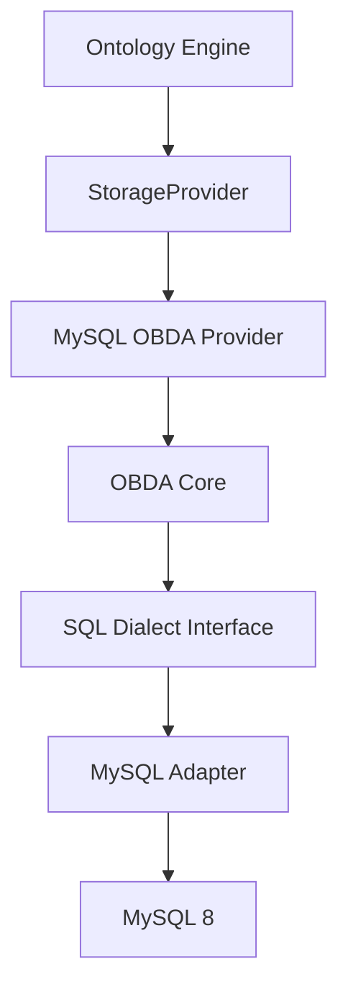

# Requirements: OBDA Core, SQL Dialects, and MySQL StorageProvider

## Summary

Open Foundry 增加一层 SQL 中立的 OBDA：把 ODL 与 mapping 编成方言无关计划，再由方言适配器生成并执行 SQL。v1 只交付 MySQL 适配器，并且该适配器背后的 provider 必须完整实现 `StorageProvider` 读写契约。本轮不做 ReBAC。

---

## Problem Frame

当前 Runtime 的 Ontology Engine 只依赖 `spi.StorageProvider`，落地实现只有 memory。v2 与旧 OBDA 草案把 mapping 当成 Sync Engine 的只读 overlay，并把本体存储绑在 PostgreSQL+AGE 上。这与「先用 MySQL 跑通完整 SPI、映射层对 SQL 方言保持中立」的目标冲突。

没有中立核心时，每个数据库都会复制一套 identity、租户、OCC、link 与 schema 生命周期。没有完整 SPI 时，Engine 无法把 Action、查询与 schema apply 接到同一存储。

---

## Key Decisions

- **两层定义。** OBDA Core 负责 mapping 语义与中立计划。SQL 方言适配器负责标识符、占位符、类型、introspection 与 DDL。v1 只实现 MySQL。
- **OBDA 是完整存储，不是 overlay adapter。** MySQL OBDA provider 直接实现 `StorageProvider`。不把查询路由到另一套 ontology store，也不把 write 留给 PostgreSQL+AGE。
- **ODL 仍是语义源。** Mapping 只描述物理对应，不重写 ObjectType / LinkType / cardinality 语义。
- **本轮忽略 ReBAC。** 不规划授权图、tuple 物化或权限谓词注入。租户隔离仍强制。
- **源表可以没有本体系统列。** 缺 `_version`、时间戳、软删或稳定 link id 时，用同库 sidecar 补齐，而不是要求先改源库表结构。
- **作者格式只认 OBDA mapping。** 不并行长期维护 v2 `datasources/*.yaml`。
- **可写绑定收窄。** v1 可写对象与 link 必须落在单表、可逆 identity、同一事务域。view 与任意 SQL 源只读或延后。
- **`ErrUnimplemented` 不是交付。** 嵌入未实现基类只为 Go 前向兼容。每个 SPI 方法都有定义行为。

---

## Actors

- A1. Ontology Engine：唯一业务调用方，经 SPI 读写对象与 link。
- A2. Mapping author：编写 ODL 对应的 OBDA mapping。
- A3. OBDA Core：编译、规划、identity 编解码、租户注入。
- A4. MySQL dialect adapter：渲染 SQL、introspect、DDL、错误分类。
- A5. Operator：激活 schema 与 mapping 版本。

---

## Requirements

**Architecture**

- R1. Runtime 提供 SQL 中立的 OBDA Core：输入为 ODL 存储 schema、OBDA mapping 与 SPI 请求，输出为不含具体方言语法的计划。
- R2. Runtime 提供 SQL 方言接口。Core 不发射某一数据库的 SQL，适配器不重定义 SPI 语义。
- R3. v1 只实现 MySQL 方言适配器，并以此支撑一个可注入 Engine 的 `StorageProvider`。
- R4. 增加其他方言不得改 SPI 形状，也不得改 mapping 的语义模型。

**Mapping**

- R5. Mapping 是 ODL ObjectType / LinkType 到物理关系的可执行对应，不重述业务语义。
- R6. 每个 model 与 link 必须声明所属数据源引用。v1 所有可写绑定必须落在同一事务域。
- R7. 可写绑定必须能确定 INSERT / UPDATE / DELETE 目标。不满足时编译失败，不得在运行时部分写入。
- R8. 只读绑定允许查询，拒绝 mutation，并返回稳定的只读错误。
- R9. Identity 必须可逆：给定本体 id，能编译成物理 key 谓词，且不靠多表猜测类型。
- R10. Link 拥有独立 id。同一对端点上可存在多条同类型 link；禁止仅用端点哈希当通用 identity。
- R11. 封闭、可逆的字段变换可以进入 v1。任意 SQL 表达式、computed SQL、不可逆 hash 不进入可写路径。

**StorageProvider completeness**

- R12. Provider 实现 `runtime/spi/provider.go` 的全部方法，包括 schema、对象、link、query、aggregate、search、bulk、transaction、temporal、index、health 与 capabilities。
- R13. 任一方法不得以 `spi.ErrUnimplemented` 作为 v1 成功路径。
- R14. 返回对象与 link 必须带齐 SPI 系统字段。源列缺失时由 sidecar 提供，且同一记录每次读取值稳定。
- R15. `UpdateObject` / `UpdateLink` 在提供 `expectedVersion` 时必须原子 compare-and-swap。冲突返回 `spi.ErrVersionConflict`。
- R16. Cardinality 在写入时强制执行。查询侧 `LIMIT 1` 不能代替写约束。
- R17. Soft delete 为默认删除。Hard delete 必须显式 mode，并在同一事务处理相关 link。
- R18. 查询默认排除已软删记录。`GetObject` / `GetLink` 可返回带 `_deletedAt` 的记录。
- R19. Aggregate 在聚合前应用租户与软删谓词。
- R20. Search 只对声明为可搜索且方言支持全文的字段成立。不支持时返回稳定不支持错误，而不是空结果冒充无命中。
- R21. Bulk 以租户作用域的幂等键去重。相同键相同请求返回原结果；相同键不同请求被拒绝。
- R22. Temporal 读必须有真实历史来源。不能把当前行伪装成历史版本。
- R23. `BeginTransaction` 覆盖对象与 link 的 mutation。业务行、sidecar 与历史在同一本地事务中提交或回滚。
- R24. 跨事务域写入在第一笔 mutation 前拒绝。

**Tenancy and security**

- R25. 每个 SPI 调用必须有非空 `tenantId`。缺失则失败。
- R26. 租户谓词由 runtime 注入。调用方不能用 filter 或 properties 覆盖。
- R27. 跨租户存在性与不存在使用同一 not-found 错误。
- R28. 运行时 SQL 的值全部参数化。标识符必须来自已编译 mapping，不得拼接调用方字符串。
- R29. Mapping 与连接不得含明文凭证。
- R30. 本轮不实现 ReBAC、consent 或授权谓词注入。授权仍由 SPI 之上的层负责。

**Lifecycle**

- R31. Schema 与 mapping 成对准备、校验、原子激活。进行中的请求不切换到另一份 compiled mapping。
- R32. 源库 fingerprint 与激活 mapping 不兼容时，受影响绑定 fail-closed，不得静默用错列。
- R33. 能力声明必须与真实可执行绑定一致。全局 capability 为真不表示每个 ObjectType 都能 search / temporal / write。

---

## Key Flows

- F1. Activate mapping
  - **Trigger:** Operator 提交 ODL schema 与 OBDA mapping。
  - **Actors:** A5, A3, A4
  - **Steps:** 解析 mapping → introspect MySQL → 编译校验 → 准备 sidecar → 原子激活。
  - **Outcome:** 后续 SPI 请求看到同一份 compiled mapping。失败不留下半激活状态。
  - **Covered by:** R5, R7, R31, R32

- F2. Read object
  - **Trigger:** Engine `GetObject` / `QueryObjects`。
  - **Actors:** A1, A3, A4
  - **Steps:** 解码 identity → 注入租户与软删谓词 → 方言渲染 → 映射系统字段。
  - **Outcome:** 返回合法 `OntologyObject`；跨租户记为 not-found。
  - **Covered by:** R9, R14, R18, R25, R26, R27

- F3. Write with OCC
  - **Trigger:** Engine `UpdateObject` 带 `expectedVersion`。
  - **Actors:** A1, A3, A4
  - **Steps:** 校验可写绑定 → 原子版本谓词更新业务行与 sidecar → 写历史。
  - **Outcome:** 匹配则版本递增；不匹配返回 `ErrVersionConflict`，无部分提交。
  - **Covered by:** R7, R15, R23

- F4. Create link under cardinality
  - **Trigger:** Engine `CreateLink`。
  - **Actors:** A1, A3, A4
  - **Steps:** 解析两端 identity → 校验同租户与类型 → 写时强制 cardinality → 分配独立 link id。
  - **Outcome:** 违规返回 `ErrCardinalityViolation`；成功返回完整 `OntologyLink`。
  - **Covered by:** R10, R16, R26

- F5. Transaction
  - **Trigger:** Engine `BeginTransaction` 后改对象并建 link。
  - **Actors:** A1, A3, A4
  - **Steps:** 捕获租户与 mapping 版本 → 同一事务写业务行与 sidecar → commit 或 rollback。
  - **Outcome:** 全部可见或全部不可见。跨事务域操作被拒绝。
  - **Covered by:** R23, R24

---

## Acceptance Examples

- AE1. **Covers R3, R12, R13.** Given MySQL OBDA provider 注入 Engine。When 调用每个 `StorageProvider` 方法。Then 均有定义行为，无 `ErrUnimplemented`。

- AE2. **Covers R1, R2, R4.** Given 同一份 mapping 与中立计划。When 经 MySQL 适配器执行。Then SQL 由适配器生成。Core 不包含 MySQL 专用语法。

- AE3. **Covers R9, R14.** Given 源表只有业务主键、没有 `_version`。When `CreateObject` 后再 `GetObject`。Then 返回稳定 `_id` / `_version` / 时间戳，两次读取一致。

- AE4. **Covers R15.** Given `_version = 7`。When 两个更新同时带 `expectedVersion = 7`。Then 恰好一个成功，另一个 `ErrVersionConflict`。

- AE5. **Covers R10, R16.** Given MANY_TO_ONE 且已有一条 active link。When 再创建第二条同 from 的 active link。Then 失败，底层不会留下两条 active 行。

- AE6. **Covers R25, R27.** Given tenant A 的对象。When tenant B `GetObject` 同一 id。Then `ErrObjectNotFound`，与真正缺失不可区分。

- AE7. **Covers R8, R11.** Given view 或不可逆表达式绑定。When `CreateObject` / `UpdateObject`。Then 稳定只读错误，源表无写入。

- AE8. **Covers R21.** Given bulk 在中途失败后以同一幂等键重试相同 payload。Then 不重复创建；返回与首次完成一致的结果。

- AE9. **Covers R23, R24.** Given 事务内更新对象并创建 link 后 rollback。Then 业务行、sidecar、link 均不可见。

- AE10. **Covers R30.** Given v1 conformance。When 跑存储套件。Then 不要求 ReBAC tuple 或授权注入。租户隔离测试仍必须通过。

- AE11. **Covers R31.** Given 请求执行中激活新 mapping。When 该请求完成。Then 它仍使用开始时的 compiled mapping。

---

## Success Criteria

- Engine 可以只依赖 SPI 注入 MySQL OBDA provider，跑通 schema apply、对象与 link 生命周期、查询、事务。
- 增加第二种 SQL 方言时，不必改 `StorageProvider` 或 mapping 语义模型。
- Conformance 证明完整 SPI 行为与租户隔离，且不把 ReBAC 当作本轮验收条件。

---

## Scope Boundaries

**In scope**

- OBDA Core 与 SQL 方言接口
- MySQL v1 适配器与完整 `StorageProvider`
- Table mapping、可逆 identity、可写单表绑定
- Sidecar 补齐系统字段与 link identity
- 租户隔离、OCC、soft/hard delete、本地事务
- Aggregate、search、bulk、temporal、index、traverse 的定义行为

**Deferred for later**

- PostgreSQL 及其他方言适配器
- view / 任意 SQL 作为可写源
- 自由 SQL 表达式与 computed SQL
- 跨库 join 与分布式事务
- CDC / polling / overlay-to-materialize
- ReBAC、consent、字段红线
- Keyset cursor（需 SPI 输入补 cursor 后再做）

**Outside this product's identity**

- 把 OBDA 做成 Hasura 式 GraphQL 引擎
- 让 mapping 重新定义 ODL 语义
- 以 `ErrUnimplemented` 占位冒充完整 provider
- 把 MySQL 仅当 overlay，本体仍写到另一套 store

---

## Dependencies / Assumptions

- `runtime/spi/provider.go` 是本轮必须满足的接口。Engine 继续只依赖该接口。
- 现有落地实现只有 `runtime/storage/memory`。MySQL provider 是净新增。
- `runtime/go.mod` 尚无 MySQL 驱动。规划阶段再选驱动，不作为需求分叉。
- `RequestContext` 目前只有 tenant / actor / trace。本轮不扩展 ReBAC 字段。
- `docs/open-foundry-spec-v2.md` 仍把 overlay / PostgreSQL+AGE 写成 v1 叙事。实现方向以本文与 `docs/design/obda-mapping-design-v1.md` 为准；v2 文本需另开修订，不阻塞本需求。
- 设计文档 `docs/design/obda-mapping-design-v1.md` 是实现向细化。冲突时需求（本文）约束行为，设计文档约束机制，计划阶段再拆实现单元。

---

## Outstanding Questions

**Deferred to Planning**

- 中立 SQL AST 的具体节点集与包边界
- Sidecar 表的物理 schema 与命名
- 本体 id 的编码格式（typed codec vs sidecar UUIDv7 的选用规则）
- MySQL 最低小版本、FULLTEXT 与 recursive CTE 的能力探测
- Schema apply 何时允许改业务表 DDL，何时只改 mapping 与 sidecar
- Bulk 是否单事务执行全部 operations（SPI 尚无 chunk / resume 字段）
- 与 memory provider 共用哪些既有 conformance 测试，哪些必须加 MySQL fixture

---

## Sources / Research

- Behavior origin: `docs/design/obda-mapping-design-v1.md`
- Superseded mapping draft: `docs/design/open-foundry-obda-mapping-spec-v1.md`（只读 overlay / PostgreSQL-first，不作为 v1 实现方向）
- `docs/open-foundry-spec-v2.md` §3 Storage Provider Interface
- `runtime/spi/provider.go` — 完整 SPI
- `runtime/spi/ontology.go` — 系统字段、`RequestContext`、capabilities
- `runtime/spi/unimplemented.go` — `ErrUnimplemented` 占位
- `runtime/engine/engine.go` — Engine 只持有 `spi.StorageProvider`
- `runtime/storage/memory/` — 当前唯一具体 provider
- `runtime/projection/storage.go` — ODL → `OntologySchema`
