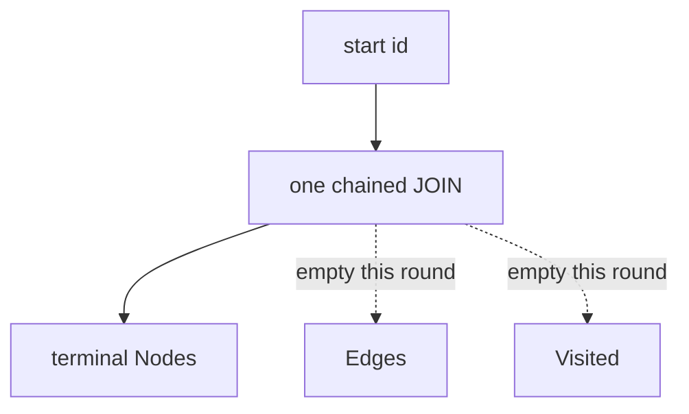

# Requirements: sqliteobda Traverse chained JOIN (terminal Nodes only)

## Summary

sqliteobda `Traverse` 对固定 `path.Steps` 发一条链式 JOIN，只交终点对象。`Limit` / `Offset` 切终点；`IncludeDeleted` 可含软删。同时改 spec §8.4/8.5、mapping spec §8、identity 计划 U6，去掉「已经在做完整图遍历」的表述。

---

## Problem Frame

direct-native 需求（R20）和 v3 spec 要求 `GetLinks` / `Traverse` 对业务表 JOIN，禁止对影子表 BFS。`GetLinks` 已经单跳 JOIN 对端对象表。`Traverse` 仍按 hop 循环调用 `GetLinks` 再加载对象，planner 也没有多跳计划。spec 却写成「当前实现」已是链式 JOIN，计划 U6 也把链式 JOIN 当成已交付目标。文档与实现分裂：读者以为多跳是一条 SQL，测例只锁了逐步走图还能绿。

---

## Key Decisions

- **一条 SQL，只交终点。** 固定路径链式 JOIN 是本轮要兑现的存储行为。`Nodes` 是最后一跳对象。`Edges` 与 `Visited` 在 sqliteobda 上为本轮空切片。
- **SPI 注释不改。** `TraversalResult` 仍写 Edges 为走过的 link、Visited 为严格中间对象。memory 继续填全。sqlite 与 memory 在这两字段上分叉。
- **Query IR 2 跳不作为 sqlite 验收。** 拼树仍以 memory 为准。sqlite 上缺中间对象与边。
- **改写清单不含 identity origin。** 改 spec §8.4/8.5、mapping spec §8、计划 U6。`docs/brainstorms/2026-08-21-obda-direct-native-identity-requirements.md` 的 R20 本轮不改；JOIN 禁 BFS 仍成立，本文件收窄的是 sqliteobda 的结果形状。
- **分页与软删作用于终点。** `Limit` / `Offset` 切 `Nodes`。默认排除软删 link 与对端；`IncludeDeleted` 为真时纳入。
- **多路径汇合不去重。** JOIN 有几条终点行，`Nodes` 就有几条。同一对象可重复出现。

---

## Actors

- A1. Ontology Engine：透传 `Traverse`；本轮不改。
- A2. sqliteobda：编译固定路径为一条 JOIN，装配终点页。
- A3. Query IR / GraphQL / REST follow：继续依赖 `Visited` + `Edges` 拼树；本轮不以 sqlite 为金路径。
- A4. Spec / plan 读者：以改写后的 v3 与 U6 为准，不再把完整图结果当成已实现。

---

## Requirements

**SQL**

- R1. `Traverse` 对非空且深度合法的 `path.Steps` 使用一条参数化链式 JOIN。不得再按 frontier 逐步调用 `GetLinks`。
- R2. 每一跳的租户谓词，以及未 omit 且未 `IncludeDeleted` 时的软删谓词，都在同一条 SQL 里。
- R3. `GetLinks` 保持现有单跳 JOIN。本轮不改其页语义。

**Result**

- R4. `Nodes` 为最后一跳目标对象。`TotalCount` 为分页前的终点行数。
- R5. sqliteobda 返回的 `Edges` 与 `Visited` 为空。1 跳与多跳都如此。
- R6. 空 `path.Steps` 返回空结果，不报错。

**Options**

- R7. `Limit <= 0` 时终点默认 100 条，上限 1000。`Offset` 从分页前的终点行切片。
- R8. 默认排除软删 link 与对端对象。`IncludeDeleted` 为真时，未 omit 的软删行可以出现在终点中。

**Errors and depth**

- R9. `len(path.Steps) > 8` → `ErrUnsupportedCapability`。
- R10. 起点无法解码、类型与第一跳端点不符、缺行、或跨租户 → `ErrObjectNotFound`。禁止扫多表猜测起点类型。

**Docs**

- R11. `docs/design/obda-spec-v3.md` §8.4/8.5 改为：链式 JOIN 只投影终点；删除「当前实现已做完整图 JOIN」的表述；示例 SQL 与 `Nodes` 对齐。
- R12. `docs/design/open-foundry-obda-mapping-spec-v3.md` §8 同步：Traverse 链式 JOIN 只交终点；禁止再把逐步 `GetLinks` 写成目标。
- R13. `docs/plans/2026-08-21-002-feat-obda-direct-native-identity-plan.md` U6 改为链式 JOIN + 终点 `Nodes`，不再要求本轮从同一条 SQL 装配 Edges / Visited。

---

## Key Flows

- F1. One-hop terminal JOIN
  - **Trigger:** 已激活；`Traverse(patientId, [AdmittedTo outbound])`。
  - **Actors:** A1, A2
  - **Steps:** 校验起点类型；一条 JOIN 连 admission 与 ward；装配 ward 为 `Nodes`。
  - **Outcome:** 一个终点；`Edges` 与 `Visited` 为空。
  - **Covered by:** R1, R4, R5, R10

- F2. Two-hop terminal JOIN
  - **Trigger:** 路径为 AdmittedTo 再 BelongsTo（或等价两跳）。
  - **Actors:** A2
  - **Steps:** 同一条 SQL 链式 JOIN 两跳；只投影第二跳对象。
  - **Outcome:** `Nodes` 为终端类型；不是两次 `GetLinks`。
  - **Covered by:** R1, R4

- F3. IncludeDeleted and pagination
  - **Trigger:** 对端或沿途 link 已软删；调用方设 `IncludeDeleted` 与 `Limit`/`Offset`。
  - **Actors:** A2
  - **Steps:** SQL 按 R8 决定是否带软删谓词；按 R7 切终点。
  - **Outcome:** 默认页没有该软删终点；打开 `IncludeDeleted` 后可以出现；`TotalCount` 为切片前行数。
  - **Covered by:** R7, R8, R4

---

## Acceptance Examples

- AE1. Covers R1, R4, R5. Given Patient→Ward 一条 live link。When 一跳 outbound Traverse。Then `Nodes` 含该 Ward；`Edges` 与 `Visited` 长度为 0。

- AE2. Covers R1, R2, R4. Given 两跳 live 路径。When Traverse 该固定路径。Then `Nodes` 为第二跳对象；执行是一条多 JOIN SQL，不是逐步 `GetLinks`。

- AE3. Covers R9, R10. Given 9 步路径，或起点类型与第一跳不符 / 跨租户。When Traverse。Then 分别为 `ErrUnsupportedCapability` 与 `ErrObjectNotFound`。

- AE4. Covers R8. Given 对端已软删且未 omit `deletedAt`。When 默认 Traverse。Then 该终点不在 `Nodes`。When `IncludeDeleted`。Then 可以出现。

- AE5. Covers R11–R13. Given 改写后的三份文档。When 阅读 Traverse 条款。Then 写明链式 JOIN 只交终点，不再声称完整图结果已实现。

---

## Success Criteria

- sqliteobda 多跳 Traverse 不再依赖逐步 `GetLinks`。
- 现有 memory / Query IR 测例不因本需求改拼树语义。
- v3 spec、mapping spec §8、identity 计划 U6 与 sqliteobda 行为一致。

---

## Scope Boundaries

**Deferred for later**

- 从同一条 JOIN 装配 `Edges` 与 `Visited`
- sqliteobda 上 Query IR 2 跳 / REST follow 拼树
- 逐步 Filter / 逐步 `MaxDepth`
- 可变深度递归或 recursive CTE
- 改 identity origin R20 正文

**Outside this round**

- 改 Engine、memory、projection、SPI 注释
- 把 SPI 改成「Edges/Visited 可选」
- 多态「一列指向多种 ObjectType」
- 恢复对影子表的 BFS

---

## Dependencies / Assumptions

- `GetLinks` 的单跳 JOIN 已存在，本轮只收口 `Traverse`。
- from/to 列与对象 PK 同为 `EncodeDirect` 字符串，JOIN 为等值比较。
- `TraversalStep.Filter` 与逐步 `MaxDepth` 本轮忽略。
- identity origin R20 的 JOIN 禁令仍约束 SQL 形态；结果形状以本文件为准。

---

## Outstanding Questions

**Deferred to Planning**

- planner 如何表示多跳 JOIN（别名、投影哪些对象列）而不把 Edges/Visited 装回来。
- 测例如何锁「一条 SQL」而不绑死具体 SQL 文本。

---

## Sources / Research

- `docs/brainstorms/2026-08-21-obda-direct-native-identity-requirements.md` — R20 JOIN；本文件收窄 sqlite 结果形状
- `docs/design/obda-spec-v3.md` — §8.4/8.5 目前写成已实现链式 JOIN
- `docs/design/open-foundry-obda-mapping-spec-v3.md` — §8 Query / links / traverse
- `docs/plans/2026-08-21-002-feat-obda-direct-native-identity-plan.md` — U6 链式 JOIN
- `docs/design/faq1-Identity.md` — 从「Traverse 不做 JOIN」到 `PlanTraverse` 的论证
- `runtime/storage/sqliteobda/links.go` — `GetLinks` JOIN；`Traverse` 仍逐步 `GetLinks`
- `runtime/obda/planner.go` — 有 `PlanGetLinksJoin`，无多跳 Traverse 计划
- `runtime/spi/ontology.go` — `TraversalResult` 字段语义
- `runtime/query/expand.go` — `assemblePath` 依赖 `Visited` + `Edges` + `Nodes`
- `runtime/storage/memory/provider.go` — memory 仍填全图并尊重分页 / `IncludeDeleted`
