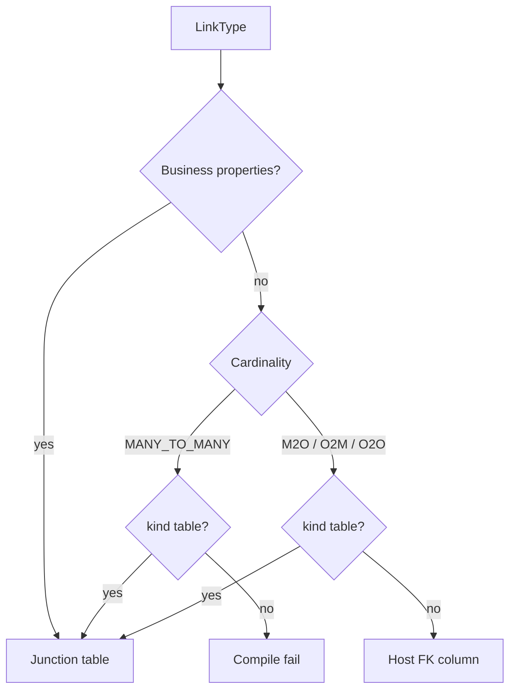

# Requirements: Property-less Link Inline FK (MySQL)

## Summary

无业务属性的 Link 在 MySQL 上不再建中间表，外键落在宿主表。有业务属性的 Link 仍是带自己 ID 的联结表。MySQL 的 DDL、编译、CreateLink / GetLinks / Traverse 都按这种物理形态工作。SQLite 不实现 inline，加载到 inline mapping 则失败。

---

## Problem Frame

今天每个 LinkType 都会得到一张独立表，哪怕 ODL 里没有任何业务字段。`BorrowedBy` 有 `borrowedAt` / `dueAt`，联结表是对的。`OwnedBy` 这种纯引用却仍会多一张 `owned_by`，只为存 `from_id` / `to_id`。

`docs/design/obda-spec-v3.md` §15.7 把 Link 当作带自己属性和自己 ID 的一等实体。这条规则对有状态的关系成立，对无状态的 FK 引用过重。关系型库对 MANY_TO_ONE / ONE_TO_MANY / ONE_TO_ONE 本来就可以用宿主列表达；MANY_TO_MANY 不行。

当前校验只认 `relation.kind` 为 `table` 或 `view`，空 kind 当成 `table`。物理期望给每个 compiled link 单独一张表。没有 inline 这条路。

---

## Key Decisions

- **有无业务属性决定物理形态。** `id` 与系统字段不算业务属性。有 `borrowedAt` 这类字段就必须建表。只有 identity 的 LinkType（如 `BedInWard`）也算无业务属性，可以 inline。
- **默认 inline，显式建表才能退出。** 无属性且 cardinality 可 inline 时，省略 kind 或声明 inline 都走宿主 FK。写 `kind: table` 则继续联结表。现有 mapping 几乎都写了 `kind: table`，不会被默认值改掉。
- **可空性只看 host 导航字段。** `owner: Member` → 可空 FK；`owner: Member!` → `NOT NULL`。对端列表（如 `ownedBooks: [Book!]!`）不决定 FK 是否可空。
- **必填 inline 只走对象 API。** CreateObject 写入 FK；改指向用 UpdateObject。DeleteLink 与二次 CreateLink 都失败。可空 inline 才用 CreateLink（仅当 FK 为空）和 DeleteLink（`SET NULL`）。
- **CreateLink 不覆盖。** 已有关联再 CreateLink 是 cardinality violation，与今天联结表行为对齐。
- **对端 hard delete 对齐联结表。** 可空则清掉 FK；host 必填则拒绝删除对端。
- **library-pack 是金路径。** 增加可空的 `OwnedBy`（与现有 `borrower` 一样可空）。`BorrowedBy` 保持联结表。SQLite 加载含 inline 的该 pack 必须失败，不得改建成表。
- **M2M 永不 inline。** 无属性 M2M 若未显式 `kind: table`，编译失败。

---

## Actors

- A1. Mapping author：编写 ODL LinkType 与 OBDA mapping；用 `kind: table` 退出 inline。
- A2. Operator：对 MySQL 打印 DDL、Init、ApplySchema。
- A3. OBDA core：编译 mapping，算出物理期望（inline 不单独成表）。
- A4. MySQL provider：按 inline 或联结表执行 link SPI。
- A5. SQLite provider：遇到 inline mapping 失败，不建表、不激活。

---

## Requirements

**Eligibility**

- R1. 业务属性指 ODL LinkType 上除 identity 与系统字段以外的字段。有任一业务属性的 Link 不得 inline。
- R2. 无业务属性且 cardinality 为 MANY_TO_ONE、ONE_TO_MANY 或 ONE_TO_ONE 的 Link，默认 inline。
- R3. MANY_TO_MANY 不得 inline。无业务属性的 M2M 必须显式 `kind: table`，否则编译失败。
- R4. `kind: table` 对无业务属性 Link 仍合法，结果是联结表。
- R5. 声明 inline 但存在业务属性，或声明 inline 且为 M2M，编译失败。

**Physical layout**

- R6. Inline Link 不产生自己的物理表。FK 列追加到 host 对象表。
- R7. Host 是承载 FK 的那一端：MANY_TO_ONE 在 from（多端）；ONE_TO_MANY 在 to（多端）；ONE_TO_ONE 在 mapping 指定的一端，该列 UNIQUE。
- R8. FK 是否可空只由 host 对象上指向对端的导航字段决定：非空类型（`Member!`）则 NOT NULL，可空类型（`Member`）则可空。
- R9. Inline Link 的 SPI identity 从 host 主键派生，不另存 link 行。系统字段复用 host 行。
- R10. 有业务属性的 Link 保持现有联结表：独立表、独立 identity、from/to 列、cardinality UNIQUE、未 omit 的系统列。物理期望与 DDL 仍按 `docs/brainstorms/2026-09-07-obda-physical-schema-expectation-requirements.md` 从 compiled mapping 计算。

**MySQL behavior**

- R11. MySQL 打印与 Init 的 DDL：host 表含 FK 列；不出现该 inline Link 的独立 CREATE TABLE。
- R12. 可空 inline：CreateLink 在 FK 为空时写成 UPDATE host；已有值则 `ErrCardinalityViolation`。DeleteLink 将 FK 置空。
- R13. 必填 inline：CreateObject / UpdateObject 写入 FK。CreateLink 与 DeleteLink 失败。
- R14. GetLink / GetLinks / Traverse 必须能解析 inline 关联。Traverse 只 JOIN 宿主与对端，不经过不存在的 link 表。
- R15. Hard delete 对端对象时：若仍有 NOT NULL FK 指向它则拒绝删除；可空 FK 必须被清空，不得留下悬空 ID。

**SQLite and packs**

- R16. SQLite 遇到任一 inline Link 必须失败并说明原因。不得把 inline 改写成联结表。
- R17. `domain-packs/library-pack` 增加无业务属性的 `OwnedBy`（Book → Member，MANY_TO_ONE）。Book 上可空导航 `owner: Member`。Member 上 inbound 列表不迫使每本书有拥有者。`BorrowedBy` 保持 `kind: table` 与现有字段。

---

## Key Flows

- F1. Compile inline vs table
  - **Trigger:** 加载含 LinkType 的 mapping。
  - **Actors:** A1, A3
  - **Steps:** 看业务属性、cardinality、kind。可 inline 则编译为宿主 FK；`kind: table` 则联结表；非法组合失败。
  - **Outcome:** compiled mapping 可区分 inline 与 table。非法 mapping 不产出部分成功结果。
  - **Covered by:** R1, R2, R3, R4, R5

- F2. Print MySQL DDL for library-pack
  - **Trigger:** Operator 对含 `OwnedBy` 的 library-pack 打印 MySQL DDL。
  - **Actors:** A2, A3, A4
  - **Steps:** 编译 → 物理期望 → MySQL 渲染。
  - **Outcome:** `book` 含 owner FK 列；无 `owned_by` 表；`borrowed_by` 仍在。
  - **Covered by:** R6, R10, R11, R17

- F3. Optional OwnedBy attach and detach
  - **Trigger:** Book 的 `owner` 可空，当前无拥有者。
  - **Actors:** A4
  - **Steps:** CreateLink 写入 FK；GetLinks / Traverse 经 host JOIN 对端；DeleteLink 置空 FK。
  - **Outcome:** 关联可建可拆。第二次 CreateLink 在仍占用时 cardinality violation。
  - **Covered by:** R8, R12, R14

- F4. Required inline via object APIs
  - **Trigger:** host 导航为 `Member!`。
  - **Actors:** A4
  - **Steps:** CreateObject 必须带对端 id。改指向走 UpdateObject。CreateLink / DeleteLink 失败。
  - **Outcome:** 不存在「先插入再补 FK」的必填行。
  - **Covered by:** R8, R13

- F5. SQLite loads library-pack
  - **Trigger:** SQLite 路径加载已含 `OwnedBy` inline 的 library-pack。
  - **Actors:** A5
  - **Steps:** 编译或 Open / ApplySchema 发现 inline。
  - **Outcome:** 失败，不创建 `owned_by`，不激活。
  - **Covered by:** R16, R17

---

## Acceptance Examples

- AE1. **Covers R1, R6, R11, R17.** Given library-pack 有带属性的 `BorrowedBy` 与无属性的 `OwnedBy`。When 打印 MySQL DDL。Then 有 `borrowed_by` 表，无 `owned_by` 表，`book` 有可空 owner FK。

- AE2. **Covers R4.** Given 无业务属性 Link 且 mapping `kind: table`。When 编译并打印 MySQL DDL。Then 仍为独立联结表，行为与今天一致。

- AE3. **Covers R3, R5.** Given 无属性 MANY_TO_MANY 且未写 `kind: table`，或有属性却声明 inline。When 编译。Then 失败，不产出物理期望。

- AE4. **Covers R12, R14.** Given 可空 `OwnedBy`，Book 尚无 owner。When CreateLink 再 GetLinks outbound 与从 Member inbound。Then 都能看到该关联。Traverse Book → Member 不经过第二张 link 表。第二次 CreateLink 同一 Book 返回 cardinality violation。

- AE5. **Covers R12.** Given 可空 `OwnedBy` 已指向某 Member。When DeleteLink。Then FK 为空，GetLinks 不再返回该关联。

- AE6. **Covers R13.** Given host 导航为 `Member!`。When CreateObject 不带 owner。Then 对象创建失败。When CreateLink 或 DeleteLink。Then 失败。When UpdateObject 改 FK。Then 指向新对端。

- AE7. **Covers R15.** Given 若干 Book 的可空 owner 指向 Member M。When hard delete M。Then 这些 Book 的 FK 被清空。Given 某 Book 的 owner 为 NOT NULL 且指向 M。When hard delete M。Then 删除失败，Book 仍在。

- AE8. **Covers R16, R17.** Given library-pack 已含 inline `OwnedBy`。When SQLite 加载该 pack。Then 失败且不建 `owned_by`。

---

## Success Criteria

- 无属性、可 inline 的 Link 在 MySQL 上不再多一张空壳关系表；有属性的 Link 仍是一等联结表。
- Engine 经 SPI 对 inline 与 table 两种 Link 都能完成约定的读写与遍历，调用方不必知道物理分叉。
- library-pack 金路径在 MySQL 上可演示 `OwnedBy` inline 与 `BorrowedBy` 建表并存。
- SQLite 对 inline 失败原因清楚，不出现「同一 mapping、两种物理形态」。

---

## Scope Boundaries

**In scope**

- 无属性 → 默认 inline；`kind: table` 退出
- MySQL：物理期望、DDL、CreateLink / DeleteLink / GetLink / GetLinks / Traverse
- M2O / O2M / O2O inline；M2M 拒绝
- library-pack `OwnedBy` 金路径（可空）
- SQLite 拒绝 inline

**Deferred for later**

- SQLite 或其他方言实现 inline
- 把已有无属性联结表（如 supply-chain 的 `ShipsFrom`）迁成 inline
- 无属性 Link 日后加业务字段时的迁移
- 把 §15.7「凡 Link 皆独立表」改写成全方言规范（本轮只约束 MySQL 行为与 mapping 语义）

**Outside this product's identity**

- 有业务属性的 Link 拆进宿主列（放弃独立 identity / OCC / 软删历史）
- MANY_TO_MANY 靠多值列或 JSON 假装 inline
- 让 SQLite 静默把 inline 建成联结表

---

## Dependencies / Assumptions

- 物理期望仍是方言无关的列与 UNIQUE 规格，见 `docs/brainstorms/2026-09-07-obda-physical-schema-expectation-requirements.md`。本轮给期望增加「inline 列挂在 host 表、不为该 Link 单独成表」。
- ODL 仍是语义源。cardinality 与导航字段可空性不在 mapping 里重写。
- 今天 `runtime/obda/validate.go` 把空 kind 当成 `table`，且只允许 `table` / `view`。本轮改变无属性 Link 的默认。
- `docs/design/obda-spec-v3.md` §15.7 与既有 R10（Link 拥有独立 id）对有属性 Link 仍然成立。无属性 inline 是刻意例外：SPI 仍有 Link 类型与可解码 id，但 id 从 host 派生。
- library-pack 目前只有 `BorrowedBy`，没有 `OwnedBy`。金路径是新增，不是改现有借用关系。
- 必填 inline 的测试不依赖 library-pack 金路径；用夹具覆盖。

---

## Outstanding Questions

**Deferred to Planning**

- mapping 如何写出 inline（`kind: inline`、host、FK 列名）；省略 kind 与显式 inline 的等价规则
- GetLink 的 host 派生 id 如何编码，使其可逆且不与对象 id 冲突
- 无属性 inline 的 UpdateLink：无字段可更新时是稳定 no-op 还是明确错误
- SQLite 拒绝 inline 发生在校验、编译还是 Open，以及用哪条错误
- O2M / O2O 的 UNIQUE 如何并进 host 表的物理期望，且仍把方言的 `of_active` / 部分索引留在方言层
- 同一 host 上多条 inline Link 的列名冲突如何在编译期失败

---

## Sources / Research

- Spec first-class Link: `docs/design/obda-spec-v3.md` §15.7–15.8
- Kind validation defaults empty to table: `runtime/obda/validate.go`
- Every compiled link becomes a PhysicalTable: `runtime/obda/physical.go`
- Library mapping today: `domain-packs/library-pack/obda/library.obda.yaml`
- Adjacent physical expectation: `docs/brainstorms/2026-09-07-obda-physical-schema-expectation-requirements.md`
- Identity-only ODL example with no pack mapping: `domain-packs/nhs-acute/schema/links.odl` (`BedInWard`)
- Identity-only Link still mapped as `kind: table`: `domain-packs/supply-chain/schema/links.odl` (`ShipsFrom`) and `domain-packs/supply-chain/obda/supply-chain.obda.yaml`
