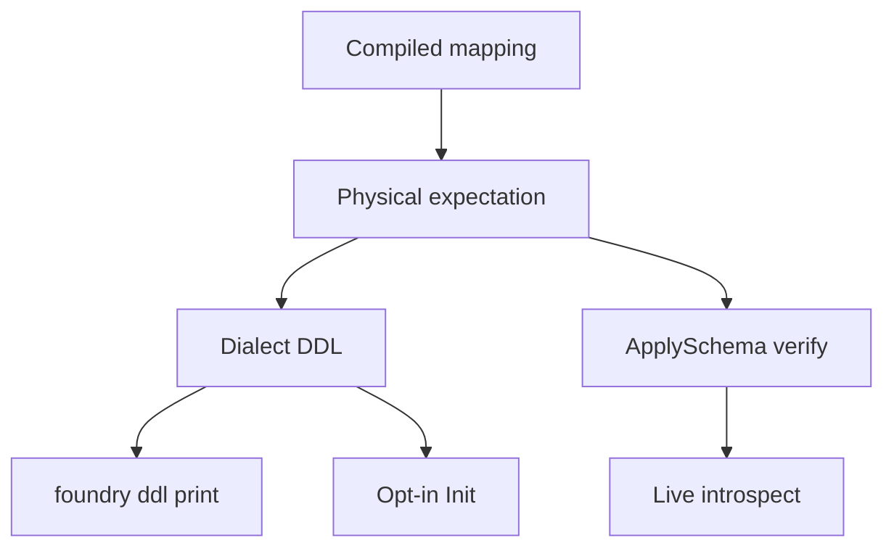

# Requirements: OBDA Physical Schema Expectation

## Summary

OBDA 从 compiled mapping 算出一份方言无关的物理期望：哪些表、哪些列、哪组 UNIQUE、是否排除软删。打印 DDL 和激活前校验都对照这份期望。方言只负责写成语句，以及在本库核对 UNIQUE。`foundry ddl` 不连库。装配入口按 driver 选 provider，只构造不激活。

---

## Problem Frame

MySQL provider 按「每个方言一份 provider」落地，把 sqlite 的 schema 校验整段复制过去。两份逻辑描述同一套 mapping 语义：identity、tenant、未 omit 的系统列、cardinality UNIQUE。改 omit 或系统列要改两处。

更危险的是第三套真相：各方言的建表语句自己再列一遍列清单。校验要的列和 CREATE 发出的列可以各自漂移。

装配层也绑死了 sqlite。配置默认 driver 是 mysql，但 `foundry ddl` 只打印 sqlite DDL，`Open` 只构造 sqlite provider。`ddl` 还先走 `Open`，会在打印前对库跑 sqlite PRAGMA。MySQL 那轮计划把 shared-core 延后到「重复咬人」；现在咬的是 schema 语义和装配，不是整包 objects/links。

---

## Key Decisions

- **一份物理期望，两套渲染。** 列需求和 UNIQUE 规格只从 compiled mapping 算一次。方言渲染 DDL，并用本库 introspect 对照同一份期望。不把整段 verify 塞进中立核心，也不只抽一份列清单而让建表语句继续另写。
- **期望停在语义层。** 期望描述「这组列上要有排除软删的 UNIQUE」。SQLite 的部分索引和 MySQL 的 `of_active` 生成列是方言实现，不得写进期望。
- **打印和连库拆开。** `foundry ddl` 只加载 pack、编译、打印。不打开数据库，不构造 provider。
- **`--dialect` 可覆盖。** 未指定时用配置的 driver。与运行时 driver 不一致时当作有意覆盖，不警告。
- **`ddl` 与 `Open` 都只接受一份 mapping。** 多份或零份失败。本轮不 merge。
- **`Open` 按 driver 选 provider，不激活。** 成功后 mapping 未激活。调用方再 `ApplySchema`。现有的 sqlite「打开即激活」入口保持原行为。
- **不认识的 driver / 方言失败。** 不得回退到 sqlite。
- **本轮不合成通用 SQL provider。** sqlite 与 mysql provider 仍分立。不把 introspect 收成统一端口。

---

## Actors

- A1. Operator：跑 `foundry ddl` 拿到建表语句；配置 driver；可选执行 Init；再激活。
- A2. Mapping author：编写一份 OBDA mapping。omit 与 cardinality 决定期望里的列和 UNIQUE。
- A3. OBDA core：编译 mapping，算出物理期望。
- A4. SQL 方言：把期望写成 DDL；用本库 introspect 判断表、列、UNIQUE 是否满足期望。
- A5. SQL provider：`ApplySchema` 对照期望做 live 校验后激活。`Open` 只按 driver 构造其中一个。

---

## Requirements

**Physical expectation**

- R1. compiled mapping 必须能产生一份方言无关的物理期望：每个 mapped 对象表和 link 表、必需要列、cardinality 所需 UNIQUE、该 UNIQUE 是否必须排除软删行。
- R2. 必需要列包括 identity、tenant（若声明）、未 omit 的系统列，以及 link 的 from/to 列。
- R3. UNIQUE 规格由 cardinality 决定：MANY_TO_ONE 约束 from 侧，ONE_TO_MANY 约束 to 侧，ONE_TO_ONE 两侧都要，MANY_TO_MANY 不要求这类 UNIQUE。tenant 列若存在则纳入规格。
- R4. 期望不得包含某一数据库的索引语法、生成列或类型名。

**Dialect render and verify**

- R5. 方言必须能从同一份期望生成该库的 CREATE TABLE / UNIQUE 语句。类型、引号、`IF NOT EXISTS`、部分索引或 `of_active` 由方言决定。
- R6. `ApplySchema` 必须用 live introspect 对照期望：缺表不得激活；缺列或缺所需 UNIQUE 不得激活。即使本进程刚打印或执行过 DDL，仍必须检查 live 库。
- R7. UNIQUE 是否匹配由方言判断。同一份「排除软删」期望，SQLite 认部分索引，MySQL 认 `of_active` 等价物。
- R8. 可选 Init 执行 R5 的语句。`ApplySchema` 不得调用它。MySQL 的 Init 仍只适用于空库。

**foundry ddl**

- R9. `foundry ddl` 加载 domain pack 与恰好一份 mapping，编译后按选定方言打印 R5 的语句。不打开数据库，不构造 provider。
- R10. `--dialect` 覆盖打印用的方言。未指定时用配置的 driver。
- R11. mapping 数量不是 1，或方言/driver 无法识别时，`ddl` 失败且不打印部分语句。
- R12. `--dialect` 与配置 driver 不一致时仍打印所选方言，不警告。

**Bootstrap Open**

- R13. `Open` 按配置的 driver 构造对应 SQL provider。不认识的 driver 失败，不得回退。
- R14. `Open` 成功后不 `ApplySchema`。未激活前，SPI 读写按现有「mapping 未激活」失败。
- R15. `Open` 要求恰好一份 mapping。现有的 sqlite 打开即激活入口不改这条规则，也不改「打开即激活」。

---

## Key Flows

- F1. Print mapped DDL
  - **Trigger:** Operator 运行 `foundry ddl`，可选 `--dialect`。
  - **Actors:** A1, A2, A3, A4
  - **Steps:** 加载 pack → 断言一份 mapping → 编译 → 算期望 → 按方言打印语句。
  - **Outcome:** stdout 是该方言的建表/UNIQUE DDL。无数据库会话。
  - **Covered by:** R1, R5, R9, R10, R11

- F2. Open provider without activation
  - **Trigger:** 运行时用配置装配存储。
  - **Actors:** A1, A5
  - **Steps:** 读 driver → 构造对应 provider → 返回。
  - **Outcome:** 持有未激活的 provider。读写尚未可用。
  - **Covered by:** R13, R14, R15

- F3. Activate against live schema
  - **Trigger:** 调用方对已构造的 provider 做 `ApplySchema`。
  - **Actors:** A3, A4, A5
  - **Steps:** 编译 → 算期望 → 方言 introspect → 对照表/列/UNIQUE → 成功则进程内激活。
  - **Outcome:** 匹配则激活；缺表/缺列/缺 UNIQUE 则失败且不激活。
  - **Covered by:** R1, R6, R7, R8

---

## Acceptance Examples

- AE1. **Covers R1, R5, R9, R10.** Given 配置 driver 为 mysql。When 无 `--dialect` 跑 `foundry ddl`。Then 打印 MySQL DDL，过程中不打开数据库。

- AE2. **Covers R10, R12.** Given 配置 driver 为 mysql。When `--dialect` 为 sqlite。Then 打印 SQLite DDL，无警告。

- AE3. **Covers R4, R5, R7.** Given 同一份 MANY_TO_ONE 且未 omit 软删的 mapping。When 分别生成 sqlite 与 mysql DDL，再对各自空库 Init 后 `ApplySchema`。Then 两边都激活成功；sqlite 语句含部分索引，mysql 语句含 `of_active` 等价物；期望本身不含二者中的任一种语法。

- AE4. **Covers R6, R8.** Given 刚打印过 DDL 但从未执行。When `ApplySchema`。Then 因缺表失败，mapping 未激活。

- AE5. **Covers R11, R15.** Given pack 里有两份 mapping。When `foundry ddl` 或 `Open`。Then 两者都失败。

- AE6. **Covers R13, R14.** Given driver 为 mysql。When `Open` 成功。Then 持有的是 mysql provider，且尚未激活。

- AE7. **Covers R11, R13.** Given driver 或 `--dialect` 为未支持值。When `ddl` 或 `Open`。Then 失败，不回退到 sqlite。

---

## Success Criteria

- 改 omit 或 cardinality 的列/UNIQUE 规则只改期望一处，两方言的打印与校验随之对齐。
- 配置 mysql 时，`foundry ddl` 默认打出可在 MySQL 执行的语句，且不连库。
- `Open` 按 driver 选对 provider，且不把激活藏进装配。
- 增加第三种方言时，不必再复制一份「需要哪些列 / 哪些 UNIQUE」；仍需该方言自己的 DDL 与 UNIQUE 匹配。

---

## Scope Boundaries

**In scope**

- compiled mapping → 物理期望
- 方言从期望生成 DDL，并用 introspect 对照期望
- `foundry ddl` 不连库、`--dialect`、一份 mapping
- `Open` 按 driver 选 provider、不激活、未知值失败
- 保持 Init 可选、`ApplySchema` 必做 live 检查

**Deferred for later**

- 把 sqliteobda / mysqlobda 合成一个通用 SQL provider
- 把 introspect / DDL 收进统一方言端口
- `ddl` 执行建表
- `Open` 打开即激活
- 多 mapping merge 后打印或装配
- `--dialect` 与 driver 不一致时警告
- 第三种 SQL 方言

**Outside this product's identity**

- 把 mapping 语义或期望写进某一个方言包
- 让 `ApplySchema` 靠「刚生成的 DDL」代替 live introspect
- 把 MySQL 的 `of_active` 或 SQLite 部分索引提升为中立模型

---

## Dependencies / Assumptions

- `ApplySchema` 先 introspect 再激活、Init 可选、禁止 `of_*` sidecar，仍以 `docs/brainstorms/2026-08-21-obda-direct-native-identity-requirements.md` 为准。
- sqlite 与 mysql 的 UNIQUE 分叉（部分索引 vs `of_active`）是已接受的方言事实，见 `docs/solutions/design-patterns/mysql-port-divergence-of-active-unique-index.md`。
- 配置默认 driver 为 mysql；当前 `Open` 与 `ddl` 却绑死 sqlite。本需求要消除这条错位。
- 现有 sqlite「打开即激活」入口继续服务测试与旧调用方。
- 无 `CONCEPTS.md`；用词与 `docs/brainstorms/2026-08-21-obda-mysql-storage-provider-requirements.md` 的 Core / dialect / provider 分层一致。

---

## Outstanding Questions

**Deferred to Planning**

- 期望的数据结构与它在编译结果中的存放方式
- `ddl` / `Open` 如何按名字解析方言和 provider（显式开关即可，本轮不要求统一端口）
- 现有各方言建表列清单如何改为消费期望，避免第三套真相残留
- 共享期望与分方言渲染的测试如何拆，才能锁住 AE3 的语义等价、语法分叉

---

## Sources / Research

- Duplicated verify/column specs: `runtime/storage/sqliteobda/schema.go`, `runtime/storage/mysqlobda/schema.go`
- Dialect interface has no DDL/introspect: `runtime/obda/dialect/dialect.go`
- `Open` always constructs sqlite; `ApplySchema` commented out: `runtime/bootstrap/conf.go`
- `ddl` hardcodes sqlite: `runtime/cmd/main.go`
- `OpenSQLite` activates: `runtime/bootstrap/bootstrap.go`
- Provider-per-dialect, shared-core deferred: `docs/plans/2026-08-27-001-feat-mysql-obda-provider-plan.md`
- ApplySchema must introspect even after optional DDL: `docs/design/obda-spec-v3.md`, `docs/brainstorms/2026-08-21-obda-direct-native-identity-requirements.md`
- UNIQUE dialect fork: `docs/solutions/design-patterns/mysql-port-divergence-of-active-unique-index.md`
