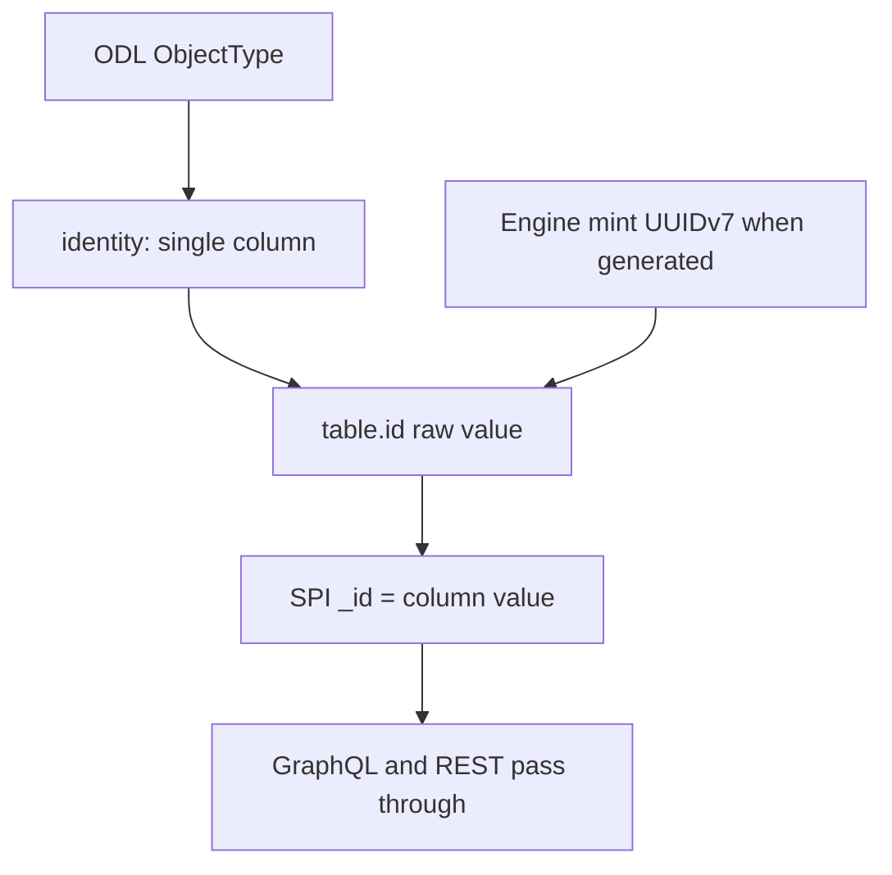

# Requirements: Single-Column Physical Identity

## Summary

ODL `_id` 等于被映射表上**单列** identity 的原始值。OBDA 只声明哪一列是 identity，不再编码或解码 ID。`insert: generated` 时 Engine 铸造 UUIDv7；provider 只写入该值。GraphQL 与 REST **原样透传**该裸 `_id`。删除 `EncodeDirect` / `DecodeDirect`。

---

## Problem Frame

现行 direct-native 把引擎 `_id` 做成可逆类型信封：provider 在写入 PK 前执行 `EncodeDirect(type, keys)`，`GetLinks` / `Traverse` 再靠 `DecodeDirect` 取出类型。这与「OBDA 做 Identity Mapping、不做 Identity Generation」冲突，也让 sqlite 的编码 `_id` 与 memory 的裸 UUID 分叉。

信封要解决的问题——「禁止扫多表猜类型」——在 SPI 里并不需要从 ID 解码。对象读写自带 `typ`。`GetLinks` / `Traverse` 能从 `linkType + direction` 经 compiled mapping 得到端点类型。GraphQL 根字段名与 REST 路径段已经带类型，HTTP 客户端也不会在「不知道类型」的上下文里使用 id。

复合键编码是信封存在的另一理由。本轮选择不支持复合 PK，换取存储层始终用原始列值做等值 JOIN。

---

## Key Decisions

- **存储层只做 Mapping。** identity 声明列名与 insert 策略。不把类型打进 ID，不在 OBDA 里铸造或解析 ID。
- **单列是前提。** identity 必须恰好一列。复合键不编码、不拼接、不在本轮支持。
- **铸造上收到 Engine。** `insert: generated` 时 Engine 给出 UUIDv7；所有 provider（含 memory）写入传入的 `_id`。`insert: provided` 时 Engine 不铸，使用调用方提供的那一列值。
- **唯一性是 `(type, id)`。** 存储层不要求跨类型全局唯一。GraphQL 根字段与 REST 路径已带类型；client cache 默认 `__typename + id`。
- **HTTP 不做 presentation 编码。** 对外 `id` 就是 SPI `_id`。不加 `node(id:)`。若将来要全局 Node 查询，再在 resolver 入口补编码。
- **Inline link `_id` 等于 host 对象 `_id`。** 靠 link `typ` 区分。表链接仍有独立 `_id`（Engine 已铸造的 UUIDv7，不再包信封）。
- **本文件只取代旧文的 identity 决定。** `docs/brainstorms/2026-08-21-obda-direct-native-identity-requirements.md` 的 R2 / R3 / R4 / R18 / R27 作废。无 sidecar、`ApplySchema` live 检查、系统列 omit、JOIN 遍历仍然有效。

---

## Actors

- A1. Ontology Engine：`insert: generated` 时铸造对象 UUIDv7；表链接继续铸造 link UUID。
- A2. SQL OBDA provider（sqlite 与 mysql）：按 mapping 把 `_id` 写入 identity 列；用 `typ` 选表；JOIN 用原始 ID。
- A3. memory provider：创建时持久化 Engine 传入的 `_id`，不再自己另铸对象 ID。
- A4. HTTP API（GraphQL 与 REST）：原样透传 SPI `_id`。类型来自 GraphQL 根字段名或 REST 路径段。
- A5. Mapping author：声明单列 identity 与 `insert: generated | provided`。
- A6. SPI / Engine 调用方：使用存储 `_id`。

---

## Requirements

**Storage identity**

- R1. 每个可执行绑定的 identity 必须恰好一列。多列 identity 在 mapping 编译或校验时失败，不得激活。
- R2. 对象与 link 的 SPI `_id` 等于该 identity 列的原始存储值（非文本列取其规范字符串形式）。不得再写入类型信封。
- R3. 运行时不得从 ID 字符串解码类型。`GetLinks` / `Traverse` 的对象类型由 `linkType + direction` 经 compiled mapping 推导。provider 不得扫多表猜测类型。
- R4. `GetObject` / `GetLink` 在声明的类型对应表上按 `_id` 与租户查找。类型不匹配、跨租户、缺行 → 与缺失相同的 not-found。不得先做纯内存类型信封校验。

**Engine minting**

- R5. `insert: generated`：Engine 铸造 UUIDv7 作为 `_id`，再交给 storage。调用方不得用 properties 覆盖该 PK。
- R6. `insert: provided`：Engine 不铸造。`_id` 必须来自调用方提供的那一列值；缺值失败。
- R7. 所有 storage provider 必须持久化 Engine 传入的对象 `_id`。provider 不得在 generated 路径上另铸或改写对象 ID。
- R8. 表链接的 `_id` 仍是 Engine 铸造的 UUIDv7（现有 `_engineLinkId` 路径），写入 link 表 identity 列时不再包类型信封。
- R9. 删除 `EncodeDirect` / `DecodeDirect` 及一切依赖它们的存储路径。不得留下「仅 inline 使用」的编码分支。

**Inline links**

- R10. Inline link 的 SPI `_id` 等于 host 对象的 SPI `_id`。Create / Get / Delete 均使用该值，不另铸 link UUID。
- R11. 同一 host 上不同 inline link type 可以共享同一 SPI `_id`。寻址始终带 link `typ`。

**HTTP pass-through**

- R12. GraphQL 类型根字段（如 `patient(id:)`）与 REST `GET /api/v1/{type}/{id}` 的 `id` 等于 SPI `_id`。不得在 HTTP 边界编码或解码。本轮不加 `node(id:)`。

**Spec and mapping**

- R13. `docs/design/obda-spec-v3.md` 中要求可逆类型信封、从单 id 解码类型、以及 sqlite/memory `_id` 分叉的条款必须改写，使之与 R1–R4、R12 一致。
- R14. `insert: generated | provided` 仍是 mapping 作者契约。generated 表示 Engine 铸 UUID 写入该列；provided 表示列值由调用方提供。

---

## Key Flows

- F1. Generated create
  - **Trigger:** `CreateObject("Patient", {name: "Ada"})`，mapping 为 `insert: generated`。
  - **Actors:** A1, A2 or A3
  - **Steps:** Engine 铸 UUIDv7；provider `INSERT` 该值到 identity 列；返回 SPI `_id` 等于列值。
  - **Outcome:** 库中无类型信封。随后 `GetObject("Patient", id)` 用该裸 id 命中。
  - **Covered by:** R2, R5, R7

- F2. GetLinks / Traverse without decoding
  - **Trigger:** `GetLinks(patientId, "AdmittedTo", "outbound")` 或带该首跳的 `Traverse`。
  - **Actors:** A2
  - **Steps:** mapping 推出起点类型 Patient；JOIN 业务表；`WHERE` 使用裸 id。
  - **Outcome:** 不调用任何 ID 解码。错类型 id 在正确表上查空 → not-found。
  - **Covered by:** R3, R4

- F3. HTTP get
  - **Trigger:** GraphQL `patient(id:)` 或 REST `GET /api/v1/patient/{id}`。
  - **Actors:** A4, A1
  - **Steps:** 路径或根字段提供 type；`id` 原样交给 Engine `GetObject`；响应 `id` 原样返回 SPI `_id`。
  - **Outcome:** 客户端看见裸存储 id。同一对象在 GraphQL 与 REST 上 id 字符串相同。
  - **Covered by:** R12

- F4. Inline link by host id
  - **Trigger:** `GetLink("AdmittedTo", hostStorageId)`；host 上另有一条 inline link。
  - **Actors:** A1, A2
  - **Steps:** 用 link typ 选 inline 绑定；按 host `_id` 读 host 行上的 FK。
  - **Outcome:** 两条 inline link 的 SPI `_id` 相同，靠 `typ` 区分。
  - **Covered by:** R10, R11

- F5. Provided natural key
  - **Trigger:** `insert: provided`，调用方给出单列自然键（如 ISBN）。
  - **Actors:** A1, A2, A5
  - **Steps:** Engine 不铸 UUID；provider 把该值写入 identity 列。
  - **Outcome:** SPI `_id` 等于自然键的字符串形式。
  - **Covered by:** R2, R6, R14

---

## Acceptance Examples

- AE1. **Covers R2, R5, R7, R9.** Given `insert: generated`。When Engine `CreateObject` Patient。Then 返回的 `_id` 是 UUIDv7 形态；业务表 identity 列等于该值；该字符串不能当作类型信封解码。

- AE2. **Covers R4, R9.** Given Patient 与 Ward 各有一行。When `GetObject("Patient", wardStorageId)`。Then `ErrObjectNotFound`（错表上空查），过程不依赖 ID 解码。

- AE3. **Covers R1.** Given mapping 为某对象声明两列 identity。When 编译或 `ApplySchema`。Then 失败，mapping 未激活。

- AE4. **Covers R3.** Given 已激活的 AdmittedTo。When `GetLinks(patientStorageId, "AdmittedTo", "outbound")`。Then 结果页的端点 `_id` 是 Ward 表原始 PK；SQL JOIN 为裸 id 等值比较。

- AE5. **Covers R10, R11.** Given 同一 Patient 上两条 inline link。When 分别 Get 两条 link。Then SPI `_id` 都等于该 Patient `_id`。

- AE6. **Covers R12.** Given 已创建的 Patient。When GraphQL `patient(id:)` 与 REST GET 使用同一 SPI `_id`。Then 两者都命中该对象；响应 `id` 等于该裸 `_id`。

- AE7. **Covers R6, R14.** Given `insert: provided` 且调用方未给 identity 值。When `CreateObject`。Then 失败，不写入行。

- AE8. **Covers R8, R9.** Given Engine `CreateLink` 表链接。When provider 写入。Then link 表 identity 列等于 Engine 注入的 UUID，无类型信封。

---

## Success Criteria

- sqlite、mysql、memory 对 generated 对象返回的 `_id` 形态一致：裸单列值，不再分叉。
- 存储路径与测试中不再出现 `EncodeDirect` / `DecodeDirect`。
- GraphQL 与 REST 对同一对象给出与 SPI 相同的裸 `id`。
- spec v3 的 identity 表述与本文件一致，旧 brainstorm 的信封条款不再被新工作引用为有效需求。

---

## Scope Boundaries

**Deferred for later**

- 只有复合 PK、没有单列 identity 的遗留表（作者需先加单列 id）
- 一个 FK 指向多种 ObjectType
- GraphQL `node(id:)` / Node 接口，以及为此做的 presentation 编码（`docs/design/q6-id.md`）

**Outside this round**

- 恢复 sidecar / `of_*` 表
- 在存储层或 HTTP 层保留任何类型信封
- 为本轮尚未存在的全局 `node(id:)` 预先编码

---

## Dependencies / Assumptions

- 无 sidecar、`ApplySchema` 必须 live introspect、系统列可 omit、Traverse 链式 JOIN，仍以 `docs/brainstorms/2026-08-21-obda-direct-native-identity-requirements.md` 中未被本文件取代的条款为准。
- Inline FK 的物理形状以 `docs/brainstorms/2026-09-07-obda-inline-link-fk-requirements.md` 为准；本文件只改其 `_id` 来源（host 裸 id，不再 `EncodeDirect`）。
- Query IR 在 `Traverse` 前对起点做存在性检查的规则仍然成立；存储层因此不必靠解码 ID 来拒绝未知起点。
- 非文本 identity 列的规范字符串形式（整数、UUID 类型）由规划定；产品只要求 SPI `_id` 为稳定字符串且等于列值的往返形式。
- Engine 如何获知某类型是 `generated` 还是 `provided`（读 compiled mapping，或其它注入）由规划定；R5 / R6 / R14 的行为不因注入方式改变。
- 现有 GraphQL schema 只有类型根字段，没有 `node(id:)`。Apollo/Relay 缓存 key 为 `__typename + id`，裸 id 不会跨类型撞车。

---

## Outstanding Questions

**Deferred to Planning**

- mapping YAML 是 `column:` 单数还是继续 `columns:` 且长度为 1。
- Engine 把生成的对象 `_id` 交给 provider 的 SPI 形状（与现有 `_engineLinkId` 是否对称）。

---

## Sources / Research

- `docs/brainstorms/2026-08-21-obda-direct-native-identity-requirements.md` — 被取代的信封条款（R2/R3/R4/R18/R27）
- `docs/design/obda-spec-v3.md` — 现行 EncodeDirect 契约，本轮需改写
- `docs/design/q6-id.md` — 将来 `node(id:)` 才需要的 presentation 编码，本轮不实施
- `runtime/obda/identity.go` — `EncodeDirect` / `DecodeDirect`
- `runtime/engine/engine.go` — CreateObject 不铸对象 ID；CreateLink 铸 UUIDv7 并注入 `_engineLinkId`
- `runtime/storage/memory/provider.go` — CreateObject 自行 `uuidv7.New()`
- `runtime/api/node.go` — GraphQL `id` 已原样透传 `spi.FieldID`（本轮保持）
- `runtime/api/http.go` — REST GET `/api/v1/{type}/{id}`，响应 `id` 已原样透传
- `docs/plans/2026-09-07-002-feat-obda-inline-link-fk-plan.md` — inline `_id = EncodeDirect(linkType, hostEngineID)`，由本文件 R10 取代
