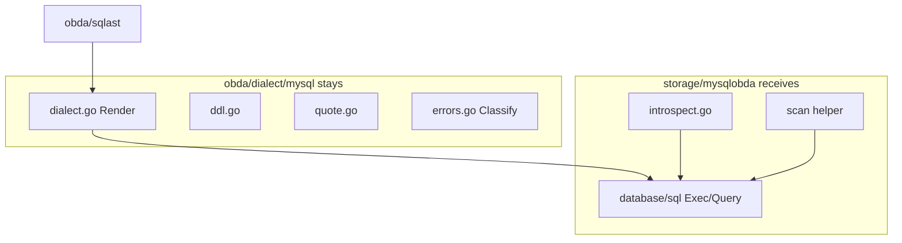

# mysqlobda: xorm vs database/sql, and dialect/mysql package boundary

## Summary

`mysqlobda` 继续用 `database/sql` 执行已经由 `sqlast` + `Dialect.Render` 产出的参数化 SQL。不把 xorm 引进这条路径。真正要改的是两件事：在 `storage/mysqlobda` 内用位置扫描 helper 消掉重复的 `dest/ptrs` 样板；把 `obda/dialect/mysql/introspect.go` 移入 `storage/mysqlobda`，让 dialect 包只做纯渲染。`Classify` 留在 dialect。sqlite 与共享 helper 本轮不动。

---

## Problem Frame

`runtime/internal/orm/db.go` 已经给出 xorm Engine 构造范式，容易让人以为 `mysqlobda` 里手写的 `database/sql` 是过时写法。但 `mysqlobda` 不是编译期已知表结构的数据访问层：列名、表名、可写性都来自运行时 mapping YAML。xorm 的主体价值（struct 映射、tag、`Sync2`、链式 DSL）在这里用不上。

同时 `obda/dialect/mysql` 声称只做 sqlast → SQL 渲染，却有 193 行 `information_schema` 查询、签名直接吃 `*sql.DB`。整体并入 `storage/mysqlobda` 会偏离 `docs/design/obda-spec-v3.md` 已成文的包边界，也会打破与 `dialect/sqlite` 的对称。

---

## Key Decisions

- **xorm 不进 mysqlobda。** 全量替换（Pattern A）因 JOIN 同名列、类型转换层、缺少 `QueryRow` 三个已核实阻断点被否决。连接构造层用 xorm（Pattern B）收益不够支付依赖成本。
- **痛点用本地 helper 解。** 7 处 `dest/ptrs` 位置扫描样板抽到 `storage/mysqlobda` 私有 helper。保留位置语义与 `unwrap` + `NormalizeValue` 类型契约。
- **dialect 按是否触库切开，不整体搬家。** `dialect.go` / `ddl.go` / `quote.go` / `errors.go` 留在 `obda/dialect/mysql`。`introspect.go` 移入 `storage/mysqlobda`。
- **`Classify` 留在 dialect。** 与 spec v3 §3.1 表格一致；它不触库。
- **本轮只动 mysql。** sqlite introspect 与共享 scan helper 另开一轮。中间态允许两种方言归属法并存。
- **xorm 的适用边界（建议，本轮不成文）。** 表结构由 mapping YAML 在运行时决定 → `database/sql` + `sqlast`/`Dialect`。表结构由 runtime 在编译期定死 → xorm + struct。`mysqlobda` 永远属于前者。



---

## Requirements

**xorm / scan helper**

- R1. `mysqlobda` 继续通过 `database/sql`（含现有 `DBTX`）执行 dialect 渲染出的参数化 SQL。不引入 xorm Engine / Session / `QueryInterface`。
- R2. `mysqlobda` 的行读取继续按列位置扫描，不按 `rows.Columns()` 列名建 map。JOIN 路径（`links.go` 的 `PlanGetLinksJoin`）不得因同名列互相覆盖。
- R3. 读出类型契约仍是 `unwrap` 再 `Dialect.NormalizeValue`。时间戳对外表示仍是 RFC3339 字符串，不经过 xorm 的 `TZLocation` / `Interface2Interface`。
- R4. 7 处 `ptrs[i] = &dest[i]` 样板收敛到 `storage/mysqlobda` 包内私有 helper。`unwrap` 仍为该包私有。本轮不抽到共享包，也不改 `sqliteobda`。
- R5. `search.go` 的 `of_score` 等尾部 extra 列仍由调用方从扫描结果尾部自取，不并进业务列 map。

**dialect / introspect 归属**

- R6. `obda/dialect/mysql` 只保留不碰活连接的代码：`dialect.go`、`ddl.go`、`quote.go`、`errors.go` 及其纯字符串测试。
- R7. `introspect.go`（`InspectTable` / `TableExists` / `InspectIndexes` / `HasUniqueIndex` / `HasFulltextIndex` 及关联类型）移入 `storage/mysqlobda`。调用方改为包内符号，不再经 `mysqldialect.` 跨包调用。
- R8. `Classify` 留在 `obda/dialect/mysql`。错误分类语义不变（1062 → cardinality / version；1146 / 1049 → drift）。
- R9. `bootstrap/dialect.go` 继续从 `obda/dialect/mysql` 取 `MappedTableStatements` / `DropTableStatements`。DDL 渲染不随 introspect 搬家。
- R10. 移动后 `obda/dialect/mysql` 的测试仍可不连 `TEST_DB_URL` 跑通。introspect 相关测试随文件进入 `mysqlobda`，继续走 `internal/testdb` + `TEST_DB_URL`。

**行为不变**

- R11. SPI 表面、乐观锁 `RowsAffected`、`sql.ErrNoRows` → `ErrObjectNotFound`、fingerprint drift fail-closed、事务 `Conn` 钉住语义均保持现状。本轮不是功能变更。

---

## Scope Boundaries

**本轮做**

- `storage/mysqlobda` 本地 scan helper
- `obda/dialect/mysql/introspect.go` 移入 `storage/mysqlobda`
- 同步更新 `docs/design/obda-spec-v3.md` §3.1 表格中 introspect 一项，以及 §19 layout 中 mysql dialect 文件清单

**本轮不做**

- 用 xorm 替换 `mysqlobda` 或 `sqliteobda` 的执行层
- 在 `bootstrap` 用 `orm.NewEngine` 建连接
- 把整个 `obda/dialect/mysql` 并入 `storage/mysqlobda`
- 移动 `Classify`、DDL 渲染、quote
- 改 `obda/dialect/sqlite/introspect.go`（另开一轮以恢复对称）
- 共享 scan helper / 共享 `unwrap`
- 改 `sqlast`、planner、Engine、SPI
- 删除或成文 `runtime/internal/orm`（见 Outstanding Questions）

---

## Acceptance Examples

- AE1. **Covers R2, R4.** Given `Borrows` 走 `PlanGetLinksJoin`，两侧表都有 `id` / `tenant_id` / `version`。When 扫描一行。Then 业务列按 select 位置填入，host 的 `id` 不被 peer 的 `id` 覆盖。
- AE2. **Covers R3, R11.** Given 对象有 `created_at`。When `GetObject` / `QueryObjects`。Then `spi.FieldCreatedAt` 仍是 RFC3339 字符串，不是 `time.Time`。
- AE3. **Covers R6, R7, R10.** Given 只跑 `go test ./obda/dialect/mysql/...` 且未设 `TEST_DB_URL`。When 测试结束。Then 全部通过；没有测试因缺库 skip 导致整包无断言。
- AE4. **Covers R8, R11.** Given MySQL 返回 `Error 1062` 且信息含 `version`。When `Classify`。Then 仍是 `spi.ErrVersionConflict`。

---

## Outstanding Questions

**Deferred to Planning**

- D1. introspect 移入 `mysqlobda` 后，纯函数（`HasUniqueIndex` / `HasFulltextIndex`）是跟查询函数放同一文件，还是拆成不碰 `*sql.DB` 的小文件？
- D2. `runtime/Makefile` 的 `MYSQL_PACKAGES` 在 introspect 搬走后是否仍列出 `./obda/dialect/mysql/...`（应保留：纯渲染测试仍在该包）。
- D3. sqlite introspect 搬迁的跟进轮次：是否等 mysql 落地并跑过 `TEST_DB_URL` 后再开。

**Unresolved (not this change)**

- Q1. §2.4 的 xorm 分工边界是否写入 `docs/design/obda-spec-v3.md` 或 `CLAUDE.md`。
- Q2. `runtime/internal/orm` 当前零调用方：保留为未来内部表基础设施，还是移除以免误导。

---

## Evaluation: why xorm cannot replace database/sql here

### mysqlobda is runtime-dynamic, with no Go structs

- Schema comes from `ApplySchema` + OBDA mapping YAML, compiled to `*obda.Compiled` (`runtime/storage/mysqlobda/provider.go`).
- Column names, table names, writability, identity columns are runtime values.
- Rows land in `map[string]any`, then `assemble` builds `spi.OntologyObject`.
- Writes use parallel `cols []string` / `vals []any`.

There is no business-table Go struct in the repo, and there cannot be: table shape is declared in mapping YAML.

### SQL is rendered, not authored

```text
obda.PlanQuery / PlanCreateObject / PlanUpdateObject / PlanSearch
        ↓  closed AST (runtime/obda/sqlast)
mysqldialect.Render(stmt)
        ↓  dialect.SQLStatement{SQL: "...?..."}
tx.Exec(stmt.SQL, args...)
```

`database/sql` only sends already-parameterized SQL and scans results by position.

### database/sql surface today

| Usage | Where | Note |
|---|---|---|
| `Exec` / `Query` / `QueryRow` | 26 non-test sites | all via `DBTX` |
| `DBTX` | `provider.go` | unifies `*sql.DB` and `*sql.Tx` |
| conn pin + tx | `objects.go` `begin`, `transaction.go` | `db.Conn` → `BeginTx` → `conn.Close` |
| position-scan boilerplate | 7 sites | query / search / objects / links×3 / aggregate |
| `sql.ErrNoRows` | `objects.go` | maps to `spi.ErrObjectNotFound` |
| `RowsAffected()` | `objects.go` | sole OCC conflict signal |
| `sql.Null*` | `unwrap` | NULL normalize |

### dialect/mysql makeup (~1731 lines including tests)

| File | Kind | Touches DB |
|---|---|---|
| `dialect.go` | sqlast → SQL, `NormalizeValue` | no |
| `ddl.go` | mapped-table DDL | no |
| `quote.go` | backtick quoting | no |
| `errors.go` | `Classify` | no; couples to driver error text |
| `introspect.go` | `InspectTable` / `TableExists` / `InspectIndexes` | **yes, takes `*sql.DB`** |
| `*_test.go` | string assertions | no `TEST_DB_URL` |

### Three verified blockers against xorm v1.4.1

**1. `map[string]any` collides on JOIN duplicate column names.**

`ScanInterfaceMaps` keys the map by `rows.Columns()`. Link reads use `PlanGetLinksJoin` with `Qualifier: "l"`. Both sides have `id` / `tenant_id` / `version` / timestamps. Current code scans by position into `scanCols`, so it is safe. A name-keyed map silently overwrites. Aliasing every select column would force changes in `sqlast`, `Render`, `PlanGetLinksJoin`, and sqlite — negative ROI for a scan rewrite.

**2. xorm's conversion layer fights `NormalizeValue`.**

`row2mapInterface` runs `driver.GenScanResult(DatabaseTypeName())` then `convert.Interface2Interface(engine.TZLocation, ...)`. This project's contract is `writeValue` → `unwrap` → `Dialect.NormalizeValue`. Timestamps are RFC3339 strings end to end. If xorm turns DATETIME into `time.Time` under `TZLocation`, `spi.FieldCreatedAt` changes across the SPI boundary.

`runtime/internal/orm/db.go` sets both `TZLocation` and `DatabaseTZ` to UTC. Correct for struct tables; harmful here, where the provider owns the wire representation.

**3. No `QueryRow`, full materialization.**

xorm raw APIs are `Query` / `QueryString` / `QueryInterface` — all full slices, no streaming `*sql.Rows`, no `QueryRow`. `loadBusiness` would become `len == 0` instead of `sql.ErrNoRows`. Pagination would buffer then slice.

`introspect.go` taking `*sql.DB` would also need `engine.DB().DB` as an escape hatch.

---

## Rejected and confirmed patterns

### Pattern A — Engine/Session replace sql.DB/sql.Tx (rejected)

```go
type DBTX interface {
	Exec(sqlOrArgs ...any) (sql.Result, error)
	QueryInterface(sqlOrArgs ...any) ([]map[string]any, error)
}
```

`loadBusiness` gets shorter. `links.go` either silently corrupts or forces `sqlast` changes. Type conversion must be fought or accepted as an SPI break. `Classify` depends on `"Error 1062"` text remaining intact. Rejected.

### Pattern B — xorm only at connection construction (not taken)

```go
engine, err := orm.NewEngine(driver, c.DBURL)
return mysqlobda.Open(engine.DB().DB, raw, mysqlobda.Options{})
```

Tiny diff, zero correctness risk, tiny benefit. `Open` already `Ping`s. `ShowSQL(true)` dumps all SQL and bypasses `runtime/internal/log`. Not taken.

### Pattern C — local position-scan helper (confirmed)

```go
// runtime/storage/mysqlobda/scan.go — illustrative, not a frozen signature
func scanRow(sc interface{ Scan(...any) error }, cols []string, extra int) ([]any, error) {
	dest := make([]any, len(cols)+extra)
	ptrs := make([]any, len(dest))
	for i := range dest {
		ptrs[i] = &dest[i]
	}
	if err := sc.Scan(ptrs...); err != nil {
		return nil, err
	}
	for i := range dest {
		dest[i] = unwrap(dest[i])
	}
	return dest, nil
}

func bizMap(vals []any, cols []string) map[string]any {
	out := make(map[string]any, len(cols))
	for i, c := range cols {
		out[c] = vals[i]
	}
	return out
}
```

About 30 lines replace 7 sites. Position semantics stay. Type contract stays. No new dependency. Confirmed; helper stays mysqlobda-private this round.

---

## Evaluation: dialect package boundary

**Why a full move looks tempting.** 38 references to `mysqldialect` exports, 34 inside `mysqlobda`. Only `bootstrap/dialect.go` is outside. `bootstrap` already imports `mysqlobda`, so no import cycle. `Makefile` already tests both packages as one unit. `Provider.dialect` is the concrete `*mysqldialect.Dialect`, not the interface.

**Why a full move is rejected.** spec v3 line 28 says that document constrains package boundaries. §3.1 pins `sqliteobda → runtime/obda → dialect.Dialect ← dialect/sqlite`. §19 nails `dialect/<name>` under `runtime/obda/`. §23 lists PostgreSQL and DuckDB as the same extension slot. MySQL was placed there to mirror sqlite (`docs/plans/2026-08-27-001-feat-mysql-obda-provider-plan.md`). Folding the slot because *today* only mysqlobda consumes it trades short-term neatness for long-term extensibility. A same-package renderer also loses the hard wall against `activation` / `p.db` / tenant state.

**Why the introspect split is the right cut.** The real smell is independent of xorm: a package that claims to render SQL is running `information_schema` queries. Moving only the live-connection code sharpens the rule without overturning the dependency graph.

---

## Sources

| Claim | Evidence |
|---|---|
| provider has no structs; columns are runtime | `runtime/storage/mysqlobda/objects.go` insert/update column loops |
| SQL is rendered, not handwritten | `runtime/storage/mysqlobda/query.go`; `runtime/obda/dialect/mysql/dialect.go` `Render` |
| 7 position-scan sites | query.go, search.go, objects.go, links.go ×3, aggregate.go |
| link read is JOIN + position scan | `runtime/storage/mysqlobda/links.go` `PlanGetLinksJoin` |
| xorm map keyed by column name | `xorm.io/xorm@v1.4.1/scan.go` `ScanInterfaceMaps` |
| xorm converts via TZLocation | `xorm.io/xorm@v1.4.1/scan.go` `row2mapInterface` |
| xorm raw query has no QueryRow | `xorm.io/xorm@v1.4.1/interface.go` |
| timestamps are RFC3339 strings | `runtime/storage/mysqlobda/objects.go` `nowRFC3339` / `assemble` |
| `Classify` matches driver error text | `runtime/obda/dialect/mysql/errors.go` |
| introspect takes `*sql.DB` | `runtime/obda/dialect/mysql/introspect.go` |
| only extra consumer of mysqldialect | `runtime/bootstrap/dialect.go` |
| spec owns package boundary | `docs/design/obda-spec-v3.md` §3.1, §19 |
| MySQL dialect placement was "mirror sqlite" | `docs/plans/2026-08-27-001-feat-mysql-obda-provider-plan.md` |
| MySQL tests skip without `TEST_DB_URL` | `runtime/internal/testdb/mysql.go` |
| xorm has zero call sites | only `runtime/go.mod` and `runtime/internal/orm/db.go` |
