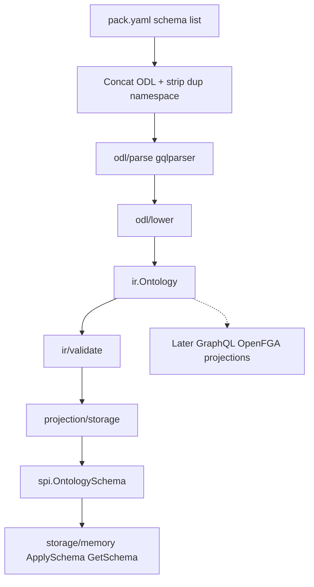

# feat: Go Phase 1 — SPI, ODL Parser, Ontology IR

## Summary

Add an in-repo Go `runtime/` module that defines Ontology IR as the TBox core, parses ODL via gqlparser and lowers into IR, exposes a full SPI `StorageProvider` with schema-only memory implementation, and proves the supply-chain gold path: parse → IR → storage projection → `ApplySchema` / `GetSchema`.

## Problem Frame

TypeScript today splits schema truth across `ParsedSchema` (GraphQL-flavored AST), `OntologySchema` (storage projection), and action YAML. `plan/1.md` and the origin requirements call for a Go-native Runtime Phase 1 that puts Ontology IR first so later engine/query/API work does not re-bind to SDL or storage shapes (see origin: `docs/brainstorms/2026-08-10-go-phase1-ontology-ir-requirements.md`).

## Requirements

Origin R1–R11 are in scope. Plan-local restatement:

- R1–R3. Ontology IR holds full Phase 1 TBox with field roles; not a GraphQL AST; action signatures only.
- R4–R5. Parse existing ODL dialect; load/merge `domain-packs/supply-chain` schema list into one IR.
- R6–R9. Full SPI surface; non-schema methods return documented unimplemented errors; project IR → storage schema with TS omission rules; memory `ApplySchema`/`GetSchema` round-trip.
- R10–R11. Code under `runtime/`; consume packs in-place; no GraphQL/REST/Postgres/engine CRUD as success criteria.

Origin acceptance: AE1–AE4, flow F1.

## Key Technical Decisions

- **Module root `runtime/`** with `module github.com/openfoundry/runtime`, Go 1.22+ (align toward cel-evaluator’s 1.25 when convenient). Separate from `packages/cel-evaluator`; optional root `go.work` later, CI may use `GOWORK=off`.
- **IR-first pipeline:** `odl/parse` (gqlparser AST) → `odl/lower` → `ir` → `validate` → `projection/storage` → `spi.OntologySchema`. `ir` must not import gqlparser.
- **Parser: `github.com/vektah/gqlparser/v2`.** Use `parser.ParseSchema` / `ParseSchemas` only — not `LoadSchema` / GraphQL semantic validation.
- **FieldRole at lower time:** Primary | Property | Param | LinkNav | Computed — projection reads roles, not directive bags.
- **Pack gold path:** read `domain-packs/supply-chain/pack.yaml` `schema:` list only; do **not** load `domain-packs/core` despite pack dependency declaration (ODL is self-contained; matches TS supply-chain pack tests).
- **Namespace merge:** keep first file’s `@namespace`; strip duplicate `extend schema @namespace` from later files (mirror TS pack concat).
- **Storage projection:** omit Primary, Computed, LinkNav from object properties; extract Unique/Indexed/Searchable indexes; link fields map through; actions/enums/interfaces stay in IR only. Behavioral parity with `packages/api/src/schema-loader.ts` conversion — not bit-exact TS JSON as hard gate.
- **SPI stub pattern:** `UnimplementedStorageProvider` embed + `ErrUnimplemented` with method name; memory overrides schema (+ optional health/capabilities if needed for honesty).
- **No Phase 1 CLI required.** Automated tests satisfy R9 / F1.
- **Action YAML out of scope.** Do not load `actions/*.yaml`.

## High-Level Technical Design



**Directional type sketch (not implementation spec):**

```text
ir.Ontology { Namespace, Objects, Links, Actions, Enums, Interfaces, Scalars }
ir.Field { Name, Type TypeRef, Role FieldRole, Flags, Link?, Computed? }
spi.OntologySchema { Version, ObjectTypes, LinkTypes }  // persistence view
```

## Output Structure

```text
runtime/
├── go.mod
├── spi/
│   ├── ontology.go          # OntologySchema, property/index types
│   ├── provider.go          # StorageProvider + related SPI types
│   ├── unimplemented.go     # UnimplementedStorageProvider
│   └── errors.go
├── ir/
│   ├── ontology.go          # Ontology IR + FieldRole
│   └── validate.go
├── odl/
│   ├── parse.go
│   └── lower.go
├── pack/
│   └── loader.go            # pack.yaml → merged IR
├── projection/
│   └── storage.go
├── storage/
│   └── memory/
│       └── provider.go
└── ..._test.go / testdata/  # per-package tests + gold helpers
```

Implementer may adjust package names within `runtime/` if clearer; keep the layer boundary (parse ≠ ir ≠ projection ≠ spi).

## Scope Boundaries

**In scope:** units U1–U6 below.

**Deferred to Follow-Up Work**

- Thin CLI (`validate` / `apply-schema`)
- Multi-pack merge / loading `core`
- Bit-exact golden diff against TS `toOntologySchema` JSON
- Query IR, Action runtime, GraphQL/REST generators, Postgres/AGE, engine CRUD
- Turbo/`pnpm` orchestration of Go tests (add CI job later)

**Outside this product's identity**

- Line-by-line TypeScript port
- GraphQL as semantic core

## Implementation Units

### U1. SPI contract and unimplemented base

- **Goal:** Go SPI types and full `StorageProvider` surface with documented unimplemented defaults.
- **Requirements:** R6, R7, AE4
- **Dependencies:** none
- **Files:**
  - Create: `runtime/go.mod`
  - Create: `runtime/spi/*.go`
  - Create: `runtime/spi/unimplemented_test.go`
- **Approach:** Port conceptual shapes from `packages/spi/src/ontology.ts` and `storage-provider.ts` (RequestContext, OntologySchema, MigrationResult, object/link/query types as needed for the interface). Embed `UnimplementedStorageProvider`; every non-overridden method returns `fmt.Errorf("%w: MethodName", ErrUnimplemented)`.
- **Patterns to follow:** TS SPI zero-dependency types package; gRPC-style unimplemented embed from research.
- **Test scenarios:**
  - Happy path: type-assert a stub struct embedding Unimplemented satisfies `StorageProvider`.
  - Covers AE4. Calling `CreateObject` (and one link / one query method) returns error with `errors.Is(..., ErrUnimplemented)` and method name in message.
- **Verification:** `go test ./spi/...` passes; interface compiles complete relative to TS method groups (schema, objects, links, transactions, versioning, indices, health).

### U2. Ontology IR and validate

- **Goal:** Semantic TBox types with FieldRole; post-merge semantic validation API.
- **Requirements:** R1, R2, R3
- **Dependencies:** none (may land parallel to U1; no import of spi required)
- **Files:**
  - Create: `runtime/ir/ontology.go`, `runtime/ir/validate.go`, `runtime/ir/validate_test.go`
- **Approach:** Define `Ontology`, object/link/action/enum/interface/scalar, `TypeRef`, `FieldRole`, link/computed refs, storage-relevant flags (unique/indexed/searchable/constraint/default). `Validate(*Ontology) error` checks: link endpoints exist, exactly one Primary per object, action fields are Param, enum value uniqueness, namespace present when expected. No gqlparser types in this package.
- **Patterns to follow:** Origin R1 field roles; TS validator intent in `packages/odl/src/validator/index.ts` (behavior, not AST shape).
- **Test scenarios:**
  - Happy path: minimal valid ontology (one object with primary + property, one link) validates clean.
  - Error: link `to` missing type → typed/validate error.
  - Error: object with zero or two Primary fields → error.
  - Error: action field without Param role → error.
- **Verification:** `go test ./ir/...` passes; package imports contain no gqlparser.

### U3. ODL parse and lower

- **Goal:** Parse ODL SDL into a throwaway syntax view and lower to `ir.Ontology`.
- **Requirements:** R2, R4
- **Dependencies:** U2
- **Files:**
  - Create: `runtime/odl/parse.go`, `runtime/odl/lower.go`, `runtime/odl/*_test.go`
  - Create: `runtime/odl/testdata/*.odl` (small fixtures)
- **Approach:** Depend on `github.com/vektah/gqlparser/v2`. Parse with `ParseSchema`/`ParseSchemas`. Lower maps `@linkType`/`@actionType`/`@objectType` (default object), field directives → FieldRole + flags. Extract `@namespace` from schema extensions. Discard AST after lower.
- **Execution note:** Implement test-first on small fixtures (object, link, action, computed, link-nav) before supply-chain.
- **Patterns to follow:** Directive routing in `packages/odl/src/parser/index.ts`; do not re-home GraphQL nodes in IR.
- **Test scenarios:**
  - Happy path: object with `@primary`, `@unique`, `@indexed` lowers roles/flags correctly.
  - Happy path: `@linkType(from,to,cardinality)` populates LinkType.
  - Happy path: `@actionType` fields with `@param` → ActionType params only.
  - Happy path: `@link` / `@computed` → LinkNav / Computed roles.
  - Error: invalid SDL syntax → parse error with source name.
- **Verification:** `go test ./odl/...` passes; IR values have no gqlparser types reachable from exported IR structs.

### U4. Pack loader (supply-chain schema list)

- **Goal:** Load `pack.yaml` schema paths, concat with namespace strip, parse+lower+validate one IR.
- **Requirements:** R5, AE1, F1 (partial)
- **Dependencies:** U3, U2
- **Files:**
  - Create: `runtime/pack/loader.go`, `runtime/pack/loader_test.go`
- **Approach:** Minimal YAML parse for `schema:` list only. Resolve paths relative to pack dir. First file keeps namespace extension; subsequent files strip `extend schema @namespace(...)`. Merge IR with first-wins for object/link/enum/interface/scalar by name; accumulate actions. Call validate. Do not load `core` or actions YAML.
- **Patterns to follow:** `domain-packs/supply-chain/src/__tests__/supply-chain-pack.test.ts` concat/strip; `pack.yaml` schema list order.
- **Test scenarios:**
  - Covers AE1. Loading `domain-packs/supply-chain` yields IR with 6 object types, 7 link types, 4 action types, and expected enums (align counts with pack.yaml `provides` / TS tests).
  - Edge: second file duplicate namespace line stripped — single namespace `supply.chain`.
  - Error: missing schema file path → clear error.
- **Verification:** `go test ./pack/...` with repo-relative path to `domain-packs/supply-chain` passes without copying pack sources.

### U5. Storage projection

- **Goal:** Pure function `ProjectStorage(ir) → spi.OntologySchema` with TS omission/index rules.
- **Requirements:** R8, AE2
- **Dependencies:** U1, U2
- **Files:**
  - Create: `runtime/projection/storage.go`, `runtime/projection/storage_test.go`
- **Approach:** Mirror `convertObjectType` / `convertLinkType` / `toOntologySchema` in `packages/api/src/schema-loader.ts`. Default schema version `1` unless IR carries an explicit storage version later. Sort names for stable output.
- **Patterns to follow:** schema-loader conversion block; SPI property/index types from U1.
- **Test scenarios:**
  - Covers AE2. Fixture IR with primary + computed + link-nav + ordinary property → storage object properties contain only ordinary; indexes from unique/indexed/searchable.
  - Happy path: link type properties include link fields (including id).
  - Edge: actions/enums present in IR do not appear in OntologySchema.
- **Verification:** `go test ./projection/...` passes.

### U6. Memory provider and gold-path integration

- **Goal:** Memory `ApplySchema`/`GetSchema` plus end-to-end supply-chain proof.
- **Requirements:** R9, R10, AE3, AE4, F1
- **Dependencies:** U1, U4, U5
- **Files:**
  - Create: `runtime/storage/memory/provider.go`, `runtime/storage/memory/provider_test.go`
  - Create: `runtime/pack/gold_test.go` (or `runtime/e2e/supply_chain_test.go`)
- **Approach:** Embed Unimplemented; store schemas by version in a map; clone on get; first apply fromVersion 0; missing version errors; idempotent same-version re-apply behavior aligned with `packages/storage-memory` schema methods. Integration test: load supply-chain → project → apply → get → compare object/link names and property sets.
- **Patterns to follow:** `packages/storage-memory/src/memory-storage-provider.ts` apply/get; `tests/spi-conformance/src/categories/schema.ts` versioning expectations (subset).
- **Test scenarios:**
  - Covers AE3. Round-trip apply/get returns equivalent schema for supply-chain projection.
  - Covers F1. Full pipeline from pack path succeeds with zero validate errors.
  - Covers AE4. Non-schema method on memory provider → ErrUnimplemented.
  - Error: getSchema unknown version → error.
  - Edge: re-apply same version succeeds / remains retrievable.
- **Verification:** `go test ./...` under `runtime/` green; gold path does not copy `domain-packs` into `runtime/`.

## Risks & Dependencies

| Risk | Mitigation |
|---|---|
| gqlparser rejects ODL schema extensions / unknown directives | Use parse-only APIs; cover namespace extension in U3 fixtures early |
| supply-chain ODL uses features not in small fixtures | U4 gold test is the gate; fix lower gaps against real pack |
| SPI surface drift vs TS | Keep method groups aligned; Phase 2 fills behavior |
| Path fragility to domain-packs in tests | Resolve from module dir walking to repo root or env override |

**Dependencies:** Go toolchain; network once for `gqlparser` module download; read access to `domain-packs/supply-chain`.

## Deferred to Implementation

- Exact helper names and whether syntax AST is a named exported type or internal-only
- Whether health/capabilities return minimal honest values or Unimplemented
- Optional IR JSON golden files vs purely programmatic assertions for supply-chain counts
- Root `go.work` creation vs standalone `runtime/go.mod` only

## Sources & Research

- Origin: `docs/brainstorms/2026-08-10-go-phase1-ontology-ir-requirements.md`
- `plan/1.md` Phase 1 order
- `packages/spi/src/{ontology,storage-provider}.ts`
- `packages/api/src/schema-loader.ts` projection rules
- `packages/odl/src/parser/{index,types}.ts`
- `packages/storage-memory/src/memory-storage-provider.ts`
- `domain-packs/supply-chain/{pack.yaml,schema/,src/__tests__/supply-chain-pack.test.ts}`
- External: vektah/gqlparser/v2 parse-only guidance; Go unimplemented-embed pattern
