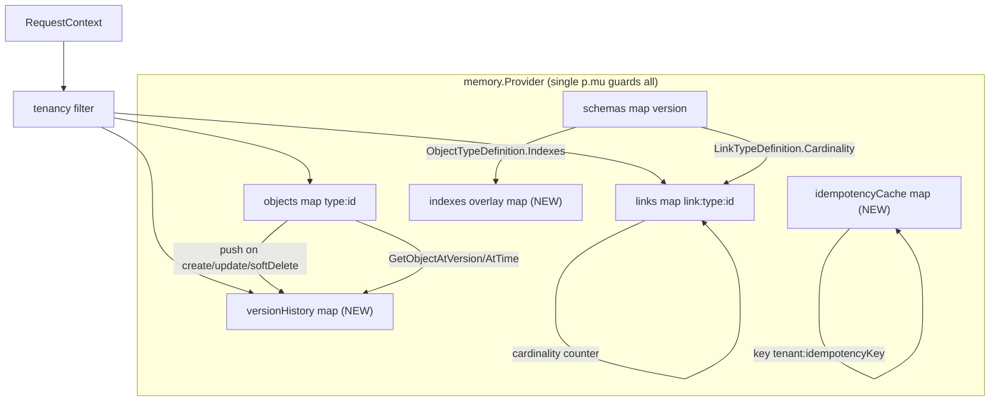
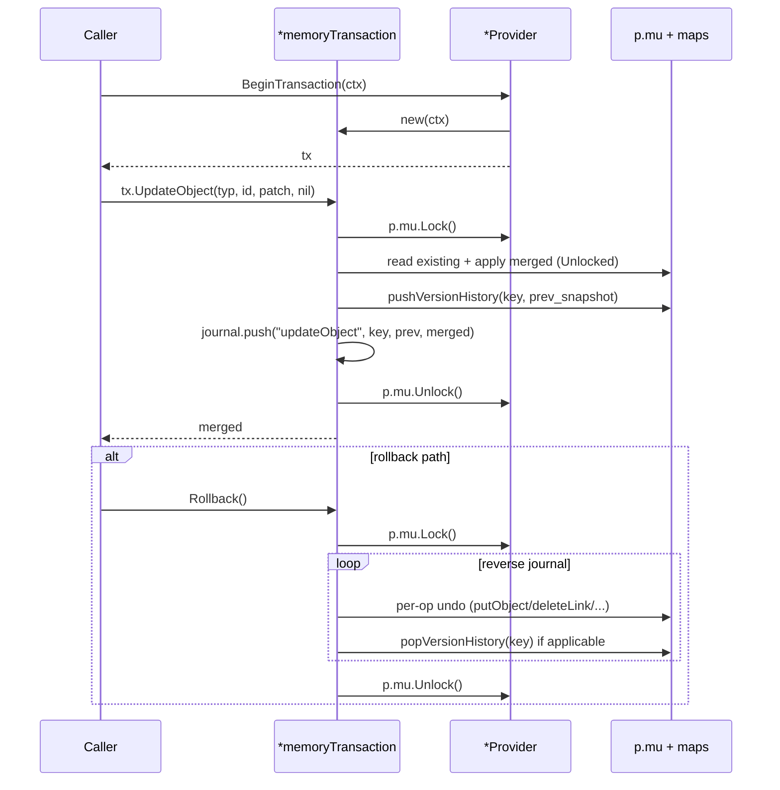

# Go Phase 3 — Full SPI Surface + Versioning/Soft-Delete/Cardinality/Transactions - Plan

## Goal Capsule

- **Objective:** 让 Go Runtime 的 `memory.Provider` 从 Phase 2 的 11 个 SPI override 扩展到全 24 个，并落实现 Phase 2 全部推迟的行为——版本自增与 `expectedVersion` 冲突、`_versionHistory` + 时点查询、`_deletedAt` 软删、cardinality 原子强制、`MemoryTransaction`（journal + 反向 rollback）、filter 求值、Query/Aggregate/Search/Bulk/GetLinks/Traverse 以及 Engine 的 `UpdateLink` 动词与 `expectedVersion` 透传。校验仍复用 Phase 1 的 `ir.Validate`；事件发射刻意继续推迟（`TODO(Phase 3)` stub 保留）。
- **Product Authority:** Go-native Ontology Runtime 的 Phase 3。`packages/storage-memory` 与 `packages/engine` 仍是行为参考，移植绑定 INTENT（动词步骤顺序、依赖方向、软删/版本/cardinality 语义），不移植 AST 形状；TS `PlatformError` 与事件层刻意不入此 Phase。
- **Open Blockers:** 无（R1–R11 经四轮决策已锁：memory-only 基数、sentinel 错误、Go-native conformance、跳过事件）。

## Product Contract

### Summary

Phase 3 关闭 Phase 2 留下的全部 `ErrUnimplemented` 缺口：memory provider 实现 13 个仍推迟的 `StorageProvider` 方法 + 8 方法 `spi.Transaction` 接口首实现；版本/软删/cardinality 三条横切语义在 memory 侧落地；Engine 仅做最小增量（`UpdateObject` 透传 `expectedVersion`、新增 `UpdateLink` 动词）。conformance harness 的 ErrUnimplemented floor 折叠为零，新增 Go-native 正向断言覆盖每个实现方法；Gold Path 扩展至 13 动词零 `ErrUnimplemented` 命中。

### Problem Frame

Phase 2 在分支 `feat/go-phase1-ontology-ir` 上落了 Engine 的六个生命动词 + memory provider 七个 SPI override，剩余 13 个方法经嵌入的 `UnimplementedStorageProvider` 返回 `ErrUnimplemented`（`runtime/spi/unimplemented.go`），`spi.Transaction` 接口全声明零实现，`_version`/`_deletedAt` 仅作保留字段名不写入，cardinality 不强制（`engine.go:287`），事件发射在各动词的 `// TODO(Phase 3)` stub 处停摆。Phase 2 plan 的 Deferred for later 把软删/版本/历史/cardinality/事件/查询/事务全部归入 Phase 3+；本 Phase 取除事件外的全部条目入栈。

TS 行为参考（已对源 verified）：`packages/storage-memory/src/memory-storage-provider.ts` 的 `_versionHistory` map（:250-301）、`_doSoftDeleteObject`（:392-407）、`_enforceCardinality`（:309-341）、`MemoryTransaction`（:125-239）、`queryObjects`/`aggregateObjects`/`searchObjects`/`getLinks`/`traverse`/`bulkMutate`、`getObjectAtVersion`/`getObjectAtTime`；`packages/engine/src/links/link-manager.ts` 的 `updateLink`（:152-183）、`computeChanges`（:390-403）、cardinality advisory（:311-344）；`packages/engine/src/objects/object-manager.ts` 的 `update`/`delete` step order、`computeChanges`（:373-388）。Phase 3 镜像这些 intent，Go 代码是 Go-native。

### Requirements

**版本与软删（横切）**

- R1. 版本自增：`CreateObject` 戳 `_version:1`；`UpdateObject`/`DeleteObject(soft)`/`UpdateLink` 合并后 `_version` 自增 1；`expectedVersion != nil` 且与 existing 失配 → 返回 `errors.Is(err, ErrVersionConflict)=true`；`expectedVersion == nil` 跳过检查。memory 是 authoritative，Engine 透传不重算。
- R2. 版本历史：memory 维护 `versionHistory map[string][]OntologyObject`（key `type:id`），每次 object 的 create/update/soft-delete 推入克隆快照（**链接不推历史**——TS `_doUpdateLink` 不调 `_pushVersionHistory`，镜像之）。`GetObjectAtVersion` 按 `(version, tenant)` 查；`GetObjectAtTime` 解析各快照的 `_updatedAt`，返回 `_updatedAt ≤ ts` 的最新同租户快照。
- R3. 软删：`DeleteObject(mode="soft")` 戳 `_deletedAt` + `_version+1` + `_updatedAt`，**不从 map 移除**；`mode="hard"` 行为不变（幂等、跨租户 no-op）。`GetObject`/`GetLink` 对 set `_deletedAt` 返回带类型 not-found（mask）；`QueryObjects`/`GetLinks`/`Traverse` honor `options.IncludeDeleted`（默认排除）；`AggregateObjects`/`SearchObjects` **始终排除** `_deletedAt`（TS 无 includeDeleted 选项，镜像）。链接软删刻意不实现（TS memory 对 link 走硬删，`:484-487` TODO 保留）。

**Cardinality**

- R4. memory `CreateLink` 在 `p.mu` 下原子强制 `LinkTypeDefinition.Cardinality`：`MANY_TO_MANY` no-op；`ONE_TO_ONE` 同时检查 from-outbound 与 to-inbound；`MANY_TO_ONE` 检查 from-outbound；`ONE_TO_MANY` 检查 to-inbound。计数用 active（非 `_deletedAt`）同类型同租户链接。违例返回 `errors.Is(err, ErrCardinalityViolation)=true`，方法名在错消息中。Engine 不做 cardinality advisory（与 Phase 2 KTD scope 决策一致，**不**调 `GetLinks`）。

**剩余 SPI 表面**

- R5. memory.Provider override 13 个方法：`QueryObjects`、`AggregateObjects`、`SearchObjects`、`BulkMutate`、`UpdateLink`、`GetLinks`、`Traverse`、`BeginTransaction`、`GetObjectAtVersion`、`GetObjectAtTime`、`EnsureIndex`、`DropIndex`、`ListIndexes`。其余 SPI 方法经嵌入 `UnimplementedStorageProvider` 仅保留 `mustEmbedUnimplementedStorageProvider()`（floor 折叠为零后不再有方法路径走 `ErrUnimplemented`）。
  - `QueryObjects`：10 operators（`eq/neq/gt/gte/lt/lte/in/contains/startsWith/exists`）+ `and/or/not` 逻辑；多 key `OrderBy` 反向稳定排序，null 排尾；`MAX_QUERY_LIMIT=1000`，默认 limit=100，`hasNextPage = offset+limit < totalCount`。honor `IncludeDeleted`。`QueryOptions.AsOfVersion`/`AsOfTime` 用 `versionHistory` 选历史快照（best-effort，TS memory 忽略它们；comment 标注）。
  - `AggregateObjects`：`count/sum/avg/min/max` over `AggregateField`（`field='*'` for count 必数组长度）；`groupBy` keys 经 JSON stringify 分组；非法 fn 提前抛错；始终排除 `_deletedAt`；`limit/offset` 默认 full。
  - `SearchObjects`：空/空白 query 返回空结果；tokens = lower-split；默认 search 字段为不带 `_` 且 string 值的字段；score=每 term 出现次数累加；highlights 推**整字段值**；始终排除 `_deletedAt`；按 score desc 排；limit 默认 full。
  - `BulkMutate`：idempotency cache key `${tenant}:${idempotencyKey}`（tenant-scoped）；命中返回克隆；miss 时迭代 ops 经 `p._do*Unlocked` best-effort apply，失败 → `BulkMutationError{OperationIndex, Code:"INTERNAL_ERROR", Message}`；**不**裹 transaction。
  - `GetLinks`：tenant + `linkType` + `_deletedAt`/`IncludeDeleted` + direction（outbound=`_fromId==objectID`、inbound=`_toId==objectID`）；分页。
  - `Traverse`：BFS over `path.Steps`；`MAX_TRAVERSAL_DEPTH=10`、`MAX_TRAVERSAL_NODES=10000`；`nodes`=最终 step 结果、`edges`=全部 traversed；`includeDeleted` 同时作用于 link 与 target object；分页只切 `nodes`。
  - `UpdateLink`：existing + tenant guard → `ErrLinkNotFound`；合并 patch（跳 link 系统字段，re-stamp `_updatedAt`，`_version+1`）；`expectedVersion` 失配 → `ErrVersionConflict`；**无 link 版本历史**。
  - `EnsureIndex`/`DropIndex`：维护 in-memory `indexes map[string][]IndexDefinition` overlay（key `typ`）；`ListIndexes` 合并 applied schema 的 `ObjectTypeDefinition.Indexes`（`projection.projectObject:48-54` 已填充）与 overlay。TS 注释"indices don't affect correctness" 对 memory 仍成立；但 overlay 让 `ListIndexes` 反映 mutation。

**事务**

- R6. `BeginTransaction` 返回实现 `spi.Transaction`（8 方法）的 `*memoryTransaction`：持 `*Provider` + `RequestContext`（ctx 固定于 Begin 时刻）；每个 verb 调 `p._do*Unlocked` eager-apply 后推 journal entry 替代调用 `p.<verb>` 的 locked 包装；`Commit` no-op 翻 state；`Rollback` 反向遍历 journal undo。共享 `p.mu`。
  - Journal discriminated by `op string`：`"createObject"`→`delete(key)`、`"updateObject"`/`"softDeleteObject"`→`putObject(key, prev) + popVersionHistory(key)`、`"hardDeleteObject"`→`putObject(key, prev)`、`"createLink"`→`deleteLink(key)`、`"updateLink"`→`putLink(key, prev)`、`"deleteLink"`→`putLink(key, prev)`。
  - `assertOpen()` 在 commit/rollback 后调任何方法抛错。

**Engine 增量**

- R7. Engine 新增 `UpdateLink(ctx, typ, linkID, patch, expectedVersion)`：镜像 TS `link-manager.ts:152-183` 与 Phase 2 `UpdateObject`——`storage.GetLink` 先（缺失 → `ErrLinkNotFound` 在写前），`mergePatch`（剔除 link 系统字段）用于 validation，`storage.UpdateLink(ctx, typ, linkID, patch, expectedVersion)`。无新的 per-verb 校验器（链接属性校验复用 `validateObjectPayload` 思路或最小化）。
- R8. Engine `UpdateObject` 把 `expectedVersion` 透传给 SPI（Phase 2 传 `nil`，改为传参）；version bookkeeping 仍由 memory authoritative。

**Conformance 与 Capabilities**

- R9. `Capabilities()` 随单元渐进翻 flag：版本 + 时点查询落 → `SupportsTemporalQueries=true`；Search 落 → `SupportsFullTextSearch=true`；Bulk 落 → `SupportsBulkMutations=true`；GetLinks/Traverse 落 → `SupportsGraphTraversal=true, MaxTraversalDepth=10`；Transaction 落 → `SupportsTransactions=true`。`SupportsGeoQueries=false` 不变。`ReplicationSupport=ReplicationNone` 不变。
- R10. `runtime/conformance/conformance_test.go` 的 `TestConformance_ErrUnimplementedFloor` 13 case 表折叠为零（改为 doc-comment + 空表，或删测试并加 note）；新增正向 Go-native round-trip 测试覆盖每个实现方法（Query/Aggregate/Search/Bulk/GetLinks/Traverse/UpdateLink/Transaction-Commit-Rollback/SoftDelete/VersionConflict/CardinalityViolation），均用现有 `fixtureOntology()` + `setup(t)` helper；`runtime/storage/memory/` 的两个 floor 表（`provider_object_test.go:233-285`、`provider_link_test.go:199-225`）同步折叠。
- R11. `runtime/e2e/supply_chain_test.go` Gold Path（F8）在 F7 之上扩展：每个新方法类别至少一个显式 step（query after create、traverse after link、transaction-with-rollback once、soft-delete-then-restore），维持"零 `ErrUnimplemented` 命中"作为 floor proof。

### Key Decisions

- **Memory-only cardinality（决策锁）。** R4 在 memory `CreateLink` 的 `p.mu` 下原子强制；Engine 不做 advisory pre-check。理由：Go memory 用单 mutex，原子性由构造保证，省一次 `GetLinks` 往返；TS CQ-02 TOCTOU note 对多锁 provider 仍有效，memory-only 是 Phase 3 的简化。Engine `CreateLink` 的 step order 不变（与 Phase 2 一致，不新增 `GetLinks` 调用）。
- **Sentinel 错误（决策锁）。** R1/R4 用 `ErrVersionConflict`、`ErrCardinalityViolation` 两个新 sentinel 加入 `runtime/spi/errors.go` 的 `var (…)`；`fmt.Errorf("%w: …", sentinel, detail)` 包装，`errors.Is` 是稳定契约。**不**引入 `PlatformError` struct——保持与 Phase 2 既有 5 sentinel 一致（KTD-7 语义），PlatformError 留给后续 Phase 与 HTTP 层一起入栈。
- **Go-native conformance（决策锁）。** R10 扩展现有 Go-native harness，**不**移植 `tests/spi-conformance/src/categories/*.ts` 的十个 category。正向测试只覆盖 Phase 3 实现方法，不主张 TS parity（cardinality 软删 multi-tenancy lineage 等仍推迟）。
- **跳过事件发射（决策锁）。** 各动词的 `// TODO(Phase 3): emit* via event bus` 注释 stub 原位保留；**不**构建 `EventBus`/`CloudEvent`/`EngineEventEmitter`。事件层与 API 层一起 Phase 4+。
- **Engine-first 层级延续。** Engine 仅依赖 `spi.StorageProvider`；Phase 3 的 `UpdateLink` 与 `expectedVersion` 透传遵循 Phase 2 KTD-1，Engine 不 import `runtime/storage/memory`。
- **JSON-clone + RFC3339Nano 时间戳保留。** `cloneObject`/`cloneLink`/`cloneSchema` JSON 往返模式沿用；系统时间字段继续存 RFC3339Nano 字符串（`systemTimestamps()`）；`GetObjectAtTime` 与 `QueryOptions.AsOfTime` 用 `time.Parse(time.RFC3339Nano, s)` 比对。新 sensor 字段不引入 `time.Time` 表示，避免破坏 clone 约定。
- **单 mutex 延续。** `p.mu sync.Mutex` 继续守 objects/links/schemas/versionHistory/idempotencyCache/indexes 全部 map；`MemoryTransaction` 的 verb 调 `_do*Unlocked`（in-lock inner，沿用 `linkTypeDefinitionUnlocked` 模式）。Phase 3 不评估 RWMutex 或细粒度锁（Phase 4+ 性能压力评估）。

### Key Flows

- F1. **Update with version conflict** — Engine `UpdateObject(ctx, typ, id, patch, expectedVersion)`：`GetObject` 先（缺失 → `ErrObjectNotFound`）；`mergePatch` validation；`storage.UpdateObject(ctx, typ, id, patch, expectedVersion)`；memory under lock 比对 `existing._version` 与 `expectedVersion`，失配 → `ErrVersionConflict` before write；etc. Outcome：成功返回 `_version+1` 的对象，`_versionHistory` 推入。Covers R1, R2, R8.
- F2. **Soft delete visibility** — `DeleteObject(ctx, typ, id, "soft")`：memory 戳 `_deletedAt`+`_version+1`+`_updatedAt`，推 history。后续 `GetObject` → `ErrObjectNotFound`；`QueryObjects(includeDeleted:true)` 返回软删对象；`QueryObjects(includeDeleted:false)` 排除。Aggregate/Search 始终排除。Covers R3.
- F3. **Cardinality reject** — `CreateLink(ctx, "ONE_TO_ONE", a, b, {...})` memory under lock：扫 active 同类型同租户链接，发现 `fromId=a` 已有 outbound → `ErrCardinalityViolation`，无 map 写。Engine 侧 step order 不变（不做 `GetLinks` pre-check）。Covers R4.
- F4. **Transaction rollback** — `BeginTransaction(ctx)` → `tx`；`tx.CreateObject(...)` eager-applies under lock + journal entry；…；`tx.Rollback()` 反向遍历 journal：`createObject`→`delete(key)`、`updateObject`→`putObject(prev) + popVersionHistory`、…；Outcome：状态回到 Begin 时刻；`versionHistory` 与之同步。Covers R6.
- F5. **UpdateLink round-trip** — Engine `UpdateLink(ctx, typ, linkID, patch, expectedVersion)`：`GetLink` 先（缺失 → `ErrLinkNotFound`）；`mergePatch` validation；`storage.UpdateLink`；memory under lock 合并 patch、`_version+1`、`_updatedAt` re-stamp；`expectedVersion` 失配 → `ErrVersionConflict`。Covers R5, R7.
- F6. **Aggregate by group** — `AggregateObjects(ctx, typ, query)`：tenant + type + 排除 `_deletedAt`；groupBy keys 分组；每 group 算 count/sum/avg/min/max；非法 fn 提前抛。Covers R5.
- F7. **Traverse multi-step** — `Traverse(ctx, startID, path{steps}, options)`：BFS 逐 step；超 `MAX_TRAVERSAL_DEPTH=10` 抛错；`totalNodesSeen` 超 `MAX_TRAVERSAL_NODES=10000` break；`nodes`=最终 step、`edges`=全部 traversed；分页切 `nodes`。Covers R5.
- F8. **Extended Gold Path** — 在 Phase 2 F7 之上：load supply-chain pack → project → ApplySchema → Engine verbs on Supplier/Part/SuppliesProduct → 创建后 `QueryObjects("Supplier", filter)`、链接后 `GetLinks`/`Traverse`、`BeginTransaction` + rollback 一次、`DeleteObject(soft)` 后 `QueryObjects(includeDeleted:true)`。Outcome：管线全绿，13 动词零 `ErrUnimplemented` 命中。Covers R10, R11.

### Acceptance Examples

- AE1. Covers F1 / R1, R2. 已 apply schema 下 `Engine.UpdateObject("Supplier", s.id, {tier:"Gold"}, nil)` 返回 `_version` 严格 +1 的对象；同 id 再传 `expectedVersion=priorVersion-1` → `ErrVersionConflict`；`memory.GetObjectAtVersion(ctx, "Supplier", s.id, priorVersion)` 返回旧字段值；`GetObjectAtTime(ctx, ..., ts)` 返回 `_updatedAt ≤ ts` 的最新快照。
- AE2. Covers F2 / R3. `Engine.DeleteObject("Supplier", s.id, "soft")` 后 `Engine.GetObject("Supplier", s.id)` → `ErrObjectNotFound`；`memory.QueryObjects(ctx, "Supplier", ALL, {IncludeDeleted:true})` 含软删对象；`{IncludeDeleted:false}` 不含；`memory.AggregateObjects(...)` 与 `SearchObjects(...)` 始终不含软删。
- AE3. Covers F3 / R4. ONE_TO_ONE 链接类型：create 首条 link 成功；create 第二条同 from 端 outbound link → `ErrCardinalityViolation`，map 无新 entry；MANY_TO_MANY 第二条允许。跨租户 link 不计入计数（tenant isolation）。
- AE4. Covers R5 (query). `QueryObjects` 覆盖 10 operators + `and`/`or`/`not` 组合；`OrderBy` 多 key 稳定；`limit/offset` 分页 + `hasNextPage`；`includeDeleted` 与 `AsOfTime`（选历史快照）路径。
- AE5. Covers R5 (aggregate/search). `AggregateObjects` count over `'*'` + grouped sum/avg/min/max；非法 fn 抛错；`SearchObjects` multi-term score + highlights（整字段值）+ 空白 query 返回空。
- AE6. Covers R5 (bulk). `BulkMutate` 同 `(tenant, idempotencyKey)` 第二次返回与首次相同结构；失败 op → `BulkMutationError{OperationIndex, "INTERNAL_ERROR", message}`；跨租户 idempotency cache 不碰撞。
- AE7. Covers R5 (indices). apply 一个含 `@unique`/`@indexed` 字段的 fixture schema → `ListIndexes(ctx, typ)` 返回 projection 填充的 indexes；`EnsureIndex` overlay → `ListIndexes` 合并；`DropIndex` 从 overlay 移除。
- AE8. Covers F7 / R5 (links/traverse). `GetLinks` outbound vs inbound + `includeDeleted` + 分页；`Traverse` 多 step + 深度过限抛错 + 节点数过限 break。
- AE9. Covers F5, F1 / R5, R7. `memory.UpdateLink` 合并 patch、`_version` 自增、`expectedVersion` 失配 → `ErrVersionConflict`、link 不推历史；`Engine.UpdateLink` on missing link id → `ErrLinkNotFound` 在 `storage.UpdateLink` 之前（`recordingProvider` 计数证明）。
- AE10. Covers F4 / R6. tx 内 `CreateObject` + `UpdateObject` + `DeleteObject` + `CreateLink` + `UpdateLink` + `DeleteLink`，各自 journal 推入；`Commit` no-op + state flip；`Rollback` 反向 undo 各 op，`versionHistory` 弹回；`Rollback` 后 `GetObject` 见 Begin 时刻状态；commit/rollback 后调任何方法抛错。
- AE11. Covers F8 / R10, R11. 扩展 Gold Path 全绿，13 verbs 零 `ErrUnimplemented` 命中；conformance floor 折叠为零（不再有 `TestConformance_ErrUnimplementedFloor` 非 doc case）。

### Scope Boundaries

**Deferred for later**

- 事件发射（`EventBus`/`CloudEvent`/`EngineEventEmitter`、Subscribable fan-out、Redpanda transport）—— **Phase 4+**。`engine.go` 的 `TODO(Phase 3): emit*` stub 原位保留并改标 `TODO(Phase 4)`。
- TS `PlatformError` struct 与 HTTP-status 映射、`ErrorCode` 枚举语义对齐 —— Phase 4+（与 HTTP/API 层一起）。
- link 软删（memory 对 link 继续硬删；TS `:484-487` TODO 保留）—— Phase 4+ 评估 memory/postgres 对齐。
- link 版本历史 —— Phase 4+（TS 不推 link 历史，镜像之；后续若有语义需求再入栈）。
- LAZY computed fields、lineage 记录、object sets、computed field evaluator —— Phase 4+（本 Phase 不动 `link-manager.ts`/`object-manager.ts` 的 lineage 路径）。
- 严格 unknown-property 拒绝、enum membership、`@constraint` 求值、immutable-on-patch、list element-type 深查 —— Phase 4+（Phase 2 KTD-5 已定最小校验，本 Phase 不扩张 Engine validator）。

**Outside this product's identity**

- 移植 `tests/spi-conformance/src/categories/*.ts` 的全 10 类 TS 套件到 Go。Phase 3 conformance 是 Go-native、intent-mirroring 子集；不主张 TS conformance parity。
- 引入新外部 Go 依赖。`runtime/go.mod` 不增 require；filter evaluator、JSON-clone、UUIDv7 均用 stdlib + 已有 `google/uuid`。
- 让 API/HTTP 层成语义核心。IR 是语义核心（`docs/design/draft.md` §15）；Phase 3 不入 HTTP。

### Dependencies / Assumptions

- Phase 1 + Phase 2 在 `feat/go-phase1-ontology-ir` 上稳定：SPI/IR/ODL/projection/schema-only memory + 七 override + 六动词全绿。Phase 3 增量改 `runtime/storage/memory/provider.go`、加 `runtime/storage/memory/transaction.go`、扩展 `runtime/engine/engine.go`、更新 `runtime/conformance/conformance_test.go` 与 `runtime/e2e/supply_chain_test.go`；**不应**重写 `runtime/spi/`、`runtime/ir/`、`runtime/projection/`、`runtime/pack/`、`runtime/odl/`。
- `runtime/spi/ontology.go` 的 13 方法所需类型已定义（FilterExpression 单结构体 :121-128、QueryOptions 含 AsOfVersion/AsOfTime :131-138、AggregateQuery/AggregateField/AggregateResult/AggregateGroup、SearchQuery/SearchResult/SearchHit、BulkMutationRequest/Operation/Result/Error、TraversalPath/Step/Options/Result、IndexDefinition、ObjectPage/LinkPage），无需扩 SPI 类型。
- `runtime/spi/transaction.go` 已全声明 8 方法（零实现），Phase 3 加首实现。
- `runtime/spi/errors.go` 已有 5 sentinel（ErrUnimplemented/ErrObjectNotFound/ErrLinkNotFound/ErrInvalidObjectType/ErrInvalidLinkType），Phase 3 加 2（ErrVersionConflict/ErrCardinalityViolation）。
- `_version`/`_deletedAt` 在 `memory.isSystemField`/`linkSystemFields` 已保留为系统字段，Phase 3 仅"开始写入"它们，**不**扩 reserved 集合。
- `projection.projectObject:48-54` 已把 `@unique`/`@indexed`/`@searchable` 填入 `ObjectTypeDefinition.Indexes`，`ListIndexes` 直接读。
- `traversing` 与 aggregation 用 in-memory 全 map 扫描（O(N)），acceptable for test provider；不对 performance 做 SLA 承诺。
- `MemoryTransaction` 的 eager-apply 模型与 TS 一致（`commit` no-op，rollback 反向 undo）；与真实事务语义差距记入 Risk。

### Outstanding Questions

四轮决策已锁 R1–R11 全部分支：

- Q1（cardinality enforcement 位置）→ memory-only atomic（决策锁，KTD-1）。
- Q2（错误模型 sentinel vs PlatformError）→ sentinel（决策锁，KTD-2）。
- Q3（conformance 覆盖度）→ Go-native harness（决策锁，KTD-3）。
- Q4（事件发射范围）→ 跳过，stub 保留（决策锁，KTD-4）。

剩余 implementation-time 细节见 Planning Contract 的 `Deferred to Implementation` 与 `Assumptions`。

### Sources / Research

- Origin：`docs/plans/2026-08-11-001-feat-go-phase2-engine-memory-lifecycle-plan.md`（Phase 2 plan，branch `feat/go-phase1-ontology-ir`）。
- TS behavioral reference（已对源 verified）：
  - `packages/storage-memory/src/memory-storage-provider.ts` — `_versionHistory`（:250-301）、`_doSoftDeleteObject`（:392-407）、`_enforceCardinality`（:309-341）、`MemoryTransaction`（:125-239）、`queryObjects`/`aggregateObjects`（:545-707）、`searchObjects`（:709-787）、`bulkMutate`（:789-831）、`updateLink`（:455-482）、`getLinks`（:860-885）、`traverse`（:887-970）、`getObjectAtVersion`/`getObjectAtTime`（:980-1004）、index no-ops（:1006-1018）。
  - `packages/engine/src/links/link-manager.ts` — `updateLink`（:152-183）、`computeChanges`（:390-403）、`enforceCardinality`/`assertMaxOutbound`/`assertMaxInbound`（:311-384）。
  - `packages/engine/src/objects/object-manager.ts` — `update`/`delete` step order、`computeChanges`（:373-388）、`mergeProperties`（:353-371）。
  - `packages/engine/src/events/*` 与 `packages/spi/src/errors.ts` — 事件层与 PlatformError 均**不入** Phase 3（决策锁 KTD-4），仅作未来 Phase 参考。
- Go Phase 2 foundation（已对源 verified）：
  - `runtime/spi/provider.go:5-34` — 24 方法 `StorageProvider` interface + `mustEmbedUnimplementedStorageProvider()`。
  - `runtime/spi/transaction.go:3-13` — 8 方法 `Transaction` interface 全声明零实现。
  - `runtime/spi/ontology.go:121-128` — `FilterExpression` 单结构体（无独立 `FieldPredicate`/`LogicalPredicate`）。
  - `runtime/storage/memory/provider.go` — Phase 2 11 override + helper（`cloneObject`/`cloneLink`/`cloneSchema`/`systemTimestamps`/`isSystemField`/`linkSystemFields`/`linkTypeDefinitionUnlocked`）。
  - `runtime/engine/engine.go` — 6 动词 + 6 `TODO(Phase 3): emit*` stub + `recordingProvider` seam（`objects_test.go:302-349`）。
  - `runtime/conformance/conformance_test.go:179-250` — 13 case ErrUnimplemented floor（折叠为零的目标表）。

## Planning Contract

### Key Technical Decisions

- **KTD-1. Memory-only 基数原子。** R4 在 `memory.CreateLink` 的 `p.mu` 下强制 `Cardinality`，扫描 active 同类型同租户链接。Engine **不**做 advisory pre-check，**不**调 `GetLinks`（与 Phase 2 KTD scope 决策一致）。新辅助 `linkTypeDefinitionWithCardinalityUnlocked(typ)` 返回 `(*spi.LinkTypeDefinition, bool)`；现有 `linkTypeDefinitionUnlocked` 改为代理。Phase 3 单 mutex 保证原子性；多锁 provider 的 TOCTOU 风险留 Phase 4+ 评估。
- **KTD-2. Sentinel 错误延续。** `ErrVersionConflict`、`ErrCardinalityViolation` 加入 `runtime/spi/errors.go` 的 `var (…)`；`fmt.Errorf("%w: …", sentinel, detail)` 包装；`errors.Is` 是稳定契约。**不**引 `PlatformError` struct；TS 的 `code`/`category`/`retryable` 字段不被 Go 侧 sentinel 携带（与 Phase 2 既有 5 sentinel 一致）。PlatformError 与 HTTP 层一起 Phase 4+ 入栈。
- **KTD-3. Go-native conformance。** Phase 3 扩展 `runtime/conformance/conformance_test.go` 与 `runtime/storage/memory/` 的 per-package tests，**不**移植 `tests/spi-conformance/src/categories/*.ts`。正向测试覆盖 Phase 3 实现方法 + 横切（软删/版本/cardinality）；floor 表折叠为零。multi-tenancy、lineage、schema-migration 一致性等 TS category 推迟。
- **KTD-4. 事件发射推迟。** `engine.go` 的 6 个 `// TODO(Phase 3): emit* via event bus` 注释 stub 原位保留并改标 `TODO(Phase 4)`；**不**构建 `EventBus`/`CloudEvent`/`EngineEventEmitter`/`InMemoryEventBus`。事件层与 API 层一起 Phase 4+ 入栈。Phase 3 各动词的步骤顺序保留天然 emit hook 槽位（注 stub 位置不动，便于 Phase 4 接入）。
- **KTD-5. JSON-clone + RFC3339Nano 时间戳延续。** `cloneObject`/`cloneLink`/`cloneSchema` JSON 往返沿用；`versionHistory` 快照用 `cloneObject`（`cloneVersionSnapshot` 复用之）。系统时间字段继续是 `systemTimestamps()` 的 RFC3339Nano 字符串；`GetObjectAtTime` 与 `AsOfTime` 用 `time.Parse(time.RFC3339Nano, s)` 解析比对。**不**在 Phase 3 切到 `time.Time` 表示（破坏 clone 约定 + 破坏既有 Phase 1/2 测试）。
- **KTD-6. 单 sync.Mutex 延续。** `p.mu` 继续守所有 map（objects/links/schemas/versionHistory/idempotencyCache/indexes）。`MemoryTransaction` 与 provider 方法共享 `p.mu`；`_do*Unlocked` 是 in-lock inner（`linkTypeDefinitionUnlocked` 模式）。
- **KTD-7. Transaction eager-apply + 反向 rollback。** 与 TS `MemoryTransaction` 一致：每 verb 在 `p.mu` 下 eager-apply 然后推 journal entry；`Commit` no-op 翻 state；`Rollback` 反向遍历 journal undo。`commit` 不是真事务边界（不跨多 provider 隔离），仅 rollback 有效。与真实事务语义差距记入 Risk。
- **KTD-8. FilterExpression 单结构体派发。** Go SPI 把 `FieldPredicate`/`LogicalPredicate` 折进单 `FilterExpression`（`spi/ontology.go:121-128`），Phase 3 evaluator 按"leaf if `Field`/`Operator` 非空、logical if `And`/`Or`/`Not` populated"派发；不存在独立类型分支。10 operators + 3 logical 全实现。

### High-Level Technical Design

Phase 3 在 memory.Provider 上叠加 3 个新 map + 2 新 sentinel + 一个新文件 `runtime/storage/memory/transaction.go`。下图给出 memory 内部 map 关系与被锁的范围：

`MemoryTransaction` 与 provider 共享 `p.mu`；下图给出 BeginTransaction → verb → Commit/Rollback 的时序：

### Assumptions

- ASN1. 13 方法所需 SPI 类型已定义（`runtime/spi/ontology.go`），Phase 3 不扩 SPI 类型。
- ASN2. `_version`/`_deletedAt` 已在 `isSystemField`/`linkSystemFields` 保留，Phase 3 仅写入，不扩 reserved 集。
- ASN3. `projection.projectObject` 已填 `ObjectTypeDefinition.Indexes`，`ListIndexes` 直接读 + overlay 合并。
- ASN4. memory 全 map 扫描（cardinality 计数、query filter、aggregate search）O(N) acceptable for in-memory test provider；无 SLA 承诺。
- ASN5. `MemoryTransaction` eager-apply + rollback 是 TS 一致模型，非真事务隔离；rollback 有效，commit 是 no-op。建模上跨多 verbs 不原子（Phase 2 已下注，Phase 3 镜像之）。
- ASN6. `expectedVersion` 用 `*int`；`nil` = 跳过检查（accept），非 nil = 强制比对。Engine `UpdateObject` 透传 caller 给的 `*int`（可能 nil）；memory authoritative。
- ASN7. `QueryOptions.AsOfVersion`/`AsOfTime` 在 QueryObjects 里 best-effort 用 `versionHistory` 选历史快照（TS memory 忽略它们；Phase 3 加 best-effort 并 comment 标注与 TS 差距）。其他方法（GetLinks/Traverse）**不** honor AsOf*.
- ASN8. Phase 3 不动 `runtime/ir/`、`runtime/odl/`、`runtime/projection/`、`runtime/pack/`、`runtime/spi/`（只加 2 sentinel）。`runtime/internal/uuidv7` 不变。

## Implementation Units

> U-ID 顺序 = 依赖顺序；每个单元 `cd runtime && go test ./...` 自验后再进下一个。Cap flag 按 U 渐进翻（不一次性全翻）。

### U1. Foundation — sentinel errors + version-history map scaffolding

- **Goal:** `ErrVersionConflict`、`ErrCardinalityConflict` 加入 `runtime/spi/errors.go`；memory.Provider 加 `versionHistory` map + `pushVersionHistory`/`popVersionHistory`/`cloneVersionSnapshot` helper；`_version` 在 `CreateObject`/`CreateLink` 戳 `1`（不增量，不变更 update 路径）。
- **Requirements:** R1, R2 基座。
- **Dependencies:** 无（Phase 2 已稳）。
- **Files:**
  - Modify: `runtime/spi/errors.go`（在 `var (…)` 加 2 sentinel）
  - Modify: `runtime/storage/memory/provider.go`（struct 加 `versionHistory map[string][]spi.OntologyObject`；`New()` 初始化；加 helper；`CreateObject`/`CreateLink` 加 `_version: 1`）
  - Modify: `runtime/storage/memory/provider_object_test.go:41-43`（`_version` must-be-nil → must-be-`1`）
  - Modify: `runtime/storage/memory/provider_link_test.go`（对应链接 `_version` 断言）
- **Approach:** sentinel 文案与既有 5 个一致（`errors.New("openfoundry: version conflict")`、`"openfoundry: cardinality violation"`）；`pushVersionHistory` 在 `CreateObject` 末尾推入克隆快照（`cloneObject` 复用为 `cloneVersionSnapshot`）；`CreateLink` 不推历史（与 ASN5 一致）。`UpdateObject`/`DeleteObject` 在此 U **不**动 update/version 增量逻辑（U2 做），仅 `_version: 1` 在 create 路径戳入。
- **Patterns to follow:** 既有 sentinel 文案风格（`runtime/spi/errors.go:6,19,22,26,29`）；`linkTypeDefinitionUnlocked` in-lock 模式；`cloneObject` JSON 往返。
- **Test scenarios:** `ErrVersionConflict`/`ErrCardinalityConflict` 经 `errors.Is` 识别（既有 `errors.Is` 测试模板）；`provider_object_test.go:41-43` `_version` 翻 1；`provider_link_test.go` 链接 `_version` 翻 1；版本历史被 create 推入（U1 单测）；既有 floor 测试仍绿。
- **Verification:** `go test ./spi/... ./storage/memory/...` 绿；`go.mod` 无新 require。

### U2. Versioning + version conflict + temporal queries

- **Goal:** `UpdateObject` 合并后 `_version+1` + 推 history；`expectedVersion` 失配返 `ErrVersionConflict`；`DeleteObject(soft)` 戳 `_deletedAt` + `_version+1` + 推 history；`GetObjectAtVersion`/`GetObjectAtTime` 实现；Engine `UpdateObject` 透传 `expectedVersion`（不再是 `nil`）；`Capabilities().SupportsTemporalQueries` 翻 true。
- **Requirements:** R1, R2, R3(部分), R8, R9.
- **Dependencies:** U1.
- **Files:**
  - Modify: `runtime/storage/memory/provider.go`（`UpdateObject` 加版本增量 + conflict + history；`DeleteObject` soft 分支；新 `GetObjectAtVersion`/`GetObjectAtTime`；`Capabilities` 翻 `SupportsTemporalQueries`）
  - Modify: `runtime/engine/engine.go:100`（`nil` → 透传 `expectedVersion`）
  - Modify: `runtime/storage/memory/provider_object_test.go:220-231`（`TestUpdateObject_ExpectedVersionArgument_SilentlyIgnored` 翻为 `ErrVersionConflict`）
  - Modify: `runtime/conformance/conformance_test.go:183-237`（移 `GetObjectAtVersion`/`GetObjectAtTime` 两 case）
  - Modify: `runtime/storage/memory/provider_object_test.go:233-285`（floor 表移对应 case）
  - Create: `runtime/storage/memory/provider_version_test.go`（版本增量、conflict、历史查询正反向）
- **Approach:** conflict 条件 `existing["_version"].(int) != *expectedVersion`；`_version` 存为 `int`（JSON marshal 仍兼容）。`GetObjectAtTime` 解析各快照 `_updatedAt` string，返回 `_updatedAt ≤ ts` 的最新同租户。Engine `UpdateObject` 把 caller 给的 `*int` 透传给 SPI；`nil` = accept any version（memory skip check）。`DeleteObject(mode="soft")` 戳 `_deletedAt` 不从 map 删，推 history；hard 路径不变。
- **Patterns to follow:** 既有 `fmt.Errorf("%w: %s/%s", spi.ErrObjectNotFound, typ, id)` 包装；`systemTimestamps` RFC3339Nano；`cloneObject` 快照。
- **Test scenarios:** Covers AE1. `_version+1` on update；`expectedVersion` 匹配通过、失配 `ErrVersionConflict`；`GetObjectAtVersion` 返回旧字段、历史缺返 `ErrObjectNotFound`；`GetObjectAtTime` 返回 at-or-before；`DeleteObject(soft)` 戳 `_deletedAt` 不移除 + `_version+1`；`GetObject` 对软删对象返 `ErrObjectNotFound`；Engine `UpdateObject` 不再硬塞 `nil`（顺序透传 backtrack 测试）。floor 表对应 case 移除后仍绿。
- **Verification:** `go test ./...` 绿；`Capabilities().SupportsTemporalQueries=true`；`provider_object_test.go:220-231` 翻为 conflict 断言。

### U3. Soft-delete read paths

- **Goal:** `GetObject`/`GetLink` 对 `_deletedAt` set 返 not-found（mask）；`QueryObjects` honor `IncludeDeleted`（默认排除）；`GetLinks`/`Traverse`（U6 实现）也是；`AggregateObjects`/`SearchObjects`（U4 实现）始终排除；Engine `DeleteObject(soft)` 不再 bub `ErrUnimplemented`。Cap flag 不在此 U 翻（与 U6 traverse 联动）。
- **Requirements:** R3.
- **Dependencies:** U2（软删写入已落）.
- **Files:**
  - Modify: `runtime/storage/memory/provider.go`（`GetObject`/`GetLink` 加 `_deletedAt` check；`QueryObjects` 已在 U4 落 includeDeleted，此 U 只需 `GetObject`/`GetLink` 路径 ready）
  - Modify: `runtime/engine/objects_test.go:286-295`（`TestEngine_DeleteObject_SoftMode_BubblesUnimplemented` 翻为 soft 成功路径）
  - Modify: `runtime/storage/memory/provider_object_test.go:103-112`（`TestDeleteObject_SoftMode_Unimplemented` 翻为 `StampsDeletedAt`）
- **Approach:** `GetObject`/`GetLink` 在 tenant check 后加 `_deletedAt` check（与 cross-tenant mask 同形）；软删对象对 Engine `GetObject` 返 `ErrObjectNotFound`，Engine 不合成值；`Engine.DeleteObject` 不动 step order（软删流经 SPI）。`DeleteObject` 调 `mode != "hard" && mode != "soft"` 的非法值默认按"非 hard 即不支持"处理或归入 soft（Implementation-time 决断，倾向 soft 路径）。
- **Patterns to follow:** 既有 `fmt.Errorf("%w: %s/%s", spi.ErrObjectNotFound, ...)` mask；TS `getObject:526-531` `_deletedAt` 过滤。
- **Test scenarios:** Covers AE2（部分，read 两半边）。软删后 `GetObject` → `ErrObjectNotFound`；`GetLink` 软删（不实 link 软删，仅 object 软删对 GetObject 的影响）；Engine `DeleteObject(soft)` 在 `objects_test.go` 翻为成功；cross-tenant 软删无 leak（原租户仍见）。
- **Verification:** `go test ./...` 绿；`objects_test.go:286-295` 与 `provider_object_test.go:103-112` 翻为成功路径。

### U4. QueryObjects + AggregateObjects + SearchObjects + filter evaluator

- **Goal:** memory 实现 `QueryObjects`/`AggregateObjects`/`SearchObjects`；filter evaluator 派发 FilterExpression 单结构体（10 operators + and/or/not）；`MAX_QUERY_LIMIT=1000`、默认 limit=100、null 排尾、多 key orderBy 反向稳定；Aggregate 全 groupBy + 5 fn + `*` count；Search 多 term score + highlights（整字段值）+ 空白返空。`Capabilities().SupportsFullTextSearch` 翻 true（Search 落）。
- **Requirements:** R5 (query/aggregate/search), R3（软删在 query 路径）.
- **Dependencies:** U3（软删 read mask 已落）。
- **Files:**
  - Modify: `runtime/storage/memory/provider.go`（加 `evaluateFilter`/`evaluateFieldPredicate`/`evaluateLogicalPredicate`；实现 3 方法；`Capabilities` 翻 `SupportsFullTextSearch`）
  - Modify: `runtime/conformance/conformance_test.go:183-237`（移 3 case）
  - Modify: `runtime/storage/memory/provider_object_test.go:233-285`（floor 表移 3 case）
  - Create: `runtime/storage/memory/provider_query_test.go`（filter operators、logical、pagination、orderBy、includeDeleted、AsOfTime、aggregate grouping、search scoring）
- **Approach:** TS 行为镜像：`evaluateFieldPredicate` switch 10 operators（`in` 要 `[]any` 含；`gt/gte/lt/lte` 要两边 number；`contains`/`startsWith` string；`exists` truthy→present-nonnull、falsy→null）；`evaluateLogicalPredicate` `and`→all、`or`→any、`not`→negate；leaf if `Field`/`Operator` 非空、logical if `And`/`Or`/`Not` populated。`AggregateObjects` 提前 validate `ALLOWED_FNS = {count,sum,avg,min,max}`；groupBy keys 经 JSON stringify；`field='*'` count = group len、否则 non-null count；sum/avg/min/max numeric-only null-when-no-numbers；始终排除 `_deletedAt`。`SearchObjects` 空白返空、token lower-split、默认 search 字段为不带 `_` 的 string 字段、score=term 出现次数累加、highlights 推整字段值、始终排除 `_deletedAt`、按 score desc。`AsOfVersion`/`AsOfTime` best-effort（ASN7）。
- **Patterns to follow:** TS `memory-storage-provider.ts:70-119,545-581,583-707,709-787`；既有 `cloneObject` 返。
- **Test scenarios:** Covers AE4, AE5. 10 operators 各一正一负；`and`/`or`/`not` 组合；`orderBy` 单/多 key + asc/desc + null 排尾；`limit/offset` + `hasNextPage`（`offset+limit < totalCount`）；`includeDeleted` true/false；`AsOfTime` 选历史快照（best-effort）；aggregate count-over-star + grouped sum/avg/min/max；非法 fn 抛错；search multi-term score + highlights（整字段值）+ 空白 query 返空 + 默认 search 字段（不带 `_`）。
- **Verification:** `go test ./...` 绿；`Capabilities().SupportsFullTextSearch=true`；floor 表 3 case 移除。

### U5. BulkMutate + Indices

- **Goal:** memory 实现 `BulkMutate`（idempotency tenant-scoped cache + best-effort apply + `INTERNAL_ERROR` failure）+ `EnsureIndex`/`DropIndex`（overlay）+ `ListIndexes`（schema-projected + overlay 合并）。`Capabilities().SupportsBulkMutations` 翻 true.
- **Requirements:** R5 (bulk/indices).
- **Dependencies:** U2, U3（create/update/soft-delete `_do*Unlocked` 已就绪，BulkMutate 复用）。
- **Files:**
  - Modify: `runtime/storage/memory/provider.go`（struct 加 `idempotencyCache map[string]spi.BulkMutationResult` + `indexes map[string][]spi.IndexDefinition`；`New()` 初始化；提取 `_doCreateObjectUnlocked`/`_doUpdateObjectUnlocked`/`_doSoftDeleteObjectUnlocked`/`_doHardDeleteObjectUnlocked`（lift from 现有 locked 方法）；实现 `BulkMutate`/`EnsureIndex`/`DropIndex`/`ListIndexes`；`Capabilities` 翻 `SupportsBulkMutations`）
  - Modify: `runtime/conformance/conformance_test.go:183-237`（移 4 case）
  - Modify: `runtime/storage/memory/provider_object_test.go:233-285`（floor 表移 BulkMutate + 3 index case）
  - Create: `runtime/storage/memory/provider_bulk_test.go`（idempotency 命中、跨租户隔离、partial failure、ListIndexes schema + overlay）
- **Approach:** `_do*Unlocked` 是 lift-only refactor（不改行为）：现有 locked 方法改为 take `p.mu` 再调 unlocked inner；`BulkMutate` 在 `p.mu` 下迭代 ops 调 unlocked，失败 → `BulkMutationError{OperationIndex, "INTERNAL_ERROR", message}`；idempotency cache 命中返克隆；`EnsureIndex` append to `indexes[typ]`、`DropIndex` 从 `indexes[typ]` 移除（field 名匹配）、`ListIndexes` 合并 `schemas[current].ObjectTypes[typ].Indexes` 与 `indexes[typ]`（按 field 去重，overlay 优先）。
- **Patterns to follow:** TS `bulkMutate:789-831`（idempotency cache + `INTERNAL_ERROR`）；`projection.projectObject:48-54`（IndexDefinition 形状）。
- **Test scenarios:** Covers AE6, AE7. 同 `(tenant, idempotencyKey)` 第二次返与首次相同结构（结构等价，非指针）；跨租户同 key 不碰撞；partial failure op → `BulkMutationError{index, "INTERNAL_ERROR", message}` + `Accepted/Failed` 计数正确；apply 一个 `@unique`/`@indexed` fixture schema → `ListIndexes` 含 projection 填充；`EnsureIndex` overlay 后 `ListIndexes` 合并显示；`DropIndex` 从 overlay 移除；schema-projected index 与 overlay 同 field 不重复。
- **Verification:** `go test ./...` 绿；`Capabilities().SupportsBulkMutations=true`；floor 表 4 case 移除。

### U6. GetLinks + Traverse + UpdateLink + cardinality + Engine.UpdateLink

- **Goal:** memory 实现 `GetLinks`/`Traverse`/`UpdateLink`；`CreateLink` 加 cardinality 原子强制（`ErrCardinalityConflict`）；`Capabilities().SupportsGraphTraversal=true, MaxTraversalDepth=10`。Engine 新增 `UpdateLink` 动词（镜像 `UpdateObject`：read-existing、merge-validate、delegate with `expectedVersion`）。
- **Requirements:** R4, R5 (links/traverse/updateLink), R7.
- **Dependencies:** U2（version/conflict），U3（软删 read mask），U5（`_do*Unlocked` 已 lift，CreateLink 同步 extract `_doCreateLinkUnlocked`）。
- **Files:**
  - Modify: `runtime/storage/memory/provider.go`（`CreateLink` extract `_doCreateLinkUnlocked` + 加 `enforceCardinalityUnlocked`；`linkTypeDefinitionUnlocked` 升级返回 `(*spi.LinkTypeDefinition, bool)`；实现 `GetLinks`/`Traverse`/`UpdateLink`；`Capabilities` 翻 graphTraversal）
  - Modify: `runtime/engine/engine.go`（新增 `UpdateLink` 方法 + helper）
  - Modify: `runtime/conformance/conformance_test.go:183-237`（移 `UpdateLink`/`GetLinks`/`Traverse` 3 case）
  - Modify: `runtime/storage/memory/provider_link_test.go:199-225`（floor 表移 3 case）
  - Create: `runtime/storage/memory/provider_link_extra_test.go`（GetLinks direction/inclusion/pagination；Traverse depth/nodes/step；UpdateLink merge/conflict/cross-tenant；cardinality 4 cardinality 值正反向）
  - Create: `runtime/engine/links_update_test.go`（Engine.UpdateLink happy/missing/merge；`recordingProvider` reject-before-SPI）
- **Approach:** `enforceCardinalityUnlocked` 扫 `p.links` 找 active（非 `_deletedAt`）同类型同租户链接按 4 cardinality 矩阵检查；违例返 `fmt.Errorf("%w: %s", spi.ErrCardinalityConflict, detail)`。`GetLinks` 按 direction 过滤 + `IncludeDeleted` + 分页 + `totalCount`（filtered 后）。`Traverse` BFS over steps，`MAX_TRAVERSAL_DEPTH=10`（超抛错）、`MAX_NODES=10000`（super break），`nodes`=最终 step、`edges`=全部，`includeDeleted` 同时作用于 link 与 target object。`UpdateLink` 合并 patch（跳 link 系统字段、re-stamp `_updatedAt`、`_version+1`）+ `expectedVersion` conflict + link 不推历史；`ErrLinkNotFound` on missing/cross-tenant。Engine `UpdateLink`：`GetLink` 先（缺失 → `ErrLinkNotFound`），`mergePatch` validation，`storage.UpdateLink(ctx, typ, linkID, patch, expectedVersion)`；`recordingProvider` 加 `updateLinkCalls` 计数证明 reject-before-SPI。
- **Patterns to follow:** TS `getLinks:860-885`、`traverse:887-970`、`_doUpdateLink:455-482`、`_enforceCardinality:309-341`；Engine Phase 2 `UpdateObject`/`DeleteLink` step order（`engine.go:88-106,337-346`）。
- **Test scenarios:** Covers AE3, AE8, AE9. `GetLinks` outbound vs inbound + `includeDeleted` + pagination + `totalCount`；`Traverse` 多 step + depth 过限抛错 + nodes 过限 break + `nodes`=最终 step `edges`=全部；`UpdateLink` 合并 patch、`_version+1`、`expectedVersion` 失配 `ErrVersionConflict`、`ErrLinkNotFound` missing/cross-tenant、不推历史；cardinality `ONE_TO_ONE` 第二同 from 端 outbound → `ErrCardinalityConflict`（map 无新 entry），`MANY_TO_MANY` 第二条允许，`MANY_TO_ONE` 与 `ONE_TO_MANY` 各自单向检查；跨租户 link 不计 cardinality；Engine.UpdateLink happy、missing 拒绝在 `storage.UpdateLink` 之前（`recordingProvider` 计数）、`expectedVersion` 透传。
- **Verification:** `go test ./...` 绿；`Capabilities().SupportsGraphTraversal=true, MaxTraversalDepth=10`；floor 表 3 case 移除。

### U7. Transactions

- **Goal:** `BeginTransaction` 返回首实现 `*memoryTransaction`（8 方法 `spi.Transaction` + eager-apply + journal + reverse rollback）；`MemoryTransaction` 共享 `p.mu`。`Capabilities().SupportsTransactions=true`。
- **Requirements:** R6.
- **Dependencies:** U2, U5（`_do*Unlocked` 已 lift），U6（`_doCreateLinkUnlocked` 已 lift）。
- **Files:**
  - Create: `runtime/storage/memory/transaction.go`（`memoryTransaction` 结构 + 8 方法 + Commit/Rollback + assertOpen + journal 类型）
  - Modify: `runtime/storage/memory/provider.go`（实现 `BeginTransaction` 返回 `&memoryTransaction{p:p, ctx:ctx}`；提取 `_doDeleteLinkUnlocked`；`Capabilities` 翻 `SupportsTransactions`）
  - Modify: `runtime/conformance/conformance_test.go:183-237`（移 `BeginTransaction` 1 case）
  - Modify: `runtime/storage/memory/provider_object_test.go:233-285` + `provider_link_test.go:199-225`（floor 表同步）
  - Create: `runtime/storage/memory/transaction_test.go`（Commit 可见、Rollback 反向 undo、versionHistory 弹回、assertOpen、cross-tenant 隔离）
- **Approach:** `package memory`（white-box，访问 `p.mu`/`p.objects`/`p.links`/`p.versionHistory` 字段）。journal `[]txEntry` discriminated by `op string`，每 entry 携 prev/value/key；eager-apply 调对应 `_do*Unlocked`（持锁）后推 entry；`Commit` 翻 `committed=true`、不再接受 verb；`Rollback` 反向遍历 undo（`createObject`→`delete(objects,key)`、`updateObject`/`softDeleteObject`→`objects[key]=prev + popVersionHistory`、`hardDeleteObject`→`objects[key]=prev`、`createLink`→`delete(links,key)`、`updateLink`/`deleteLink`→`links[key]=prev`），全程持 `p.mu`。
- **Patterns to follow:** TS `MemoryTransaction:125-239`（journal 结构、assertOpen、reverse rollback）；`p.mu` 单锁；in-lock `_do*Unlocked` 模式。
- **Test scenarios:** Covers AE10. tx 内 create object + commit + Get（外部 provider）见；tx 内 update + rollback + Get 见 Begin 时刻值；tx 内 softDelete + rollback + object restored（`_deletedAt` unset）；tx 内 hardDelete + rollback + restored；tx 内 createLink + rollback + GetLink 见 Begin 时刻；tx 内 updateLink + rollback；tx 内 deleteLink + rollback；commit/rollback 后 verb 抛错（assertOpen）；versionHistory 对 update 的 rollback 弹回（`GetObjectAtVersion` 见回退后的序列）；cross-tenant isolation in tx（A tenant tx 不影响 B tenant 的 object）。
- **Verification:** `go test ./...` 绿；`Capabilities().SupportsTransactions=true`；floor 表 `BeginTransaction` 移除；`spi.Transaction` 有首 Go 实现；`var _ spi.Transaction = (*memoryTransaction)(nil)` 编译期断言。

### U8. Conformance harness update + Gold Path extension + final Capabilities audit

- **Goal:** `TestConformance_ErrUnimplementedFloor` 13 case 折叠为零（删测试或留空 doc）；新增正向 Go-native 测试覆盖每个 Phase 3 实现方法；Gold Path（F8）扩展至 13 动词；`Capabilities()` 终态确认（geo=false，余 true，depth=10）；`engine.go` 的 `TODO(Phase 3): emit*` 改标 `TODO(Phase 4)`。
- **Requirements:** R10, R11, R9.
- **Dependencies:** U1–U7 全部.
- **Files:**
  - Modify: `runtime/conformance/conformance_test.go`（删 floor 表或留空 doc；新增 11 个正向测试：`TestConformance_QueryObjects`、`..._AggregateObjects`、`..._SearchObjects`、`..._BulkMutate`、`..._GetLinks`、`..._Traverse`、`..._UpdateLink`、`..._Transaction_Commit_Rollback`、`..._SoftDelete`、`..._VersionConflict`、`..._CardinalityViolation`）
  - Modify: `runtime/storage/memory/provider.go`（`Capabilities()` 终态 + 更新 doc comment；如果不是真"全翻"，明确每 flag 已在哪 U 翻）
  - Modify: `runtime/e2e/supply_chain_test.go`（F7 → F8：加 query after create、traverse after link、BeginTransaction + rollback once、DeleteObject(soft) + QueryObjects(includeDeleted:true)）
  - Modify: `runtime/engine/engine.go`（6 `TODO(Phase 3): emit*` → `TODO(Phase 4): emit*`）
- **Approach:** conformance 正向测试用现有 `fixtureOntology()` + `setup(t)`；每测试一个 AE 标 `Covers AE<n>`。Gold Path 不复制 `domain-packs` 进 `runtime/`（路径走 repo-relative，沿用 Phase 1 `FindRepoRoot`）。`Capabilities()` 终态：`SupportsTransactions: true, SupportsTemporalQueries: true, SupportsFullTextSearch: true, SupportsGeoQueries: false, SupportsGraphTraversal: true, SupportsBulkMutations: true, MaxTraversalDepth: 10, ReplicationSupport: ReplicationNone`。
- **Patterns to follow:** Phase 2 `conformance_test.go` 的 setup + round-trip + `Covers AE` 标注；`e2e/supply_chain_test.go` Gold Path 模板。
- **Test scenarios:** Covers AE11. conformance floor 折叠为零（表无 entry 或测试删并 comment 标注）；11 个正向 conformance 测试全绿；Gold Path F8 13 动词零 `ErrUnimplemented` 命中；`Capabilities()` 终态断言；`TODO(Phase 4)` 标记 6 处。
- **Verification:** `cd runtime && go test ./...` 全绿；floor 表零 case；Gold Path F8 跑通；`go.mod` 无新 require。

## Test-flip Matrix

| 测试工件 | Phase 2 断言 | Phase 3 后 |
|---|---|---|
| `provider_object_test.go:41-43` | `_version` must be nil | `_version` = 1 |
| `provider_object_test.go:103-112` | DeleteObject soft → ErrUnimplemented | soft 戳 `_deletedAt` |
| `provider_object_test.py:220-231` | expectedVersion 静默忽略 | 失配 → ErrVersionConflict |
| `provider_object_test.go:233-285` | 10 case object floor | 0 case（折叠） |
| `provider_link_test.go:199-225` | 3 case link floor | 0 case（折叠） |
| `conformance_test.go:183-237` | 13 case provider floor | 0 case（测试删/留空 doc） |
| `objects_test.go:286-295` | Engine soft → ErrUnimplemented | Engine soft → 成功 |
| `memory/provider.go:76-87` Capabilities | all false/zero | geo=false、余 true、depth=10 |
| `engine.go` 6 处 `TODO(Phase 3): emit*` | stub | 改标 `TODO(Phase 4): emit*` |

## Verification Contract

| AE / Requirement | Verifying suite |
|---|---|
| AE1 (Update +version conflict + temporal) | `runtime/storage/memory/provider_version_test.go` + `runtime/engine/objects_test.go` |
| AE2 (Soft-delete visibility) | `runtime/storage/memory/provider_object_test.go`（软删路径） + `provider_query_test.go`（includeDeleted） |
| AE3 (Cardinality reject) | `runtime/storage/memory/provider_link_extra_test.go` |
| AE4 (QueryObjects filter/pagination) | `runtime/storage/memory/provider_query_test.go` |
| AE5 (Aggregate/Search) | `runtime/storage/memory/provider_query_test.go` |
| AE6 (BulkMutate idempotency) | `runtime/storage/memory/provider_bulk_test.go` |
| AE7 (ListIndexes merge) | `runtime/storage/memory/provider_bulk_test.go` |
| AE8 (GetLinks/Traverse) | `runtime/storage/memory/provider_link_extra_test.go` |
| AE9 (UpdateLink + Engine.UpdateLink reject-before-SPI) | `runtime/storage/memory/provider_link_extra_test.go` + `runtime/engine/links_update_test.go` |
| AE10 (Transaction rollback + versionHistory pop) | `runtime/storage/memory/transaction_test.go` |
| AE11 (Conformance floor=0 + Gold Path F8) | `runtime/conformance/conformance_test.go` + `runtime/e2e/supply_chain_test.go` |
| R12（其余 SPI 经 ErrUnimplemented）由 floor 折叠为零替代——floor 退场即 Phase 3 完成的证明 | — |

**Repo command（实施时执行）：** `cd runtime && go test ./...`。

## Definition of Done

- `cd runtime && go test ./...` 全绿；Phase 1 + Phase 2 测试（除 Test-flip Matrix 列出的 8 项）原绿。
- memory.Provider 上 Phase 3 恰加 13 个 SPI override；**全 24 方法真实实现**；`UnimplementedStorageProvider` 仅余 `mustEmbedUnimplementedStorageProvider()`（floor 表折叠为零）。
- `spi.Transaction` 有首 Go 实现（`*memoryTransaction`），`var _ spi.Transaction = (*memoryTransaction)(nil)` 编译期 satisfaction。
- `runtime/spi/errors.go` 加 2 个 sentinel（`ErrVersionConflict`、`ErrCardinalityConflict`）；`errors.Is` 在测试中识别。
- `runtime/go.mod` 不增新外部 require（仅 stdlib + Phase 1/2 已有 `gqlparser/v2`、`yaml.v3`、`google/uuid`）。
- Engine 仅依赖 `spi`；memory 不被 Engine 直接 import；`Engine.UpdateLink` 加，`UpdateObject` 透传 `expectedVersion`。
- `Capabilities()` 终态：`SupportsTransactions/Temporal/FullTextSearch/GraphTraversal/BulkMutations=true`，`SupportsGeoQueries=false`，`MaxTraversalDepth=10`，`ReplicationSupport=ReplicationNone`。
- Conformance floor 折叠为零；新增 11 个正向 conformance 测试全绿；Gold Path F8 13 动词零 `ErrUnimplemented` 命中。
- 版本/软删/cardinality/Transaction 横切语义在 memory 侧 authoritative；Engine 只透传/前置 read。
- 事件发射 `TODO(Phase 4)` 标注；不构建 `EventBus`/`CloudEvent`/emitter。
- Product Contract R1–R11 / AE1–AE11 / F1–F8 ID 与语义不变；不在 Phase 3 扩 Product Contract 范围。

## Risks & Dependencies

| Risk | Mitigation |
|---|---|
| `FilterExpression` 单结构体派发 shape mismatch（Go 无独立 `FieldPredicate`/`LogicalPredicate`） | U4 按"leaf if Field/Operator 非空、logical if And/Or/Not populated"派发；单测 10 operators + 3 logical compositor 全覆盖 |
| `MemoryTransaction` rollback 与 `p.mu` 重入 | Transaction 方法 take `p.mu`，调 `_do*Unlocked` in-lock inner；Rollback 也持 `p.mu`；无 nested lock；测试覆盖 |
| Cardinality 全 map 扫描 O(N) 每次并发 link 创建压力 | 内存 test provider 不提 SLA；comment 标注多锁 provider 应用 DB 约束（镜像 TS CQ-02 note）；Phase 4+ 评估 |
| Transaction eager-apply 非真事务边界（跨多 verb 不原子） | TS 一致模型；commit no-op、rollback 有效；记入 ASN5；conformance 不主张跨多 provider 原子性 |
| `expectedVersion` 用 `*int` vs JSON-decoded `float64` 兼容 | `_version` 在 Go 侧存 `int`；JSON marshal 往返后 `int` 仍 `int`；`expectedVersion` 是 Go 本地 `*int` 不经 JSON；conflict 比对前做 `int` 类型断言 |
| `_version` 在 `OntologyObject`（`map[string]any`）的 type 表示不稳 | 统一存 `int`（`_version: 1`、`_version+1`）；测试用 `obj["_version"].(int)` 断言；不混用 float64 |
| `AsOfTime` RFC3339Nano parse 失败 | `GetObjectAtTime` 解析失败时返 `ErrObjectNotFound`（mask 为 not found，记 KTD-5）；非法时间字符串视为缺失快照 |
| TS link computeChanges 跳 `_`-prefixed、object 版不跳 | Engine `UpdateLink` 与 `UpdateObject` 各用对应 helper（mirror TS）；不强行统一；`computeChanges` 实现细节可入 Implementation-time 决断 |
| Test flip 级联在 U 之间交叉 partial-green | 每 U 的 behavior-flip 同步落（U2 必落 expectedVersion flip、U3 必落 soft flip、etc.）；每 U `go test ./...` 全绿才进下一 |
| PlatformError/sentinel 不一致：TS memory 用 plain `Error` with `.code`，Engine throw `PlatformError` | Phase 3 用 Go sentinel（KTD-2），不引 PlatformError；跨 Phase 4+ 与 HTTP 层时再评一致性 |

## Deferred to Implementation

- 具体 helper 名（`ErrCardinalityConflict` vs `ErrCardinalityViolation` 文案，对齐 Phase 2 sentinel "openfoundry: ..." 风格）
- `DeleteObject` 非 `"hard"`/`"soft"` 的非法 mode 是否单独返错或归 soft（倾向 soft 路径）
- `QueryOptions.AsOfVersion`/`AsOfTime` 在 `QueryObjects` 里的具体快照选取实现（linear scan vs 二分；内存 provider 用 linear 即可）
- `Engine.UpdateLink` 的 link 属性 per-verb validator 范围（复用 `validateObjectPayload` 还是写一个 `validateLinkPayload`；倾向最小化，复用现有 helper）
- `ListIndexes` 合并 schema + overlay 的去重 key（按 `Field` 还是 `(Field, IndexType)`）
- `_version` 在 JSON marshal/unmarshal 后是否始终 `int`（`encoding/json` 把 number 解为 `float64`，cloneObject 往返后需 type assert 兼容；可能需 `cloneObject` 内保 `int` 或在比较时做 `int(float64)` 转换）
- `MemoryTransaction` journal 是否复用 `p._do*Unlocked` 还是 tx 自己写一遍（倾向复用 unlocked，保证行为与外部 `p.<verb>` 一致）
- `Capabilities()` 是否在每 U flip 后立即跑 conformance 验，还是 U8 统一 audit（倾向每 U flip 同时跑该 U 的新增测试 + floor 表，U8 做终态 audit）