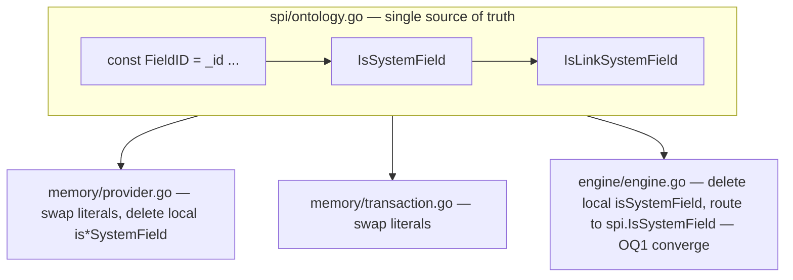

# Go SPI Reserved-Field Constants - Plan

## Goal Capsule

- **Objective:** Collapse the three duplicate declarations of OntologyObject/OntologyLink reserved field names in the Go `runtime/` into one exported constant set + helpers in `spi`, and replace the string literals in production consumers.
- **Product authority:** Refactor of an internal technical surface; no user-facing behavior change. The Go runtime Phase 1–3 plans (Sources) own the surrounding architecture; this plan owns only the reserved-field-name consolidation.
- **Open blockers:** none. OQ1 resolved (see Outstanding Questions).

---

## Product Contract

*Product Contract unchanged from `ce-brainstorm` (R1–R10, AEs, Scope Boundaries, OQ1 resolved). Planning enriches this artifact in place with Planning Contract, Implementation Units, Verification Contract, and Definition of Done.*

### Summary

Promote the `_`-prefixed reserved field names of `spi.OntologyObject` / `spi.OntologyLink` (both `map[string]any`) into exported `spi` string constants and `IsSystemField`/`IsLinkSystemField` helpers, then replace the reserved-field string literals in the three production consumers (`memory/provider.go`, `memory/transaction.go`, `engine/engine.go`). Wire shape and behavior are unchanged; tests are not modified.

### Problem Frame

The Go SPI defines `OntologyObject` and `OntologyLink` as `map[string]any` (`runtime/spi/ontology.go:15,19`) because Go cannot express TS's "named fields + open string index" interface in one type. That choice fits the flat JSON wire shape and the JSON-clone convention used throughout the memory provider, but it pushed the reserved-field contract out of the type layer and into scattered helpers. Three production declarations now hold that contract independently:

- `runtime/storage/memory/provider.go:448` — `isLinkSystemField`, 12 fields (includes `_engineLinkId`).
- `runtime/storage/memory/provider.go:894` — `isSystemField`, 7 fields (omits `_engineLinkId`).
- `runtime/engine/engine.go:278` — a second `isSystemField`, 8 fields (includes `_engineLinkId`), whose comment claims it "mirrors memory.isSystemField" while the code already disagrees.

The cost is real: the three sets can drift silently (the engine comment is evidence of drift already happening), reserved names are re-typed as string literals at ~91 production sites with zero compile-time checking, and the SPI surface documents its contract only in a comment line above a bare `map[string]any`. A future Postgres backend that never JSON-round-trips would re-derive these names a fourth time. The cheapest fix that pays down the debt without disturbing the wire shape or clone convention is to name the constants once in `spi` and reference them everywhere.

### Requirements

**Constants & helpers (spi)**

- R1. `spi` exports untyped string constants for the seven object reserved fields (`_id`, `_type`, `_tenantId`, `_version`, `_createdAt`, `_updatedAt`, `_deletedAt`) and the five link-specific reserved fields (`_fromId`, `_toId`, `_fromType`, `_toType`, `_engineLinkId`).
- R2. `spi` exports `IsSystemField(string) bool` and `IsLinkSystemField(string) bool` as the single source of truth for reserved-field membership; `IsLinkSystemField` is a superset of `IsSystemField` and is defined in terms of it so the seven base names are listed once.
- R3. `spi` gains a small unit test asserting both the constant string values and the `IsSystemField`/`IsLinkSystemField` membership sets, so the source of truth is guarded the day constant values are touched.

**Production replacement**

- R4. `runtime/storage/memory/provider.go` replaces every reserved-field string literal with the matching `spi` constant and routes its local `isSystemField`/`isLinkSystemField` to the exported `spi` helpers, deleting the two local copies.
- R5. `runtime/storage/memory/transaction.go` replaces its reserved-field string literals (`_id`, `_tenantId`, and link `_id`/`_tenantId` reads) with `spi` constants.
- R6. `runtime/engine/engine.go` deletes its local `isSystemField` and routes to `spi.IsSystemField`, eliminating the third duplicate declaration. Per OQ1 (resolved: converge), engine adopts the 7-field `spi.IsSystemField` set; the dead `_engineLinkId`-on-objects filter vanishes (verified unreachable on engine's object validation path — `_engineLinkId` is link-domain, produced at `engine.go:315` only on the link-creation path and never present in object payloads). No caller affected, no test touched.

**Behavior preservation**

- R7. The JSON wire shape of `OntologyObject`/`OntologyLink` is byte-identical: constants hold the same `_`-prefixed strings, so `json.Marshal`/`Unmarshal` (used by `cloneObject`/`cloneSchema`) produces unchanged output.
- R8. Per-layer field-stripping behavior is unchanged for every (layer, field, operation) that strips or keeps a field today. The single non-identical site (engine's `_engineLinkId` membership) is converged away by R6; on every real code path the before/after are observationally equivalent (OQ1).
- R9. No `*_test.go` file is modified; the existing suite passing unchanged is the primary proof of R7/R8.

**Quality gate**

- R10. After the refactor, a grep for reserved-field string literals returns zero hits in the touched production files outside the single `spi` definition file.

### Key Decisions

- **Scope is production code only.** The four files `spi/ontology.go` (define), `memory/provider.go`, `memory/transaction.go`, `engine/engine.go` (consume) are in scope; all `*_test.go` files keep string literals as readable JSON-shape documentation. ~91 production sites move; ~265 test sites stay. Chosen over "production + tests" to avoid noiseing tests with `obj[spi.FieldType]` at no real single-source-of-truth gain, and over "spi + provider.go only" because the engine duplicate is where the drift already bit.
- **Link set is a superset reusing the object helpers.** `IsLinkSystemField` delegates to `IsSystemField` then checks the five link-specific fields, so the seven base names live in exactly one place. Mirrors the existing `isLinkSystemField` structure in `provider.go:448`.
- **Constants are exported from `spi`.** The memory and engine packages are separate packages and must reference the names, so internal-only constants are not viable. `spi` is the contract package, so exporting the reserved-field names is consistent with its role.
- **Wire-layer helpers go to `spi`, not `ir`.** The unification target for the duplicated `isSystemField(k string)` in `memory/provider.go` and `engine/engine.go` is `spi.IsSystemField`/`IsLinkSystemField`, never `ir`. `ir` is storage-agnostic semantic TBox (Phase 1 plan U2: AST-free, no downstream storage coupling); the `_id`/`_tenantId`/`_version`/… names are SPI storage-wire contract columns, so they belong with `spi`. Putting them in `ir` would reverse the dependency: the semantic IR layer would learn the storage-wire reserved-column set, dragging storage contract into ontology. This is the dual of the rejected `*ast.Definition` option (that one pushed AST into IR from the parser side; this would push storage contract in from the SPI side) — both break IR-first layering. The schema-layer "is this field `@primary`" concept already lives in `ir` as `Field.Role == ir.RolePrimary`, and `engine.roleWritable` (engine.go:220) already consults it — no new helper there. Two concepts, two layers, two homes; the refactor only consolidates the wire-layer half (which was the half actually duplicated).

### Acceptance Examples

- AE1. **Covers R4, R8.** After refactor, `memory.CreateObject` with a user-supplied `_id` still ignores the user value and stamps its own UUIDv7 — object system-field stripping is preserved.
- AE2. **Covers R4, R8.** After refactor, `memory.CreateLink` with `_engineLinkId` in `properties` still consumes it as the link id and strips it from the stored link's user-facing fields — link system-field stripping is preserved.
- AE3. **Covers R7.** After refactor, `json.Marshal` of an `OntologyObject` emits the same `_`-prefixed keys with the same values as before the refactor (byte-identical wire shape).
- AE4. **Covers R9, R10.** After refactor, `go test ./...` under `runtime/` is green with zero edits to any `*_test.go` file, and a reserved-field literal grep returns zero hits in the touched production files outside `spi/ontology.go`.

### Scope Boundaries

**Out of scope**

- Replacing reserved-field string literals in any `*_test.go` file (decision, not deferral — tests read better as plain JSON-shape docs).
- Rewriting `OntologyObject`/`OntologyLink` as structs with custom JSON marshaling; the JSON-clone convention and the flat wire shape stay.
- Touching the IR (`runtime/ir/`), ODL, pack, or projection packages — they do not read `_`-prefixed reserved fields.
- Introducing a fourth reserved field (e.g. for a future backend); that flows through the spi constants when it arrives.

### Dependencies / Assumptions

- The `_engineLinkId` divergence between engine's `isSystemField` (8 fields, includes it) and memory's object `isSystemField` (7, omits it) was the one place current behavior was not identical across layers; OQ1 verified it is unreachable on engine's object path and resolved to converge. Not load-bearing.
- The constant values are exactly the wire names (`_id` … `_engineLinkId`); any rename is out of scope and would by construction change the wire shape.

### Outstanding Questions

- OQ1. **Resolved.** Engine's local `isSystemField` (`engine.go:278`) includes `_engineLinkId` and is used for object-payload validation and patch merging; memory's object `isSystemField` omits it. Verified that `_engineLinkId` is link-domain (`memory/provider.go:492` consumes it; `engine.go:315` produces it — both on the link-creation path) and never reaches engine's object validation, so the two candidate directions are behaviorally equivalent on all real callers. **Decision: converge** — engine's local `isSystemField` is deleted and engine routes to `spi.IsSystemField` (7 fields); the dead `_engineLinkId`-on-objects filter simply vanishes. No caller affected, no test touched. This is what R6 now encodes.

### Layer boundary note (not adopted)

During review, an alternative was considered: retain the parsed `*ast.Definition` (gqlparser) on `ir.Field` as a private-data escape hatch so callers like `isSystemField` could consult the AST. **Rejected.** The Phase 1 plan (U2 / "package imports contain no gqlparser") makes `ir` AST-free by hard constraint, and `ir.Field` already carries the full semantic projection of every relevant directive via `FieldRole` + `FieldFlags` + `Link*`/`Computed*` (verified against `packages/odl/src/parser/types.ts` directive kinds): no directive information is lost that the AST would recover. Re-introducing `*ast.Definition` into `ir` would push the gqlparser import into the IR layer and transitively into every downstream (projection, future OpenFGA/REST/Postgres), undoing the IR-first layering the plan exists to protect. The `isSystemField` pain is a schema/wire-layer naming conflation (TS itself keeps them as two separate functions — `engine/objects/validation.ts:501` for `@primary` semantics, `actions/executor/action-executor.ts:74` `SYSTEM_FIELD_PREFIXES` for `_`-prefixed wire keys), not an information-loss problem; this refactor keeps both Go layers at the wire layer (`spi` constants) without widening scope to engine's `field.Role` path. Documented here so the rejected option is not re-litigated.

### Sources / Research

- `runtime/spi/ontology.go:15,19` — `OntologyObject` / `OntologyLink` as `map[string]any` (the type choice that pushed reserved-field knowledge into helpers).
- `runtime/engine/engine.go:274-284` — engine's local `isSystemField` (8 fields, incl. `_engineLinkId`), comment claims it mirrors memory's.
- `runtime/storage/memory/provider.go:447-456` — `isLinkSystemField` (12 fields, superset).
- `runtime/storage/memory/provider.go:894-903` — object `isSystemField` (7 fields, omits `_engineLinkId`).
- `runtime/storage/memory/transaction.go:63,124,217,226` — reserved-field literal reads in the transaction journal.
- `docs/plans/2026-08-10-001-feat-go-phase1-ontology-ir-plan.md` — originating Go Phase 1 plan (SPI surface, map choice, JSON-clone convention).
- Footprint: 356 reserved-field literal occurrences across 17 `runtime/**/*.go` files; 91 in production (85 `provider.go`, 4 `transaction.go`, 2 `engine.go`), 265 in tests.

---

## Planning Contract

### Key Technical Decisions

- KTD-1. **Constant naming follows the existing `spi` CamelCase.** `spi` already uses CamelCase exported identifiers (`RequestContext.TenantID`, `CardinalityOneToOne`, `IndexBTREE`), so the reserved-field constants are `FieldID`, `FieldType`, `FieldTenantID`, `FieldVersion`, `FieldCreatedAt`, `FieldUpdatedAt`, `FieldDeletedAt` and `LinkFieldFromID`, `LinkFieldToID`, `LinkFieldFromType`, `LinkFieldToType`, `LinkFieldEngineLinkID` (link prefix distinguishes link-specific names from object ones). Declared as **untyped** string constants (`const FieldID = "_id"`, no `string` type) so they remain usable in map-key and concatenation contexts without conversion. Carries R1.
- KTD-2. **`IsLinkSystemField` delegates to `IsSystemField`.** `func IsLinkSystemField(k string) bool { return IsSystemField(k) || k == LinkFieldFromID || k == LinkFieldToID || … || k == LinkFieldEngineLinkID }`. The seven base reserved names are listed exactly once (in `IsSystemField`), the five link-specific ones once (in `IsLinkSystemField`); no name appears in both. Mirrors the existing `memory.isLinkSystemField` structure at `provider.go:448`. Carries R2.
- KTD-3. **Wire-layer helpers home in `spi`, not `ir`.** Carried from the brainstorm's "Wire-layer helpers go to `spi`, not `ir`" decision: `_id`/`_tenantId`/… are SPI storage-wire contract columns, not ontology semantics, so `ir` stays storage-agnostic. The rejected `*ast.Definition` alternative (brainstorm "Layer boundary note") collapses to the same boundary call from the parser side. The schema-layer "@primary" concept already lives in `ir.Field.Role` and is consulted by `engine.roleWritable`; this refactor touches neither.
- KTD-4. **OQ1 convergence: engine adopts the 7-field `spi.IsSystemField`.** Engine's local `isSystemField` (`engine.go:278`, 8 fields incl. `_engineLinkId`) is deleted; all call sites route to `spi.IsSystemField` (7 fields). The `_engineLinkId`-on-objects filter is dead on the object validation path (`_engineLinkId` is link-domain, produced only at `engine.go:315` on the link-creation path and never present in object payloads — verified in the brainstorm). Observationally equivalent on every real caller; zero tests touched. Carries R6.
- KTD-5. **Tests keep string literals.** The ~265 test-site literals stay as `obj["_type"]`, not `obj[spi.FieldType]`, by brainstorm Key Decision "Scope is production code only": tests read better as plain JSON-shape docs. The spi unit test (R3) is the one new test file. Carries R9.

### High-Level Technical Design

The flow is one-directional: `spi` defines once, three consumers swap literals and delete their local helpers. No bidirectional coupling, no shared mutable state. The only behavioral nuance is KTD-4's convergence at `engine`, which is observationally equivalent (the dead filter branch vanishes).

### Assumptions

- External research was not run and is not load-bearing — this is a mechanical in-repo Go refactor with all patterns already grounded in the brainstorm.
- The constant **values** are exactly the existing wire names; renaming any reserved field is out of scope and would by construction break R7 (byte-identical wire shape).
- `spi` is consumed only within `runtime/` today; the newly exported `IsSystemField`/`IsLinkSystemField`/`Field*` constants form an additive contract surface for future storage backends, but no external repo consumes them yet.

---

## Implementation Units

### U1. spi reserved-field constants + helpers + unit test

- **Goal:** Establish the single source of truth for reserved-field names and membership in `spi`.
- **Requirements:** R1, R2, R3
- **Dependencies:** none (foundation for U2, U3)
- **Files:**
  - Modify: `runtime/spi/ontology.go` (add constants + `IsSystemField` + `IsLinkSystemField`)
  - Create: `runtime/spi/ontology_systemfield_test.go`
- **Approach:** Add twelve untyped string constants (KTD-1) grouped under the existing `OntologyObject`/`OntologyLink` type declarations. `IsSystemField(k string) bool` is a switch over the seven object constants. `IsLinkSystemField` delegates to `IsSystemField` then checks the five `LinkField*` constants (KTD-2). Keep the helpers allocation-free (switch, not a `map[string]bool` per call) — mirrors the existing `memory.isSystemField` switch shape. Do not import anything new (no `strings`, no `time`); `spi` stays zero-dependency per Phase 1 plan.
- **Execution note:** Implement test-first — write `ontology_systemfield_test.go` asserting the constant values (`FieldID == "_id"`, …) and the membership sets (`IsSystemField("_id")==true`, `IsSystemField("_engineLinkId")==false`, `IsLinkSystemField("_engineLinkId")==true`, etc.), then implement the constants + helpers to make it pass. This guards the source of truth the moment the values are touched.
- **Patterns to follow:** existing `spi` CamelCase constant style (`IndexBTREE`, `CardinalityOneToOne`); existing `memory.isSystemField` switch shape (`provider.go:894`).
- **Test scenarios:**
  - Happy path: every one of the seven object constants equals its `_`-prefixed wire string; every one of the five link constants equals its wire string.
  - Happy path: `IsSystemField` returns true for each of the seven object reserved fields and false for the five link-only fields and for a user field like `"name"`.
  - Happy path: `IsLinkSystemField` returns true for all twelve reserved fields and false for `"name"`.
  - Edge: `IsSystemField("")` and `IsLinkSystemField("")` return false (empty key is not reserved).
  - Edge: a future-reserved candidate like `"_tenant"` (not in either set) returns false from both helpers.
- **Verification:** `go test ./spi/...` green; `IsSystemField`/`IsLinkSystemField` are the only declarations of reserved-field membership in the `spi` package.

### U2. memory provider + transaction literal replacement

- **Goal:** Swap the reserved-field literals in `memory/provider.go` and `memory/transaction.go` to `spi` constants and delete the two local helpers.
- **Requirements:** R4, R5, R7, R8
- **Dependencies:** U1
- **Files:**
  - Modify: `runtime/storage/memory/provider.go` (replace ~85 literals; delete local `isSystemField` at `:894` and `isLinkSystemField` at `:448`; route callers to `spi.IsSystemField`/`spi.IsLinkSystemField`)
  - Modify: `runtime/storage/memory/transaction.go` (replace 4 literals: `_id`, `_tenantId`, link `_id`, link `_tenantId`)
- **Approach:** Mechanical replacement preserving every map literal `_id` → `spi.FieldID`, `_tenantId` → `spi.FieldTenantID`, etc.; key-array literals like `[]string{"_id","_type",…}` become `[]string{spi.FieldID, spi.FieldType, …}`. The two local `is*SystemField` functions are deleted; their call sites switch from `isSystemField(k)` to `spi.IsSystemField(k)` (and `isLinkSystemField` → `spi.IsLinkSystemField`). `cloneObject`/`cloneSchema`/`cloneLink` JSON round-trips are untouched — they marshal/unmarshal maps by content, so the constant string values produce byte-identical output (R7). `objectVersionInt` and `systemTimestamps` are untouched.
- **Patterns to follow:** the replaced sites keep their exact surrounding structure — only the string tokens change.
- **Test scenarios:**
  - Test expectation: none — this unit is a behavior-preserving mechanical refactor. The existing `runtime/storage/memory/*_test.go` suite passing unchanged is the proof (covers AE1–AE3 exercise paths through CreateObject/CreateLink/UpdateObject/soft-delete). Run `go test ./runtime/storage/memory/...`.
  - Audit: after edit, `grep -rn '"_id"\|"_type"\|"_tenantId"\|"_version"\|"_createdAt"\|"_updatedAt"\|"_deletedAt"\|"_fromId"\|"_toId"\|"_fromType"\|"_toType"\|"_engineLinkId"' runtime/storage/memory/provider.go runtime/storage/memory/transaction.go` returns zero hits.
- **Verification:** `go test ./runtime/storage/memory/...` green; the audit grep returns zero hits in both files.

### U3. engine literal replacement + OQ1 convergence

- **Goal:** Delete engine's local `isSystemField` and route to `spi.IsSystemField`, applying the OQ1 convergence (7-field set; the dead `_engineLinkId`-on-objects filter vanishes).
- **Requirements:** R6, R7, R8
- **Dependencies:** U1
- **Files:**
  - Modify: `runtime/engine/engine.go` (replace the 2 literals at `:280` switch and `:315` `props["_engineLinkId"]`; delete the local `isSystemField` at `:278`; route the three call sites at `:141, :166, :190, :195` — plus the `:190/:195` `mergePatch` reads — to `spi.IsSystemField`)
- **Approach:** The four `isSystemField` call sites (`validateObjectPayload` loop, its required-fields loop, `mergePatch`'s two loops) switch to `spi.IsSystemField(k)`. The local function at `:278` is deleted entirely. The one remaining `_engineLinkId` literal in engine — `props["_engineLinkId"] = linkID` at `:315` on the *link* creation path — becomes `props[spi.LinkFieldEngineLinkID] = linkID` (this is a link-domain write, not object validation; it stays, just constantized). Engine no longer references `_engineLinkId` in its object-payload filter — the 8th case simply disappears because `spi.IsSystemField` does not include it (KTD-4). Per OQ1 verification, `_engineLinkId` never reaches engine's object validation path, so this is observationally equivalent.
- **Execution note:** The dead-branch removal is the one non-mechanical step; keep the deletion atomic with the `spi.IsSystemField` routing so the existing engine tests (`engine/objects_test.go`, `engine/links_test.go`, `engine/links_update_test.go`) pin the behavior. Do not add any new test for the vanished branch — OQ1 established it's unreachable.
- **Patterns to follow:** `engine.roleWritable` already consults `ir.Field.Role` for the schema-layer "@primary" judgment; this unit touches only the wire-layer string dispatch and leaves `roleWritable` untouched (two concepts, two layers).
- **Test scenarios:**
  - Test expectation: none — behavior-preserving refactor plus an observationally-equivalent dead-branch removal. The existing engine test suite passing unchanged is the proof. Run `go test ./runtime/engine/...`.
  - Audit: after edit, the reserved-field literal grep returns zero hits in `runtime/engine/engine.go` (both `:280` and `:315` literals moved to constants).
- **Verification:** `go test ./runtime/engine/...` green; audit grep zero hits in `engine.go`.

---

## Verification Contract

| Gate | Command | Covers | Applicability |
|---|---|---|---|
| spi unit test | `go test ./runtime/spi/...` | R1, R2, R3 (constant values + membership sets) | Always |
| memory provider suite | `go test ./runtime/storage/memory/...` | R4, R5, R7, R8, AE1–AE3 (object/link system-field stripping, wire shape) | Always |
| engine suite | `go test ./runtime/engine/...` | R6, R8 (OQ1 convergence, object validation + link creation) | Always |
| Full runtime suite | `go test ./runtime/...` | R9 — all `*_test.go` pass unchanged | Always |
| Reserved-literal audit | `grep -rn '<reserved literals>' runtime/spi/ontology.go runtime/storage/memory/provider.go runtime/storage/memory/transaction.go runtime/engine/engine.go` | R10 — zero hits outside `spi/ontology.go` (the definition file) | Always |
| Test-edit audit | `git diff --name-only \| grep '_test\.go$'` | R9 — no `*_test.go` modified except the new `spi/ontology_systemfield_test.go` from U1 | Always |

---

## Definition of Done

- R1–R10 satisfied: `spi` constants + helpers defined and unit-tested; `memory/provider.go`, `memory/transaction.go`, `engine/engine.go` literals replaced and local helpers deleted/routed.
- `go test ./runtime/...` green end-to-end with zero edits to any pre-existing `*_test.go` (the single new test file is U1's `runtime/spi/ontology_systemfield_test.go`).
- Wire shape byte-identical (R7): `cloneObject`/`cloneSchema` JSON round-trips produce the same output as before the refactor — covered by the existing memory + engine suites passing unchanged.
- OQ1 convergence applied (KTD-4): engine's object-payload filter no longer references `_engineLinkId`; the dead branch is gone.
- Reserved-literal audit clean (R10): zero hits in the touched production files outside `runtime/spi/ontology.go`.
- The plan is a single-PR refactor; the three units may be committed separately in U1 → U2 → U3 order, but land together as one behavior-preserving change.