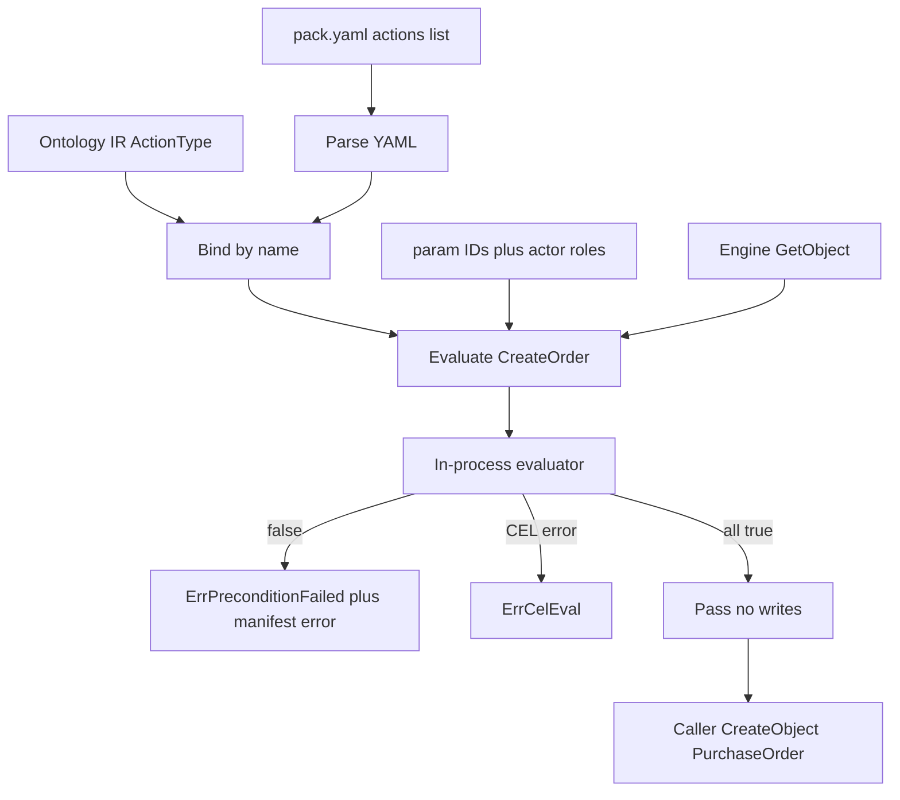

# Go Phase 4 — CEL Preconditions and CreateOrder Manifest Parse

## Summary

Go Runtime 从 supply-chain pack 装载 CreateOrder YAML，按 param ID 经 Engine 拉齐对象，并在进程内用夹具 `actor.hasRole` 求值 CEL 前置条件。通过后调用方手写 `CreateObject`；本 Phase 不执行 YAML effects。

---

## Problem Frame

Phases 1–3 已有 Ontology IR（Action 仅签名）、Engine 动词、memory SPI。`pack.LoadDir` 仍跳过 action YAML。CEL 只存在于 `packages/cel-evaluator` gRPC sidecar。Domain pack 的动能规则无法在 Go Runtime 里判定真假。

Origin（`docs/brainstorms/2026-08-18-go-phase4-cel-action-requirements.md`）把 draft 的 Phase 4 第三腿（Executor / 事务 / compensation）砍掉：本 Phase 只证明 YAML 进 Runtime 且 CreateOrder 前置条件可求值。

---

## Requirements

Carry-forward from origin R1–R11. Planning pins the how.

**Manifest load**

- R1. Runtime 从 `domain-packs/supply-chain` 装载 action YAML，不把 pack 源复制进 Go 树。
- R2. 装载后的 CreateOrder manifest 按名绑定 Ontology IR 的 `CreateOrder` 签名。
- R3. `sideEffects` / `rollback` / `reversible` / `undo` 能 parse，求值时忽略。

**Parameter resolution**

- R4. 对象型 `@param` 在 CEL 前经 Engine/SPI 解析为快照。CreateOrder 需要 `supplier` 与 `product`。
- R5. 缺失或类型错误的对象 param 在 CEL 前失败，且与前置条件为假可区分。

**CEL preconditions**

- R6. 前置条件在进程内对 resolve 时捕获的快照求值，求值期间不重读 storage。
- R7. CEL 环境提供 `params`、`actor`、`now`，以及每个 `@param` 顶层变量。
- R8. `actor.hasRole(role)` 只对照调用方夹具角色列表。不调用 OpenFGA。
- R9. 任一前置条件为假时返回该条 manifest `error` 字符串，且不触发 Engine 动词。

**Handoff**

- R10. 求值成功不改变本体状态。调用方手写 Engine 动词完成 CreateOrder（`CreateObject` PurchaseOrder）。
- R11. 成功标准是后续 Executor 的协议基础，不是 GraphQL/REST、事件总线或 compensation。

---

## Key Technical Decisions

- **KTD-1. 复用 `packages/cel-evaluator/evaluator` 作进程内库。** Origin 禁止金路径依赖 gRPC sidecar。该包已实现 `actor.hasRole`（读 `actor.roles` 字符串列表）和 dyn 变量环境，与 TS executor 不传 typeEnv 的路径一致。Runtime 在边界把 `map[string]any` 转成 evaluator 所需的 protobuf Value，不在 Runtime 重写 CEL 函数库。
- **KTD-2. `LoadDir` 保持 IR-only；新增装载函数读 `pack.yaml` 的 `actions:` 列表。** 不改现有 Phase 1–3 调用方。路径以 pack 声明为准，不 glob。绑定失败（YAML `action` 名在 IR 中不存在）对 CreateOrder 是硬错误。列表中另外三条 YAML 可随列表被 parse，但没有验收测试（见 origin 修订）。
- **KTD-3. 不引入 Action IR。** Manifest 解析成可求值的前置条件结构（action 名、version、preconditions）。effects 等字段解码后丢弃或保留但不执行。
- **KTD-4. Sentinel 延续 Phase 2/3。** 新增 `ErrPreconditionFailed`（CEL 结果非 true）与 `ErrCelEval`（编译/运行时错误）。对象缺失包装既有 `ErrObjectNotFound`。把 Product ID 当作 `supplier` 传入时，type-scoped `GetObject` 同样得到 `ErrObjectNotFound`（与「不存在」不可分，且都不是 `ErrPreconditionFailed`）。`ErrInvalidObjectType` 仅用于 IR 里根本没有该对象类型名。不引入 `PlatformError`。`errors.Is` 仍是稳定契约。失败域是三类：resolve（含 not-found）、前置条件为假、CEL 运行时错误。
- **KTD-5. 求值 API 依赖 Engine.GetObject，不直接打 SPI。** 解析对象 param 走 Engine，以便复用租户隔离与 not-found 语义。求值本身不调用任何写动词。
- **KTD-6. `now` 为 ISO-8601 字符串。** 对齐 TS `action-executor.ts` 的 `now()`，避免本 Phase 引入 protobuf Timestamp 作为变量表示。`duration()` 已在 evaluator 中；CreateOrder 金路径不用它。
- **KTD-7. Dyn 环境，不做装载期 CEL 类型检查。** 与 origin「No Action IR / no load-time typecheck」一致；调用 evaluator 时不传 ODL typeEnv。
- **KTD-8. Engine 上的 `TODO(Phase 4): emit*` 原样保留。** 本 Phase 不接事件层。注释与 Phase 3 计划的命名差是已知的，不在本 PR 改标以免假装事件已交付。

---

## High-Level Technical Design



求值顺序（对齐 spec §5.3 的 Preconditions 段，省略 Authorise/Consent/Execute）：校验必填标量与对象 ID 已给出 → 按 IR 判断对象型 param → `GetObject` → 组装 `params` / 顶层 param / `actor` / `now` → 按 manifest 顺序求值 CEL → 首个非 true 即停。

---

## Output Structure

新建 `runtime/action/`（实现时可微调文件名，下列为范围声明）：

```text
runtime/
  action/
    manifest.go      # YAML 结构与 parse
    evaluate.go      # resolve + CEL preconditions
    evaluate_test.go
    manifest_test.go
  pack/
    loader.go        # 扩展：读 actions: ，不改 LoadDir 返回值
    actions.go       # 新：按 pack.yaml 列表装载 manifest
    actions_test.go
  cel/
    eval.go          # 对 cel-evaluator/evaluator 的薄适配
    eval_test.go
  spi/
    errors.go        # Modify: 新增 ErrPreconditionFailed、ErrCelEval
```

`runtime/go.mod` 将增加对 `github.com/openfoundry/cel-evaluator` 的 require，并用 `replace` 指向 `../packages/cel-evaluator`。

---

## Implementation Units

### U1. Pack actions 装载与 CreateOrder 绑定

- **Goal:** 按 `pack.yaml` 的 `actions:` 列表解析 YAML，并把 CreateOrder 绑到 IR 签名。
- **Requirements:** R1, R2, R3; AE1
- **Dependencies:** none
- **Files:**
  - Modify: `runtime/pack/loader.go`（扩展 `Manifest` 的 `actions` 字段；`LoadDir` 仍只返回 IR）
  - Create: `runtime/pack/actions.go`
  - Create: `runtime/pack/actions_test.go`
  - Create: `runtime/action/manifest.go`
  - Create: `runtime/action/manifest_test.go`
- **Approach:** 用已有 `gopkg.in/yaml.v3`。未知/忽略字段必须不导致 Unmarshal 失败。YAML `action` 必须等于某个 `ir.ActionType.Name`。测试只用 `create-order.yaml` 断言绑定与忽略字段；不为另外三条 YAML 写测试。
- **Patterns to follow:** `runtime/pack/loader.go` 的 `pack.yaml` Unmarshal；`pack.SupplyChainDir` / `FindRepoRoot`；TS `packages/actions/src/parser/types.ts` 的顶层字段名（intent，不移植校验器）。
- **Test scenarios:**
  - Covers AE1. `LoadActions`（或等价）对 supply-chain pack 返回名为 CreateOrder 的 manifest，且 IR 中存在同名 ActionType。
  - CreateOrder YAML 含 `sideEffects` / `rollback` / `reversible` 时装载成功。
  - 将 YAML `action` 改成未知名的夹具文件时绑定失败。
  - `LoadDir` 既有测试（4 个 IR actions 来自 ODL）保持绿色。
- **Verification:** pack 测试绿；既有 `runtime/pack/loader_test.go` 不因返回值变化而红。

### U2. 进程内 CEL 适配

- **Goal:** Runtime 能在本进程求值 CEL 表达式，并支持夹具 `actor.hasRole`。
- **Requirements:** R6, R7, R8
- **Dependencies:** none (can land parallel to U1)
- **Files:**
  - Modify: `runtime/go.mod`, `runtime/go.sum`
  - Create: `runtime/cel/eval.go`
  - Create: `runtime/cel/eval_test.go`
- **Approach:** import `github.com/openfoundry/cel-evaluator/evaluator`，`replace` 到 `../packages/cel-evaluator`。适配层负责变量 map 与 protobuf Value 互转。对象快照在转换前剥离 SPI 系统字段、把 `time.Time` 写成 ISO-8601，并给 `_id` 加 `id` 别名（对齐 TS serializer）。不启动 gRPC。不传 typeEnv（KTD-7）。`has_link` / `count_links` / `hasPermission` 随库存在，CreateOrder 测试不覆盖它们。
- **Patterns to follow:** `packages/cel-evaluator/evaluator/evaluator.go` 的 `Evaluate` + `envWithDynVars`；`evaluator_test.go` 的 hasRole 夹具形状（`actor.roles` 列表）；`packages/actions/src/cel/serializer.ts` 的系统字段剥离与 Date→ISO。
- **Test scenarios:**
  - 表达式 `actor.hasRole('procurement_manager')` 在 roles 含该字符串时为 true，否则为 false。
  - 表达式 `params.quantity > 0` 在 map 变量下可求值。
  - 非法 CEL 返回可 `errors.Is(..., ErrCelEval)` 的错误，而不是 precondition-false。
- **Verification:** `runtime/cel` 测试不监听端口、不拨 gRPC。

### U3. Resolve + 前置条件求值

- **Goal:** 给定 CreateOrder 名、param（对象为 ID）、夹具 actor，解析对象并求值全部前置条件。
- **Requirements:** R4, R5, R6, R7, R8, R9, R10; F2, F3; AE2, AE3, AE4, AE5
- **Dependencies:** U1, U2
- **Files:**
  - Create: `runtime/action/evaluate.go`
  - Create: `runtime/action/evaluate_test.go`
  - Modify: `runtime/spi/errors.go`（两个新 sentinel）
- **Approach:** 用 IR `ActionType.Fields` 区分对象型 param（`Type.Name` 能在 `Ontology.ObjectByName` 命中）与标量。对象 ID 走 `Engine.GetObject`。组装变量：顶层 `supplier`/`product`/标量、`params` 全图、`actor: {id, roles, type}`、`now` ISO-8601。按 manifest 顺序求值；第一个非 true 返回 `ErrPreconditionFailed` 并带上该条 `error` 文案。成功路径禁止调用 Create/Update/Delete。通过时返回已解析的 `supplier`/`product` 快照，金路径手写动词不必再 `GetObject`。
- **Patterns to follow:** `packages/actions/src/executor/action-executor.ts` 的 `resolveParamObjects` 与 precondition 循环（intent）；Engine 测试里的 `tenantCtx`。
- **Execution note:** 先写失败用例（未知 supplier ID、缺角色）再写通过用例。
- **Test scenarios:**
  - Covers AE2. 合法 Supplier/Product、quantity > 0、roles 含 `procurement_manager` → 求值成功且 storage 中无新 PurchaseOrder。
  - Covers AE3. 同上但 fixture roles 不含 `procurement_manager` 与 `supply_chain_admin`（空列表或如 `viewer`）→ `errors.Is(ErrPreconditionFailed)` 且 message 为 `Only procurement managers or supply chain admins can create orders`。
  - Covers AE4. 未知 supplier ID → `errors.Is(ErrObjectNotFound)`，不是 `ErrPreconditionFailed`。
  - Covers AE5. 成功求值后不 `CreateObject` → 无 PurchaseOrder。
  - `supplier.tier == 'PROBATION'` → 对应 manifest 文案 `Cannot place orders with suppliers on probation`。
  - `params.quantity == 0` → `Order quantity must be greater than zero`。
  - 同时 probation 且缺合格角色 → 返回**第一条** manifest 文案（probation），不是角色文案。
  - `supplier` 存在但无 `tier`（或 `tier` 为 null）→ `ErrCelEval`，不是 probation 的 manifest 文案。
- **Verification:** `errors.Is` 覆盖三类失败域（resolve / 前置条件为假 / CEL 运行时）；成功路径零写动词（可用 recording provider 或求值前后 object 计数）。

### U4. Supply-chain CreateOrder 金路径

- **Goal:** 在真实 pack 上把 F1 跑通：load → resolve → CEL pass → 手写 `CreateObject(PurchaseOrder)`。
- **Requirements:** R1, R2, R4, R7, R8, R10, R11; F1; AE6
- **Dependencies:** U3
- **Files:**
  - Modify: `runtime/e2e/supply_chain_test.go`（扩展或新增同包测试）
- **Approach:** 复用 `pack.SupplyChainDir` + 投影 + memory `ApplySchema` + Engine。先创建 Supplier（非 PROBATION）与 Product，再求值 CreateOrder，再由测试手写 PurchaseOrder。CreateObject 的 properties 按 YAML effects 的 intent：`status: DRAFT`，`supplier`/`product` 传对象 `_id`（不是整棵 snapshot），标量从入参复制，`notes` 可省略。求值与 CreateObject 共用同一 `RequestContext`。不复制 pack 进 `runtime/`。不为另外三条 Action 增加用例。
- **Patterns to follow:** 现有 `TestGoldPath_SupplyChain_F8` 的装载与 Engine 用法。
- **Test scenarios:**
  - Covers AE6 / F1. 前置条件通过后手写 CreateObject，PurchaseOrder 可 Get；字段含 `DRAFT`、supplier/product ID、入参标量。
  - 金路径求值成功与手写 CreateObject 是两步；中间点断言尚无该订单。
- **Verification:** `cd runtime && go test ./...` 全绿；Phase 1–3 既有测试保持绿色。

---

## Scope Boundaries

**In scope**

- CreateOrder YAML 装载、IR 绑定、进程内 CEL 前置条件、夹具角色、对象 param 解析、金路径手写 `CreateObject`

**Deferred for later** (from origin)

- Action Executor（按 YAML effects 改图）
- 单事务包裹 effects、compensation / `ROLLBACK_ALL`
- Action undo
- Side-effects、审计、CloudEvent emit
- Authorise / Consent；OpenFGA
- Action IR；装载期 CEL 类型检查
- `has_link` / `count_links` / `actor.hasPermission` 的验收覆盖
- ShipOrder / ReceiveShipment / CancelOrder 作为验收门
- GraphQL / REST Action API、ToolRegistry
- PostgreSQL / AGE

**Outside this Phase's identity** (from origin)

- 逐行移植 TypeScript Action Engine
- 金路径必须走 gRPC CEL sidecar
- 把手工 Engine 动词当成 Action Runtime 的终态

**Deferred to Follow-Up Work**

- 给 `.github/workflows/ci.yml` 加上 `go test ./runtime/...`（既有缺口，本 Phase 不顺手修 CI）
- 引入根级 `go.work`（本 Phase 用 module `replace` 即可）
- 把 Engine `TODO(Phase 4): emit*` 改标为更晚的 Phase（避免与本 Phase 交付混淆，但改注释不是本 Phase 范围）
- 为另外三条 action YAML 增加 parse-only 测试

---

## Acceptance Examples

Origin AE1–AE6 由 U1/U3/U4 的 `Covers AE` 场景执行。不在此重复 Given/When/Then。

---

## System-Wide Impact

- **Dependencies:** `runtime/go.mod` 首次引入 CEL/protobuf 传递依赖。Go 版本：runtime 为 1.22，cel-evaluator 模块为 1.25。实现时若 `replace` 无法在 1.22 编译，将 runtime 的 `go` 指令上调到能编译的最低版本，而不是改回 sidecar。
- **Auth:** 夹具角色不是安全边界。后续 OpenFGA 替换 `actor.roles` 来源，求值 API 形状应能继续接受 roles 列表。
- **Events:** 不发射；Engine stub 仍在。
- **CI:** 与 Phase 1–3 相同，Go 测试仍是本地门禁，本 Phase 不改 workflow。

---

## Risks & Dependencies

| Risk | Mitigation |
|---|---|
| cel-evaluator Go 1.25 vs runtime 1.22 无法一起编译 | 先 `replace` 试编；失败则只抬 runtime `go` 版本，保持 in-process |
| evaluator 的 `structpb.Value` 边界使对象快照字段丢失 | 适配层用与 TS serializer 相同的 JSON 兼容类型（string/number/bool/list/map）；U3 用真实 Supplier 对象测 `supplier.tier` |
| `LoadDir` 与新装载函数分叉导致金路径忘了装 YAML | U4 必须调用新装载函数；U1 测试锁 CreateOrder 绑定 |
| 误把 Executor 或 emit 做进本 Phase | Scope Boundaries + KTD-8；U3 成功路径零写动词 |
| 前置条件求值与手写 CreateObject 之间的竞态 | Origin 已接受；Executor 阶段用单事务关闭。本 Phase 金路径是单测进程，不作为安全边界 |

**Dependencies:** Phase 1–3 Go Runtime（IR、pack ODL load、Engine Get/CreateObject、memory provider）已在本仓库。

---

## Open Questions

无阻塞项。实现时再定的细节：

- 求值入口的具体类型名与包内文件切分
- protobuf 转换是放在 `runtime/cel` 还是小 internal 包
- 是否给 `ir.Ontology` 增加 `ActionByName` 辅助（可选，非产品分叉）
- 必填标量或对象 ID 在 `GetObject` 之前缺失时，用新 sentinel 还是普通 `fmt.Errorf`（只要 `errors.Is` 不是 `ErrPreconditionFailed`）

---

## Sources & Research

- Origin: `docs/brainstorms/2026-08-18-go-phase4-cel-action-requirements.md`
- `docs/design/draft.md` — CEL 内嵌而非移植
- `docs/open-foundry-spec-v2.md` §5.2–5.3
- `docs/plans/2026-08-11-002-feat-go-phase3-full-spi-surface-plan.md` — sentinel、事件推迟
- `runtime/pack/loader.go` — 不加载 action YAML；`FindRepoRoot`
- `runtime/ir/ontology.go` — `ActionType` 仅签名
- `runtime/spi/errors.go` — sentinel 契约
- `runtime/e2e/supply_chain_test.go` — 金路径模板
- `packages/cel-evaluator/evaluator/evaluator.go` — `Evaluate`、`hasRoleImpl`、dyn vars
- `packages/actions/src/executor/action-executor.ts` — resolve + precondition 循环
- `domain-packs/supply-chain/pack.yaml` — `actions:` 列表
- `domain-packs/supply-chain/actions/create-order.yaml` — 金路径 manifest
- `domain-packs/supply-chain/schema/actions.odl` — CreateOrder `@param` 签名
