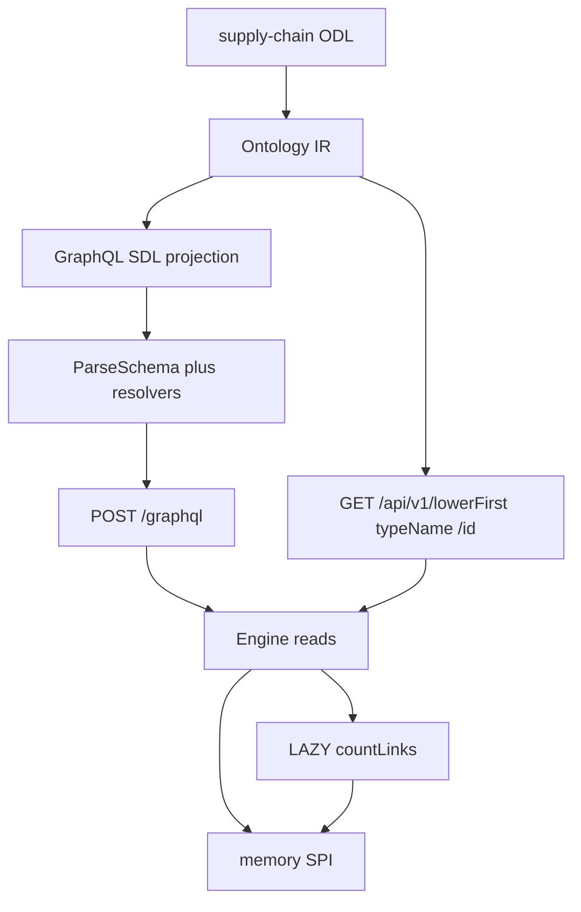

# Go Phase 6 — Read-Only GraphQL API and REST GET

## Summary

Go Runtime 从 Ontology IR 生成只读 GraphQL HTTP API，经 Engine + memory 提供 get、列表/filter/Relay 分页、聚合、按类型 search、嵌套对象与 LAZY `@computed`。REST 仅证明第二条投影：`GET /api/v1/{lowerFirst(typeName)}/{id}`。

---

## Problem Frame

Phases 1–4 已有 IR、Engine 生命周期动词、memory 全 SPI 读表面、CEL 前置条件。`runtime/` 仍无 HTTP/GraphQL。TS `packages/api` 从 ODL 生成 schema 与 resolver，读路径走 Engine，写路径走尚不存在的 Action Executor。Phase 5 鉴权未进 Go；Engine 事件仍是 stub。

Origin（`docs/brainstorms/2026-08-20-go-phase6-graphql-rest-requirements.md`）把 Phase 6 收成只读 API：GraphQL 是产品，REST GET 是存在证明，WebSocket/mutation/OpenFGA 一律后做。

Go Engine 今天只有 CRUD。TS `ObjectManager.query` / `aggregate` / `search` 是 SPI 透传。本 Phase 先把这些读动词和 LAZY `countLinks` 接到 Engine，再投影 HTTP。

---

## Requirements

Carry-forward from origin R1–R15. Planning pins the how.

**Projection and transport**

- R1. GraphQL schema 从 Ontology IR 生成，不依赖 ODL 的 GraphQL AST。
- R2. Runtime 经 HTTP 提供该 schema。金路径测试打 HTTP，不只进程内 execute。
- R3. REST 对每个 ObjectType 提供 GET by id，作为同一 Engine get 的第二条投影。
- R4. GraphQL 与 REST 读路径走 Engine，不直连 SPI。

**Generated GraphQL surface**

- R5. 每个 supply-chain ObjectType 有 get-by-id、带 filter 的 Relay 列表、aggregate。
- R6. memory 声称 `supportsFullTextSearch` 时生成 per-type `searchFoos`。不生成 `searchAll` / `typeahead`。
- R7. 生成 schema 不含 Mutation、Subscription。
- R8. 不含 `_redactedFields` / `_consentRestricted`。字段空值性跟 ODL。
- R9. `@link` 导航字段经 Engine `GetLinks` 展开。对象型属性（ODL 里写成 `Supplier!` 但存的是 ID，如 `PurchaseOrder.supplier`）经 Engine `GetObject` 展开。

**Engine read path**

- R10. Engine 提供 query / aggregate / search / GetLinks。query/aggregate/search 对齐 TS，透传到 SPI。
- R11. 对象读返回带 LAZY `@computed` 的类型时，Engine 求值并合并。Gold：Facility `currentUtilization` = inbound `InventoryAt` 的 `countLinks`。
- R12. 缺失对象：GraphQL get 返回 `null`（无 error）；REST GET 返回 404。跨租户与软删 get 同样按 not-found。

**Integration**

- R13. 金路径只用 memory provider。
- R14. 调用方用请求头提供 tenant。无 authenticate / authorise / consent / redact。
- R15. 成功标准是 memory 上的只读 HTTP API，不是完整 spec §8。

---

## Key Technical Decisions

- **KTD-1. IR 产出 SDL 字符串，启动时用 graph-gophers/graphql-go `ParseSchema`。** Origin 要求 schema 来自 IR 且 HTTP 可测。gqlgen 是编译期 codegen，与「pack 驱动、运行时生成」冲突。graph-gophers 原生 parse SDL 并带 POST handler，对齐 TS 的 SDL + executable schema。`vektah/gqlparser` 继续只用于 ODL 输入解析，不兼 GraphQL server。
- **KTD-2. HTTP 用标准库 `net/http` + `httptest`。** 本 Phase 只有 GraphQL POST 与一条 REST GET，不引入 chi/gin。
- **KTD-3. REST 路径 `GET /api/v1/{lowerFirst(typeName)}/{id}`。** 例如 `/api/v1/product/{id}`、`/api/v1/inventoryRecord/{id}`。不跟 TS 的复数 `products`，也不用 `Product` 原样。
- **KTD-4. GraphQL 路径 `POST /graphql`。** 与 TS api-gateway 一致。
- **KTD-5. Tenant 头 `X-OpenFoundry-Tenant`。** 缺头、空串或纯空白 → 400，体为 `{ "error": { "code": "MISSING_TENANT", "message": "..." } }`，GraphQL 与 REST 都在进 resolver 前拒绝。HTTP 只从该头填 `TenantID`；`ActorID` / `TraceID` 用固定测试哨兵，不从客户端头读取。不解析 `Authorization` / Bearer / cookie。
- **KTD-6. 嵌套两套路径。** RoleLinkNav（`@link`）→ `GetLinks` 再 `GetObject`；对象型 RoleProperty（隐式 FK）→ 属性里的 ID 再 `GetObject`。空 `@link` 列表返回 `[]` 不是 `null`。N+1 可接受，不做 dataloader。
- **KTD-7. 找不到：GraphQL get `null`；REST 404 + 小错误体 `{ "error": { "code": "OBJECT_NOT_FOUND", "message": "..." } }`。** 对齐 TS graphql「returns null for non-existent」，不在本 Phase 上完整 spec §8.8。
- **KTD-8. Relay cursor 镜像 TS offset 编码。** `packages/api/src/graphql/pagination.ts` 的 `cursor:{offset}` base64。非法 cursor 失败，不静默当 0。
- **KTD-9. Filter/orderBy 映射对齐 TS `convertFilter` 与 memory 已实现的算子。** 不发明新谓词。空/空白 search query 返回空 hits（跟 memory，不跟 TS GraphQL validation error）。
- **KTD-10. `countLinks` 在 Engine 读路径求值，默认 inbound。** 与 `packages/engine/src/computed/computed-field-evaluator.ts` 一致。GraphQL 仅在 selection 包含该字段时求值；REST GET 始终合并。未知 `fn` 失败。Gold pack 只有 LAZY `countLinks`。
- **KTD-11. Gold fixture 必须 `CreateLink`。** memory 无 link-sync。只 `CreateObject(InventoryRecord, {facility})` 不会产生 InventoryAt；`currentUtilization` 会是 0。Product.suppliers 同理需要 SuppliesProduct link。
- **KTD-12. Origin AE2 示例字段名作废。** ODL 是 `product { suppliers { name } }`（`[Supplier!]!` inbound MANY），不是 singular `supplier`。
- **KTD-13. Engine 读动词不 import memory。** API 包依赖 Engine 与 IR，测试再注入 `memory.New()`。
- **KTD-14. 主键对外一律 `id`。** SPI 存 `_id`；GraphQL 与 REST 都映射成 IR 主键名 `id`。响应里不暴露 `_id`。
- **KTD-15. Filter 不生成对象型 FK 的 `FooFilter` 字段。** `PurchaseOrder.supplier` 等存 ID 的 RoleProperty 不出现在 `PurchaseOrderFilter` 里（或仅按 ID 过滤）。避免 SDL 引用未定义的 `SupplierFilter`。U3 必须对 supply-chain 全量 SDL 做 `ParseSchema`。
- **KTD-16. GetObject 带可选 computed 集合。** `nil` = 不求值；空切片 = 全部 LAZY；非空 = 列出的字段。GraphQL 按 selection；REST GET 传全部 LAZY。
- **KTD-17. 嵌套判别。** `RoleLinkNav` → GetLinks；`RoleProperty` 且 `ObjectByName(TypeRef.Name)` 命中 → FK GetObject；enum/scalar 原样返回。

---

## Actors

- A1. Gold-path caller（测试）：HTTP GraphQL 与 REST GET，带 tenant 头。
- A2. API projection：IR → SDL + resolver；REST GET。
- A3. Engine + memory：get / query / aggregate / search / GetLinks / LAZY computed。

---

## High-Level Technical Design



读路径：

1. 装载 pack → IR → `ApplySchema` → `engine.New`。
2. IR → SDL（Query 根：`foo` / `foos` / `fooAggregate` / `searchFoos`；ObjectType 含 `@link` 与对象型 FK；无 Mutation/Subscription/security envelope）。
3. 动态绑 resolver：get → `GetObject`；list → `QueryObjects` + Relay；aggregate / search 透传；`@link` → `GetLinks`；FK → `GetObject`。
4. HTTP：tenant 头写入 `spi.RequestContext`；GraphQL 与 REST 共用同一 Engine。

Facility `currentUtilization`：`GetLinks(facilityID, "InventoryAt", inbound)` 的 `totalCount`。只统计 link，不统计 InventoryRecord 上的 facility FK。

---

## Output Structure

新建目录为实现时可微调的范围声明：

```text
runtime/
  engine/
    engine.go            # Modify: GetObject 合并 LAZY computed
    read.go              # Query / Aggregate / Search / GetLinks 透传
    computed.go          # countLinks
    read_test.go
    computed_test.go
  projection/
    graphql/
      sdl.go             # IR → SDL
      sdl_test.go
  api/
    schema.go            # ParseSchema + resolver registry
    resolvers.go         # get/list/aggregate/search/link/FK
    filter.go            # GraphQL filter → SPI FilterExpression
    pagination.go        # Relay cursor
    http.go              # POST /graphql, GET REST, tenant 头
    http_test.go
    schema_test.go
    resolvers_test.go
  e2e/
    graphql_rest_test.go # supply-chain HTTP gold
  go.mod                 # Modify: graph-gophers/graphql-go
```

---

## Implementation Units

### U1. Engine 读动词透传

- **Goal:** Engine 暴露 Query / Aggregate / Search / GetLinks，行为与 TS ObjectManager/LinkManager 透传一致。
- **Requirements:** R4, R10
- **Dependencies:** none
- **Files:**
  - Create: `runtime/engine/read.go`
  - Create: `runtime/engine/read_test.go`
  - Modify: `runtime/engine/engine.go`（仅当需要把方法挂到 Engine 上）
- **Approach:** 每个方法把 `spi.RequestContext` 与参数交给 `StorageProvider` 对应方法。GetLinks 的 direction 由调用方传入。不做 computed、不做 filter 改写。测试用 memory provider + 小 IR fixture，不断言 HTTP。
- **Patterns to follow:** `packages/engine/src/objects/object-manager.ts` 的 query/aggregate/search；`packages/engine/src/links/link-manager.ts` 的 getLinks；`runtime/storage/memory` 已有语义。
- **Test scenarios:**
  - 同租户 QueryObjects 过滤命中；跨租户 miss 与 GetObject 一样隔离。
  - Aggregate count 与插入条数一致；软删对象不计入。
  - Search token 命中 memory 已覆盖的字段；空白 query 返回空。
  - GetLinks inbound/outbound 与 CreateLink 一致。
- **Verification:** `runtime/engine` 测试绿；API 包尚未存在。

### U2. LAZY countLinks

- **Goal:** GetObject（及后续嵌套 get）在 IR 声明了 LAZY `@computed(fn: countLinks)` 时合并该字段。
- **Requirements:** R11; F3; AE6
- **Dependencies:** U1
- **Files:**
  - Create: `runtime/engine/computed.go`
  - Create: `runtime/engine/computed_test.go`
  - Modify: `runtime/engine/engine.go`（GetObject 调用 enrichment）
- **Approach:** 只实现 `countLinks`。`args.type` 为 link type 名；direction 默认 inbound。用 U1 GetLinks 的 `totalCount`。未知 fn 返回错误。EAGER/TTL 不做。GetObject 增加 computed 选项（KTD-16）。
- **Patterns to follow:** `packages/engine/src/computed/computed-field-evaluator.ts`；`domain-packs/supply-chain/schema/facility.odl`；`runtime/ir` 的 ComputedRef。
- **Execution note:** 先写「无 InventoryAt link 时 utilization=0」与「CreateObject 不含 CreateLink 仍为 0」，再写 N links。
- **Test scenarios:**
  - Covers AE6. Facility 有 N 条 active InventoryAt → `currentUtilization == N`。
  - 仅 CreateObject InventoryRecord（FK facility）无 CreateLink → 0。
  - 未知 computed fn → 错误，不静默省略。
- **Verification:** 不经 HTTP 即可证明 GetObject 合并该字段。

### U3. IR → GraphQL SDL

- **Goal:** 从 `*ir.Ontology` 生成可 parse 的 SDL：每 ObjectType 的类型、Connection、Filter、Query 根字段；capability 控制 search；省略写与安全信封。
- **Requirements:** R1, R5, R6, R7, R8; AE5, AE8
- **Dependencies:** none（可与 U1 并行）
- **Files:**
  - Create: `runtime/projection/graphql/sdl.go`
  - Create: `runtime/projection/graphql/sdl_test.go`
- **Approach:** 输入只有 IR，不 import gqlparser AST。命名对齐 TS Query 根：`lowerFirst(name)` get、`lowerFirst(name)+s` list、`lowerFirst(name)+Aggregate`、`search{Name}s`。空值性跟 IR `TypeRef`（不抄 TS §7.1.3 把非主键改成 nullable）。Filter 算子只暴露 SPI 已有集合；对象型 FK 不生成嵌套 `FooFilter`（KTD-15）。声明 `DateTime`、`JSON` 与 PageInfo / Aggregate / Search 共享类型。Query 根不含 `availableTools`、objectSet、`cdm*`。`SupportsFullTextSearch` 从传入的 `spi.StorageCapabilities` 读取。U3 测试必须 `ParseSchema(sdl, stub)` 能过 supply-chain 全量 SDL。
- **Patterns to follow:** `packages/odl/src/codegen/index.ts` 的 Query 根与 filter 形状；origin R6–R8 的省略表。
- **Test scenarios:**
  - Covers AE5. supply-chain IR + memory capabilities → SDL 含 `searchProducts` 等，不含 `searchAll` / `typeahead`。
  - Covers AE8. 无 `type Mutation` / `type Subscription`，无 `_redactedFields` / `_consentRestricted`。
  - 每个 ObjectType 有 get、list、aggregate。
  - `Product` 含 `suppliers: [Supplier!]!`；`PurchaseOrder` 含 `supplier: Supplier!`。
  - capabilities 把 FTS 设为 false 时 SDL 无 search*。
- **Verification:** 对生成 SDL 做字符串/parse 断言，不启动 HTTP。

### U4. 可执行 schema 与 resolver

- **Goal:** 把 SDL 绑到 Engine：get/list/aggregate/search、`@link`、FK nested、Relay、filter。
- **Requirements:** R4, R5, R9, R10, R12; F1, F2; AE1, AE2, AE3, AE4
- **Dependencies:** U1, U2, U3
- **Files:**
  - Create: `runtime/api/schema.go`
  - Create: `runtime/api/resolvers.go`
  - Create: `runtime/api/filter.go`
  - Create: `runtime/api/pagination.go`
  - Create: `runtime/api/schema_test.go`
  - Create: `runtime/api/resolvers_test.go`
  - Modify: `runtime/go.mod` / `runtime/go.sum`（graph-gophers）
- **Approach:** boot 时 `ParseSchema(sdl, root)`。用少量 per-type wrapper（或 `UseFieldResolvers`）把 IR 字段绑到 Engine，不要等 Open Questions 才发现 method 对不上。主键按 KTD-14 映射。嵌套按 KTD-17。list 用 KTD-8 cursor。MANY `@link` GetLinks，去重 target id，软删跳过，上限 1000。FK GetObject，目标缺失则为 null。computed 按 selection 调 KTD-16。`product { suppliers { leadTimeDays } }` schema 校验失败。本单位可用进程内 Exec；HTTP 在 U5。
- **Patterns to follow:** `packages/api/src/graphql/resolver-generator.ts` 的 get/query/aggregate/search 与 `convertFilter`；`packages/api/src/graphql/pagination.ts`。
- **Test scenarios:**
  - Covers AE1. `product(id:)` 返回标量。
  - Covers AE2. `product { suppliers { name } }`：0 条 → `[]`；N 条 → 对应 Supplier.name；须 CreateLink SuppliesProduct。
  - Covers AE3. `products(filter:, first:, after:)` 的 edges / pageInfo / totalCount。
  - Covers AE4. aggregate 与 Engine/memory 分组一致。
  - `purchaseOrder { supplier { name } }` 走 FK GetObject，不走 GetLinks。
  - `product(id: bogus)` → data 为 null，errors 空。
  - PO.supplier 指向不存在 ID 时嵌套 `supplier` 为 null。
  - GraphQL 不选 `currentUtilization` 时不调用 GetLinks（selection-aware）。
  - 非法 cursor → 请求失败。
  - 空白 `searchProducts(query: "  ")` → 空 hits。
- **Verification:** 不监听端口即可跑通上述 Exec 测试。

### U5. HTTP：GraphQL + REST GET

- **Goal:** `POST /graphql` 与 `GET /api/v1/{lowerFirst(typeName)}/{id}` 共用 Engine；tenant 头进 RequestContext。
- **Requirements:** R2, R3, R12, R14; F4; AE7, AE9
- **Dependencies:** U4
- **Files:**
  - Create: `runtime/api/http.go`
  - Create: `runtime/api/http_test.go`
- **Approach:** `http.NewServeMux`。GraphQL 用 graph-gophers relay Handler（或等价 POST JSON）。REST：`lowerFirst` 反查 IR 类型名。成功 JSON 用 `id` 而非 `_id`；FK 保持 ID 字符串。404 用 KTD-7。缺/空 tenant 头 → 400（KTD-5）。未知类型 path → 404。忽略 `Authorization`。默认只在测试里用 `httptest`（loopback）。
- **Patterns to follow:** `packages/api/src/rest/route-generator.ts` 的 get-by-id intent（路径按 KTD-3，不抄 plural）；`packages/api/src/rest/errors.ts` 的 not_found → 404。
- **Test scenarios:**
  - Covers AE7. 同一 Product：REST GET 200 与 GraphQL get 标量一致；未知 id → 404。
  - Covers AE9. 带 tenant 头、无 token 的查询成功。带 `Authorization` 头也不改变结果。
  - 缺 `X-OpenFoundry-Tenant`、空串、纯空白 → 400 `MISSING_TENANT`。
  - `/api/v1/inventoryRecord/{id}` 命中 InventoryRecord。
  - REST GET Facility 含 `currentUtilization`。
  - 未挂载 list/links/history/aggregate/actions。
- **Verification:** 全部经 `httptest.NewServer`。

### U6. Supply-chain HTTP 金路径

- **Goal:** 真实 pack 上 HTTP 覆盖 F1–F4：get、嵌套 `suppliers`（非 origin 原文 `supplier`）、list/aggregate/search、LAZY computed、REST GET。
- **Requirements:** R2, R13, R15; F1, F2, F3, F4; AE1–AE9
- **Dependencies:** U5
- **Files:**
  - Create: `runtime/e2e/graphql_rest_test.go`
- **Approach:** `pack.LoadDir` → project → `ApplySchema` → Engine → HTTP。Seed 必须 **CreateLink**（SuppliesProduct、InventoryAt）。6 个类型各一次 GraphQL get；REST GET 金门仍是 AE7（Product + 未知 id），其余类型 REST 为可选 smoke。HTTP 执行 `searchProducts`（命中 + 空白 query）、list 分页、aggregate。跨租户 list/search/aggregate 为空，不只 get。
- **Patterns to follow:** `runtime/e2e/supply_chain_test.go` 的 pack 路径与 tenantCtx。
- **Test scenarios:**
  - Covers AE1–AE9 as HTTP（`suppliers` 字段）。含 HTTP `searchProducts`、list 分页、aggregate，不只 schema 检查。
  - 六个 ObjectType 各一条 GraphQL get；REST 以 Product AE7 为金门。
  - `inventoryRecord { facility { currentUtilization } }` 嵌套 LAZY。
  - `shipment { order { orderNumber } origin { name } destination { name } }` 三 FK 展开。
  - 跨租户：get/REST 404 或 null；`products` / `searchProducts` / aggregate 为空集。
  - `product { suppliers { leadTimeDays } }` GraphQL 校验失败。
- **Verification:** `cd runtime && go test ./e2e/ ./api/ ./engine/ ./projection/graphql/` 绿。

---

## Scope Boundaries

**In scope**

- IR → SDL → 动态 GraphQL HTTP
- Engine query/aggregate/search/GetLinks + LAZY countLinks
- `@link` 与隐式 FK 嵌套
- REST GET `lowerFirst(typeName)`
- memory 金路径与 supply-chain 全 ObjectType smoke

**Deferred for later**（origin）

- WebSocket / GraphQL Subscriptions
- Action mutations 与 Action Executor
- OpenFGA、consent、redaction 信封与 nullable transform
- `searchAll`、`typeahead`、BM25
- REST list / links / history / aggregate / `/health`
- Query IR、SPARQL / Cypher
- FHIR、CDM、SDK、OpenAPI
- API governance（complexity、rate limit）
- PostgreSQL / AGE

**Outside this Phase's identity**（origin）

- 逐行移植 `packages/api`
- 把 GraphQL SDL 当语义源
- 带鉴权的 api-gateway

**Deferred to Follow-Up Work**

- CI 增加 `go test ./runtime/...`（Phase 4 已记录缺口，本 Phase 不顺手改 workflow）
- DataLoader / 嵌套 link 批量化
- 完整 spec §8.8 错误信封
- GraphQL query complexity

---

## Alternative Approaches Considered

- **gqlgen 静态 codegen：** DX 最好，但每个 pack 要 rebuild，与 IR 运行时投影冲突。弃用。
- **graphql-go/graphql 程序化 ObjectConfig：** 更接近 resolver map，但不 parse SDL，还要再维护一份与 spec 文档不同的树。弃用。
- **Query IR 再投影 GraphQL/REST：** Origin 已选直接打 Engine。REST 只有 GET by id，现在抽 Query IR 过早。
- **REST 用 TS 复数路径：** 用户选定 `lowerFirst(typeName)`，与 TS `products` 分叉；计划内写清，避免实现者抄 TS。

---

## Risks & Dependencies

- **graph-gophers 用 struct method 反射，不是 TS 式 flat map。** 需要按 IR 做少量 generic wrapper。风险是绑定失败要到 boot 才发现 → U3/U4 必须在测试里 `ParseSchema` 真 schema。
- **supply-chain 两套关系模型。** 只测 Product.suppliers 会漏掉 PO/Shipment/InventoryRecord。U6 必须包含 FK nested。
- **依赖：** Phases 1–3 memory 读表面与 pack load；Phase 4 CEL 本 Phase 不调用。
- **N+1：** 嵌套 MANY 可能多次 GetObject。本 Phase 接受；超 1000 link 截断对齐 TS。

---

## System-Wide Impact

- 对外出现第一条 Go HTTP 契约（`POST /graphql` 与 `GET /api/v1/{lowerFirst(typeName)}/{id}`）。后续 Phase 5 往 schema 加 security 字段是加法，本 Phase 故意省略以免假实现。
- REST 路径与 TS `/api/v1/{plural}/:id` **故意分叉**（KTD-3 `lowerFirst(typeName)`）。任何对照 TS 客户端的测试必须改路径，不能抄 `products`。
- Engine 从「写动词 + Get」变成读 API 的门面；SPI 边界不变。
- 无 auth：handler 只认 tenant 头。不可对公网暴露；金路径与本地测试专用。
- GraphQL 单对象 miss 是 `null`；REST 是 404。同一 not-found 在两个传输层语义不同，客户端不能假设对称 HTTP 状态。

---

## Acceptance Examples

Origin AE1–AE9 仍是金门，按 KTD-12 把 AE2 读成 `suppliers`。实现时 U6 必须 HTTP 覆盖它们，并加上 FK nested 与 6 类型 smoke（见 U6 test scenarios）。

---

## Open Questions

**Deferred to Implementation**

- graph-gophers root resolver 的具体 wrapper 形状（每类型 struct vs 统一 Node 类型）
- graph-gophers 自定义标量 DateTime/JSON 的具体 marshal 注册代码
- GraphQL introspection 默认开还是关（本 Phase 无鉴权；TS 非 dev 关闭。倾向关，实现时可按库默认）

---

## Sources / Research

- Origin: `docs/brainstorms/2026-08-20-go-phase6-graphql-rest-requirements.md`
- `docs/design/draft.md` — GraphQL 为 IR projection；动态 resolver；gqlgen 建议被本计划 KTD-1 否决
- `docs/open-foundry-spec-v2.md` §8.1 / §8.2
- `packages/odl/src/codegen/index.ts` — SDL 形状与 search 命名 `search{Name}s`
- `packages/api/src/graphql/resolver-generator.ts`、`pagination.ts`
- `packages/engine/src/computed/computed-field-evaluator.ts` — countLinks inbound
- `runtime/engine/engine.go` — 仅 CRUD；LAZY TODO
- `runtime/storage/memory/provider.go` — `SupportsFullTextSearch: true`
- `domain-packs/supply-chain/schema/product.odl` — `suppliers: [Supplier!]! @link`
- `domain-packs/supply-chain/schema/purchase-order.odl` — implicit FK
- `domain-packs/supply-chain/schema/facility.odl` — LAZY countLinks
- graph-gophers/graphql-go — runtime SDL parse；gqlgen #1691 确认动态 schema 不走 codegen
