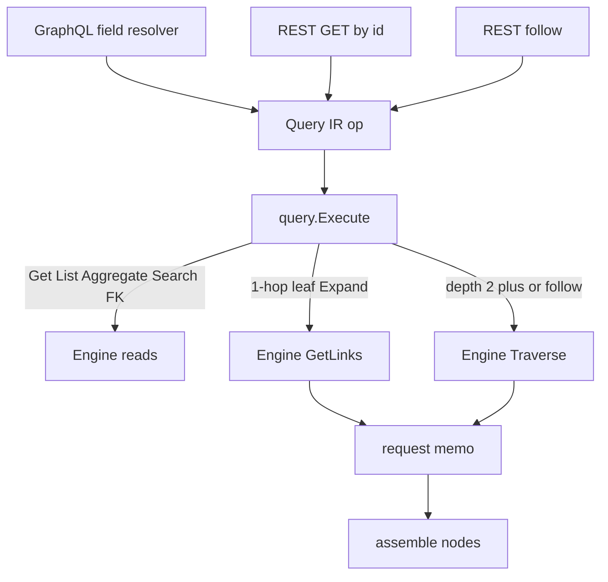

# Go Phase 6 follow-up — Query IR, nested Traverse, REST follow

## Summary

在已落地的 Phase 6 只读 HTTP 之上，把 GraphQL 与 REST 读改为经 Query IR 打 Engine。1 跳 `@link` 叶子仍 `GetLinks`；更深全路径与 REST follow 走 `Traverse`。SPI 增加 `Visited`（严格中间对象）。supply-chain 补 2 跳导航。不改 001 计划正文。

---

## Problem Frame

001 已把 GraphQL/REST 接到 Engine：`@link` 逐字段 `GetLinks` + `GetObject`，REST 只有 GET by id，Query IR 被标为过早。SPI `Traverse` 的 `nodes` 只有终点，Go Engine 未暴露该动词。2 跳嵌套无法一次走完，中间对象也拼不回选择树。

origin（`docs/brainstorms/2026-08-20-go-phase6-query-ir-traverse-requirements.md`）推翻 001 的「不引入 Query IR」和「REST 仅存在证明」，但公开 GraphQL 仍禁止根级 `traverse`。

---

## Requirements

Carry-forward origin R1–R19. Planning pins the how.

- R1–R4. Query IR 是本 Phase 全部对外读的执行入口（GraphQL get/list/aggregate/search/`@link`/FK，REST GET，REST follow）。
- R5–R9. GraphQL 无根级图查询；1 跳叶子 `GetLinks`；更深每条线性全路径一次 `Traverse`；混排按字段分类；用 `nodes` + `Visited` + `edges` 装配。
- R10–R12. REST follow 用已声明 `@link` 字段名；一律 `Traverse`；非法字段名失败。
- R13–R15. SPI `Visited` 加法；`nodes` 仍为终点；Engine `Traverse` 透传；投影不碰 SPI。
- R16–R18. supply-chain 2 跳 HTTP 金路径必须打到 `Traverse`；1 跳 `product { suppliers { name } }` 仍 `GetLinks`。
- R19. 001 未冲突部分继续有效。

---

## Key Technical Decisions

- **KTD-1. Query IR 是按 resolver 构造的 tagged op，不是整份 GraphQL 文档的优化器。** origin 要唯一执行器，不要 SPARQL/OBDA `SemanticQueryPlan`。投影构造 `Get` / `List` / `Aggregate` / `Search` / `Expand`，一律 `query.Execute` → Engine。整文档共享前缀规划延后。
- **KTD-2. `Expand` 按该 `@link` 字段的选择集分类。** 子选择不含 `@link` → `GetLinks`；含 `@link` → 从当前对象对每条线性全路径 `Traverse`。用 graph-gophers `SelectedFieldNames` / `HasSelectedField`（v1.8.0 默认开启，仓库尚未调用）。
- **KTD-3. 禁止双执行。** `Traverse`/`GetLinks` 结果按 `(startId, fieldName)` 缓存在请求上下文。子字段 resolver（含新的 `TrackedProduct`）只读缓存。测试用计数包装断言次数。
- **KTD-4. `TraversalResult.Visited` = 严格中间对象。** 不含起点、不含终点。1 跳 `Visited` 为空。`nodes` / `edges` / `totalCount` 不变。Go 与 TS SPI、两边 memory 一起改。
- **KTD-5. 金 2 跳：`Facility.inventoryRecords` + `InventoryRecord.trackedProduct`。** 前者 `@link(InventoryAt, INBOUND)` 列表；后者 `@link(InventoryOf, OUTBOUND)` 单数可空 `Product`。不把现有 FK `facility` / `product` 改成 `@link`。无 `CreateLink(InventoryOf)` 时 `trackedProduct` 为空，FK `product` 仍有值。
- **KTD-6. REST follow：`GET /api/v1/{lowerFirst}/{id}/follow?path=inventoryRecords,trackedProduct`。** 逗号分隔 `@link` 字段名。起点先 `GetObject`：缺失/软删/跨租户 → 404 `OBJECT_NOT_FOUND`。空 path、FK 名、link type 名、标量名、中间 hop 非法 → 400 `INVALID_FOLLOW_PATH`，不打 SPI。响应只含终点对象（`id` 而非 `_id`）。
- **KTD-7. MANY 上限每根、每跳 1000。** 与 001 `linkPageLimit` 一致。`Traverse` 的 `TraversalOptions.Limit` 不够表达中间跳；执行器按 hop 截断 frontier。
- **KTD-8. 混排与分叉用合成 IR fixture。** 扩展后的 supply-chain 每类型仍基本一个 `@link`，盖不住 origin AE3/AE4。金 pack 只锁线性 2 跳 + 1 跳 `suppliers`。
- **KTD-9. REST follow 与 GraphQL 2 跳比终点 id 集合，不比树同构。** 多条 inventory 指向同一 Product 时 REST `nodes` 去重、GraphQL 保留多条父层。
- **KTD-10. `query` 包依赖 Engine + IR，不 import memory。** 同 001 KTD-13。

---

## Actors

- A1. Gold-path caller（origin）
- A2. Query compiler（origin）
- A3. Engine + memory（origin）

---

## High-Level Technical Design



分类（定向，非实现规格）：

```text
Expand(start, field, childSelection):
  if no @link in childSelection -> GetLinks(field)
  else for each linear @link path in childSelection:
         Traverse(start, steps(field + path))
  memoize; child resolvers read memo only
```

装配：终点 = `nodes`；中间 = `Visited`（按 id）；父子 = `edges`。同 id 在两次 traverse 中去重。

---

## Output Structure

新建目录为实现时可微调的范围声明：

```text
runtime/
  query/
    ir.go          # Get / List / Aggregate / Search / Expand
    execute.go     # Execute → Engine
    execute_test.go
    expand.go      # hop 分类、path 展开、每跳 1000
  spi/ontology.go          # Modify: Visited
  engine/read.go           # Modify: Traverse
  api/compile.go           # GraphQL selection → Expand
  api/http.go              # Modify: GET via Execute; follow
  domain-packs/supply-chain/schema/
    facility.odl           # Modify: inventoryRecords
    inventory-record.odl   # Modify: trackedProduct
```

---

## Implementation Units

### U1. SPI `Visited` + memory 收集中间对象

- **Goal:** `TraversalResult` 增加严格中间对象集合；`nodes` 仍为最后一步。
- **Requirements:** R13
- **Dependencies:** none
- **Files:**
  - Modify: `runtime/spi/ontology.go`
  - Modify: `runtime/storage/memory/provider.go`
  - Modify: `runtime/storage/memory/provider_link_extra_test.go`
  - Modify: `packages/spi/src/ontology.ts`
  - Modify: `packages/spi/src/__tests__/types.test.ts`
  - Modify: `packages/storage-memory/src/memory-storage-provider.ts`
  - Modify: `packages/storage-memory/src/__tests__/memory-storage-provider.test.ts`
- **Approach:** 每步把 `stepNodes` 累进 `Visited`，最后一步只进 `nodes` 不进 `Visited`。在 Go/TS 的 `TraversalResult` 类型上写清字段语义（今日 SPI 结构体本身没有注释，`nodes`=终点只存在于 memory 实现注释里）。保留现有「nodes=终点」测试。Postgres TS traversal 本计划不改（Go 金路径是 memory）；若 TS 编译因类型破裂再最小补字段零值。
- **Patterns to follow:** `runtime/storage/memory/provider.go` Traverse BFS；`Test Traverse_MultiStep_NodesAreFinalStep`。
- **Test scenarios:**
  - Covers AE8. 2 跳：`nodes` 仅终点；`Visited` 含且仅含中间层；`edges` 两跳都在。
  - 1 跳：`Visited` 空；`nodes` 为 hop1。
  - 旧断言 `nodes` 不含中间对象仍然通过。
- **Verification:** Go memory + TS SPI/memory 测试绿。

### U2. Engine `Traverse` 透传

- **Goal:** Engine 暴露 `Traverse`，行为与 TS `LinkManager.traverse` 一致。
- **Requirements:** R14
- **Dependencies:** U1
- **Files:**
  - Modify: `runtime/engine/read.go`
  - Modify: `runtime/engine/read_test.go`
- **Approach:** 把 `spi.RequestContext` 与 path/options 交给 storage。不做分类、不装配 GraphQL 树。
- **Patterns to follow:** 同文件 `GetLinks`；`packages/engine/src/links/link-manager.ts` traverse。
- **Test scenarios:**
  - 2 跳与 memory 直接调用结果一致（含 `Visited`）。
  - 跨租户起点走 traverse 不漏出外租户对象（沿用 memory 隔离）。
- **Verification:** `runtime/engine` 测试绿。

### U3. Query IR 与 Execute

- **Goal:** 投影只构造 Query IR op，由 `Execute` 调 Engine。
- **Requirements:** R1, R2, R3, R4, R15
- **Dependencies:** U2
- **Files:**
  - Create: `runtime/query/ir.go`
  - Create: `runtime/query/execute.go`
  - Create: `runtime/query/expand.go`
  - Create: `runtime/query/execute_test.go`
- **Approach:** tagged op：`Get`、`List`、`Aggregate`、`Search`、`Expand`。`Expand` 带 start、`@link` 字段名、mode（GetLinks vs 一组全路径 Traverse）。每跳 MANY 截 1000。非法 `@link` 名返回可映射为 `INVALID_FOLLOW_PATH` 的错误。不 import memory。
- **Patterns to follow:** `runtime/engine/read.go` 透传；001 filter/pagination 仍在 API 层先做成 SPI 类型再放进 List op。
- **Test scenarios:**
  - Get / List / Aggregate / Search 与直接 Engine 调用一致。
  - Expand 1 跳叶子 → 一次 `GetLinks`，零次 `Traverse`。
  - Expand 2 跳 → 一次 `Traverse`，零次 `GetLinks`。
  - Expand 分叉 → 两次 `Traverse`。
  - 未知字段名 → 错误，storage 计数为 0。
- **Verification:** 用计数包装的 memory 测 Execute；API 包尚未改路由也可先绿。

### U4. supply-chain 2 跳导航字段

- **Goal:** 金 pack 出现真实 2 跳 `@link` 链，且 FK 仍在。
- **Requirements:** R16, R17, R18
- **Dependencies:** none（可与 U1–U3 并行）
- **Files:**
  - Modify: `domain-packs/supply-chain/schema/facility.odl`
  - Modify: `domain-packs/supply-chain/schema/inventory-record.odl`
  - Modify: `domain-packs/supply-chain/SCHEMA.md`（若字段表存在）
  - Modify: `runtime/api/node.go`（先加 `InventoryRecords` / `TrackedProduct` 方法壳，行为在 U5 接 Execute）
  - Modify: `runtime/api/resolvers_test.go`（`TestNode_CoversSupplyChainFields`）
- **Approach:** 见 KTD-5。ODL 注释写明：`product`/`facility` 仍是 FK；图遍历走新 `@link`。新方法在 U5 接 `Execute` 之前不得并入 e2e：2 跳若仍走 `resolveLink`（逐跳 `GetLinks`）会让 R17 假绿。U4 只保证 SDL/node 方法存在；行为正确性由 U5 计数测试锁死。
- **Patterns to follow:** `product.odl` `suppliers`；`links.odl` InventoryAt / InventoryOf。
- **Test scenarios:**
  - SDL 含 `Facility.inventoryRecords` 与 `InventoryRecord.trackedProduct`，仍含 FK `product` / `facility`。
  - `ParseSchema` 对全量 supply-chain SDL 仍成功。
- **Verification:** `runtime/projection/graphql` + `TestNode_CoversSupplyChainFields` 绿。

### U5. GraphQL 经 Query IR 执行并装配

- **Goal:** 所有 GraphQL 读构造 Query IR；`@link` 按选择集分类；无双执行。
- **Requirements:** R2, R5, R6, R7, R8, R9, R15; F1–F3; AE1–AE4, AE9
- **Dependencies:** U3, U4
- **Files:**
  - Create: `runtime/api/compile.go`
  - Modify: `runtime/api/node.go`
  - Modify: `runtime/api/schema.go`（get/list/aggregate/search 改 Execute）
  - Modify: `runtime/api/resolvers_test.go`
- **Approach:** get/list/aggregate/search 改为构造对应 op。`resolveLink` 改为看选择集：叶子 `Expand(GetLinks)`，否则 `Expand(Traverse paths)`，结果写入 memo。`TrackedProduct` 从父 IR 节点的 memo 取单数目标。LAZY computed 仍走 `ComputeField`（与 Traverse 装配无关）。合成 IR fixture 覆盖混排与分叉。
- **Patterns to follow:** graph-gophers `SelectedFieldNames`；现有 `getLinksCounter` 扩成兼计 `Traverse`。
- **Test scenarios:**
  - Covers AE1 / F1. `product { suppliers { name } }` → `GetLinks` 1 次，`Traverse` 0。
  - Covers AE2 / F2. `facility { inventoryRecords { quantity trackedProduct { name } } }` 在已 seed InventoryAt+InventoryOf 时 → `Traverse` ≥1，`GetLinks` 0（对该字段）。
  - Covers AE2 反例. 只建 FK、不建 InventoryOf → `trackedProduct` null；`product { name }` 仍有值。
  - Covers AE3. 合成 fixture 分叉 → 两次 `Traverse`，中间对象去重。
  - Covers AE4. 合成混排 → 一字段 `GetLinks`、一字段 `Traverse`。
  - Covers AE9. SDL 无根 `traverse`/`follow`。
  - 子 resolver 不再增加 `GetLinks`/`Traverse` 计数（KTD-3）。
  - `product { suppliers { products { sku } } }` 有限 2 跳环：按层装配，不因 id 去重丢掉第二层。
- **Verification:** 进程内 Exec + 计数包装。

### U6. REST GET 走 Query IR；REST follow

- **Goal:** REST GET 与 GraphQL get 同一 Execute；follow 为通用图查询。
- **Requirements:** R3, R4, R10, R11, R12; F4, F5; AE5–AE7
- **Dependencies:** U3
- **Files:**
  - Modify: `runtime/api/http.go`
  - Modify: `runtime/api/http_test.go`
- **Approach:** GET by id 构造 `Get` op（computed 全量 LAZY，保持 001 REST 行为）。follow 见 KTD-6。1 跳 follow 也 `Traverse`。未知类型 path 仍 404。
- **Patterns to follow:** 001 tenant 头与 404 信封；新 code `INVALID_FOLLOW_PATH`。
- **Test scenarios:**
  - Covers AE5 / F4. 同一 Product：REST GET 与 GraphQL get 标量一致；两者经 Execute。
  - Covers AE6 / F5. follow `inventoryRecords,trackedProduct` 终点 id 集合与 GraphQL 2 跳终点一致。
  - Covers AE6. 1 跳 follow `suppliers` 走 `Traverse` 不走 `GetLinks`。
  - Covers AE7. 空 path、`product`（FK 名）、`InventoryAt`（link type）、`name`、hop2 非法、从 Product follow `inventoryRecords` → 400 `INVALID_FOLLOW_PATH`，storage 计数 0。
  - 软删/未知/跨租户起点 follow → 404 `OBJECT_NOT_FOUND`。
- **Verification:** `httptest`。

### U7. HTTP 金路径与种子

- **Goal:** supply-chain HTTP 证明 1 跳 GetLinks、2 跳 Traverse、follow、FK 假绿反例。
- **Requirements:** R16, R17, R18; F1, F2, F4, F5; AE1, AE2, AE5, AE6
- **Dependencies:** U4, U5, U6
- **Files:**
  - Modify: `runtime/e2e/graphql_rest_test.go`
- **Approach:** `seedAll` 增加 `CreateLink(InventoryOf, inventory, product)`。001 的 AE1–AE9 行为不回退。2 跳查询必须带 Traverse 计数（经可注入的包装或 Engine 探针；若 e2e 不便计数，U5 已锁计数，e2e 锁响应形状 + 无 InventoryOf 反例）。
- **Patterns to follow:** 现有 `seedAll` 对 InventoryAt / SuppliesProduct 的 CreateLink。
- **Test scenarios:**
  - HTTP `product { suppliers { name } }` 仍绿。
  - HTTP `facility { inventoryRecords { trackedProduct { name } } }` 中间+终点有值。
  - HTTP follow 2 跳终点与上条 GraphQL 终点 id 集合一致。
  - 不建 InventoryOf 的变体：FK `product` 有值，`trackedProduct` 空。
- **Verification:** `cd runtime && go test ./e2e/ ./api/ ./query/ ./engine/ ./storage/memory/` 绿。

---

## Scope Boundaries

**In scope**

- Query IR + Execute
- Engine `Traverse`
- SPI `Visited`（Go + TS 类型与 memory）
- GraphQL 分类与装配、禁止双执行
- REST GET via Query IR、REST follow
- supply-chain 2 跳导航与金路径

**Deferred for later**（origin）

- GraphQL 根 `traverse` / ObjectType `follow`
- 整文档 Query IR 优化 / 共享前缀
- DataLoader 多起点批量化
- 鉴权 / consent
- TS GraphQL/REST planner
- REST list / links / history
- Postgres / AGE `Visited` 填充（若 TS 编译不破裂则完全不做）

**Outside this phase's identity**（origin）

- 把 SPI `TraversalPath` 暴露给 GraphQL
- 把 GraphQL SDL 当语义源
- 带鉴权的 api-gateway

**Deferred to Follow-Up Work**

- 改写 001 计划正文（本文件是 002，不原地改 001）
- 把 `node` 硬编码字段方法换成纯 IR 动态 resolver
- Postgres TS `traverse` 填 `Visited`

---

## Acceptance Examples

Origin AE1–AE9 仍是金门。实现时 U5/U6/U7 必须覆盖它们，并加上 FK 假绿反例与合成混排/分叉（KTD-5, KTD-8）。

---

## Risks & Dependencies

- **依赖 001 已有 HTTP 金路径。** 本计划叠在 `runtime/api` 的 graph-gophers + Engine 读动词上。001 未完成则本计划阻塞。
- **硬编码 `node` 方法。** 新 `@link` 漏方法会让 `TestNode_CoversSupplyChainFields` 失败；U4 必须同步方法。
- **FK 假绿。** `trackedProduct` 与 `product` 同目标。测试必须区分 CreateLink(InventoryOf) 与 FK。
- **memory Traverse 不校验起点存在。** follow 必须先 `GetObject`（KTD-6），否则软删对象仍能走出图。
- **TS Postgres traversal** 可能因 `Visited` 零值编译仍过、运行缺字段；Go 金路径不依赖它。

---

## System-Wide Impact

- 对外 REST 增加 follow，Phase 6 REST 不再只是 GET by id。
- SPI 契约加法：所有 `TraversalResult` 字面量（含测试）要能接受 `Visited`。
- GraphQL 公开契约不变（仍无根 traverse）；行为从 N+1 `GetLinks` 变为选择集驱动的 `GetLinks`/`Traverse`。
- Query IR 成为 Runtime 第三种 IR 的第一块落地；后续 REST list / SPARQL 应扩展 Execute，而不是再接一套 resolver。

---

## Open Questions

**Deferred to Implementation**

- Query IR Go 类型是 struct 内嵌指针还是 interface 判别
- memo 挂在 `context.Value` 还是 `Server` 请求包装
- e2e 是否注入 Traverse 计数器，或只靠 U5 计数 + e2e 形状/反例

---

## Sources / Research

- Origin: `docs/brainstorms/2026-08-20-go-phase6-query-ir-traverse-requirements.md`
- Prerequisite: `docs/plans/2026-08-20-001-feat-go-phase6-graphql-rest-plan.md`
- `docs/design/draft.md` — Ontology IR + Query IR + Action IR
- `runtime/api/node.go` — `resolveLink` / `resolveFK`；硬编码字段方法
- `runtime/engine/read.go` — 无 Traverse
- `runtime/spi/ontology.go` — `TraversalResult` 无沿途集合
- `runtime/storage/memory/provider.go` — Traverse BFS；`stepNodes` 每步覆盖
- graph-gophers v1.8.0 `SelectedFieldNames` / `HasSelectedField`
- `domain-packs/supply-chain/schema/links.odl` — InventoryAt / InventoryOf
- `packages/engine/src/links/link-manager.ts` — TS traverse 透传
- 无 `docs/solutions/` 可复用学习
