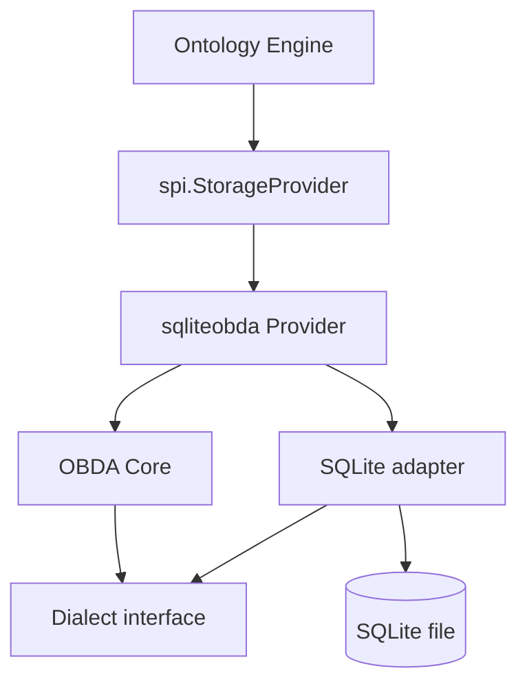
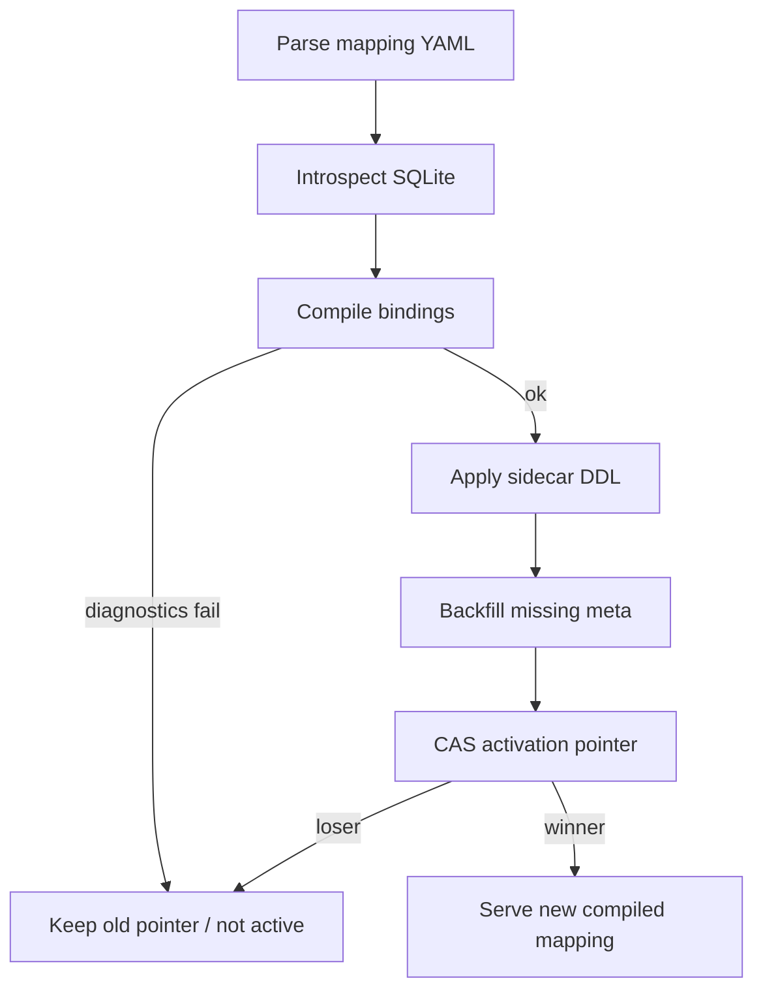
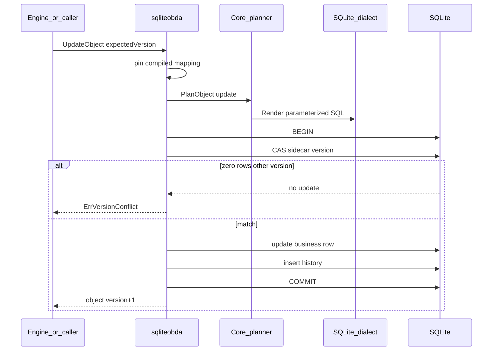
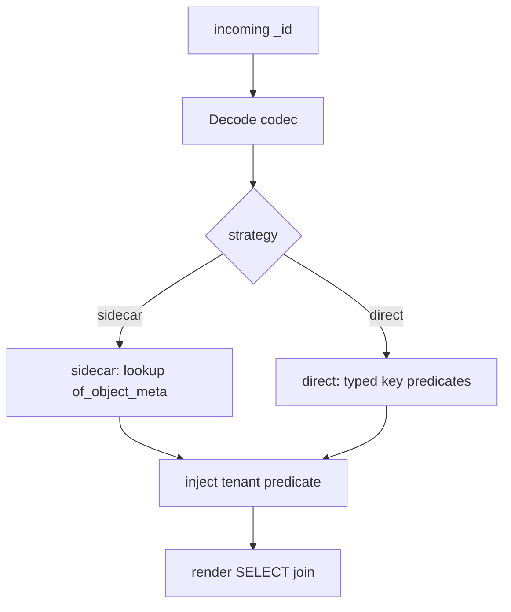

# feat: Add SQLite OBDA StorageProvider

## Summary

在 Go Runtime 增加 SQL 中立的 OBDA 核心、方言接口，以及第一个方言适配器 **SQLite**。该适配器背后的 provider 完整实现 `spi.StorageProvider`，可注入 Ontology Engine。源表缺少系统列时用同库 sidecar 补齐。本轮不做 ReBAC，不改 TypeScript，不交付 MySQL。

源需求文档标题仍写 MySQL。本计划按确认范围把 v1 方言改为 SQLite；MySQL 适配器列为后续工作。行为仍以该需求文档为准，机制参考 `docs/design/obda-mapping-design-v1.md`，冲突时需求约束行为、设计约束分层。

## Progress (2026-08-21)

**Branch:** `feat/go-phase1-ontology-ir`  
**Tests:** `cd runtime && go test ./obda/... ./storage/sqliteobda/` 当前绿。Provider 仍嵌入 `UnimplementedStorageProvider`；U8 完成前不得宣称可注入生产路径。

| Unit | Status | Commit | Notes |
|---|---|---|---|
| U1 SPI sentinels + mapping parse | **done** | `00030c8` | `runtime/spi/errors.go` 加法 sentinel；`runtime/obda` parse/validate |
| U2 Neutral AST + Dialect + planner | **done** | `d8d0629` | `sqlast`、`dialect.Dialect`、object/search/query 计划 |
| U3 SQLite dialect | **done** | `5434225` | `modernc.org/sqlite`；quote/render/introspect/DDL；Core 不 import 驱动 |
| U4 Sidecar + ApplySchema | **done** | `961e7fd` | `Open` 注入 mapping；CAS 激活；backfill 复制业务租户列；漂移 fail-closed |
| U5 Object CRUD / query / OCC / delete | **done** | `4000852` | 真实文件库；软删 Get 可见；硬删级联 link meta 并保留 history |
| U6 Links / cardinality / GetLinks / Traverse | **done** | `7a1bf08` | 部分唯一索引强制 cardinality；Traverse 为逐步 `GetLinks`（非 recursive CTE） |
| U7 Transactions + remaining SPI | **partial** | `389a276` | 步骤 1 已落地：`BeginTransaction`、Rollback 原子性、打开 Tx 时并发 Get 不挂。Aggregate / Search / Bulk / Temporal / EnsureIndex / AE1 方法表 **未做**，这些方法仍返回 `ErrUnimplemented` |
| U8 Engine smoke + origin-vs-memory | **not started** | — | 依赖 U7 收口 |

**相对 Files 清单的实现取舍（不改行为锁定）：**

- `options.go` / `health.go` 并入 `provider.go`；`registry.go` 未单列，compiled mapping 在 `obda.Compile` + `activation`。
- SQLite render 在 `dialect/sqlite/dialect.go`，无独立 `render.go`。
- sidecar 对象物理键唯一索引是全量 unique（支撑 R35 软删后再 Create 拒绝），不是 `WHERE deleted_at IS NULL` 的部分索引。
- Query `AsOfTime` / `AsOfVersion` 返回 `ErrUnsupportedCapability`，不返回 live 行。
- `sqlTxn.UpdateLink` / `DeleteLink` 仍走公开方法（各自开事务）；对象与 `CreateLink` 已走 pinned `*sql.Tx`。

**U7 剩余（按原顺序）：** Aggregate → Search/FTS5 → Bulk 幂等 → Temporal/`of_*_history` → EnsureIndex KTD-17 → Health/Capabilities 收口与 AE1 方法表。然后 U8。

---

## Problem Frame

Engine 只依赖 `spi.StorageProvider`，当前唯一落地实现是 `runtime/storage/memory`。没有中立核心时，每个数据库都会复制 identity、租户、OCC、link 与 schema 生命周期。没有完整 SPI 时，Engine 无法把 Action、查询与 schema apply 接到同一 SQL 存储。

旧 overlay 草案与 v2 文本把 mapping 写成只读 overlay、并把本体绑在 PostgreSQL+AGE 上。本轮按需求改为：OBDA 直接实现完整 SPI，SQLite 是第一个方言。

---

## Requirements

需求 ID 沿用 origin。R3 按计划确认改为 SQLite。其余行为原文有效，把「MySQL」读成「当前方言（SQLite）」。

**Architecture**

- R1. Runtime 提供 SQL 中立的 OBDA Core：输入为 ODL 存储 schema、OBDA mapping 与 SPI 请求，输出为不含具体方言语法的计划。
- R2. Runtime 提供 SQL 方言接口。Core 不发射某一数据库的 SQL，适配器不重定义 SPI 语义。
- R3. v1 实现 SQLite 方言适配器，并以此支撑一个可注入 Engine 的 `StorageProvider`。（origin 写 MySQL；计划确认改为 SQLite。）
- R4. 增加其他方言不得改 SPI 形状，也不得改 mapping 的语义模型。

**Mapping**

- R5. Mapping 是 ODL ObjectType / LinkType 到物理关系的可执行对应，不重述业务语义。
- R6. 每个 model 与 link 必须声明所属数据源引用。v1 所有可写绑定必须落在同一事务域（同一个 SQLite 连接/文件）。
- R7. 可写绑定必须能确定 INSERT / UPDATE / DELETE 目标。不满足时编译失败，不得在运行时部分写入。
- R8. 只读绑定允许查询，拒绝 mutation，并返回 `ErrReadOnlyMapping`。`access: readWrite` 配 view 或不可逆 transform 在编译期失败（`ErrInvalidMapping`），不得以只读错误冒充合法可写 mapping。
- R9. Identity 必须可逆：给定本体 id，能编译成物理 key 谓词，且不靠多表猜测类型。
- R10. Link 拥有独立 id。同一对端点上可存在多条同类型 link；禁止仅用端点哈希当通用 identity。
- R11. 封闭、可逆的字段变换可以进入 v1。任意 SQL 表达式、computed SQL、不可逆 hash 不进入可写路径。

**StorageProvider completeness**

- R12. Provider 实现 `runtime/spi/provider.go` 的全部方法。
- R13. 任一方法不得以 `spi.ErrUnimplemented` 作为 v1 成功路径。
- R14. 返回对象与 link 必须带齐 SPI 系统字段。源列缺失时由 sidecar 提供，且同一记录每次读取值稳定。
- R15. `UpdateObject` / `UpdateLink` 在提供 `expectedVersion` 时必须原子 compare-and-swap。冲突返回 `spi.ErrVersionConflict`。
- R16. Cardinality 在写入时强制执行。查询侧 `LIMIT 1` 不能代替写约束。
- R17. Soft delete 为默认删除。Hard delete 必须显式 mode，并在同一事务处理相关 inbound 与 outbound link。
- R18. 查询默认排除已软删记录。`GetObject` / `GetLink` 可返回带 `_deletedAt` 的记录。
- R19. Aggregate 在聚合前应用租户与软删谓词。
- R20. Search 只对声明为可搜索且方言支持全文的字段成立。不支持时返回稳定不支持错误，而不是空结果冒充无命中。空白 query 返回空命中。
- R21. Bulk 以租户作用域的幂等键去重。相同键相同请求返回原结果；相同键不同请求被拒绝。全部 operations 在同一 SQL 事务中执行。
- R22. Temporal 读必须有真实历史来源。不能把当前行伪装成历史版本。无历史则 not-found，且该绑定不得宣称 temporal。
- R23. `BeginTransaction` 覆盖对象与 link 的 mutation。业务行、sidecar 与历史在同一本地事务中提交或回滚。
- R24. 跨事务域写入在第一笔 mutation 前拒绝。SQLite v1 只有一个事务域；映射到其他连接的可写绑定在编译期失败。

**Tenancy and security**

- R25. 每个 SPI 调用必须有非空 `tenantId`。缺失则失败。
- R26. 租户谓词由 runtime 注入。调用方不能用 filter 或 properties 覆盖。
- R27. 跨租户存在性与不存在使用同一 not-found 错误。Identity 解码失败与类型不匹配对调用方也是 not-found；细节只进脱敏 trace。
- R28. 运行时 SQL 的值全部参数化。标识符必须来自已编译 mapping，不得拼接调用方字符串。
- R29. Mapping 与连接不得含明文凭证。DSN 由构造参数注入，不写进 yaml。
- R30. 本轮不实现 ReBAC、consent 或授权谓词注入。

**Lifecycle**

- R31. Schema 与 mapping 成对准备、校验、原子激活。进行中的请求不切换到另一份 compiled mapping。
- R32. 源库 fingerprint 与激活 mapping 不兼容时，受影响绑定 fail-closed。新请求失败；进行中的请求继续用开始时的 compiled mapping。
- R33. 能力声明必须与真实可执行绑定一致。全局 capability 为真不表示每个 ObjectType 都能 search / temporal / write。

**Origin-vs-memory（计划锁定，不改 memory）**

- R34. Hard delete 保留 sidecar 历史行。memory 会清掉 history；本 provider 不模仿。
- R35. 软删主键上的 Create 拒绝，不做隐式 undelete。
- R36. `expectedVersion == nil` 跳过 OCC，但目标行必须存在且未软删。写路径不复活软删行。
- R37. 业务行与 sidecar 只存在一侧（split-brain）时，读写都记 not-found。读路径不合成、不隐式 backfill。修复走激活时的 backfill。
- R38. `ApplySchema` 不 ALTER 业务表。只准备 provider 自有 sidecar / FTS / 注册表，并激活 mapping。

---

## Actors

- A1. Ontology Engine：唯一业务调用方，经 SPI 读写。本轮 Engine 不加事务 API。
- A2. Mapping author：编写 `*.obda.yaml`。
- A3. OBDA Core：编译、规划、identity、租户注入。
- A4. SQLite dialect adapter：渲染 SQL、introspect、DDL、错误分类。
- A5. Operator：通过 `ApplySchema` 激活 schema 与 mapping 版本。

---

## Key Flows

- F1. Activate mapping
  - **Trigger:** Operator 提交 ODL schema 与已构造注入的 OBDA mapping。
  - **Actors:** A5, A3, A4
  - **Steps:** 解析 mapping → introspect SQLite → 编译校验 → 准备 sidecar DDL → 可选 backfill → CAS 激活指针。
  - **Outcome:** 后续 SPI 请求看到同一份 compiled mapping。失败不翻转激活指针，也不服务半激活状态。
  - **Covered by:** R5, R7, R31, R32, R38

- F2. Read object
  - **Trigger:** Engine 或直接 SPI `GetObject` / `QueryObjects`。
  - **Actors:** A1, A3, A4
  - **Steps:** 解码 identity → 注入租户与软删谓词 → 方言渲染 → JOIN sidecar → 映射系统字段。
  - **Outcome:** 返回合法 `OntologyObject`；跨租户、解码失败、split-brain 均为 not-found。
  - **Covered by:** R9, R14, R18, R25, R26, R27, R37

- F3. Write with OCC
  - **Trigger:** `UpdateObject` 带 `expectedVersion`。
  - **Actors:** A1, A3, A4
  - **Steps:** 校验可写绑定 → 同一事务锁 sidecar 行、核对版本、更新业务行与 sidecar、写历史。
  - **Outcome:** 匹配则版本递增；不匹配返回 `ErrVersionConflict`，无部分提交。
  - **Covered by:** R7, R15, R23

- F4. Create link under cardinality
  - **Trigger:** `CreateLink`。
  - **Actors:** A1, A3, A4
  - **Steps:** 解析两端 identity → 校验同租户、类型、两端均未软删 → 写时用部分唯一索引强制 cardinality（约束冲突映射为 `ErrCardinalityViolation`）→ 分配独立 link id。
  - **Outcome:** 违规返回 `ErrCardinalityViolation`；成功返回完整 `OntologyLink`。
  - **Covered by:** R10, R16, R26

- F5. Transaction
  - **Trigger:** `BeginTransaction` 后改对象并建 link。
  - **Actors:** A1, A3, A4
  - **Notes:** Engine 本轮不暴露 `BeginTransaction`；调用方为直接 SPI。
  - **Steps:** 捕获租户与 mapping 版本 → `BEGIN` → 写业务行与 sidecar → `COMMIT` 或 `ROLLBACK`。
  - **Outcome:** 全部可见或全部不可见。
  - **Covered by:** R23, R24

---

## Acceptance Examples

- AE1. **Covers R3, R12, R13.** Given SQLite OBDA provider 注入 Engine。When 调用每个 `StorageProvider` 方法。Then 均有定义行为，无 `ErrUnimplemented`。
- AE2. **Covers R1, R2, R4.** Given 同一份 mapping 与中立计划。When 经 SQLite 适配器执行。Then SQL 由适配器生成。Core 不包含 SQLite 引号、FTS5 或方言关键字字符串。
- AE3. **Covers R9, R14.** Given 源表只有业务主键、没有 `_version`。When `CreateObject` 后再 `GetObject`。Then 返回稳定 `_id` / `_version` / 时间戳，两次读取一致。
- AE4. **Covers R15.** Given `_version = 7`。When 两个更新同时带 `expectedVersion = 7`。Then 恰好一个成功，另一个 `ErrVersionConflict`。
- AE5. **Covers R10, R16.** Given MANY_TO_ONE 且已有一条 active link。When 再创建第二条同 from 的 active link。Then 失败，底层不会留下两条 active 行。
- AE6. **Covers R25, R27.** Given tenant A 的对象。When tenant B `GetObject` 同一 id。Then `ErrObjectNotFound`，与真正缺失不可区分。
- AE7. **Covers R8, R11.** Given `access: read` 的 view 绑定已激活。When `CreateObject` / `UpdateObject`。Then `ErrReadOnlyMapping`，源表无写入。Query 仍成功。`access: readWrite` + view 不得激活（编译 `ErrInvalidMapping`）。
- AE8. **Covers R21.** Given bulk **成功提交** 后以同一幂等键重试相同 payload。Then 不重复创建；返回与首次完成一致的存结果。中途失败则整笔 SQL 事务回滚（含 `of_idempotency` 行），重试是从头执行，不是 resume 部分进度。
- AE9. **Covers R23, R24.** Given 事务内更新对象并创建 link 后 rollback。Then 业务行、sidecar、link 均不可见。
- AE10. **Covers R30.** Given v1 conformance。When 跑存储套件。Then 不要求 ReBAC tuple 或授权注入。租户隔离测试仍必须通过。
- AE11. **Covers R31.** Given 请求执行中激活新 mapping。When 该请求完成。Then 它仍使用开始时的 compiled mapping。
- AE12. **Covers R18, R34.** Given 软删对象。When `GetObject`。Then 返回带 `_deletedAt` 的记录。Hard delete 之后 `GetObjectAtVersion` 仍能读到删除前快照。
- AE13. **Covers R20.** Given 未声明 searchable 的类型。When `SearchObjects` 非空 query。Then 稳定不支持错误，不是空 hits。空白 query 返回空 hits。
- AE14. **Covers R21.** Given 同一幂等键、不同 payload hash。When 第二次 `BulkMutate`。Then 拒绝，不覆盖第一次结果。
- AE15. **Covers R37, R38.** Given sidecar 有行、业务表无对应行。When `GetObject`。Then `ErrObjectNotFound`。`ApplySchema` 不给业务表加列。

---

## Key Technical Decisions

- KTD-1. **两层包边界。** `runtime/obda` 只含 mapping 语义、中立 AST、planner、identity、registry 契约。`runtime/obda/dialect` 定义 `Dialect`。`runtime/obda/dialect/sqlite` 是唯一 v1 适配器。`runtime/storage/sqliteobda` 实现 SPI，依赖 Core 与 Dialect，不把 SQLite 语法散进 Core。

- KTD-2. **驱动用 `modernc.org/sqlite`。** 仓库无 CGO 先例，Go 1.25，测试与交叉编译不引入 gcc。blank-import 注册 `sqlite`。DSN 由构造参数传入。测试用 `t.TempDir()` 文件库，不用共享 `:memory:`（多连接会各开一份库）。

- KTD-3. **标识符与占位符。** 标识符必须匹配 `[A-Za-z_][A-Za-z0-9_]*`，渲染为 `"name"`，嵌入引号直接拒绝。值占位符一律 `?`。调用方字符串（含 `OrderBy.Field`、`GroupBy`、聚合字段、`SearchQuery.Fields`、`EnsureIndex`/`DropIndex` 的 field、FTS query）不得进入标识符位置或 SQL 文本。逻辑字段必须先解析为 compiled mapping 再变成 Identifier；未知字段在规划期失败。

- KTD-4. **SQLite 方言能力。** 声明：事务、savepoint、recursive CTE、FTS5、generated columns、JSON1。不声明 spatial / GIN / GIST / HASH。`catalog` 只接受空或 `main`。启动时探测 `PRAGMA compile_options` 是否含 `ENABLE_FTS5`；没有则 `SupportsFullTextSearch=false`，Search 走不支持错误。tenant.strategy 只允许 `column` 与 `constant`；`connection` 与未知策略 → `ErrInvalidMapping`。`constant` 要求 `ctx.TenantID` 等于配置值，否则与跨租户同一 not-found / `ErrTenantRequired`。

- KTD-5. **SPI 只做加法 sentinel。** 不改方法签名。新增并用于 `errors.Is`：`ErrReadOnlyMapping`、`ErrUnsupportedCapability`、`ErrInvalidMapping`、`ErrMappingNotActive`、`ErrTenantRequired`、`ErrUnsupportedIndexType`、`ErrSourceSchemaDrift`、`ErrIdempotencyConflict`、`ErrTransactionDomain`。不把 `ErrUnimplemented` 当成功路径。不引入 `PlatformError` struct。

- KTD-6. **Mapping 不走 `ApplySchema` 参数。** SPI 的 `ApplySchema(ctx, schema)` 不变。Provider 构造时注入 mapping 字节或已解析文档与 `*sql.DB`。`ApplySchema` 把这份 mapping 与传入 schema 成对编译、准备 sidecar、CAS 激活。yaml 里的 `connection.dsnRef` 只做命名引用，必须能在构造选项里解析；明文 DSN 编译失败。Core 把 `sources.*.dialect` 当不透明标识符；`sqlite` 适配器在 `sqliteobda.Open` / compile 时核对该值。`dialect: mysql` 在无 MySQL 适配器时由 provider 拒绝，不把 sqlite 白名单写进 Core 语义模型。

- KTD-7. **Compiled mapping 钉在单次 SPI 调用。** 每个公开方法入口读取当前激活指针并持有该 immutable 副本直到返回。Fingerprint **不在每个 Get 上重跑 PRAGMA**。激活时把 introspect 摘要写入 `of_mapping_activation`；热路径只比较这份摘要（或 schema 代次）。完整 introspect 留给 `ApplySchema`、`HealthCheck` 和可选周期探测；探测失败后 **后续新请求** fail-closed。`BeginTransaction` 在 begin 时钉住 tenant、mapping 版本与当时的摘要。Engine 的 Get-then-Update 不是跨 mapping 版本的原子操作；不为此改 Engine。

- KTD-8. **Sidecar 表（逻辑名锁定，物理列名实现可微调）。** 使用 `STRICT` 表，前缀可配置且必须过 Identifier 白名单，默认 `of_`：`of_schema_versions`、`of_mapping_versions`、`of_mapping_activation`、`of_object_meta`、`of_link_meta`、`of_object_history`、`of_link_history`、`of_idempotency`、`of_index_registry`。DDL 写在版本化元数据命名空间。激活失败者不得服务流量。并发 Activate 用 CAS：`UPDATE of_mapping_activation SET mapping_version = ? WHERE mapping_version = ?`（未激活则插入单行）；`RowsAffected != 1` 的一方不得翻转指针，也不得把半成品 compiled mapping 交给请求路径。Backfill 只为「业务行有、sidecar 无」的物理键插入 meta，不覆盖已有 `_id/_version`，不凭 sidecar 合成业务行。sidecar.`tenant_id` 复制自该绑定的业务租户列；`constant` 策略用配置常量并跳过其它租户行。禁止用 `ApplySchema` 的 `ctx.TenantID` 盖写全表。`of_mapping_versions` 只存 mapping 文本与 `dsnRef` 名，不持久化解析后的 DSN。

- KTD-9. **Identity。** `sidecar`：`_id` 为 `runtime/internal/uuidv7` 新 id；物理键来自 payload 已映射字段，或 `INSERT … RETURNING`（同一 `*sql.Tx`）读回生成键再写入 sidecar。禁止用 `last_insert_rowid()` 跨连接读取，也不把 `MaxOpenConns=1` 当铸键正确性条件。`direct`：`_id` 是 `(type, 有序物理键分量)` 的可逆编码，禁止字符串 delimiter 拼接。Engine 注入的 `_engineLinkId` 仅 sidecar link 可采纳；direct link 忽略它，以编码后的物理键为 `_id`。ODL `RolePrimary` 被 `runtime/projection/storage.go` 丢掉，因此 identity 列必须映射到会进入 payload 的普通字段，或使用 generated 插入策略；编译器在无法确定插入键时失败，不改 Engine / projection。

- KTD-10. **跟 origin，不跟 memory。** `GetObject`/`GetLink` 可返回软删行。Hard delete 在同一事务级联 inbound+outbound link，并保留 history。Bulk 同键不同 hash 拒绝。空 tenant 失败。Search 无全文映射时报错。这些差异不回写 memory，也不要求现有 `runtime/conformance` memory 用例改断言。软删端点上的 `CreateLink`：SPI 视为端点 not-found，不插 link（与 memory 经 Engine 的有效结果一致，但不改 Engine）。

- KTD-11. **OCC。** sidecar 版本是权威。`UPDATE … SET version = version + 1 WHERE id = ? AND tenant_id = ? AND version = ? AND deleted_at IS NULL`。零行时再读 sidecar：活行且版本不同 → `ErrVersionConflict`；缺失、跨租户、或已软删 → not-found。软删行不算「行仍存在」的 OCC 命中。

- KTD-12. **Cardinality。** 用 SQLite 部分唯一索引（`WHERE deleted_at IS NULL`）落在 sidecar 或可写关联表上：MANY_TO_ONE 约束 `(tenant, link_type, from_id)`；ONE_TO_MANY 约束 `(tenant, link_type, to_id)`；ONE_TO_ONE 两端都约束；MANY_TO_MANY 不额外约束端点对。`LIMIT 1` 与纯事务内 COUNT 都不算强制。

- KTD-13. **Search 用 FTS5，不是 MySQL FULLTEXT。** 中立 AST 含 `FullTextMatch` / `SearchSource`（逻辑搜索索引，不是 `fts5` 字面量）。`runtime/obda`（除 `dialect/sqlite`）不得出现 `fts5` / `MATCH` / `unicode61`。可搜索绑定时，在 sidecar 命名空间建 provider 自有 FTS5 虚表（按 object type 一张，列含 sidecar `_id` 与 `tenant_id`），不 ALTER 业务表。Create/Update 在同一事务里 UPSERT FTS 行；soft delete 从 FTS 删除；hard delete 删除 FTS 行。MATCH 只用 bound parameter（`WHERE fts MATCH ?`）；用户 query 按短语转义，去掉 FTS 操作符与 `column:` 前缀。无 FTS 映射或方言无 FTS5 → `ErrUnsupportedCapability`。空白 query → 空 hits。Highlights 允许空。Tokenizer 默认 `unicode61`（仅 sqlite 适配器）。Search SQL 必须 `AND tenant_id = ?`，禁止先无租户取 `_id` 再内存过滤。

- KTD-14. **连接与并发。** `sqliteobda.Open` 对注入的 `*sql.DB` 设置 `PRAGMA foreign_keys=ON`、`busy_timeout=5000`；文件 DSN 再 `journal_mode=WAL`。写事务用 `BEGIN IMMEDIATE`。`MaxOpenConns` 允许大于 1 以便 WAL 下只读不与打开的 `*sql.Tx` 抢唯一槽位；写仍串行。禁止默认无限池等待：拿不到连接必须在短超时内失败。所有 mutation/read helper 接受 `DBTX`（`*sql.DB` 或 `*sql.Tx`）；Provider 方法传 `p.db`，Transaction 方法传 pinned Tx，打开 Tx 期间禁止同一 helper 再走 `p.db`。

- KTD-15. **时间与类型。** 系统时间戳 UTC `RFC3339Nano` 字符串，与 memory 一致。写入：ODL string→TEXT、int→INTEGER、float→REAL、bool→INTEGER 0/1、datetime→TEXT、JSON→TEXT（JSON1 校验）。**读出后**经 `Dialect.NormalizeValue` 再交给 SPI 调用方：Boolean→Go `bool`、整数→`int`、DateTime→RFC3339Nano 字符串，避免 Engine `UpdateObject` 的 `checkScalarType` 把 `int64(0/1)` 当非法 Boolean。sidecar 用 STRICT；业务表保持源库 affinity，不强制改 STRICT。

- KTD-16. **Go only。** 不改 `packages/*`、TS SPI、overlay connector、v2 TS storage。不把「与 TS 对齐」当目标。yaml 解析复用已有 `gopkg.in/yaml.v3`。

- KTD-17. **EnsureIndex 不改业务表。** v1 `EnsureIndex` 只登记并创建 provider 自有对象：sidecar 上的 FTS5、以及 registry 记录。对业务表物理列的 BTREE / HASH / GIN / GIST 一律 `ErrUnsupportedIndexType`。查询性能依赖源库已有索引。`DropIndex` 只丢 registry 拥有的索引。R38 对 `ApplySchema` 与 `EnsureIndex` 同样成立。

---

## High-Level Technical Design

依赖方向单向：`StorageProvider` → OBDA Core → `Dialect` ← SQLite adapter。Core 不 import `modernc.org/sqlite`。



激活是 prepare → validate → sidecar DDL → backfill → CAS。失败者保持旧指针。



对象写路径：业务行与 sidecar 同一事务。OCC 谓词打在 sidecar 版本列。



Identity 在编译期选定，运行时不再猜表。



---

## Output Structure

实现时可微调文件名；包边界以 KTD-1 为准。

```text
runtime/
  spi/
    errors.go                    # additive sentinels only
  obda/
    doc.go
    mapping.go                   # YAML document types
    parse.go
    validate.go
    compiler.go
    planner.go
    identity.go
    registry.go
    sqlast/
      ast.go
    dialect/
      dialect.go                 # Dialect interface + capabilities
      sqlite/
        dialect.go
        quote.go
        render.go
        introspect.go
        ddl.go
        fts.go
        errors.go
  storage/
    sqliteobda/
      provider.go
      options.go
      objects.go
      links.go
      query.go
      aggregate.go
      search.go
      bulk.go
      transaction.go
      temporal.go
      indexes.go
      health.go
      sidecar.go
      testdata/                  # business-table fixtures + sample mapping
```

---

## Scope Boundaries

**In scope**

- Go OBDA Core、方言接口、SQLite 适配器
- 完整 `StorageProvider`（含 schema、CRUD、query、traverse、aggregate、search、bulk、transaction、temporal、index、health、capabilities）
- Table mapping、可逆 identity、可写单表绑定
- Sidecar 补齐系统字段与 link identity
- 租户隔离、OCC、soft/hard delete、本地 SQL 事务
- 针对真实 SQLite 文件的 provider 测试与 Engine 注入冒烟

**Deferred for later**（origin 原文，方言顺序按本计划修正）

- MySQL 及其他 SQL 方言适配器
- PostgreSQL / SQL Server
- view / 任意 SQL 作为可写源
- 自由 SQL 表达式与 computed SQL
- 跨库 join 与分布式事务
- CDC / polling / overlay-to-materialize
- ReBAC、consent、字段红线
- Keyset cursor（需 SPI 输入补 cursor 后再做）

**Outside this product's identity**（origin 原文）

- 把 OBDA 做成 Hasura 式 GraphQL 引擎
- 让 mapping 重新定义 ODL 语义
- 以 `ErrUnimplemented` 占位冒充完整 provider
- 把 SQL 库仅当 overlay，本体仍写到另一套 store

**Deferred to Follow-Up Work**（本计划）

- 改 `docs/open-foundry-spec-v2.md` 的 PostgreSQL+AGE 叙事
- 把 Go / SQLite 测例接入现有 GitHub CI（当前 CI 以 TS 为主）
- Engine 增加 `BeginTransaction` API
- 为迁就 SQL provider 改 memory / 现有 Engine Get-then-Update 语义
- 改 `runtime/projection/storage.go` 以保留 `RolePrimary`
- 抽取可注入的共享 conformance harness（本轮 SQLite 测例放在 `sqliteobda` 包内）

---

## Implementation Units

按依赖分三阶段。内部可以有未实现方法，但 U8 完成前不得宣称 provider 可注入生产路径。

### Phase A — Foundation

### U1. SPI sentinels and mapping document

- **Status:** done (`00030c8`)
- **Goal:** 加法错误契约可 `errors.Is`；`*.obda.yaml` 能解析并在语义校验失败时给出 `ErrInvalidMapping`。
- **Requirements:** R5–R11, R29, KTD-5, KTD-6
- **Dependencies:** none
- **Files:**
  - modify `runtime/spi/errors.go`
  - create `runtime/obda/doc.go`
  - create `runtime/obda/mapping.go`
  - create `runtime/obda/parse.go`
  - create `runtime/obda/validate.go`
  - create `runtime/obda/parse_test.go`
  - create `runtime/obda/validate_test.go`
- **Approach:** Sentinel 只追加，不改现有字符串。YAML 模型对齐设计文档 §8，但测试 fixture 的 `catalog` 为空或 `main`（不要抄设计示例里的 `catalog: hospital`）。`sources.*.dialect` 在 Core 是不透明字符串。拒绝明文 `dsn` / `password` / `uri` / `url` / `token` / `secret` / `user` 字段。校验：每个 model/link（含 `access: read` 与 view）必须有可执行 tenant 策略（`column` 或 `constant`）；`connection`、未知 strategy、非 `main` catalog → `ErrInvalidMapping`。可写绑定必须是单表、可逆 identity、完整 system 策略。view 与不可逆 transform 不得 `access: readWrite`。尚不连数据库。`doc.go` 写清两层定义、v1 方言是 SQLite、mapping 由构造注入。
- **Patterns to follow:** `runtime/pack/loader.go` 的 `yaml.v3` 用法；`runtime/spi/errors.go` 现有 sentinel 注释风格。
- **Test scenarios:**
  - Happy path: 合法 sidecar 对象 + direct link 的 yaml 解析成功，`dialect: sqlite`，`catalog` 省略。
  - `access: readWrite` 且 `relation.kind: view` → `ErrInvalidMapping`（不是 AE7 运行时路径）。
  - 不可逆 `hash` transform 出现在可写字段 → `ErrInvalidMapping`。
  - yaml 含明文 `dsn` 或 `password` → `ErrInvalidMapping`。
  - 缺 `sourceRef` 或 identity columns 为空 → `ErrInvalidMapping`。
  - view 无 tenant 块 → `ErrInvalidMapping`。
  - `tenant.strategy: connection` 或 `catalog: hospital` → `ErrInvalidMapping`。
  - `dialect: mysql` 在 Core 可解析为文档；U4 provider 在无适配器时拒绝。
- **Verification:** 新 sentinel 可 `errors.Is`；非法 mapping 在无 DB 情况下被拒绝。

### U2. Neutral SQL AST and Dialect interface

- **Status:** done (`d8d0629`)
- **Goal:** Core 规划产出封闭 AST；方言接口稳定，Core 测试用假方言即可断言计划形状。
- **Requirements:** R1, R2, R4, R28
- **Dependencies:** U1
- **Files:**
  - create `runtime/obda/sqlast/ast.go`
  - create `runtime/obda/dialect/dialect.go`
  - create `runtime/obda/planner.go`
  - create `runtime/obda/planner_test.go`
  - create `runtime/obda/sqlast/ast_test.go`
- **Approach:** AST 节点覆盖设计 §6.1，并加上中立 `FullTextMatch` / `SearchSource`（逻辑搜索索引）。值只作为 parameter slot；标识符只作为已校验 Identifier。`Dialect` 方法对齐设计 §6.2，含 `NormalizeValue`。Planner 本单元覆盖 object Get/Create/Update/Delete 与带 tenant+软删谓词的 Select，以及 Search 计划形状（假方言不得输出 `fts5`/`MATCH`）。Traverse/Aggregate 的计划形状本单元给出节点与接口，由 U6/U7 填完整 planner 实现并补测。假方言把 Identifier 渲染成 `#name`。
- **Patterns to follow:** 设计文档 §6 的职责切分；不要把 SQLite 包 import 进 `runtime/obda`（除 `dialect/sqlite`）。
- **Test scenarios:**
  - Covers AE2. GetObject 计划含 tenant 参数 slot 与 Identifier 节点，序列化假方言输出不含双引号标识符或 `fts5`。
  - Search 计划含 `FullTextMatch` 参数 slot，假方言输出仍不含 `MATCH`/`fts5`。
  - Insert 计划把 payload 值放入 arguments，不把字面量拼进 SQL 文本节点。
  - 未知 filter / OrderBy 字段在规划期失败，不生成 AST。
- **Verification:** `runtime/obda` 的 go list 依赖不含 `modernc.org/sqlite`。

### U3. SQLite dialect

- **Status:** done (`5434225`)
- **Goal:** 把中立计划渲染成可在真实 SQLite 上执行的参数化 SQL，并提供 introspect、sidecar DDL、错误分类。
- **Requirements:** R2, R3, R4, R28, R32, KTD-2, KTD-3, KTD-4, KTD-14, KTD-15
- **Dependencies:** U2
- **Files:**
  - create `runtime/obda/dialect/sqlite/dialect.go`
  - create `runtime/obda/dialect/sqlite/quote.go`
  - create `runtime/obda/dialect/sqlite/render.go`
  - create `runtime/obda/dialect/sqlite/introspect.go`
  - create `runtime/obda/dialect/sqlite/ddl.go`
  - create `runtime/obda/dialect/sqlite/fts.go`
  - create `runtime/obda/dialect/sqlite/errors.go`
  - create `runtime/obda/dialect/sqlite/dialect_test.go`
  - create `runtime/obda/dialect/sqlite/introspect_test.go`
- **Approach:** `sql.Open("sqlite", path)` 经 `modernc.org/sqlite`。Quote 走白名单 + 双引号。Introspect 用 `PRAGMA table_info` / `index_list`，产出 fingerprint 摘要。DDL 只生成 sidecar STRICT 表、部分唯一索引、FTS5 虚表；不生成 `ALTER TABLE` 业务表。`FullTextMatch` 渲染为 `MATCH ?`，query 已在 planner 转义。错误分类：约束失败、busy、缺表分别映射到 cardinality/version/lock/drift 相关 sentinel。SPI `error.Error()`、HealthCheck.Details 不得含文件路径或 DSN。Recursive CTE 渲染留给 Traverse 调用同一 Render。读路径 `NormalizeValue` 必须有测例（bool/datetime）。
- **Patterns to follow:** KTD-3 白名单；memory 的 `errors.Is` 包装，不泄漏内部细节。
- **Test scenarios:**
  - 标识符 `patient` → `"patient"`；`patient;drop` 与嵌入 `"` 被拒绝。
  - 渲染 SELECT 的 arguments 与 SQL 分离；用真实文件库 `QueryRow` 能取出绑定值。
  - Introspect 一张无系统列的业务表，fingerprint 稳定；改列后 fingerprint 变化。
  - Sidecar `CREATE TABLE ... STRICT` 在真实库执行成功。
  - 非法标识符不会变成可执行 SQL。
  - `NormalizeValue`：INTEGER 0/1 → Go `bool`；datetime TEXT → RFC3339Nano 字符串。
  - Open 使用含路径的 DSN 后，公开 error 字符串不含该路径。
- **Verification:** 方言测试打开 temp 文件库并真正执行渲染结果。

### Phase B — Provider persistence

### U4. Sidecar, registry, and ApplySchema

- **Status:** done (`961e7fd`)
- **Goal:** schema+mapping 成对编译、sidecar 就绪、CAS 激活；`GetSchema` 读出版本快照。
- **Requirements:** R12, R31, R32, R33, R37, R38, F1, KTD-6, KTD-7, KTD-8
- **Dependencies:** U1, U3
- **Files:**
  - create `runtime/obda/compiler.go`
  - create `runtime/obda/compiler_test.go`
  - create `runtime/obda/identity.go`
  - create `runtime/obda/identity_test.go`
  - create `runtime/obda/registry.go`
  - create `runtime/storage/sqliteobda/provider.go`
  - create `runtime/storage/sqliteobda/options.go`
  - create `runtime/storage/sqliteobda/sidecar.go`
  - create `runtime/storage/sqliteobda/health.go`
  - create `runtime/storage/sqliteobda/apply_schema_test.go`
  - create `runtime/storage/sqliteobda/testdata/` fixtures
- **Approach:** `sqliteobda.Open(db, mapping, opts)` 持有 mapping，未 Activate 时除 `HealthCheck`/`Capabilities` 外的方法返回 `ErrMappingNotActive`。构造时核对 mapping dialect 有 sqlite 适配器，否则 `ErrInvalidMapping`。`ApplySchema`：introspect → compile → 需要时 backfill sidecar（KTD-8 租户复制规则）→ CAS `of_mapping_activation`。业务表 DDL 不出现。失败的 Activate 不得把指针指到新版本。`HealthCheck` 查连通、激活对、缓存的 fingerprint 摘要；漂移的绑定记 degraded，探测失败后新请求 fail-closed（`ErrSourceSchemaDrift`）。Details 不含路径/DSN/SQL 文本。
- **Patterns to follow:** memory 的 `var _ spi.StorageProvider` 与 embed `UnimplementedStorageProvider`；系统时间用 RFC3339Nano。
- **Test scenarios:**
  - Covers F1 / AE11. 激活成功后 `GetSchema` 返回传入 object types；激活期间进行中的 pinned mapping 不变（用测试夹具在 ApplySchema 中途持有旧 pinned 副本）。
  - 并发两次 `ApplySchema` 只有一个 CAS 成功；失败者仍服务旧版本或保持未激活。
  - Covers AE15 / R38. ApplySchema 后业务表列集合与 fixture 一致（无新系统列）。
  - 改业务表列后再 `HealthCheck` 探测 → 绑定 fail-closed；热路径 Get 比较的是激活摘要，不每次 PRAGMA。
  - 空 tenant 的 `ApplySchema` → `ErrTenantRequired`。
  - `dialect: mysql` mapping → Open/`ApplySchema` 失败。
  - HealthCheck.Details 与 SPI error 不含 temp DSN 路径。
  - backfill 多租户业务行：sidecar.tenant_id 复制自业务列，不被 ApplySchema 的 ctx 盖写。
- **Verification:** 未激活 provider 不接受 CRUD；激活失败后指针不变。

### U5. Object CRUD, query, tenant, OCC, delete

- **Status:** done (`4000852`)
- **Goal:** 对象读写在真实 SQLite 上满足租户、OCC、软删/硬删与系统字段稳定性。
- **Requirements:** R8, R9, R14, R15, R17, R18, R25–R28, R34–R37, F2, F3
- **Dependencies:** U4
- **Files:**
  - create `runtime/storage/sqliteobda/objects.go`
  - create `runtime/storage/sqliteobda/query.go`
  - create `runtime/storage/sqliteobda/objects_test.go`
  - create `runtime/storage/sqliteobda/query_test.go`
- **Approach:** 所有 helper 接受 `DBTX`。Create：sidecar 铸 id，插入业务行与 meta+history；租户值只来自 pinned `RequestContext`，忽略 properties 里的 `_tenantId`；禁止把可写逻辑字段映射到 tenant 列。Get：解码失败 / 跨租户 / split-brain → `ErrObjectNotFound`；软删仍返回对象。Update：KTD-11；`expectedVersion==nil` 仍要求未删除存在行。`access: read` → `ErrReadOnlyMapping`，零写入。Query：默认排除软删，`IncludeDeleted` 可包含；`Limit<=0` 视为 100，上限 1000；identity 列做稳定 tie-breaker；`Cursor` 保持空；`AsOf*` 在 history 落地前必须拒绝或跳过，**不得返回当前行冒充历史**（U7 接 history 源）。OrderBy 字段必须是 mapping 逻辑名。Hard delete：同事务删除该对象全部 inbound 与 outbound link（含已软删 link），删业务行与 object meta，**保留** history。对已软删对象再 soft delete 幂等成功；hard delete 仍执行级联。Soft-deleted 主键 Create → 拒绝。
- **Patterns to follow:** `runtime/internal/uuidv7`；SPI 字段常量 `spi.Field*`；不改 Engine。
- **Execution note:** 先写失败的文件库集成测试（Create 后 Get 系统字段稳定），再补实现。
- **Test scenarios:**
  - Covers AE3. 无系统列的 patient 表 Create+Get 两次，`_id/_version/_createdAt` 相同。
  - Boolean 列 Create→Get 的 Go 类型是 `bool`，不是 `int64`。
  - Covers AE4. 两个 goroutine 同时 `expectedVersion=1`，一成功一 `ErrVersionConflict`。
  - Covers AE6. 跨租户 Get 与缺失 id 均为 `ErrObjectNotFound`，error 字符串不可区分。
  - Covers AE7. `access: read` 绑定 Query 成功，Create 返回 `ErrReadOnlyMapping` 且源表无新行。
  - Covers AE12. 软删后 Get 带 `_deletedAt`；Query 默认不含；`IncludeDeleted` 含。
  - Hard delete 后 Query/Get 都找不到对象，相关 link 消失，history 行仍在 sidecar。
  - 空 tenant → `ErrTenantRequired`。
  - 调用方 filter 或 properties 带 `_tenantId=INTRUDER` 不能扩大可见范围或改写存储租户。
  - split-brain（只插 sidecar 或只插业务行）Get → not-found。
  - 软删后再 Create 同一物理键 → 拒绝。
  - 软删后再 Update → not-found，不是 `ErrVersionConflict`。
  - Direct identity round-trip：Create 返回的 `_id` 能 Get 回同一行。
  - `Limit==0` 实际 LIMIT 100；`OrderBy` 为 `patient;drop` 规划失败。
  - `AsOfTime` 在 U5 不得返回 live 行（拒绝或空页，U7 再接 history）。
- **Verification:** 对象测例全部走真实 SQLite 文件；无 `ErrUnimplemented`。

### U6. Links, cardinality, GetLinks, Traverse

- **Status:** done (`7a1bf08`)
- **Goal:** 独立 link id、写时 cardinality、图遍历。
- **Requirements:** R10, R14, R15, R16, R18, F4, KTD-9, KTD-10, KTD-12
- **Dependencies:** U5
- **Files:**
  - create `runtime/storage/sqliteobda/links.go`
  - create `runtime/storage/sqliteobda/links_test.go`
  - modify `runtime/obda/planner.go`
  - modify `runtime/obda/planner_test.go`
- **Approach:** CreateLink 校验两端同租户、类型匹配、可写绑定、两端均未软删（软删端点 = not-found，不插行）。Sidecar 铸 link id（或采纳 `_engineLinkId`）；direct 编码物理键并忽略 `_engineLinkId`。UpdateLink 使用与对象相同的 sidecar CAS（KTD-11）。Cardinality 靠部分唯一索引，冲突分类为 `ErrCardinalityViolation`。GetLinks 先解全局对象 id（不扫多表猜类型）。Traverse：planner 产出 JOIN 或 bounded recursive CTE 计划，方言渲染；超过 `MaxTraversalDepth`（capability=8）拒绝；用 visited canonical id 防环。CTE 每一跳 `AND tenant_id = ?`。Link 软删写入 sidecar `_deletedAt`；查询默认排除。
- **Patterns to follow:** memory 的 cardinality 计数语义（active、同租户、同类型），实现改成 SQL 约束而非全表扫描。
- **Test scenarios:**
  - Covers AE5. MANY_TO_ONE 第二条 outbound 失败，表中仍一条 active 行。
  - ONE_TO_ONE 在 from 或 to 已占用时失败。
  - MANY_TO_MANY 允许同一对端点多条 link，id 不同。
  - Covers AE9 前置：CreateLink 后 rollback 在 U7 测；本单元测 commit 后 GetLink 系统字段齐全。
  - 跨租户 from/to → not-found，不建 link。
  - 软删端点 CreateLink → not-found，不建 link。
  - 两个 goroutine 同时 `UpdateLink` `expectedVersion=1`，一成功一 `ErrVersionConflict`；软删 link 上 Update → not-found。
  - GetLinks outbound/inbound 分页；默认不含软删 link。
  - Traverse 两步路径返回终端 nodes 与 walked edges；超深度拒绝；跨租户 start 与缺失不可区分。
  - Direct link 忽略 `_engineLinkId`，返回编码 id。
- **Verification:** cardinality 失败后用 SQL 直接 `COUNT` 业务/sidecar 行，确认无脏行。

### Phase C — Completeness

### U7. SQL transactions and remaining SPI surface

- **Status:** partial (`389a276` = Approach 步骤 1). 步骤 2–7 与 AE1 方法表未做。
- **Goal:** 本地 SQL 事务 + aggregate / search / bulk / temporal / index / health / capabilities，方法均有定义行为。
- **Requirements:** R12, R13, R19–R24, R33, R34, F5, KTD-10, KTD-13, KTD-14, KTD-17
- **Dependencies:** U6
- **Files:**
  - create `runtime/storage/sqliteobda/transaction.go`
  - create `runtime/storage/sqliteobda/aggregate.go`
  - create `runtime/storage/sqliteobda/search.go`
  - create `runtime/storage/sqliteobda/bulk.go`
  - create `runtime/storage/sqliteobda/temporal.go`
  - create `runtime/storage/sqliteobda/indexes.go`
  - modify `runtime/storage/sqliteobda/health.go`
  - create `runtime/storage/sqliteobda/transaction_test.go`
  - create `runtime/storage/sqliteobda/aggregate_test.go`
  - create `runtime/storage/sqliteobda/search_test.go`
  - create `runtime/storage/sqliteobda/bulk_test.go`
  - create `runtime/storage/sqliteobda/temporal_test.go`
  - create `runtime/storage/sqliteobda/indexes_test.go`
  - modify `runtime/storage/sqliteobda/objects.go`
  - modify `runtime/obda/planner.go`
  - modify `runtime/obda/planner_test.go`
- **Approach:** `BeginTransaction` 返回包装 `*sql.Tx` 的 `spi.Transaction`，钉住 tenant 与 mapping。所有 verb 走 `DBTX=tx`。Rollback 后业务行、sidecar、link、FTS、idempotency 均不可见。本单元按此顺序落地，每步有测例后再进入下一步：
  1. Transaction 八方法 + rollback 原子性 + 打开 Tx 时并发 `GetObject`/`HealthCheck` 在短超时内返回（不得挂死）
  2. Aggregate（planner 填完整；租户与软删谓词在 GROUP BY 前；GroupBy 必须是 mapping 逻辑名）
  3. Search / FTS5 同步（KTD-13）：`objects.go` 的写路径调用 FTS helper；SearchObjects 执行 planner 的 `FullTextMatch`
  4. Bulk 单事务 + 幂等（`of_idempotency`；同键不同 hash → `ErrIdempotencyConflict`；失败整笔回滚，无 resume）
  5. Temporal 只读 `of_*_history`（含完整业务字段快照）；`QueryObjects`/`GetLinks` 的 `AsOf*` 用同一历史源，缺历史不得返回当前行
  6. Index registry（KTD-17）：FTS5 可建；业务表 BTREE/HASH/GIN/GIST → `ErrUnsupportedIndexType`
  7. Health / Capabilities 收口；FTS5 探测失败则全局 FTS false

  Capabilities：transactions/temporal/FTS/graph/bulk true，geo false，`MaxTraversalDepth=8`，`ReplicationSupport=none`。
- **Patterns to follow:** `runtime/spi/transaction.go` 八方法；memory bulk 的 tenant-scoped key，但 payload hash 冲突语义跟 origin 不跟 memory。
- **Test scenarios:**
  - Covers AE9. tx 内 UpdateObject+CreateLink，Rollback 后均不可见。
  - Commit 后可见；Commit/Rollback 后再调 verb 失败。
  - 打开 Tx 后另一 goroutine `HealthCheck`/`GetObject` 在短超时内返回，测试进程不挂。
  - Covers AE8. Bulk **提交成功** 后同键同 payload 重试返回相同结构且不双写。失败 bulk 回滚后重试会重新执行。
  - Covers AE14. 同键不同 payload → `ErrIdempotencyConflict`。
  - Covers AE13. 无 searchable 映射 + 非空 query → `ErrUnsupportedCapability`；空白 query → 空 hits。
  - 有 FTS 映射时非空 query 能命中刚写入的字段；query 含引号、`OR 1=1`、`column:` 不得扩大租户可见范围。
  - Search / GetObjectAtVersion 跨租户与缺失不可区分。
  - Aggregate count 不含软删；groupBy 前已注入 tenant；非法 GroupBy 规划失败。
  - Covers AE12 temporal. Hard delete 后 `GetObjectAtVersion` 仍返回删除前完整业务快照；无 history 的类型 → not-found。
  - Query `AsOfTime` 返回历史行，不是当前行。
  - `EnsureIndex` HASH/GIN/GIST/业务表 BTREE → `ErrUnsupportedIndexType`。
  - `HealthCheck` 在未激活时不 panic，激活后 ok。
  - Covers AE1. 方法表遍历：每个 SPI 方法对激活后的 provider 不返回 `ErrUnimplemented`。
- **Verification:** `var _ spi.StorageProvider` 编译通过；AE1 方法表全绿。

### U8. Engine injection smoke and origin-behavior suite

- **Status:** not started
- **Goal:** 证明 Engine 只依赖 SPI 即可对 SQLite provider 跑通对象/link 生命；origin 与 memory 的差异有独立套件，不改现有 memory conformance。
- **Requirements:** R3, R12, R13, R30, AE1, AE10
- **Dependencies:** U7
- **Files:**
  - create `runtime/storage/sqliteobda/engine_smoke_test.go`
  - create `runtime/storage/sqliteobda/origin_behavior_test.go`
- **Approach:** 用最小 ODL + 无系统列的 SQLite fixture + sidecar mapping，`engine.New(provider, ontology)` 跑 Create/Get/Update/Delete(soft)/CreateLink。Engine.GetObject 是 SPI 透传：软删行对 Engine 可见。单独列出 origin-vs-memory：SPI Get 可见软删、空 tenant 失败、bulk hash 冲突、hard delete 级联 link、Search 不支持报错。不修改 `runtime/conformance/*` 与 `runtime/storage/memory/*`。
- **Patterns to follow:** `runtime/engine/objects_test.go` 的 fixture 风格；`runtime/e2e/supply_chain_test.go` 的 Gold Path 意图，但数据走 SQLite。
- **Test scenarios:**
  - Engine CreateObject 后 GetObject `_id` 一致（sidecar mapping）。
  - Engine UpdateObject 透传 `expectedVersion`，冲突时 `ErrVersionConflict`。含 Boolean 字段的对象 Get 后再 Update 不因 `int64` 失败。
  - Engine CreateLink 后 GetLink 端点字段正确；direct mapping 下 `_id` 不是 Engine 预铸 uuid。
  - Engine.GetObject 软删后返回带 `_deletedAt` 的对象（透传 SPI，不是 memory 那种 mask）。
  - Engine.CreateLink 对软删端点：Engine Get 成功后会调 SPI CreateLink，SPI 返回 not-found，不建 link。注释为已知分叉，不改 Engine。
  - Covers AE10. 套件无 ReBAC 断言，租户隔离仍过。
- **Verification:** `go test` 在 `runtime/obda/...` 与 `runtime/storage/sqliteobda` 通过。现有 memory / conformance 测试不因本计划而失败。

---

## System-Wide Impact

- **SPI：** 仅加法 sentinel。既有 memory / Engine 调用方继续 `errors.Is` 旧错误。新错误不会从 memory 冒出。
- **Engine：** 构造可注入 SQLite provider。不新增事务动词。`GetObject` 透传 SPI，**不** mask 软删（mask 发生在 `memory.GetObject`）。因此注入 sqliteobda 后 Engine.GetObject 可见软删行。Get-then-Update：Engine 会进到 SPI，provider 按 R36 对软删行返回 not-found。Get-then-Delete：会对已软删对象再发一次 delete（soft 幂等，hard 仍级联）。Get-then-CreateLink：Engine 对软删端点 Get 成功后调用 CreateLink，SPI 拒绝（not-found）。本轮记录为已知分叉，不改 Engine。
- **Projection：** Primary 字段仍被丢掉。可写 direct identity 必须用 payload 中的非 Primary 字段或 generated key。经 Engine 的 direct Create 在「物理键=Primary」形状上不可用；U8 sidecar 冒烟覆盖 Engine 路径，direct 以直接 SPI 测例为准。
- **Pack loader：** 仍只加载 ODL / pack.yaml，不加载 `*.obda.yaml`。Mapping 由 provider 构造注入。
- **CI / TS：** 无。
- **安全：** 参数化 SQL（含 FTS MATCH `?`）、标识符白名单、空 tenant 拒绝、跨租户 not-found、日志与公开错误不写 DSN。无 ReBAC。能调用 `StorageProvider` 即视为存储层可信调用方。

---

## Risks & Dependencies

| Risk | Mitigation |
|---|---|
| Engine 透传 SPI Get，软删对 Engine 可见；CreateLink 对软删端点会打到 SPI | SPI CreateLink 拒绝软删端点；U8 断言该分叉；不改 Engine。 |
| ODL Primary 被 projection 丢弃，direct Create 缺物理键 | 编译期失败或要求 generated / 非 Primary 字段。不改 projection。 |
| SQLite 写互斥与打开 Tx 时的连接占用 | WAL + `BEGIN IMMEDIATE`；helper 走 `DBTX`；读可另开连接；拿不到连接短超时失败。不承诺高并发 SLA。 |
| modernc 构建未开 FTS5 | 启动探测；无 FTS5 则 capability false，Search 返回不支持错误，不装空 hits。 |
| FTS5 与 MySQL FULLTEXT 分数不可比 | 不承诺跨方言分数。R20 只要求支持/不支持的对错，以及空白 query。 |
| unique + NULL：SQLite UNIQUE 允许多个 NULL | 软删唯一性用部分索引 `WHERE deleted_at IS NULL`，不用「把删除写成 NULL 哨兵列」冒充。 |
| 需求文档与设计文档仍写 MySQL | 计划与实现以 SQLite 为准。不在本轮改 origin 文件名或 v2 规格。 |
| 新依赖 `modernc.org/sqlite`（及 `modernc.org/libc`）体积大 | 仅 `dialect/sqlite` 与 `sqliteobda` 引用。Core 测试不链接驱动。 |

**Dependencies:** Go 1.25；已有 `gopkg.in/yaml.v3`、`runtime/internal/uuidv7`、`runtime/spi`。新增 `modernc.org/sqlite`。不需要 Docker / testcontainers。

---

## Alternative Approaches Considered

- **先做 MySQL 适配器。** Origin 默认。本计划按确认改为 SQLite，以便进程内真实库测试、无容器、无 CGO。MySQL 留后续，Core/Dialect 边界为此保持中立。
- **SQLite 用 `mattn/go-sqlite3`。** 更接近官方 C SQLite，但强制 CGO，与当前 Go 模块和未来静态构建冲突。
- **生成键用 `last_insert_rowid()` 并锁 `MaxOpenConns=1`。** 把池大小当 identity 正确性条件，放开读并发会打坏铸键。本计划用同 Tx 的 `INSERT … RETURNING`。
- **只实现只读 overlay。** 违背 origin「完整 StorageProvider、直接存储」。
- **改 memory 与 Engine 以匹配 origin。** 用户确认不做。memory 与 SQL provider 允许行为分叉，文档化差异。
- **Mapping 作为 `ApplySchema` 的第二参数。** 需改 SPI。构造注入 mapping 保持 SPI 稳定。
- **EnsureIndex 给业务表建 BTREE。** 会绕过 R38。v1 拒绝业务表索引，查询依赖源库已有索引。

---

## Documentation / Operational Notes

- 在 `runtime/obda` 包注释写清：两层定义、v1 方言是 SQLite、mapping 由构造注入。
- 不修订 `docs/open-foundry-spec-v2.md`。
- 不修订 origin 文件名。实现与评审以本计划的 R3 修正为准。
- 不修改 `docs/design/open-foundry-obda-mapping-spec-v1.md`（历史 overlay 草案）。Go/SQLite 对齐的 mapping 语言写在 `docs/design/open-foundry-obda-mapping-spec-v2.md`。
- 本地运行 SQLite 测试不需要额外服务。打开文件库时启用 WAL 与 `busy_timeout`。

---

## Open Questions

无产品阻塞项。实现期可微调、不必再问：

- sidecar 物理列名与索引名
- direct identity 的具体编解码字节布局（必须可逆、有类型、禁止 delimiter 拼接）
- `of_*` 表是否再加 `IF NOT EXISTS` 迁移版本号列（逻辑表已锁定）
- HealthCheck.Details 允许的键集合（fingerprint hash、degraded 绑定名可以；路径/DSN/SQL 不可以）

---

## Sources & Research

- Origin: `docs/brainstorms/2026-08-21-obda-mysql-storage-provider-requirements.md`
- Mechanism: `docs/design/obda-mapping-design-v1.md`（两层、sidecar、identity、错误清单；方言剖面按本计划换成 SQLite）
- Mapping language (historical overlay, do not implement): `docs/design/open-foundry-obda-mapping-spec-v1.md`
- Mapping language (Go/SQLite, 2026-08-21): `docs/design/open-foundry-obda-mapping-spec-v2.md`
- SPI: `runtime/spi/provider.go`, `runtime/spi/errors.go`, `runtime/spi/transaction.go`, `runtime/spi/ontology.go`
- Engine Get-then-write: `runtime/engine/engine.go` `UpdateObject` / `DeleteObject`
- Projection drops Primary: `runtime/projection/storage.go`
- Memory contrasts: `runtime/storage/memory/provider.go` `GetObject`, `DeleteObject`, `BulkMutate`
- YAML pattern: `runtime/pack/loader.go`
- Driver: `modernc.org/sqlite`（pure Go, FTS5 typically compiled in; probe at runtime）
- SQLite: parameterized `?`, quoted identifiers, partial unique indexes, FTS5, recursive CTE, STRICT tables since 3.37, WAL + single writer
