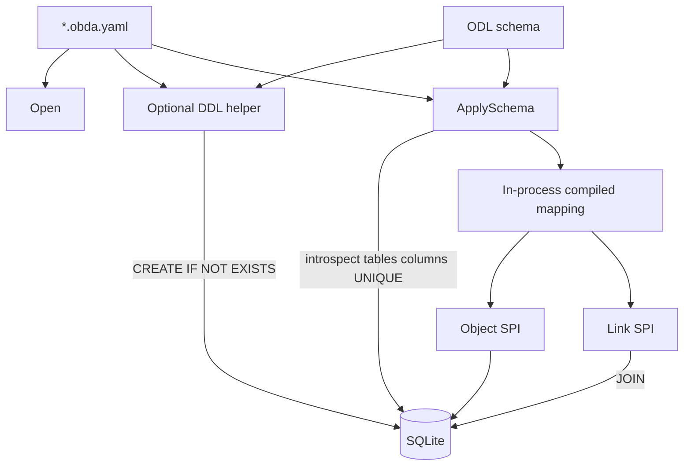

# feat: Direct-native OBDA identity without sidecar

## Summary

把 sqliteobda 从 sidecar 改成 **direct-native**：引擎 `_id` 等于业务表主键（`EncodeDirect`）。删除全部 `of_*` 表。`ApplySchema` 只做 live 存在性检查并在进程内激活。可选 DDL 辅助可建表，但不能跳过检查。`GetLinks` / `Traverse` 对业务表 JOIN。不改 Engine / memory / projection。

---

## Problem Frame

当前 provider 把引擎 id、OCC、软删和 link 端点放在 `of_*` 影子表里。Traverse 只能逐步查 `of_link_meta`，无法 JOIN 业务表。FAQ 与 origin 已选定：PK 存类型信封，影子表全部删除。上一份计划 `docs/plans/2026-08-21-001-feat-obda-sqlite-storage-provider-plan.md` 的 sidecar 单元作废；本文件是实施源。SQL 中立 Core、SQLite 第一方言、租户强制仍然有效。

---

## Requirements

Origin R-IDs 原样约束实现。

**Identity**

- R1. 只允许 `identity.strategy: direct` 且 `system.strategy: native`。任一为 `sidecar` 或其他非法值 → `ErrInvalidMapping`。
- R2. `_id` 等于 identity 列存储值，且为 `EncodeDirect` 类型信封。
- R3. 单 id 必须能解码出类型，禁止扫多表猜测。
- R4. `insert: generated` 时 provider 把 `EncodeDirect(type, UUIDv7)` 写入 PK。
- R5. Link 有独立 `_id`。端点列存对端对象 PK。

**No sidecar**

- R6. 成功路径不得创建或查询 `of_*`。
- R7. SPI 只访问 mapping 声明的业务表。

**Schema**

- R8. `ApplySchema` 对每个 mapped table live introspect；缺表不得激活。
- R9. 可选辅助：由 ODL + OBDA 生成并执行 CREATE TABLE / cardinality UNIQUE。
- R10. R9 不得关闭 R8。只生成未执行的 DDL → `ApplySchema` 必须失败。
- R11. 不得 `ALTER` 已有业务表。不得把 DDL 文本当存在证明。
- R12. 缺必需要列或 cardinality UNIQUE → 不得激活。

**Native / omit**

- R13. identity 与 tenant 所需列必须存在。
- R14–R17. `system.omit` 可省略 `version` / `createdAt` / `updatedAt` / `deletedAt`。省略则跳过对应能力，不得用影子表补。omit 优先于表上同名物理列（不读写该列）。

**Reads / graph**

- R18–R24. Decode 后按 PK 查业务表；JOIN 遍历；cardinality 靠物理 UNIQUE；硬删级联 link 行；空 `tenantId`（含 `ApplySchema`）拒绝；只读 mapping 拒绝 mutation。
- R25–R27. 本轮 temporal / Bulk 不支持；`GetSchema` 只读进程内快照；不改 Engine / memory / projection。

---

## Key Technical Decisions

- **KTD-1. DDL 辅助与 ApplySchema 分离。** 辅助是独立可调用函数（生成 SQL，调用方可 Exec）。`ApplySchema` 永不 Exec 建表，永不因「刚生成过 DDL」跳过 introspect。（origin R8–R10）
- **KTD-2. 缺表 vs 漂移。** 表不存在 → `ErrInvalidMapping`。表在但列/索引与 compiled mapping 不符 → `ErrSourceSchemaDrift`。
- **KTD-3. `system.omit`。** YAML 列表，元素为 `version` | `createdAt` | `updatedAt` | `deletedAt`。缺省空 = 四列都必须存在。
- **KTD-4. `_engineLinkId`。** 若 payload 含该字段，将其字符串作为 `EncodeDirect(linkType, [uuid])` 的 `k`；否则自铸 UUIDv7 再编码。返回 `_id` 永远是编码 PK。Engine 不改。
- **KTD-5. 硬删级联。** 枚举 compiled 中全部 link binding，对 `from_id` 或 `to_id` 等于对象 `_id` 的行 `DELETE`（含已软删）。无 FK 依赖。
- **KTD-6. Partial UNIQUE introspect。** `ApplySchema` 读 `sqlite_master` / `PRAGMA index_list` + `index_info`，核列集合与 `WHERE` 文本（未 omit `deletedAt` 时要求 `deleted_at IS NULL`）。MANY_TO_MANY 不要求 UNIQUE。
- **KTD-7. Helper 可用 `IF NOT EXISTS`。** 新库幂等。已有表 shape 不符仍由 KTD-2 失败，不 ALTER。
- **KTD-8. GetLinks JOIN。** `INNER JOIN` 目标对象表；对端缺失、跨租户、或未 omit 时对端已软删 → 该 link 不出现在页中。`GetLink(id)` 仍可返回软删 link 行。
- **KTD-9. Traverse 起点。** `DecodeDirect(startID).t` 必须等于路径第一跳对应端点 ObjectType，否则 `ErrObjectNotFound`。禁止 `lookupAnyObject` 扫全部 model。
- **KTD-10. 存量非编码 PK。** 激活不扫数据行。非法 id → not-found。
- **KTD-11. Capabilities。** `SupportsTemporalQueries` 与 `SupportsBulkMutations` 为 false，与 R25 对齐。
- **KTD-12. `GetSchema(version)`。** `version == nil` 或等于当前进程版本 → 内存快照；其他 → `ErrMappingNotActive`。
- **KTD-13. 测例单模式。** 删除 sidecar fixture 路径。测试库在激活后 `sqlite_master` 无 `of_` 前缀。
- **KTD-14. `insert: generated`。** 调用方不得通过 properties 覆盖 PK；多余 identity 字段忽略或拒绝（实现选拒绝 → `ErrInvalidMapping`）。

---

## High-Level Technical Design



ApplySchema 顺序（失败即停、不激活）：

```text
Compile → for each mapped table: exists?
       → required columns present?
       → cardinality UNIQUE present?
       → pin compiled in process
```

GetLinks outbound（方向性示意，非最终 SQL）：

```text
SELECT link cols
FROM admission AS l
INNER JOIN ward AS w ON w.id = l.to_id AND w.tenant_id = l.tenant_id
WHERE l.from_id = ? AND l.tenant_id = ?
  AND l.deleted_at IS NULL AND w.deleted_at IS NULL   -- unless omitted
```

---

## Scope Boundaries

**Deferred for later** (origin)

- 作者自建历史表 / 幂等表上的 temporal 与 Bulk
- Aggregate、Search/FTS、EnsureIndex
- Engine 改为铸造类型信封
- MySQL 方言

**Outside this product's identity** (origin)

- 遗留库：PK 不能改成类型信封
- sidecar / overlay / AGE
- ReBAC
- 改 memory、projection、`docs/open-foundry-spec-v2.md`
- ApplySchema ALTER 补列

**Deferred to Follow-Up Work**

- `sqlTxn.UpdateLink` / `DeleteLink` 未走 pinned Tx（上一计划缺口；本轮若触到 transaction.go 则顺手钉到 Tx，否则保持）
- 复合 PK 的 Helper DDL 形状（本轮 fixture 用单列 `id`）

---

## Implementation Units

### Phase A — Mapping and schema gate

### U1. Reject sidecar and add omit

- **Goal:** YAML 只接受 `direct` + `native`；`system.omit` 进入 compiled binding。
- **Requirements:** R1, R14–R17
- **Dependencies:** none
- **Files:**
  - modify `runtime/obda/mapping.go`
  - modify `runtime/obda/validate.go`
  - modify `runtime/obda/compiler.go`
  - modify `runtime/obda/validate_test.go`
  - modify `runtime/obda/compiler_test.go`
- **Approach:** `identity.strategy` 非 `direct`、`system.strategy` 非 `native` → `ErrInvalidMapping`。`omit` 未知名非法。Compiled model/link 带 `OmitVersion` 等布尔。尚不连库。
- **Patterns to follow:** `runtime/obda/validate.go` 现有 strategy 白名单。
- **Test scenarios:**
  - `sidecar` identity 或 system → `ErrInvalidMapping`
  - `omit: [deletedAt]` 编译成功；`omit: [foo]` 失败
  - 合法 `direct` + `native` + `insert: generated` 成功
- **Verification:** `go test ./obda/` 无数据库。

### U2. Mapped-table DDL helper

- **Goal:** 由 compiled mapping 生成对象表/link 表 CREATE 与 cardinality UNIQUE；零 `of_*`。
- **Requirements:** R9, R11, KTD-6, KTD-7
- **Dependencies:** U1
- **Files:**
  - modify `runtime/obda/dialect/sqlite/ddl.go`（替换 `SidecarStatements`）
  - create `runtime/obda/dialect/sqlite/ddl_test.go`
  - modify `runtime/obda/dialect/sqlite/dialect_test.go`（删 sidecar STRICT 测例）
- **Approach:** 输入 compiled + omit 标志。对象表列：identity PK、tenant（若 column）、payload 列、未 omit 的系统列。Link 表另加 from/to。UNIQUE 按 cardinality；未 omit `deletedAt` 时用 `WHERE deleted_at IS NULL`。`CREATE TABLE/INDEX IF NOT EXISTS`。标识符走现有 quote 白名单。
- **Patterns to follow:** 现 `quote.go`；不要复制 `SidecarStatements` 的 `of_*` 清单。
- **Test scenarios:**
  - 生成 SQL 不含 `of_`
  - MANY_TO_ONE 含 `(tenant_id, from_id)` partial unique
  - omit `deletedAt` 的 UNIQUE 无 `deleted_at` 谓词
  - 非法表名在生成期失败
- **Verification:** 字符串断言即可；真正 Exec 放到 U3。

### U3. ApplySchema existence gate

- **Goal:** 激活前 live 检查表/列/UNIQUE；进程内 pin；不再写 sidecar。
- **Requirements:** R6, R8, R10–R13, R26, KTD-1, KTD-2, KTD-12
- **Dependencies:** U2
- **Files:**
  - modify `runtime/obda/dialect/sqlite/introspect.go`（索引检查）
  - create `runtime/obda/dialect/sqlite/introspect_index_test.go`
  - modify `runtime/storage/sqliteobda/provider.go`
  - delete or gut `runtime/storage/sqliteobda/sidecar.go`
  - modify `runtime/storage/sqliteobda/apply_schema_test.go`
- **Approach:** `ApplySchema`：Compile → introspect 每张 mapped 表 → 缺表 `ErrInvalidMapping` → 缺列/UNIQUE `ErrSourceSchemaDrift` → 只更新内存 `activation`。删除对 `SidecarStatements`、backfill、`of_*` INSERT 的调用。导出 helper（例如 `InitMappedSchema(db, compiled)`）供测试可选调用；**ApplySchema 内部不调用它**。
- **Execution note:** 先写失败的「空库 ApplySchema」与「只生成不 Exec」测试。
- **Patterns to follow:** 现 `apply_schema_test.go` 先 CREATE 再 Apply 的骨架；断言列数不再被 sidecar 改变。
- **Test scenarios:**
  - Covers AE2. 空库 ApplySchema 失败，随后 Get → `ErrMappingNotActive`
  - Covers AE1 前置：helper Exec 后再 ApplySchema 成功
  - Covers AE3. 有表无 MANY_TO_ONE UNIQUE → 不得激活
  - 激活后 `sqlite_master` 无 `of_` 前缀
  - `GetSchema(nil)` 返回传入 object types；`GetSchema(&999)` → `ErrMappingNotActive`
  - 空 tenant ApplySchema → `ErrTenantRequired`
- **Verification:** 真实 `t.TempDir()` 文件库。

### Phase B — SPI on business tables

### U4. Object CRUD on native columns

- **Goal:** Create/Get/Update/Delete/Query 只打业务表；`_id` 为 PK 列值。
- **Requirements:** R2, R4, R7, R15–R19, R22–R24, KTD-10, KTD-14
- **Dependencies:** U3
- **Files:**
  - modify `runtime/storage/sqliteobda/objects.go`
  - modify `runtime/storage/sqliteobda/query.go`
  - modify `runtime/storage/sqliteobda/objects_test.go`
  - modify `runtime/storage/sqliteobda/query_test.go`
  - modify `runtime/storage/sqliteobda/testdata/*.obda.yaml`
- **Approach:** Create：生成或拒绝外部 PK，INSERT 业务行含 tenant 与未 omit 系统列。Get：`DecodeDirect` 校验类型，`WHERE id = ? AND tenant_id = ?`。Update CAS 在 `version` 列。Soft delete 写 `deleted_at`；omit 则 soft → `ErrUnsupportedCapability`。Hard delete 完整路径在 U6（KTD-5：先删 link 行再删对象行）；本单元不实现硬删。Query 不再 JOIN `of_object_meta`。Fixture 改为 `direct` + `native` + `insert: generated`，测试先 helper 或手工 CREATE 含系统列的表。
- **Patterns to follow:** `identity.go` Encode/Decode；`NormalizeValue` 布尔。
- **Test scenarios:**
  - Covers AE1. Create 后 `_id ==` 业务 PK 且 `DecodeDirect` 类型正确
  - 软删 Get 带 `_deletedAt`；Query 默认不含；omit `deletedAt` 时 soft 不支持
  - omit `version` 且传入 `expectedVersion` → 不支持
  - 非法 / 错类型 id → `ErrObjectNotFound`
  - `access: read` Query 成功、Create → `ErrReadOnlyMapping`
- **Verification:** 无 `of_object_meta` 读写。

### U5. Link CRUD and GetLinks JOIN

- **Goal:** link 行在业务 link 表；GetLinks INNER JOIN 对端对象表。
- **Requirements:** R3, R5, R20, R21, KTD-4, KTD-8
- **Dependencies:** U4
- **Files:**
  - modify `runtime/obda/planner.go`
  - modify `runtime/obda/planner_test.go`
  - modify `runtime/storage/sqliteobda/links.go`
  - modify `runtime/storage/sqliteobda/links_test.go`
- **Approach:** planner 增加 GetLinks JOIN 计划（link 表 + 对端表 + tenant + 可选软删）。CreateLink：校验 live 端点（未 omit 时未软删）、写入 `id`/`from_id`/`to_id`。UNIQUE 冲突 → `ErrCardinalityViolation`。GetLinks 不再 `PlanGetLinks("of_link_meta", ...)`。
- **Patterns to follow:** `sqlast.Join`；现 cardinality 测例改为直接 COUNT 业务表。
- **Test scenarios:**
  - MANY_TO_ONE 第二条 outbound 失败，表中仍一行
  - GetLinks outbound 返回对端 id 为 Ward PK
  - 对端软删时该 outbound 不出现在默认页
  - 软删端点 CreateLink → `ErrObjectNotFound`（Covers AE4）
  - `_engineLinkId` 出现在返回 `_id` 的 Decode `k` 中
- **Verification:** SQL 不出现 `of_link_meta`。

### U6. Traverse JOIN, hard-delete cascade, remove sidecar

- **Goal:** Traverse 链式 JOIN 只交终点 Nodes；硬删级联所有 mapped link 表；删除 sidecar 代码路径。
- **Requirements:** R3, R20, R22, KTD-5, KTD-9
- **Dependencies:** U5
- **Files:**
  - modify `runtime/obda/planner.go`
  - modify `runtime/storage/sqliteobda/links.go`
  - modify `runtime/storage/sqliteobda/objects.go`
  - delete `runtime/storage/sqliteobda/sidecar.go` if still present
  - modify `runtime/storage/sqliteobda/links_test.go`
  - modify `runtime/storage/sqliteobda/objects_test.go`
- **Approach:** 固定 `path.Steps` 生成多 JOIN，每跳 tenant（及未 omit 软删）谓词。只投影并装配终点对象；`Edges`/`Visited` 空。起点类型校验 KTD-9。深度 >8 → `ErrUnsupportedCapability`。Hard delete：KTD-5 先删全部相关 link 行，再删对象行（替换 U4 未实现的硬删）。完整图装配与 Query IR sqlite 拼树不在本单元。
- **Test scenarios:**
  - 两步路径返回终端 nodes；`Edges`/`Visited` 为空；超深度拒绝
  - 起点类型与第一跳不符 → `ErrObjectNotFound`
  - Hard delete 后两端 GetLinks 为空；admission 行消失
  - 编译包内无对 `of_` 表名的 Exec（测例扫 sqlite_master）
- **Verification:** `go test ./storage/sqliteobda/`；`sidecar.go` 不存在或不再引用。

### Phase C — Close

### U7. Capabilities, Engine smoke, origin AEs

- **Goal:** Capabilities 与 R25 对齐；Engine 注入冒烟；AE1–AE5。
- **Requirements:** R25, R27, AE1–AE5, KTD-11, KTD-13
- **Dependencies:** U6
- **Files:**
  - modify `runtime/storage/sqliteobda/provider.go`
  - create `runtime/storage/sqliteobda/engine_smoke_test.go`
  - modify `runtime/storage/sqliteobda/apply_schema_test.go`
- **Approach:** temporal/bulk capability false。Engine.CreateObject/CreateLink 后断言 `_id` 可 DecodeDirect（Covers AE5）。不改 Engine 测试。HealthCheck 用进程内 fingerprint，Details 无路径/DSN。
- **Test scenarios:**
  - Covers AE1 / AE2 / AE5；AE3 在 U3，AE4 在 U5
  - `GetObjectAtVersion` / `BulkMutate` 不返回成功结果
  - memory 测试套件不因本计划失败
- **Verification:** `go test ./obda/... ./storage/sqliteobda/`；`go test ./engine/` 与 `./storage/memory/` 仍绿。

---

## System-Wide Impact

- **SPI：** 不改方法签名。sentinel 用法：缺表 `ErrInvalidMapping`，shape 漂移 `ErrSourceSchemaDrift`。
- **Engine：** 不改。sqlite `_id` 与 memory 裸 UUID 分叉。CreateLink 仍注入 `_engineLinkId`，sqlite 按 KTD-4 编码。
- **Projection：** Primary 仍丢掉；本轮靠 `insert: generated`。
- **重启：** 无激活表；必须再次 ApplySchema。
- **CI：** 本轮不加 Go 到 GitHub CI。

---

## Risks & Dependencies

| Risk | Mitigation |
|---|---|
| 现有 sqlite 测例全是 sidecar 表形状 | U3 起整套改写；KTD-13 禁止双模式 |
| Partial UNIQUE introspect 脆弱 | 测例用 helper 生成的索引文本做 round-trip 对照 |
| SQLite 单写者 + 打开 Tx | 保持 WAL + `busy_timeout=5000` |
| Engine 软删 Get 仍透传 | 与 origin 一致；CreateLink 由 SPI 拒绝软删端点 |

**Dependencies:** Go 1.25；`modernc.org/sqlite`；已有 `EncodeDirect`。不需要 Docker。

---

## Alternative Approaches Considered

- **ApplySchema 内建表。** 与「必须事先存在」和「即使自动 DDL 也要检查」冲突。否决。
- **保留 of_mapping_activation。** Origin 要求删全部 `of_*`。否决。
- **GetLinks LEFT JOIN 返回断链。** 选 INNER JOIN，避免对端已删仍出现在图页。
- **改写 001 计划。** sidecar 单元与进度表会误导执行。本文件为新计划。

---

## Documentation / Operational Notes

- 实现完成后以 `docs/design/open-foundry-obda-mapping-spec-v3.md` 为准；v2 为 sidecar 历史。
- 不修订 overlay v1 spec、不修订 `docs/open-foundry-spec-v2.md`。
- 操作顺序：可选 helper → **必须** ApplySchema introspect → CRUD。
- 本地测试不需要额外服务。

---

## Sources & Research

- Origin: `docs/brainstorms/2026-08-21-obda-direct-native-identity-requirements.md`
- Spec: `docs/design/open-foundry-obda-mapping-spec-v3.md`
- Rationale: `docs/design/faq1-Identity.md`
- Sidecar-era plan (historical): `docs/plans/2026-08-21-001-feat-obda-sqlite-storage-provider-plan.md`
- Identity: `runtime/obda/identity.go`
- Sidecar DDL to replace: `runtime/obda/dialect/sqlite/ddl.go`
- ApplySchema today: `runtime/storage/sqliteobda/provider.go`
- GetLinks today: `runtime/storage/sqliteobda/links.go`
- Engine `_engineLinkId`: `runtime/engine/engine.go`
- Projection drops Primary: `runtime/projection/storage.go`
- `docs/solutions/` 不存在
