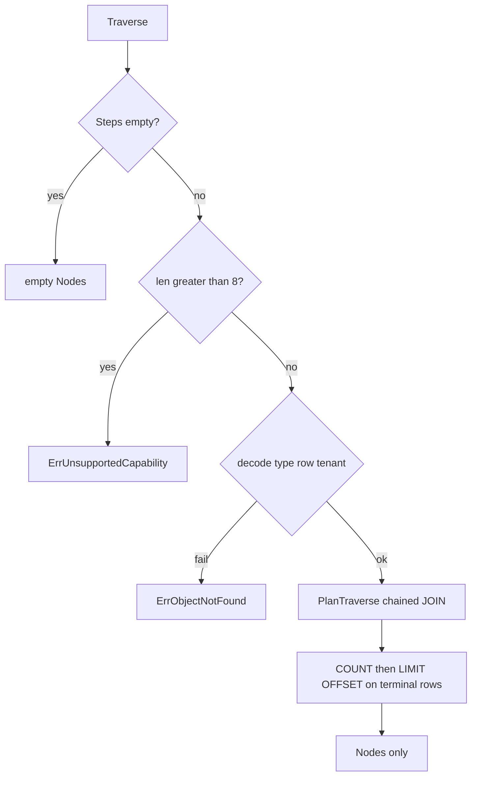

# feat: sqliteobda Traverse chained JOIN (terminal Nodes)

## Summary

sqliteobda `Traverse` 对固定 `path.Steps` 发一条链式 JOIN，只装配终点 `Nodes`。`Limit` / `Offset` / `IncludeDeleted` 作用于终点行。同时改写 v3 spec、mapping spec §8、以及 identity 计划 U6，去掉完整图遍历的虚假「当前实现」。

---

## Problem Frame

direct-native 已要求业务表 JOIN，禁止影子表 BFS。`GetLinks` 已单跳 JOIN 对端对象表。`Traverse` 仍按 hop 循环 `GetLinks` 再 `loadObject`，planner 没有多跳计划。spec §8.4/8.5 与 identity 计划 U6 却写成链式 JOIN 已交付，U6 测例还要求返回 edges。文档与实现分裂，多跳测例也锁不住「一条 SQL」。(see origin)

---

## Requirements

Origin R-IDs 原样约束实现。

- R1–R3. 合法非空路径一条参数化链式 JOIN；每跳租户与（未 omit 且未 IncludeDeleted 的）软删谓词在同一 SQL；不得逐步 `GetLinks`。`GetLinks` 页语义不变。
- R4–R6. `Nodes` 为最后一跳对象；`TotalCount` 为分页前终点行数；`Edges`/`Visited` 为空；空 Steps 空结果且不查起点。
- R7–R8. `Limit <= 0` → 100，上限 1000；`Offset` 切终点行。默认排除软删 link 与对端；`IncludeDeleted` 放开沿途未 omit 的软删谓词。
- R9–R10. 深度 > 8 → `ErrUnsupportedCapability`。起点无法解码、**起点类型与第一跳端点不符**、缺行、或跨租户 → `ErrObjectNotFound`。中间 hop 类型链断裂 → 空 `Nodes`，不报错。
- R11–R13. 改写 `docs/design/obda-spec-v3.md` §8.4/8.5、`docs/design/open-foundry-obda-mapping-spec-v3.md` §8、`docs/plans/2026-08-21-002-feat-obda-direct-native-identity-plan.md` U6：链式 JOIN 只交终点。

Actors A1–A4、Flows F1–F3、AE1–AE5 见 origin。

---

## Key Technical Decisions

- **KTD-1. 新增多跳计划，不复用 `PlanGetLinksJoin`。** 现计划别名写死 `l`/`p`，投影的是 link 列。Traverse 需要每跳独立别名，只 SELECT 终点对象的 `SelectColumns`。(see origin R1, R4)
- **KTD-2. FROM 起点对象表，再按 hop JOIN link 与目标对象。** 与 origin 要对齐的 spec §8.5 形状一致；起点存在性仍先 `loadObject`（R10）。一跳两条 JOIN，两跳四条。起点表不加 `deleted_at` 谓词（KTD-7）。`IncludeDeleted` 只作用于各 hop 的 link 表与 hop 目标表（`s1…sN`），不含 `s0`。
- **KTD-3. `IncludeDeleted` 关掉每一跳的软删谓词。** 含中间对象与沿途 link（仍尊重 omit）。默认 INNER JOIN + `deleted_at IS NULL` 会让中间软删断路。不要抄 `GetLinks`：它对 `IncludeDeleted` 仍藏软删 peer。(see origin R2, R8)
- **KTD-4. 分页排序用 Binding 的 identity 列，禁止硬编码 `id`。** 终点 identity ASC，最后一跳 link identity ASC。同一终点多条路径时只按对象 id 切 `Offset` 不稳定。`TotalCount` 按 JOIN 行，不去重。
- **KTD-5. 成功路径 `Edges`/`Visited` 为非 nil 空切片。** SPI 注释不改；memory 继续填全。(see origin Key Decisions)
- **KTD-6. 未知 `LinkType` → `ErrLinkNotFound`。** 相邻 hop 端点类型对不上 → 空 `Nodes`，不报错。`Filter` / 逐步 `MaxDepth` 忽略。
- **KTD-7. 软删起点仍算找到。** 与 sqlite `GetObject`/`loadObject` 可返回软删行一致。是否走出路径只看 hop 谓词。
- **KTD-8. 锁「一条 SQL」不绑文本。** planner 测 JOIN 条数；provider 测 Traverse 不再调用 `GetLinks`。禁止 SQL 字符串快照。
- **KTD-9. 002 计划只改 U6 正文。** 不重开硬删级联、不删 sidecar（已做完）。本文件是实施源。

---

## High-Level Technical Design



方向性 JOIN 形状（一跳 outbound，非最终 SQL）：

```text
FROM patient AS s0
INNER JOIN admission AS l0 ON l0.from_id = s0.id AND l0.tenant_id = s0.tenant_id
INNER JOIN ward AS s1 ON s1.id = l0.to_id AND s1.tenant_id = l0.tenant_id
WHERE s0.id = ? AND s0.tenant_id = ?
  AND l0.deleted_at IS NULL AND s1.deleted_at IS NULL   -- unless omit / IncludeDeleted
ORDER BY s1.id, l0.id
```

两跳在 `s1` 后再 JOIN 下一跳 link 与终点对象，SELECT 只取最后 `sN` 的对象列。

---

## Scope Boundaries

**Deferred for later** (origin)

- 同一条 JOIN 装配 `Edges` / `Visited`
- sqlite 上 Query IR 2 跳 / REST follow 拼树
- 逐步 Filter / 逐步 `MaxDepth`
- recursive CTE / 可变深度
- 改 identity origin R20 正文

**Outside this round** (origin)

- 改 Engine、memory、projection、SPI 注释
- 改 `GetLinks` 的 peer 软删语义
- 多态 FK、影子表 BFS

**Deferred to Follow-Up Work**

- hospital fixture 以外的入站/混跳金路径（本轮测例覆盖 inbound 一跳即可）
- Traverse 专用 test double 若现有 provider 无法断言「未调 GetLinks」，实现期再加最窄钩子

---

## Implementation Units

### U1. Multi-hop Traverse plan

- **Goal:** Core 产出固定路径的 `sqlast.Select`：链式 JOIN、只投影终点列、租户/软删/IncludeDeleted 谓词、稳定 ORDER。
- **Requirements:** R1, R2, R4, R7, R8
- **Dependencies:** none
- **Files:**
  - modify `runtime/obda/planner.go`
  - modify `runtime/obda/planner_test.go`
- **Approach:** 新增多跳计划入口（名称实现自定）。输入 compiled link/model 序列、方向、tenant、start id、IncludeDeleted。FROM 起点表；每跳 JOIN link 表再 JOIN 目标表；别名按 hop 递增。SELECT 终点 `Binding().SelectColumns`。`LimitOffset` 占位，值由 provider append。未知 link 不在本单元处理。
- **Patterns to follow:** `PlanGetLinksJoin` 的 `col_eq` + tenant + `is_null`；`TestPlanGetLinksJoinUsesParams`（断言 JOIN 表名与 args 长度，禁止 Core 泄漏 quoting）。
- **Test scenarios:**
  - 一跳 outbound：`len(Joins)==2`，投影列来自目标对象表 qualifier，args 含 tenant 与 start id
  - 两跳：`len(Joins)==4`，SELECT qualifier 为第二跳对象
  - 默认带 link 与目标 `deleted_at IS NULL`；`IncludeDeleted` 后这些谓词消失；omit 的 hop 从不带
  - inbound 一跳：endpoint 列对调
- **Verification:** `go test` 仅 `./obda/`，无数据库。

### U2. sqliteobda Traverse executes the plan

- **Goal:** `Traverse` 执行 U1 计划，装配终点对象；空 Edges/Visited；分页与错误语义对齐 origin。
- **Requirements:** R1, R3–R10; F1–F3; AE1–AE4
- **Dependencies:** U1
- **Files:**
  - modify `runtime/storage/sqliteobda/links.go`
  - modify `runtime/storage/sqliteobda/links_test.go`
  - modify `runtime/storage/sqliteobda/testdata/hospital.obda.yaml`
  - modify `runtime/storage/sqliteobda/apply_schema_test.go`（`hospitalSchema` 扩两跳所需类型）
- **Execution note:** 先改失败的 `TestGetLinksAndTraverse`（Edges 改为 0）并加两跳失败测例，再换实现。
- **Approach:** 保留空 Steps、深度 >8、`startTypeForPath`、`loadObject` 起点。`loadObject` 只验证起点存在与 R10；JOIN 零行返回空 `Nodes` 且 `TotalCount=0`，不是 `ErrObjectNotFound`。校验相邻 hop 类型；未知 link → `ErrLinkNotFound`；类型链断裂 → 空结果。Render 计划；COUNT 子查询得 `TotalCount`；再 `LIMIT/OFFSET`（`Limit<=0` → 100，上限 1000；`Offset<0` 当 0）。Scan 终点列，走现有对象 `assemble`。不要调 `GetLinks`。`GetLinks` 与 `TestGetLinksHidesDeletedPeer` 不动。
- **Patterns to follow:** `query.go` 的 100/1000 与 COUNT 包装；`loadObject`/`assemble`；现有深度与错起点测例。
- **Test scenarios:**
  - Covers AE1. 一跳 outbound：`Nodes` 为 Ward；`Edges`/`Visited` 非 nil 且长度为 0
  - Covers AE2. 两跳：`Nodes` 为终端类型；planner/provider 路径不是逐步 `GetLinks`
  - Covers AE3. 9 步 → `ErrUnsupportedCapability`；错类型 / 跨租户 / 坏 id → `ErrObjectNotFound`
  - Covers AE4. 默认隐藏软删终点；`IncludeDeleted` 后可出现。中间对象软删：默认断路，`IncludeDeleted` 可穿过
  - 同一终点两条 link：`Nodes` 两条相同 id，`TotalCount==2`
  - `Limit 0` → 最多 100；`Limit 1001` → 1000；`Offset` 切片；`Offset>TotalCount` 空 `Nodes` 但 count 保留
  - inbound 一跳；空 Steps 不报错；未知 LinkType → `ErrLinkNotFound`
  - `GetLinks(..., IncludeDeleted: true)` 对软删 peer 仍为 0 条（回归）
- **Verification:** `go test ./storage/sqliteobda/`；`./engine/`、`./storage/memory/`、`./query/` 仍绿且拼树语义不变。

### U3. Rewrite spec and identity U6

- **Goal:** 三份文档与 sqliteobda 行为一致：链式 JOIN 只交终点，不再声称完整图已实现。
- **Requirements:** R11–R13; AE5
- **Dependencies:** U2（正文按已实现语义写；可与 U2 同 PR，但以行为为准）
- **Files:**
  - modify `docs/design/obda-spec-v3.md`
  - modify `docs/design/open-foundry-obda-mapping-spec-v3.md`
  - modify `docs/plans/2026-08-21-002-feat-obda-direct-native-identity-plan.md`
- **Approach:** §8.4 去掉「当前实现」完整图语气；§8.5 示例投影终点列，补默认对端软删谓词。mapping spec §8 写明 Traverse 只交 `Nodes`。002 U6 改为链式 JOIN + 终点 Nodes，删除「返回 nodes 与 edges」的本轮要求。不改 identity origin 需求正文。
- **Patterns to follow:** origin R11–R13 的改写范围；v3「Removed vs v2」表若仍写 JOIN 业务表则保留方向、修正结果形状。
- **Test scenarios:**
  - Covers AE5. 三份文档可检索到「只交终点 / Nodes」，检索不到把 Edges/Visited 当成本轮 sqlite 交付
- **Verification:** 人工 diff 三份文档范围不超出 Traverse 条款与 U6。

---

## System-Wide Impact

- **SPI：** 方法签名与 `TraversalResult` 注释不变。sqlite 交空 Edges/Visited；memory 仍填全。调用方不能假设跨 provider 图完备。
- **Engine / Query IR：** 不改。Execute 仍可能 `Traverse(..., Limit: 1000)`。sqlite 上 Expand Traverse 因 `Edges` 为空无法建 adjacency（不限于缺中间对象），本轮不验收。
- **GetLinks：** 不变。`IncludeDeleted` 继续藏软删 peer。
- **Capabilities：** sqlite 深度上限保持 8，不向 memory 的 10 看齐。

---

## Risks & Dependencies

| Risk | Mitigation |
|---|---|
| `PlanGetLinksJoin` 被误改导致 GetLinks 回归 | U1 只加新入口；U2 保留 `TestGetLinksHidesDeletedPeer` 并加 IncludeDeleted 回归 |
| 两跳 fixture 拖垮 ApplySchema / DDL helper | 第三对象与第二 link 走现有 `InitMappedSchema` 路径，测例局部扩 hospital |
| nil options 从近似全量变成默认 100 | origin R7；Query IR 传 1000，直接 SPI 调用需知情 |
| 文档改写漏掉「当前实现」字样 | U3 以 AE5 检索清单验收 |

**Dependencies:** Go 1.25；`modernc.org/sqlite`；已有 `PlanGetLinksJoin` 与 `sqlast.Join`。不需要 Docker。

---

## Alternative Approaches Considered

- **继续逐步 `GetLinks`，只改 spec 承认 BFS。** Origin 明确要一条链式 JOIN。否决。
- **复用 `PlanGetLinksJoin` 循环拼接。** 别名与投影列都不对。否决。
- **FROM 第一跳 link 表、不 JOIN 起点表。** 更短，但与要对齐的 §8.5 不符，起点软删谓词也无处放。否决。

---

## Documentation / Operational Notes

- 实现完成后以改写后的 v3 spec 与 mapping spec §8 为准。
- identity 计划 `2026-08-21-002` 变为历史+U6 勘误；本文件为 Traverse 收口的实施源。
- 不修订 overlay、不修订 `docs/open-foundry-spec-v2.md`。

---

## Sources & Research

- Origin: `docs/brainstorms/2026-08-26-obda-traverse-chained-join-requirements.md`
- Identity requirements (R20 JOIN 禁令仍有效): `docs/brainstorms/2026-08-21-obda-direct-native-identity-requirements.md`
- Spec: `docs/design/obda-spec-v3.md` §8.4–8.6
- Mapping: `docs/design/open-foundry-obda-mapping-spec-v3.md` §8
- Prior plan U6: `docs/plans/2026-08-21-002-feat-obda-direct-native-identity-plan.md`
- GetLinks JOIN: `runtime/obda/planner.go` `PlanGetLinksJoin`
- Current Traverse BFS: `runtime/storage/sqliteobda/links.go`
- SPI shape: `runtime/spi/ontology.go`
- Query IR assemble: `runtime/query/expand.go`
- `docs/solutions/` 不存在
