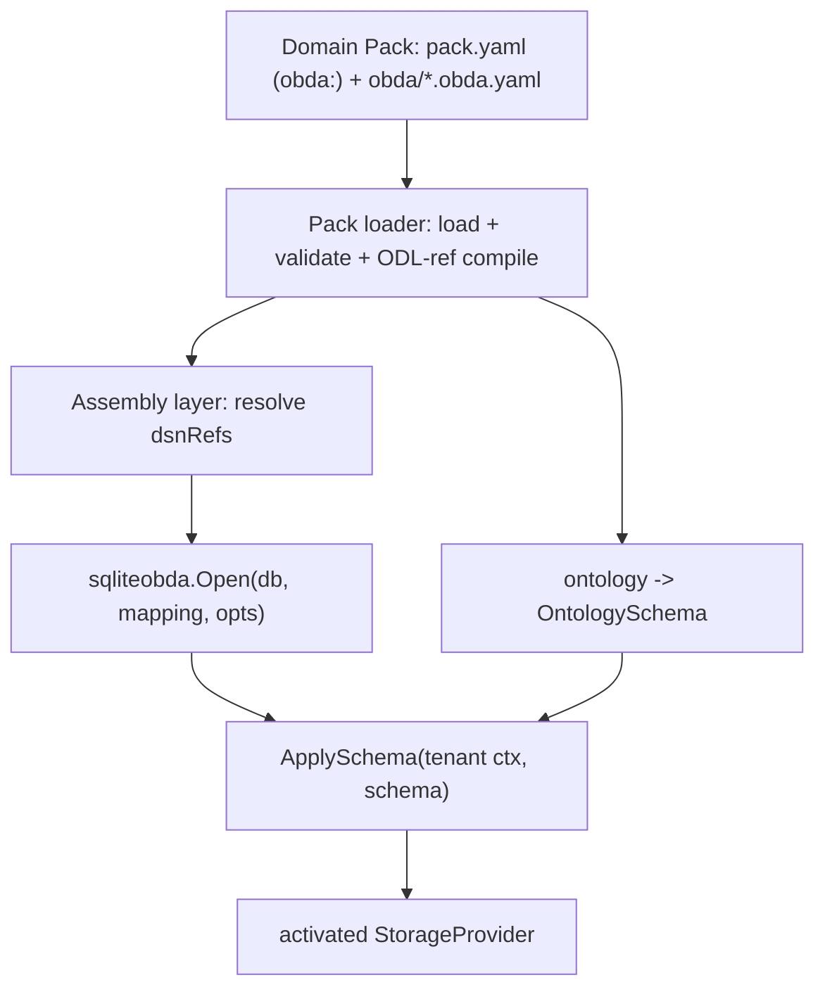
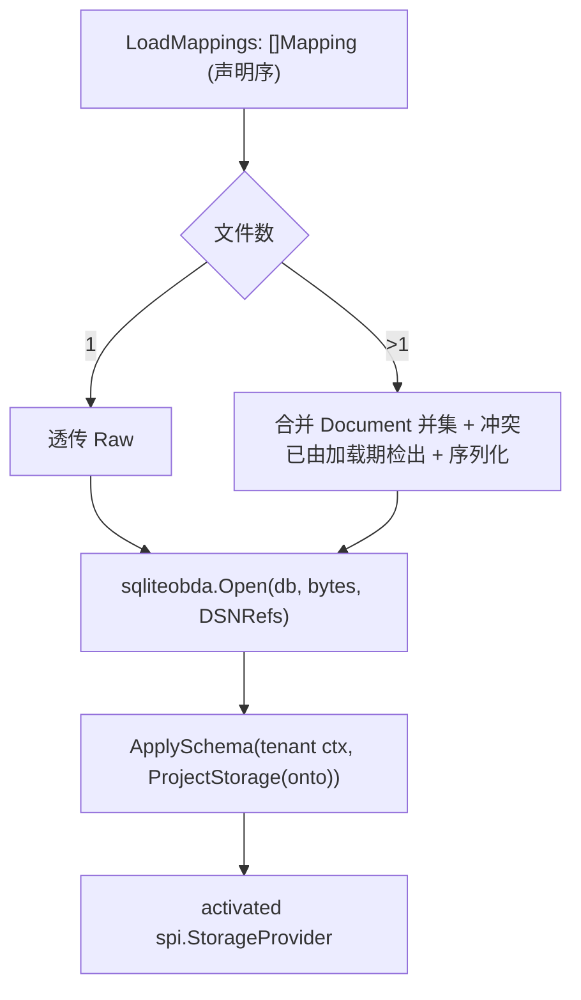

# OBDA Pack Loader Mappings - Plan

## Goal Capsule

- **Objective:** OBDA mapping 成为 Domain Pack 的一等工件：pack.yaml 以 `obda:` 清单声明（与 `schema:` / `actions:` 同构），Pack loader 按清单加载并校验，启动组装层以 pack 为注入源构造 SQLite OBDA provider 并激活 schema；`docs/design/obda-spec-v3.md` 契约描述对齐。
- **Product authority:** 用户在 2026-09-03 会话中裁定：清单驱动（否决目录发现）、组装层注入（否决 provider 消费 pack / 改 SPI 契约）、需求含启动接线；scoping synthesis 确认了 Q1/Q3 的裁定与组装层返回边界。
- **Open blockers:** 无。原 Outstanding Questions Q1–Q3 已在 Planning Contract 裁定（KTD-1 / KTD-3 / KTD-4）。
- **Execution profile:** Go runtime，4 个实现单元，U1 → U2 → U3 → U4 依赖序。
- **Stop conditions:** R1–R9 全部满足且 Verification Contract 全绿即止；不外溢到 MySQL 方言接线或依赖 pack 合并。
- **Tail ownership:** ce-work 常规 ship tail（simplify → code review → commit/PR）。

---

## Product Contract

Product Contract 自 brainstorm 起未变；原 Outstanding Questions Q1–Q3 的裁定见 Planning Contract（KTD-1 / KTD-3 / KTD-4）。

### Summary

Domain Pack 通过 pack.yaml 的 `obda:` 清单声明物理映射文件；Pack loader 按清单加载并做凭证 / ODL 引用校验；运行时组装层消费加载结果与 DSN 解析，一步构造并激活 SQLite OBDA provider。部署视角：放入带 `obda:` 声明的 pack，存储自动接好。

### Problem Frame

spec v3 原本把「Pack loader 加载 `*.obda.yaml`」列为 non-goal：mapping 只能由调用方手工以字节注入 `sqliteobda.Open(db, bytes, opts)`，仓库中至今没有生产消费方。domain pack 因此只携带语义（ODL）而不携带物理映射——部署每个 pack 都要手写存储接线，物理映射无法随 pack 分发与版本化。§4.1 曾以注的形式声明「不走 Pack loader」，与 pack 作为分发单元的定位冲突。

### Key Decisions

- **清单驱动发现。** pack.yaml 以 `obda:` 键声明 mapping 文件列表，语义与 `schema:` / `actions:` 同构（按声明路径加载，不做目录 glob）。目录发现方案曾实现后被否决删除：manifest 显式可见，与现有 loader 模式一致。
- **组装层注入，SPI 不变。** 「pack 注入」发生在启动组装层，而非 SPI 层：组装层读 pack、解析 DSN 引用、调 `Open` 与 `ApplySchema`；provider 保持 pack 无感知（可直接以 bytes 构造，方言中立）。provider 直接消费 pack（耦合 storage 与 pack 格式、各方言重复接线）与 `ApplySchema` 第二参数带 mapping（违反 spec v3 已锁定的 pinning 模型）均被否决。
- **加载期 fail-fast。** 明文凭证键、引用不存在的 model/link、清单文件缺失都在加载时报错，不推迟到 provider 构造或运行时。

### Requirements

**Pack manifest 声明**

- R1. pack.yaml 以 `obda:` 键声明该 pack 的 OBDA mapping 文件列表，加载按声明路径逐个进行，不做 glob。
- R2. 未声明 `obda:` 的 pack 加载零个 mapping 且不报错。

**加载与校验**

- R3. 每个声明的 mapping 文件在加载期完成 parse（拒绝明文凭证键 `dsn` `password` `uri` `url` `token` `secret` `user`）、validate、以及对照该 pack ontology 的 ODL 引用编译检查（model / link 名不存在即失败）。
- R4. 加载结果以可直接用于 provider 构造的形式向上暴露，调用方无需重新序列化。
- R5. 清单声明了缺失或无法解析的文件时加载失败，并指明是哪个文件。
- R6. 一个 pack MAY 声明多个 mapping 文件，加载与暴露顺序为清单声明顺序。

**启动接线（组装层）**

- R7. 运行时提供组装层：输入 pack（含加载的 mapping）与 DSN 引用解析，构造 SQLite OBDA provider 并完成 schema 激活，部署方不再手写 provider 构造代码。
- R8. 组装层注入不改变 SPI 语义：mapping 仍在 provider 构造（`Open`）时注入，`ApplySchema` 参数语义不变。

**文档契约**

- R9. `docs/design/obda-spec-v3.md` 的加载契约描述与上述语义一致（§4.1 注、§2 non-goals、§18 / §19 相关行），且不引用不存在的加载入口。

### Key Flows

- F1. 启动接线
  - **Trigger:** 部署方启动运行时并指定 domain pack。
  - **Actors:** 部署方、Pack loader、组装层、sqliteobda provider。
  - **Steps:** 读 pack.yaml -> 加载 ontology（LoadDir）-> 按 `obda:` 清单加载并校验 mappings -> 组装层解析 DSN 引用 -> `Open` 构造 provider -> `ApplySchema` 激活。
  - **Outcome:** provider 就绪可服务；部署方零接线代码。
  - **Covers R1, R3, R4, R7, R8.**

### Acceptance Examples

- AE1. pack 无 `obda/` 目录且未声明 `obda:` -> 加载零个 mapping，成功。**Covers R2.**
- AE2. 清单声明 `obda/supply-chain.obda.yaml` 但文件缺失 -> 加载失败，错误指明该文件。**Covers R5.**
- AE3. mapping 文件含明文 `dsn:` 键 -> 加载失败。**Covers R3.**
- AE4. mapping 引用 pack ontology 中不存在的 model（如 `Ghost`）-> 加载失败。**Covers R3.**
- AE5. 清单按序声明两个 mapping 文件 -> 按声明顺序返回两个，可直接用于 `Open`。**Covers R4, R6.**
- AE6. 声明了 `obda:` 的 supply-chain pack 经组装层一步接线 -> provider 激活，`GetSchema` 与首个读写请求成功。**Covers R7, R8.**

### Scope Boundaries

- 依赖 pack（如 core）的 ontology 合并加载——留后续；本需求的 ODL 引用检查对照单 pack ontology。
- MySQL 方言（mysqlobda）的启动接线——留后续；组装层设计不得为其留下硬编码障碍。
- `Open` / `ApplySchema` 的 SPI 契约变更——不在范围内（spec v3 已锁定）。

### Dependencies / Assumptions

- 当前树状态：OBDA loader 代码不存在（目录发现版曾实现，已被删除）；`docs/design/obda-spec-v3.md` §4.1 注当前引用已删除的 `pack.LoadMappings`，需随本需求落地一并修正。
- `domain-packs/supply-chain/obda/supply-chain.obda.yaml` fixture 已在树（未跟踪），映射 6 models + 7 links；其 pack.yaml 尚未声明 `obda:`。
- `sqliteobda.Open(db, mapping, opts)` 与 `ApplySchema` 契约现成（runtime/storage/sqliteobda/provider.go）；`projection.ProjectStorage` 可将 pack IR 投影为 `spi.OntologySchema` 供编译检查（runtime/projection/storage.go）。

### Sources / Research

- `runtime/pack/loader.go` — `LoadDir` 的 manifest 清单加载模式（本需求的同构参照）。
- `runtime/pack/actions.go` — `LoadActions` 的清单加载 + bind 校验模式。
- `runtime/storage/sqliteobda/provider.go` — `Open` / `ApplySchema` / `Options.DSNRefs` 契约。
- `runtime/obda/parse.go`、`validate.go`、`compiler.go` — 凭证拒绝、语义校验、ODL 引用编译检查。
- `runtime/projection/storage.go` — IR 到 `spi.OntologySchema` 投影。
- `runtime/engine/engine.go` — `engine.New(storage, ontology)` 注入面（组装层不构造 Engine 的边界依据）。
- `runtime/storage/sqliteobda/apply_schema_test.go` — 真实临时库 + 存在性检查的测试模式。
- `docs/design/obda-spec-v3.md` — §4.1 加载契约、§2 non-goals、§18 / §19。

---

## Planning Contract

### Key Technical Decisions

- KTD-1 **manifest `obda:` 清单语义（裁定 Q1）。** 未声明键 -> 零 mapping、不报错；显式空列表（`obda: []`）-> 加载错误（同 `schema:` 空清单先例）；`obda/` 目录存在但未声明 -> 不加载（严格类比 `schema:` / `actions:`，loader 不扫描未声明目录）。新增 mapping 必须改 manifest，加载内容显式可见。
- KTD-2 **加载校验链与跨文件冲突检测。** 每文件依次 parse -> validate -> compile（对照 `projection.ProjectStorage(onto)`）；pack 内跨文件的 model 名、link 名、relation 表名冲突在加载期报错——冲突映射无法合并进单一事务域（见 KTD-3），必须尽早失败。
- KTD-3 **单 pack 合并为单 provider 单连接（裁定 Q3）。** 组装层把 pack 的全部 mapping 合并为一个 `obda.Document`（sources / models / links 取并集）后序列化注入 `sqliteobda.Open`——满足 spec v3「全部可写绑定落在同一 SQLite 连接/文件」。单文件 pack 直接透传原始字节，不重序列化（守住 R4）。备选「每文件一个 provider」被否决：多 provider 共库会破坏单事务域与 ApplySchema 激活语义。
- KTD-4 **组装层边界（裁定 Q2）。** 输入：已打开的 `*sql.DB`、dsnRef 到真实值的映射、tenantID；输出：已激活的 provider。不 import 数据库驱动（驱动开库归部署方）、不构造 Engine（`engine.New` 一行由部署方完成）、不解析 secret store（引用名到值的来源是部署方决策）。包位置定为新包（建议 `runtime/bootstrap`，实现时可微调命名）。
- KTD-5 **spec 对齐是交付物。** 文档修正与代码同轮交付（R9），包括清除 §4.1 当前对已删除 `pack.LoadMappings` 的悬空引用——文档不得超前或滞后于实现。

### High-Level Technical Design

组装层主线（合并决策与激活链）：

分层不变量：`pack` 产出数据（ontology + mappings），`bootstrap` 组装（依赖 pack + sqliteobda + projection），`sqliteobda` 保持 pack 无感知。`pack -> {obda, projection}` 与 `bootstrap -> {pack, sqliteobda, projection}` 无 import 环（已验证：projection 仅依赖 ir/spi）。

### Sequencing

U1（加载器）-> U2（真实 pack 声明）-> U3（组装层）-> U4（文档对齐）。U4 必须最后：它描述 U1/U3 的最终 API。

---

## Implementation Units

### U1. Manifest 驱动的 mapping 加载器

- **Goal:** `pack.LoadMappings` 按 pack.yaml `obda:` 清单加载、校验 mapping，并做跨文件冲突检测。
- **Requirements:** R1–R6
- **Dependencies:** 无
- **Files:** `runtime/pack/loader.go`（Manifest 增 `obda` 字段）、`runtime/pack/mappings.go`（新建）、`runtime/pack/mappings_test.go`（新建）
- **Approach:** 复用 `readManifest`；未声明键返回 `(nil, nil)`；空清单报错（对齐「empty schema list」措辞风格）；逐文件 read -> `obda.Parse` -> `obda.Validate` -> `obda.Compile(projection.ProjectStorage(onto))`；返回 `Mapping{Path, Raw, Doc}` 切片，Path 为 manifest 声明的相对路径，顺序即声明顺序；加载期对 pack 内已见 model 名 / link 名 / relation 表名做冲突登记，重复即报错指明文件。
- **Execution note:** test-first——先写清单语义的失败测试（未声明 / 空清单 / 缺文件 / 凭证 / 未知 model / 多文件顺序 / 跨文件冲突）再实现。
- **Patterns to follow:** `runtime/pack/actions.go` 的 `LoadActions`（manifest 清单逐文件 parse + 对 IR bind 的完整形状）；错误措辞风格对齐 `loader.go` 现有 `pack: ...` 前缀。
- **Test scenarios:**
  - Covers AE1. 无 `obda:` 键且无 `obda/` 目录 -> `(nil, nil)`
  - `obda/` 目录存在但未声明 -> `(nil, nil)`（KTD-1）
  - `obda: []` 显式空清单 -> 加载错误
  - Covers AE2. 声明 `obda/x.obda.yaml` 但文件缺失 -> 错误指明该文件
  - Covers AE3. mapping 含明文 `dsn:` 键 -> `errors.Is(err, spi.ErrInvalidMapping)`
  - Covers AE4. mapping 引用 ontology 外 model（`Ghost`）-> `ErrInvalidMapping`
  - Covers AE5. 按序声明两个文件 -> 两个 `Mapping`，顺序与声明一致，`Raw` 非空
  - 跨文件同名 model -> 加载错误；跨文件同名 relation 表 -> 加载错误（KTD-2）
  - 跨文件同名 link -> 加载错误（KTD-2）
  - 嵌套声明路径（`obda/nested/x.obda.yaml`）-> 加载成功
- **Verification:** `cd runtime && go test ./pack/` 全绿；临时 fixture 不依赖真实 domain-packs。

### U2. supply-chain pack 声明 `obda:` 并验证真实加载

- **Goal:** 真实 domain pack 采用清单声明，端到端验证加载链。
- **Requirements:** R1, R3
- **Dependencies:** U1
- **Files:** `domain-packs/supply-chain/pack.yaml`（增 `obda:` 键）、`runtime/pack/mappings_test.go`（增真实 pack 用例）
- **Approach:** pack.yaml 增 `obda: [obda/supply-chain.obda.yaml]`；fixture 已在树（6 models + 7 links），不动其内容。
- **Patterns to follow:** `runtime/pack/loader_test.go` 的 `TestLoadSupplyChain`（经 `pack.SupplyChainDir()` 定位真实 pack 的用例形状）。
- **Test scenarios:**
  - Covers AE5. supply-chain pack 加载出 1 个 mapping、6 models、7 links、Path 为声明路径
- **Verification:** `cd runtime && go test ./pack/ -run TestLoadSupplyChainMappings` 绿。

### U3. 组装层（bootstrap）

- **Goal:** 一步从 pack 到已激活的 SQLite OBDA provider（合并、DSN 解析、`Open`、`ApplySchema`）。
- **Requirements:** R7, R8
- **Dependencies:** U1
- **Files:** `runtime/bootstrap/`（新包，命名实现时可微调）、`runtime/bootstrap/bootstrap_test.go`
- **Approach:** 入参为已打开的 `*sql.DB`、加载结果（或 packDir + ontology）、dsnRef 映射、tenantID；单文件透传 `Raw`，多文件合并 `Document` 并集后序列化（KTD-3）；`sqliteobda.Open(db, bytes, Options{DSNRefs})` 后以 `RequestContext{TenantID}` 调 `ApplySchema(ctx, ProjectStorage(onto))`；返回激活的 provider。空 mapping 集（pack 未声明 `obda:`）-> 明确报错：组装层的职责就是接 OBDA 存储。
- **Execution note:** 集成测试用 `t.TempDir()` 真实 SQLite 文件库，业务表用 dialect 的 mapped-table DDL 生成器创建（模式照 `runtime/storage/sqliteobda/apply_schema_test.go`），不用共享 `:memory:`。
- **Patterns to follow:** `runtime/storage/sqliteobda/apply_schema_test.go`（建表 -> Open -> ApplySchema -> CRUD 往返的完整链）。
- **Test scenarios:**
  - Covers AE6. 临时库建表 -> 组装 -> `GetSchema` 成功 -> `CreateObject` / `GetObject` 往返成功
  - 两个 mapping 文件（不同 model、不同表）-> 合并为单 provider 激活，两个 model 均可读写（KTD-3）
  - dsnRef 未提供映射 -> 组装失败
  - tenantID 为空 -> `ErrTenantRequired`
  - pack 未声明 `obda:` -> 组装报「无 mapping」类错误
- **Verification:** `cd runtime && go test ./bootstrap/` 全绿；`go vet` 干净。

### U4. spec 文档契约对齐

- **Goal:** `docs/design/obda-spec-v3.md` 的加载契约与实现一致，清除悬空引用。
- **Requirements:** R9
- **Dependencies:** U1, U3（需引用最终 API）
- **Files:** `docs/design/obda-spec-v3.md`
- **Approach:** §4.1 注改写为 manifest `obda:` 清单语义（`pack.LoadMappings` + 组装层注入，未声明即零 mapping、空清单报错、不做目录发现）；§18「mapping 由 `Open` 注入」行改为「由 Pack loader 按 manifest 加载、组装层经 `Open` 注入」；§19 package layout 增 `runtime/pack/mappings.go` 与组装层包行；§2 non-goals 保持已移除状态。
- **Test expectation:** none -- 纯文档变更。
- **Verification:** 文档中 grep 不到对不存在加载入口的引用；§4.1 描述与 U1/U3 实际语义逐条一致。

---

## Verification Contract

| Gate | 命令 / 判据 | 适用 |
|---|---|---|
| 加载器 + 真实 pack | `cd runtime && go test ./pack/` | U1, U2 |
| 组装层集成 | `cd runtime && go test ./bootstrap/`（或实际包路径） | U3 |
| 全量回归 | `cd runtime && go test ./...` | 全部 |
| 构建 + 静态检查 | `cd runtime && go build ./... && go vet ./...`；`gofmt -l` 无输出 | 全部 |
| 验收覆盖 | AE1–AE6 各有对应绿色测试（见各单元 Test scenarios 的 Covers 标注） | 全部 |
| 文档一致性 | spec 文档无悬空加载入口引用 | U4 |

---

## Definition of Done

- R1–R9 全部满足；AE1–AE6 均有绿色测试。
- 从 `domain-packs/supply-chain`（声明 `obda:`）出发，经组装层到 provider 激活与首个读写往返（AE6）可复现。
- `docs/design/obda-spec-v3.md` 与实现一致，无对不存在入口的引用。
- `go build` / `go vet` / `gofmt` 干净；无废弃实验代码残留在 diff 中。
