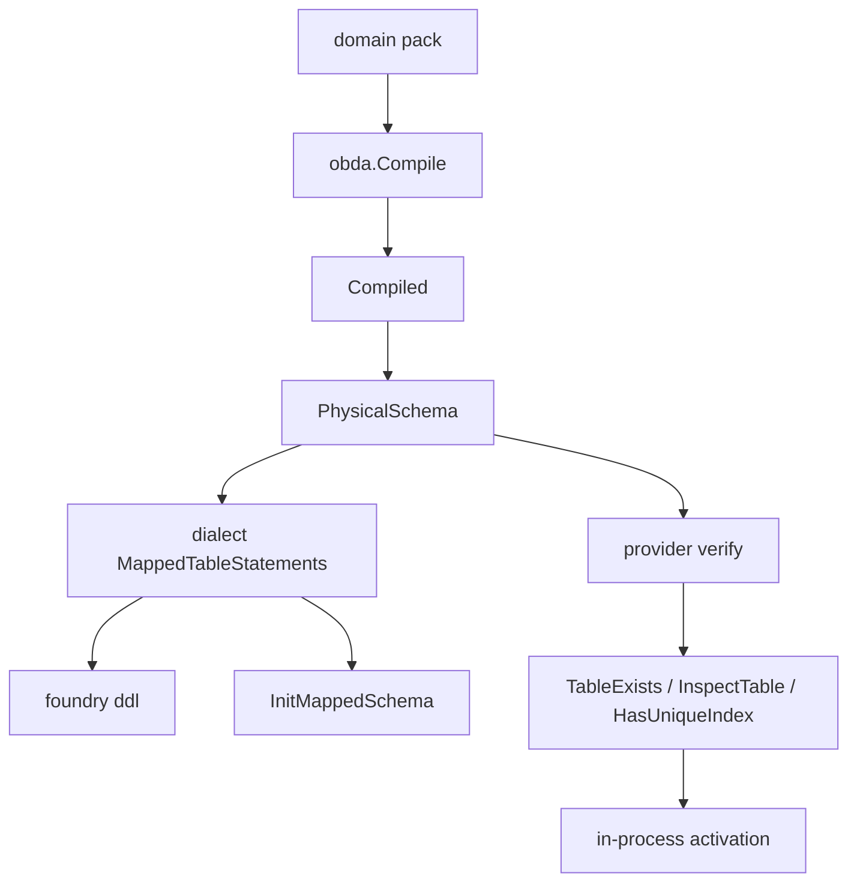

# refactor: OBDA physical schema expectation

## Summary

从 compiled mapping 算出一份方言无关的物理期望。DDL 打印、可选 Init、激活前校验都对照它。`foundry ddl` 不连库。`Open` 按 driver 选 provider，不激活。

---

## Problem Frame

sqliteobda 与 mysqlobda 各写一份「需要哪些列 / 哪些 UNIQUE」。各方言建表语句再列一遍列清单。配置默认 mysql，但 `foundry ddl` 和 `Open` 绑死 sqlite，且 `ddl` 会先开库。shared-core 整包合并仍延后；本轮只抽 schema 语义和装配（see origin）。

---

## Requirements

**Physical expectation**

- R1. compiled mapping 能产生方言无关的物理期望：表、必需要列、cardinality UNIQUE、是否排除软删行。（origin R1）
- R2. 必需要列含 identity、tenant（若有）、mapping fields、未 omit 系统列、link 的 from/to。UNIQUE 规格按 cardinality + tenant，MANY_TO_MANY 无此类 UNIQUE。（origin R2–R3；fields 与现 `requiredColumns` / `Binding()` 对齐）
- R3. 期望不含索引语法、生成列或类型名。（origin R4）

**Dialect render and verify**

- R4. 方言从同一份期望生成 CREATE TABLE / UNIQUE。类型、引号、IF NOT EXISTS、部分索引或 `of_active` 由方言决定。（origin R5）
- R5. `ApplySchema` 用 live introspect 对照期望：缺表 / 缺列 / 缺所需 UNIQUE 不得激活。刚打印或刚 Init 不能代替检查。（origin R6–R8）
- R6. UNIQUE 是否匹配由方言判断。列校验是期望列 ⊆ 实列，允许多余列（含 MySQL `of_active`）。（origin R7；plan call-out）

**foundry ddl**

- R7. `ddl` 加载 pack 与恰好一份 mapping，按方言打印 R4 语句。不打开数据库，不构造 provider，不要求 `DB_URL` 或可达库。（origin R9–R11；plan call-out）
- R8. `--dialect` 覆盖打印方言，默认用配置 driver。与 driver 不一致不警告。未知名失败，不回退 sqlite。（origin R10–R12, R11）

**Bootstrap Open**

- R9. `Open` 按 driver 构造 sqliteobda 或 mysqlobda。未知 driver 失败。成功后不 `ApplySchema`。恰好一份 mapping。（origin R13–R15）
- R10. `OpenSQLite` 仍 merge 多份 mapping 并打开即激活。这是计划对 origin「保持原行为」的收窄，不是 origin R15 / AE5 的字面。（plan call-out）

---

## Key Technical Decisions

- **KTD-1. 期望是从 `Compiled` 派生的值，不改 `Compile` 签名。** `PhysicalSchema(compiled)` 落在独立文件。Compile 继续只绑定 ontology。`Binding()` 仍给 planner 用，本轮不合并，也不把期望字段写进 `compiler.go`。列集必须与现 `requiredColumns` / `Binding().SelectColumns` 相同（含 fields），只推迟类型合并。
- **KTD-2. 期望只含语义字段。** 每张表：名字、必需要列、零组或多组 UNIQUE（列序 + `ExcludeSoftDeleted`）。禁止 `of_active`、`WHERE deleted_at IS NULL`、SQL 类型。列序与现 DDL / `Binding()` 一致：identity、tenant、from/to、fields、未 omit 系统列。不要沿用 `requiredLinkColumns` 把 from/to 接到系统列后面。
- **KTD-3. 方言 DDL 仍吃 `*Compiled`，但列名和 UNIQUE 规格必须来自期望。** 类型、PRIMARY KEY、引号、系统列 SQL 类型从 `Compiled` / 方言 `sqlType` 取。禁止再维护一份与期望平行的 `requiredColumns` / `modelColumns` 列名清单。
- **KTD-4. 校验保持子集，UNIQUE 匹配留在方言。** 缺表 → `ErrInvalidMapping`；缺列或缺 UNIQUE → `ErrSourceSchemaDrift`。`HasUniqueIndex` 仍按 sqlite 部分索引 / mysql `of_active` 分叉（see `docs/solutions/design-patterns/mysql-port-divergence-of-active-unique-index.md`）。
- **KTD-5. 名字解析是显式开关，不是 Dialect 端口。** 合法值只有 `mysql` 和 `sqlite`（与 `dialect.Name()` / `DB_DRIVER` 对齐）。不认 `sqlite3` / 大小写变体。`ddl` 与 `Open` 共用同一解析。
- **KTD-6. `DB_URL` 对 `ddl` 不再必填。** `Conf.DBURL` 改为可选；`Open` 在空 URL 时失败。`ddl` 只读 `BaseDir`、`DomainPacks`、`DBDriver`。
- **KTD-7. 打印逻辑放在 bootstrap，不放进 `main`。** `main` 只解析 `--dialect` 并调用 helper。helper 走 pack 加载 + Compile + 方言 `MappedTableStatements`，永不 `sql.Open`。
- **KTD-8. 不新增 Init CLI。** 操作员把打印结果交给自己的客户端，或在测试里调 `InitMappedSchema`。语句形状保持各方言现有输出。

---

## High-Level Technical Design

`Open` 与 `ddl` 共享 pack 加载和「恰好一份 mapping」。`Open` 另开 `sql.Open` 并按 driver 选 provider。`OpenSQLite` 不走这条「恰好一份 / 不激活」路径。

---

## Implementation Units

### U1. Physical schema expectation

- **Goal:** 从 `Compiled` 算出方言无关期望，并锁住 omit / cardinality 矩阵。
- **Requirements:** R1, R2, R3
- **Dependencies:** none
- **Files:**
  - create `runtime/obda/physical.go`
  - create `runtime/obda/physical_test.go`
- **Approach:** 导出 `PhysicalSchema`，只读 `Compiled` / `OmitFlags`，不改 `compiler.go` 与 `Binding()`。模型表与 link 表排序后稳定。列序见 KTD-2。UNIQUE 规则与现 `uniqueSpecs` 相同：MTO=from，OTM=to，O2O=两侧，M2M=无；tenant 在前；`ExcludeSoftDeleted` = `!Omit.DeletedAt`。
- **Execution note:** 先写失败测试再实现期望。
- **Patterns to follow:** `runtime/storage/sqliteobda/schema.go` 的 `requiredColumns` / `uniqueSpecs`（上提后删除重复）。
- **Test scenarios:**
  - Happy: hospital 式 MTO + tenant + 未 omit 软删 → from 侧 UNIQUE 且 `ExcludeSoftDeleted=true`；对象表含 payload 列（如 name）；期望无 `of_active` / `deleted_at IS NULL` 文本。
  - Edge: omit `deletedAt` → UNIQUE 仍在、`ExcludeSoftDeleted=false`。
  - Edge: O2O → 两组 UNIQUE；M2M → 无 UNIQUE；无 tenant → UNIQUE 列不含 tenant。
  - Edge: 仅 model 无 link → 只有对象表；系统列随 omit 增减。
- **Verification:** `go test` 覆盖 `runtime/obda` 期望矩阵。期望结构断言不含方言语法。

### U2. Dialect DDL consumes expectation

- **Goal:** 两方言的建表/索引列名与 UNIQUE 规格改读期望，语法分叉不变。
- **Requirements:** R3, R4
- **Dependencies:** U1
- **Files:**
  - `runtime/obda/dialect/sqlite/ddl.go`
  - `runtime/obda/dialect/sqlite/ddl_test.go`
  - `runtime/obda/dialect/mysql/ddl.go`
  - `runtime/obda/dialect/mysql/ddl_test.go`
- **Approach:** `MappedTableStatements` 仍接收 `*Compiled`。内部先 `PhysicalSchema`，再按期望列补方言类型与 PK。cardinality 索引只迭代期望里的 UNIQUE 规格，再各自渲染部分索引或 `of_active`。删除与期望重复的列名拼装。
- **Patterns to follow:** 现 `ddl_test.go` 的字符串断言；`docs/solutions/design-patterns/mysql-port-divergence-of-active-unique-index.md`（语义等价、语法必须分叉）。
- **Test scenarios:**
  - Covers AE3. 同一份 MTO + 未 omit 软删：sqlite DDL 含 `WHERE deleted_at IS NULL`，mysql 含 `of_active`，期望对象不含二者。
  - Happy: 现有「无 `of_*` 表名」「M2M 无索引」「omit deletedAt 去掉部分索引 / `of_active`」用例仍过。
  - Edge: O2O 仍生成 from/to 两条索引。
- **Verification:** 两边 `ddl_test.go` 全绿。禁止再出现与 `PhysicalSchema` 平行的列名清单。

### U3. Provider verify consumes expectation

- **Goal:** 两份 `schema.go` 的列/UNIQUE 计算改为调 `PhysicalSchema`；introspect 与错误码不变。
- **Requirements:** R5, R6
- **Dependencies:** U1, U2
- **Files:**
  - `runtime/storage/sqliteobda/schema.go`
  - `runtime/storage/mysqlobda/schema.go`
  - `runtime/storage/sqliteobda/apply_schema_test.go`
  - `runtime/storage/mysqlobda/apply_schema_test.go`
- **Approach:** `verifyMappedSchema` 遍历期望表。列检查保持 ⊆。UNIQUE 把 `ExcludeSoftDeleted` 传给现有 `HasUniqueIndex`。`InitMappedSchema` 仍只 Exec 方言语句，`ApplySchema` 仍不调用它。删除 `requiredColumns` / `uniqueSpecs` 副本。
- **Patterns to follow:** 现 `apply_schema_test.go`：空库 `ErrInvalidMapping`；生成但不 Exec → 缺表失败；缺列/缺 UNIQUE → `ErrSourceSchemaDrift`；成功后才能读写。
- **Test scenarios:**
  - Covers AE4. 打印或生成 DDL 但不 Exec → `ApplySchema` 失败且未激活。
  - Covers AE3. 空库 Init 后 `ApplySchema` 两边成功；MySQL 实列含 `of_active` 不导致缺列失败。
  - Error: 有 UNIQUE 但不排除软删（sqlite 无 `WHERE` / mysql 无 `of_active`）→ `ErrSourceSchemaDrift`。
  - Integration: 未激活读写仍 `ErrMappingNotActive`。
- **Verification:** sqlite 包测全绿；mysql 包测在 `TEST_DB_URL` 下全绿，未配置则 skip。

### U4. foundry ddl compile-only

- **Goal:** `ddl` 不连库、按 `--dialect` 或 driver 打印、恰好一份 mapping、未知名失败。
- **Requirements:** R7, R8
- **Dependencies:** U2
- **Files:**
  - `runtime/bootstrap/conf.go`（`DBURL` 可选；抽出 pack 加载）
  - `runtime/bootstrap/bootstrap.go` 或相邻 helper（打印入口）
  - create `runtime/bootstrap/ddl_test.go`
  - `runtime/cmd/main.go`
- **Approach:** pack 加载与 `Open` 共用，断言 `len(mappings)==1`。打印入口 Compile → 方言 `MappedTableStatements` → 返回语句。`main` 增加 `--dialect`，未指定用 `conf.DBDriver`。`Before` 仍 `LoadConfig`，但缺 `DB_URL` 不再让 `ddl` 失败。
- **Patterns to follow:** `runtime/pack/mappings.go`；`runtime/bootstrap/bootstrap.go` 的 mapping 装载。不要走 `Open`。
- **Test scenarios:**
  - Covers AE1. driver=mysql、无 `--dialect`、无 `DB_URL` / 不可达 DSN → 打印 MySQL DDL，无 `sql.Open`。
  - Covers AE2. driver=mysql、`--dialect=sqlite` → 打印 SQLite DDL，无警告。
  - Covers AE5. 两份 mapping → 失败且无语句。
  - Error: 零 mapping → 失败。
  - Covers AE7. `--dialect=sqlite3` 或 `postgres` → 失败，不回退 sqlite。
- **Verification:** bootstrap 测覆盖打印与错误；`main` 保持薄封装。

### U5. Open selects provider by driver

- **Goal:** `Open` 按 driver 构造对应 provider，不激活；填齐 `Bootstrap.Conf`；`OpenSQLite` 不动。
- **Requirements:** R9, R10
- **Dependencies:** U4（共用 pack 加载与名字解析）。与 U3 并行。
- **Files:**
  - `runtime/bootstrap/conf.go`
  - `runtime/bootstrap/bootstrap.go`（`OpenSQLite` 不改行为）
  - `runtime/bootstrap/bootstrap_test.go`（加 `Open` 用例，保留 merge 用例）
- **Approach:** `sql.Open(driver, url)` 后按 KTD-5 选 `sqliteobda.Open` 或 `mysqlobda.Open`。空 URL / 未知 driver 失败。写入 `Bootstrap.Conf`，使 `Bootstrap.ApplySchema` 可用。不调用 `ApplySchema`。`OpenSQLite` 仍 merge + 激活。
- **Patterns to follow:** 现 `Open` 的一份 mapping 检查；现 `OpenSQLite` 测试。
- **Test scenarios:**
  - Covers AE6. driver=mysql 且 `TEST_DB_URL` 可达 → mysql provider 且未激活，读写 `ErrMappingNotActive`。未配置则 skip。名字解析（`sqlite3` / `postgres` 失败、不回退）做成不调用 `provider.Open` 的纯函数测试。
  - Happy: driver=sqlite → sqlite provider，未激活。
  - Covers AE5. `Open` 两份 mapping → 失败。
  - Covers AE7. driver=`sqlite3` / `postgres` → 失败，不构造 sqliteobda。
  - Regression: `OpenSQLite` 两份 mapping 仍 merge 并激活（现 `TestOpenSQLite_MergesTwoMappings`）。
  - Error: 空 `DB_URL` → `Open` 失败。
- **Verification:** `OpenSQLite` 旧测全绿。`Open` 新测覆盖选 provider、未激活、未知 driver。

---

## Scope Boundaries

**In scope**

- `PhysicalSchema`、方言 DDL 消费期望、provider verify 消费期望
- `ddl` 不连库、`--dialect`、`DB_URL` 可选
- `Open` 按 driver 选 provider、不激活、填 `Conf`

**Deferred for later**（origin）

- 合成通用 SQL provider
- introspect / DDL 统一 Dialect 端口
- `ddl` 执行建表；`--dialect` 与 driver 不一致时警告
- `Open` 打开即激活；多 mapping merge 用于 `Open` / `ddl`
- 第三种 SQL 方言

**Deferred to Follow-Up Work**

- 合并 `Binding()` 与物理期望
- MySQL Init 半失败可重入
- `kind: view` 的 DDL / introspect
- 错库执行打印结果时的操作员警告

**Outside this product's identity**（origin）

- 把期望写进某一个方言包
- 用「刚生成的 DDL」代替 live introspect
- 把 `of_active` 或部分索引提升为中立模型

---

## Risks & Dependencies

- **假分叉。** 不要把类型名或 `RETURNING` 写进期望。UNIQUE 排除软删才是强制分叉（see mysql-port-divergence learning）。
- **`Open` 未写 `Conf`。** 现 `Bootstrap.ApplySchema` 读 `b.Conf.TenantID`，漏写会 panic。U5 必须填。
- **MySQL 测依赖 `TEST_DB_URL`。** U3 的 AE3 集成在无实例时 skip；sqlite 路径必须覆盖同一期望语义。
- **CI 不跑 `runtime` go test。** 落地后仍靠本地 `go test`。

---

## Acceptance Examples

- AE1. driver=mysql、无 flag、无 DSN → 打印 MySQL DDL，不连库。
- AE2. `--dialect=sqlite` → 打印 SQLite DDL，无警告。
- AE3. 同一期望：sqlite 部分索引，mysql `of_active`，期望不含二者；Init 后两边 `ApplySchema` 成功。
- AE4. 只生成不 Exec → 激活失败。
- AE5. 两份 mapping → `ddl` 与 `Open` 失败。`OpenSQLite` 两份仍成功是计划回归，不是 origin AE5。
- AE6. `Open` + mysql → mysql provider 且未激活。
- AE7. 未知名字 → 失败，不回退 sqlite。

---

## Documentation / Operational Notes

- `foundry ddl` 用法：`--dialect` 可选；不再需要 `DB_URL`。
- 打印结果仍无分号。MySQL 客户端需逐条执行或自备 `multiStatements`。
- 激活仍是显式 `ApplySchema`。`OpenSQLite` 仅测试 / 旧调用方。

---

## Sources / Research

- Origin: `docs/brainstorms/2026-09-07-obda-physical-schema-expectation-requirements.md`
- Duplicated specs: `runtime/storage/sqliteobda/schema.go`, `runtime/storage/mysqlobda/schema.go`
- DDL forks: `runtime/obda/dialect/sqlite/ddl.go`, `runtime/obda/dialect/mysql/ddl.go`
- UNIQUE learning: `docs/solutions/design-patterns/mysql-port-divergence-of-active-unique-index.md`
- Provider-per-dialect deferred: `docs/plans/2026-08-27-001-feat-mysql-obda-provider-plan.md`
- `OpenSQLite` merge: `runtime/bootstrap/bootstrap.go`, `runtime/bootstrap/bootstrap_test.go`
- ApplySchema live gate: `docs/brainstorms/2026-08-21-obda-direct-native-identity-requirements.md`, `docs/design/obda-spec-v3.md`
