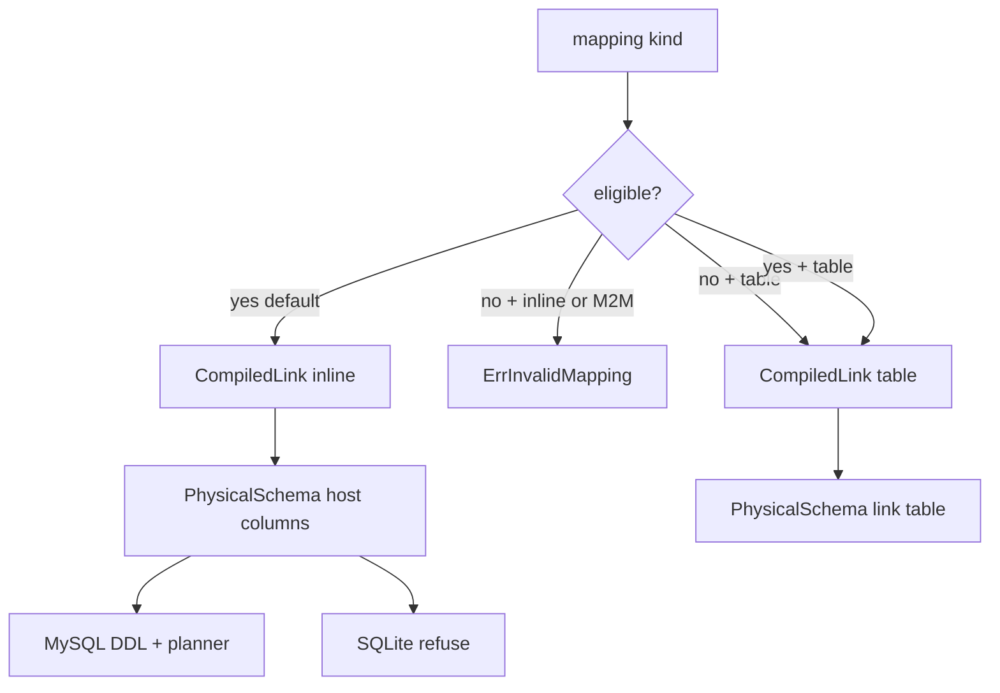
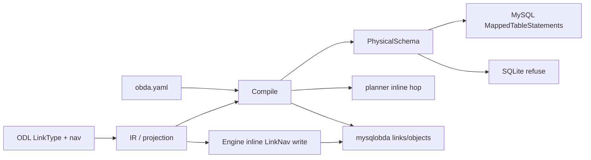
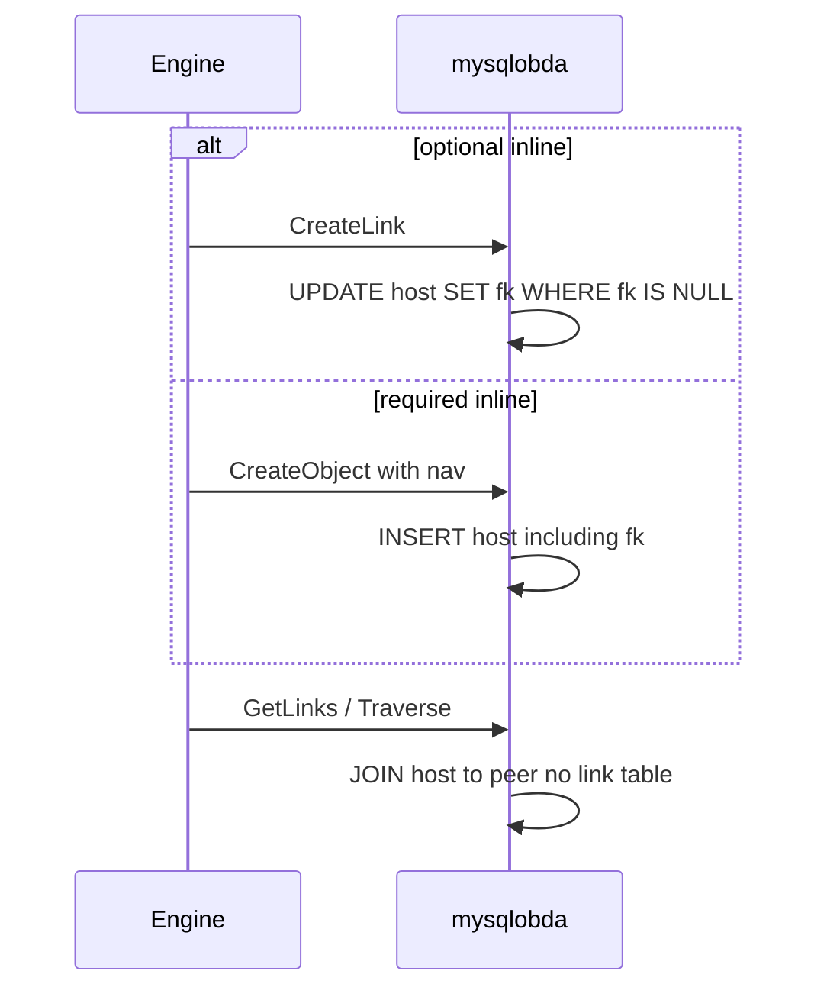

# feat: OBDA property-less link inline FK

## Summary

无业务属性的 Link 在 MySQL 上落成宿主表 FK，不再建中间表。有业务属性的 Link 仍是联结表。编译、物理期望、DDL、CreateLink / GetLinks / Traverse、对象写入都按这个分叉工作。SQLite 碰到 inline 失败，不改建成表。

---

## Problem Frame

每个 LinkType 今天都会得到一张独立表。`BorrowedBy` 有借用状态，联结表是对的。纯引用却仍多一张只存 from/to 的表。物理期望管线已落地（`docs/plans/2026-09-07-001-refactor-obda-physical-schema-expectation-plan.md`），但仍「一 link 一表」。Engine 拒写 LinkNav，投影也不保留导航可空性。本轮按 origin 把无属性、可 inline 的 cardinality 收成宿主列。（see origin）

---

## Requirements

**Eligibility**

- R1. 业务属性 = ODL LinkType 上除 identity 与系统字段以外的字段。有业务属性不得 inline。（origin R1）
- R2. 无业务属性且 M2O / O2M / O2O 默认 inline。`kind: table` 退出为联结表。M2M 永不 inline；无属性 M2M 未写 `kind: table` 则编译失败。声明 inline 但有属性或为 M2M 也失败。（origin R2–R5）

**Physical layout**

- R3. Inline Link 不产生独立物理表。FK 列挂在 host 表。M2O host=from；O2M host=to；O2O host 由 mapping 指定且该列 UNIQUE。（origin R6–R7）
- R4. FK 可空性只看 host 对象上指向对端的导航字段。`Member!` → NOT NULL；`Member` → 可空。对端列表不决定可空性。（origin R8）
- R5. Inline SPI identity 从 host 主键派生。系统字段复用 host 行。有属性 Link 保持现有联结表与 UNIQUE。（origin R9–R10）

**MySQL behavior**

- R6. MySQL DDL：host 表含 FK 列；无该 Link 的 CREATE TABLE。可空 inline：CreateLink 在 FK 为空时 UPDATE host，已有值则 `ErrCardinalityViolation`；DeleteLink 置空。必填 inline：CreateObject / UpdateObject 写 FK；CreateLink / DeleteLink 失败。（origin R11–R13）
- R7. GetLink / GetLinks / Traverse 能解析 inline。Traverse 只 JOIN 宿主与对端。（origin R14）
- R8. Hard delete 对端：可空 FK 清空；任一 NOT NULL FK 仍指向它则整笔删除失败并回滚。不得留下悬空 ID。（origin R15）

**SQLite and pack**

- R9. SQLite 方言打印 DDL 或 provider Open / ApplySchema 遇到 inline 失败，说明原因，不改写成联结表，不部分建表。（origin R16）
- R10. library-pack 增加可空 `OwnedBy`（Book → Member，M2O）。`BorrowedBy` 保持 `kind: table`。（origin R17）

---

## Key Technical Decisions

- **KTD-1. `kind` 空且可 inline → inline；空且有属性 → table。** 与今天「空 kind = table」对有属性 Link 兼容。显式 `kind: inline` 与省略等价。`kind: table` 总是联结表。inline 不要求 `relation.name`；host 表名来自 host model。
- **KTD-2. 业务属性检测看 ODL / SPI LinkType，不看 mapping `fields`。** mapping 不能靠少写 fields 把有属性 Link 收成 inline。identity 字段（primary `id`）不算业务属性。`ProjectStorage` 今天把 link `id` 留在 Properties 里，检测必须排除它。
- **KTD-3. Compile 仍只吃 `spi.OntologySchema`。** `ProjectStorage` 把对象 RoleLinkNav 投影成导航元数据（link type、direction、NonNull），挂在 `ObjectTypeDefinition` 上。Compile 用它绑定 host 可空性。不把可空性写进 YAML，也不把 `*ir.Ontology` 塞进 Compile 签名。
- **KTD-4. Host 默认：M2O=from，O2M=to；O2O inline 必须写 `host: from` 或 `host: to`。** 物理 FK 列始终追加到 **host 表**。YAML 里非 host 端的 `columns` 只是 **列名声明**（通常一列）；host 端 `columns` 空，表示用 host identity 列去 JOIN。列名与 host 已有 identity / tenant / fields / 系统列冲突则 `ErrInvalidMapping`。
- **KTD-5. Inline link ID = `EncodeDirect(linkType, []string{hostEngineID})`。** 与对象 ID 同编码、靠 `t` 区分类型。GetLink / CreateLink / DeleteLink 必须编出同一稳定 ID。错误 type 或 key 个数不对 → `ErrLinkNotFound`。
- **KTD-6. 物理期望增加列可空性，仍不含 SQL 类型。** `PhysicalTable.Columns` 改为带 `Nullable` 的列描述。现有必填列 `Nullable=false`；`deleted_at` 与可空 inline FK 为 true。仅 **O2O** inline 在 host 表上挂 cardinality UNIQUE（tenant + FK 列，`ExcludeSoftDeleted` 跟 host omit）。M2O / O2M inline 不额外 UNIQUE：M2O 一行一列；O2M 允许多行同一 FK。`of_active` 仍只由 MySQL 方言渲染。MySQL `MappedTableStatements` 必须在 **model 分支** 渲染挂在 host 表上的 UNIQUE，不能只在 link 表分支打索引。
- **KTD-7. 编译保持方言中立。** library-pack 可以 Compile。SQLite 在 `MappedTableStatements` 与 sqliteobda Open / ApplySchema 失败，错误 `ErrUnsupportedCapability`（消息标明 inline link 名）。不得在 Compile 里因 dialect 失败。
- **KTD-8. Engine 构造时注入 `*obda.Compiled`（或 host 对象+导航名 → inline 元数据）。** 仅 IR 分不出「无属性 + `kind: table`」与默认 inline（如 `ShipsFrom`）。`roleWritable` 查这张表：host 侧 inline 导航放行，联结表导航拒绝。payload 字段名是 host 导航名（如 `owner`），值是对端 engine ID。必填缺值 → 创建失败。UpdateObject 改 FK 递增 host `version` / `updated_at`。更新 `engine.New` 的 bootstrap / e2e / resolver 调用点。
- **KTD-9. 无属性 inline 的 UpdateLink → `ErrUnsupportedCapability`。** 不是静默 no-op。CreateLink 带非空 properties → `ErrInvalidMapping`。
- **KTD-10. 不建 SQL FOREIGN KEY。** 与现有 VARCHAR 端点列一致。CreateLink / CreateObject 在同一事务里 `requireLiveEndpoint`。CreateLink 用条件 UPDATE（可空且当前 NULL）保证并发只有一个成功。Hard delete 对端与清空/拒绝在同一事务；碰到必填引用则全部回滚。
- **KTD-11. Inline 读写走 host 行 OCC。** CreateLink / DeleteLink / 必填 UpdateObject 都 UPDATE host，成功则 version+1。GetLink 返回的系统字段来自 host 行。
- **KTD-12. 软删可见性跟现有 GetLinks。** host 或 peer `deleted_at` 非空则默认不可见；`IncludeDeleted` 行为与联结表路径对齐，本轮不新发明。
- **KTD-13. `CompiledLink` 带 host 导航字段名。** 供 Engine 与 `insertBusiness` / `updateBusiness` 把 payload `owner` 写到 `owner_id`。按 host 模型可列出全部 inline FK 绑定（nav 名、link 类型、列、可空、对端类型）。
- **KTD-14. pack `registerTable` 跳过 inline Link。** inline 没有独立 `relation.name`，表名等于 host，不得与 model 表冲突。`runtime/pack/mappings.go` 只登记联结表名。
- **KTD-15. `deleteLinksForObject` 跳过 inline。** 其对 `l.Table` 的 DELETE 在 inline 时等于 DELETE host 表。inline FK 只走 hard-delete 前的清空/拒绝步骤。

---

## High-Level Technical Design

Compile 产出的 `CompiledLink` 增加 inline 标记、HostModel、FK 列、Nullable。planner 在 inline hop 只 JOIN host↔peer。mysqlobda 把 CreateLink/DeleteLink 变成对 host 表的条件 UPDATE。

对象 API 与 Link API 分叉：

---

## Implementation Units

### U1. Mapping, validate, compile

- **Goal:** YAML 能表达 inline；非法组合失败；`CompiledLink` 带 inline/host/FK/nullable/host 导航名。
- **Requirements:** R1, R2, R3, R4
- **Dependencies:** none
- **Files:**
  - `runtime/obda/mapping.go`
  - `runtime/obda/validate.go`
  - `runtime/obda/validate_test.go`
  - `runtime/obda/compiler.go`
  - `runtime/obda/compiler_test.go`
  - `runtime/obda/parse_test.go`
  - `runtime/projection/storage.go`
  - `runtime/projection/storage_test.go`
  - `runtime/spi/ontology.go`
  - `runtime/pack/mappings.go`
- **Approach:** 允许 `kind: inline`。空 kind：可 inline → inline，否则 table。inline 跳过 `relation.name` / 独立 identity 校验。O2O inline 要求 `host: from|to`。Compile 用 ontology 判断业务属性（排除 primary id）、按 KTD-4 定 host、从投影的导航元数据读 NonNull 与导航字段名（KTD-3、KTD-13）。`CompiledLink.Table` 对 inline 等于 host model 表名。`LoadMappings` 对 inline 不 `registerTable`（KTD-14）。
- **Execution note:** 先写失败的 validate/compile 用例再改默认 kind。
- **Patterns to follow:** `runtime/obda/validate.go` 的 `ErrInvalidMapping`；`compiler.go` 现有 endpoint 绑定。
- **Test scenarios:**
  - Happy: 无属性 M2O、省略 kind → inline，host=from，FK 可空来自 `owner: Member`。
  - Happy: 显式 `kind: inline` 与省略等价。
  - Covers AE2. 无属性 + `kind: table` → 仍是联结表，需要 `relation.name`。
  - Covers AE3. 无属性 M2M 未写 table → 失败；有属性 + inline → 失败。
  - Edge: 只有 `id @primary` 的 LinkType 视为无业务属性。
  - Error: O2O 未声明 `host`；FK 列与 `id` / `tenant_id` / 业务列撞名。
  - Error: mapping `fields` 非空但 ODL 无业务属性仍按 ODL（不得靠 YAML 假装有属性或无属性）。
  - Happy: library-pack 式「model 表 book + inline OwnedBy」加载不报重复表名。
- **Verification:** `go test` 覆盖 `runtime/obda`、`runtime/projection`、`runtime/pack`。现有 table/view 用例仍过。

### U2. Physical expectation and MySQL DDL

- **Goal:** inline 不单独成表；host 表含可空/必填 FK；仅 O2O UNIQUE 在 host 上；MySQL DDL 跟着期望走。
- **Requirements:** R3, R4, R5, R6
- **Dependencies:** U1
- **Files:**
  - `runtime/obda/physical.go`
  - `runtime/obda/physical_test.go`
  - `runtime/obda/dialect/mysql/ddl.go`
  - `runtime/obda/dialect/mysql/ddl_test.go`
  - `runtime/storage/mysqlobda/schema.go`（列校验读新的列描述）
  - `runtime/storage/mysqlobda/apply_schema_test.go`
  - `runtime/storage/sqliteobda/schema.go`（列形状跟上，verify 仍编译）
- **Approach:** 按 KTD-6 给列加 `Nullable`。inline 循环把 FK 并进 host `PhysicalTable`，不为该 Link append 表。MySQL `sqlType`：FK 仍 VARCHAR(255)；`NULL` / `NOT NULL` 跟 `Nullable`。O2O UNIQUE 在 **model 分支** 渲染（与现 cardinality 索引相同的 `of_active` 规则）。sqlite DDL 本单元不实现 inline 成功路径（见 U6）。列形状变更后 sqliteobda `schema.go` 的列迭代必须仍能编译。
- **Patterns to follow:** U1 of `docs/plans/2026-09-07-001-refactor-obda-physical-schema-expectation-plan.md`；`mysql-port-divergence-of-active-unique-index.md`（UNIQUE 语义在期望，`of_active` 在方言）。
- **Test scenarios:**
  - Covers AE1. 期望：`book` 有可空 owner 列；无 `owned_by` 表；`borrowed_by` 仍在。MySQL DDL 同形。
  - Happy: 必填导航 → host 列 NOT NULL。
  - Happy: O2O inline → host 表一组 UNIQUE（tenant+FK，ExcludeSoftDeleted 跟 host）。
  - Edge: M2O / O2M inline 期望无 FK 列 UNIQUE。
  - Edge: 两 inline 同列名 → 已在 U1 失败，期望测不到脏表。
- **Verification:** `physical_test.go` 与 mysql `ddl_test.go` 锁住「无独立表 / 可空性 / UNIQUE 所在表」。ApplySchema 对含 inline 的 fixture 在列与 UNIQUE 上能激活。

### U3. Planner inline hops

- **Goal:** GetLinks / Traverse 对 inline 不引用 link 表。
- **Requirements:** R7
- **Dependencies:** U1
- **Files:**
  - `runtime/obda/planner.go`
  - `runtime/obda/planner_test.go`
- **Approach:** `LinkJoinBinding` / `TraverseHop` 增加 inline 形态：outbound 从 host 过滤 PK 且 FK NOT NULL，JOIN peer ON peer.id = host.fk；inbound 从 host 过滤 FK = start id。混合路径（inline 后接 table hop）每跳独立选形态。软删谓词仍加在 host 与 peer，与现 GetLinks 一致（KTD-12）。
- **Patterns to follow:** 现 `PlanGetLinksJoin` / `PlanTraverse` 的租户对齐与 args 绑定。
- **Test scenarios:**
  - Covers AE4. outbound 与 inbound SQL 不含独立 link 表名。
  - Happy: 单跳 Traverse Book→Member 只有一次对象 JOIN。
  - Covers AE10. 两跳，第一跳 inline、第二跳 table：SQL 只在第二跳出现联结表名；仍参数化、无字符串拼接。
  - Edge: IncludeDeleted 与默认隐藏软删，断言与现 table hop 同结构（谓词在哪一侧）。
- **Verification:** planner 单测断言 AST/SQL 形状；不连库。

### U4. mysqlobda link and object SPI

- **Goal:** MySQL 上 inline 的 Create/Get/Delete/Traverse 与对端 hard delete 符合 origin。
- **Requirements:** R5, R6, R7, R8
- **Dependencies:** U1, U3
- **Files:**
  - `runtime/storage/mysqlobda/links.go`
  - `runtime/storage/mysqlobda/links_test.go`
  - `runtime/storage/mysqlobda/objects.go`
  - `runtime/storage/mysqlobda/objects_test.go`
  - create or extend `runtime/storage/mysqlobda/testdata/` inline fixture（M2O 可空/必填，另加 O2M/O2O；不要改坏现有 hospital junction 矩阵）
- **Approach:** CreateLink：校验 writable、两端 live、条件 UPDATE host SET fk。DeleteLink：SET fk NULL（必填在更早失败）。GetLink：解码 KTD-5，读 host 行。CreateObject/UpdateObject：用 KTD-13 绑定把导航名写成 FK 列。Hard delete：先处理指向该对象的 inline FK（清空或拒绝），`deleteLinksForObject` **跳过** inline（KTD-15），再删对象行。整段同一事务。
- **Execution note:** 用 `TEST_DB_URL` 集成测试覆盖 AE4–AE7；无 URL 时 skip。
- **Patterns to follow:** `requireLiveEndpoint`；`Classify` 把 1062 变成 `ErrCardinalityViolation`；现 `deleteLinksForObject` 循环 compiled links。
- **Test scenarios:**
  - Covers AE4. 可空 CreateLink → GetLinks 双向 → 二次 CreateLink 得 cardinality violation。CreateLink 返回的 id 可 GetLink。
  - Covers AE5. DeleteLink 后 GetLinks 为空。
  - Covers AE6. 必填：无 nav 的 CreateObject 失败；CreateLink/DeleteLink 失败；UpdateObject 改指向成功且 version+1。
  - Covers AE7. 可空对端删除清空 FK；必填引用使删除失败，host 行仍在。Hard delete host 不得误 DELETE 自己的对象表。
  - Error: UpdateLink → `ErrUnsupportedCapability`；CreateLink 带 properties → 失败。
  - Edge: 并发两个 CreateLink 同一可空 host，只有一个成功。
  - Edge: O2M inbound 多行（无 UNIQUE 冲突）；O2O 两 host 争同一 peer → cardinality violation。
  - Edge: 跨租户 peer id → 与现 endpoint 校验一致失败。
- **Verification:** `go test` `./runtime/storage/mysqlobda`（有 `TEST_DB_URL` 时集成绿）。hospital 联结表用例不回归。

### U5. Engine inline navigation writes

- **Goal:** CreateObject / UpdateObject 能写 inline 导航字段；联结表导航仍拒绝。
- **Requirements:** R6
- **Dependencies:** U1, U4
- **Files:**
  - `runtime/engine/engine.go`
  - `runtime/engine/objects_test.go`
  - `runtime/bootstrap` 中构造 `engine.New` 的调用点（随代码搜索补齐 e2e / resolver）
- **Approach:** Engine 持有 compiled mapping 或预计算的 inline 导航表（KTD-8）。`roleWritable` 对 RoleLinkNav：host 侧且 compiled 为 inline 则放行。值必须是对端 engine ID。必填缺省失败。现 `TestEngine_CreateObject_LinkNavRoleInPayload_Rejects` 改为：联结表导航仍拒；inline 导航接受。Engine 不自己发 SQL，只把字段交给 provider。
- **Patterns to follow:** 现 payload 角色过滤；系统字段跳过逻辑。
- **Test scenarios:**
  - Happy: inline 可空 nav 出现在 CreateObject payload → 调用 CreateObject 且属性含对端 id。
  - Happy: 必填 inline 缺 nav → Engine 或 provider 失败（与 U4 AE6 对齐，本层锁「不会在进 provider 前默默丢掉字段」）。
  - Covers AE9. `BorrowedBy` 式联结表导航出现在 payload → 仍拒绝。
  - Error: 无属性但 mapping `kind: table` 的导航（如 ShipsFrom）仍拒绝。
- **Verification:** `go test` `./runtime/engine`。联结表拒写用例仍在。

### U6. SQLite refuses inline

- **Goal:** SQLite 打印或打开含 inline 的 mapping 失败，零副作用。
- **Requirements:** R9
- **Dependencies:** U1, U2
- **Files:**
  - `runtime/obda/dialect/sqlite/ddl.go`
  - `runtime/obda/dialect/sqlite/ddl_test.go`
  - `runtime/storage/sqliteobda/provider.go` 和/或 `schema.go`
  - `runtime/storage/sqliteobda/apply_schema_test.go`
  - `runtime/bootstrap/bootstrap_test.go` 或 `runtime/bootstrap/ddl_test.go`（sqlite dialect 打印失败）
- **Approach:** sqlite `MappedTableStatements` 若 compiled 含 inline → 错误返回，不打印部分语句。sqliteobda Open / ApplySchema 同样失败。Compile 成功。错误带 link 名。
- **Patterns to follow:** bootstrap 对未知 dialect 失败、不回退；`ErrUnsupportedCapability` 现有用法。
- **Test scenarios:**
  - Covers AE8. 含 inline 的 mapping：sqlite DDL 失败；OpenSQLite / sqlite ApplySchema 失败；库中无新表（空库仍空）。
  - Happy: 纯 `kind: table` mapping 的 sqlite DDL / Open 不受影响。
- **Verification:** sqlite 单测不依赖 MySQL。失败路径不调用建表。

### U7. library-pack golden path

- **Goal:** pack 同时演示 `BorrowedBy` 联结表与可空 `OwnedBy` inline。
- **Requirements:** R10, R6, R9
- **Dependencies:** U1, U2, U6
- **Files:**
  - `domain-packs/library-pack/schema/links.odl`
  - `domain-packs/library-pack/schema/book.odl`
  - `domain-packs/library-pack/schema/member.odl`
  - `domain-packs/library-pack/obda/library.obda.yaml`
  - `runtime/pack/mappings_test.go`
  - `runtime/bootstrap/ddl_test.go`
  - `runtime/storage/sqliteobda/schema.go`（若 U2 改了列形状，确认 sqlite verify 仍编译）
- **Approach:** `OwnedBy` 无业务字段（可仅 `id @primary`）。Book：`owner: Member @link(type: "OwnedBy", direction: OUTBOUND)`。Member inbound 列表不迫使每本书有 owner。YAML：`OwnedBy` 省略 kind 或 `kind: inline`，FK 列名稳定（如 `owner_id`）；`BorrowedBy` 保持 `kind: table`。pack 测试断言两个 link 形态。MySQL `foundry ddl` 金路径：`book` 含 `owner_id`，无 `owned_by`，有 `borrowed_by`。SQLite 打印该 pack 失败（U6）。
- **Patterns to follow:** 现 `TestLoadLibraryPackMappings`；`runtime/bootstrap/ddl_test.go` 的 mysql 打印断言。
- **Test scenarios:**
  - Covers AE1. MySQL DDL 金路径。
  - Covers AE8. SQLite 对该 pack 打印或 Open 失败。
  - Happy: loader 编出两个 link：BorrowedBy table、OwnedBy inline。
- **Verification:** `go test` `./runtime/pack` 与 `./runtime/bootstrap`。不把 supply-chain `ShipsFrom` 改成 inline。

---

## Scope Boundaries

**In scope**

- origin 全文：默认 inline、table 退出、MySQL 全路径、M2O/O2M/O2O、SQLite 拒绝、library-pack `OwnedBy`
- Engine 仅为 inline 放行对象导航写入
- 物理期望列可空性

**Deferred for later**（origin）

- SQLite 实现 inline
- 迁移 supply-chain `ShipsFrom` 等已有无属性联结表
- 无属性 Link 日后加业务字段的迁移
- 把 §15.7 改写成全方言规范

**Outside this product's identity**（origin）

- 有属性 Link 拆进宿主列
- M2M 用多值/JSON 假装 inline
- SQLite 静默把 inline 建成联结表

**Deferred to Follow-Up Work**

- 为 inline / 物理期望写 `docs/solutions/` 学习条目
- 真 SQL FOREIGN KEY constraint
- GetLinks 分页排序键在 inline 上的专门优化

---

## System-Wide Impact

- **Engine 契约：** LinkNav 从「一律只读」变成「inline host 导航可写」。GraphQL/REST 若直接走 Engine payload，会突然能写 `owner`；本轮不改 HTTP 层，但 objects_test 必须锁分叉。
- **library-pack：** 依赖该 pack 且走 SQLite Open / sqlite `ddl` 的调用方会失败。Compile 与 MySQL `ddl` 仍可用。
- **OCC：** inline 关联变更打在对象 version 上，客户端若只盯 link version 会看到与联结表不同的时钟。
- **Hard delete：** 比今天多一步清空/拒绝 inline FK，必须与现有联结表 DELETE 同事务。

---

## Risks & Dependencies

- **依赖：** 001 物理期望已在 main。本轮改 `PhysicalTable` 列形状，mysql/sqlite 两方言与两份 `schema.go` 的列迭代都要跟上；sqlite 成功路径仍无 inline 列。
- **风险：** 投影/SPI 增加导航元数据时不要改掉「link Properties 仍含 id」，除非检测逻辑另有要求。
- **风险：** `deleteLinksForObject` 若未跳过 inline，会 DELETE host 对象表。U4 必须有回归。
- **风险：** 无真实 FK 时的并发。用条件 UPDATE 与事务；集成测试覆盖双 CreateLink。
- **风险：** `OpenSQLite` 仍 merge 多 mapping 并激活。含 inline 的 merge 必须在激活前失败。
- **假设：** MySQL 集成测试继续靠 `TEST_DB_URL`；缺省 skip 不算本计划未完成，但有 URL 时 AE4–AE7 必须跑。
- **假设：** Init 沿用打印出的同一套 DDL 语句；本轮不新增 Init CLI，ApplySchema 仍 live 校验（origin 物理期望计划）。

---

## Acceptance Examples

- AE1–AE8 同 origin。单元测试用 `Covers AE*` 对齐：U2/U7→AE1，U1→AE2/AE3，U4→AE4–AE7，U6/U7→AE8，U5→AE9，U3→AE10。
- 计划补充（origin 未写、实施必须锁）：
  - AE9. 联结表导航仍不能出现在 CreateObject payload（KTD-8）。
  - AE10. 两跳 Traverse：inline 后接 table hop，只在 table hop 出现联结表名。

---

## Open Questions

**Deferred to implementation**

- FK 列名在 YAML 省略时是否从导航名 snake_case 推导，或强制作者写列名（U7 金路径写死 `owner_id` 即可）
- sqliteobda 拒绝发生在 Open 入口还是 ApplySchema（两者都失败即可；先做哪一个以现有激活顺序为准）
- Engine 放行后 GraphQL 层是否已自动暴露写入：本轮只加回归；若已暴露则保持，不另做 API 设计

---

## Documentation / Operational Notes

- 在 `docs/design/obda-spec-v3.md` 的 relation kind 表增加 `inline` 一行，并在 §15.7 加一句：无业务属性且非 M2M 可以是宿主 FK，不是独立表。不重写整节为全方言规范（origin deferred）。
- library-pack YAML 注释标明 `BorrowedBy` 为什么必须 `kind: table`。
- 不新增 Init CLI。操作员仍打印 MySQL DDL 后自行执行。

---

## Sources / Research

- Origin: `docs/brainstorms/2026-09-07-obda-inline-link-fk-requirements.md`
- Physical expectation: `docs/plans/2026-09-07-001-refactor-obda-physical-schema-expectation-plan.md`, `runtime/obda/physical.go`
- Kind default table: `runtime/obda/validate.go`
- Engine LinkNav reject: `runtime/engine/engine.go` `roleWritable`
- Identity: `runtime/obda/identity.go` `EncodeDirect`
- mysqlobda links/objects: `runtime/storage/mysqlobda/links.go`, `objects.go` `deleteLinksForObject`
- UNIQUE dialect fork: `docs/solutions/design-patterns/mysql-port-divergence-of-active-unique-index.md`
- Pack mappings: `runtime/pack/mappings.go`, `domain-packs/library-pack/obda/library.obda.yaml`
