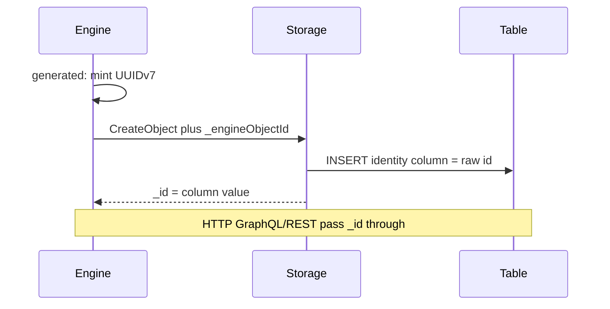
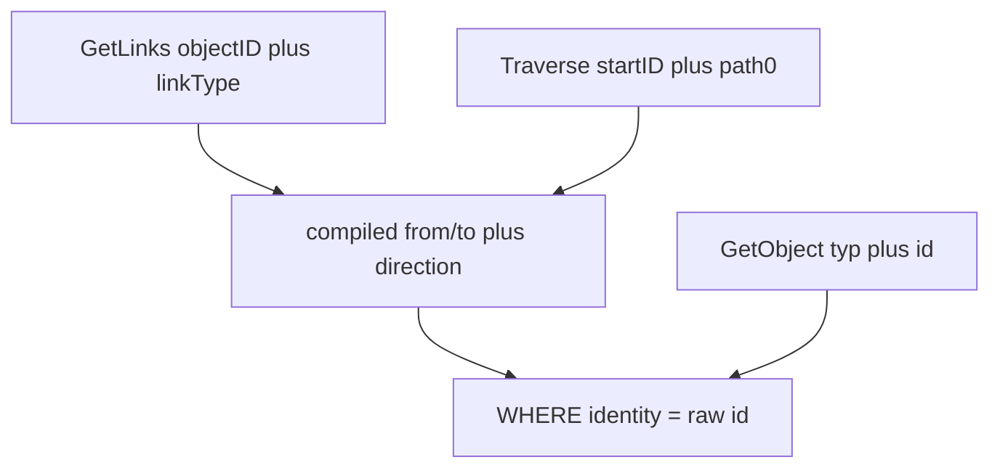

# feat: single-column physical identity

## Summary

identity 列存裸值，等于 SPI `_id`。Engine 在 `insert: generated` 时铸造 UUIDv7 并经 `_engineObjectId` 注入。删除 `EncodeDirect` / `DecodeDirect`。GraphQL 与 REST 继续原样透传 `_id`。

---

## Problem Frame

sqlite/mysql 把 `EncodeDirect` 信封写入 PK；memory 自铸裸 UUID；Engine 只给表链接铸 `_engineLinkId`。GetObject / Traverse 还靠 `DecodeDirect` 做类型校验。HTTP 根字段和路径已经带类型，不需要再编码（see origin）。

---

## Requirements

**Storage identity**

- R1. identity 恰好一列。多列在 validate/compile 失败，不得激活。（origin R1）
- R2. SPI `_id` 等于 identity 列原始值。禁止类型信封。（origin R2）
- R3. `GetLinks` / `Traverse` 从 `linkType + direction` 经 mapping 推导类型。禁止扫多表，禁止从 ID 解码类型。（origin R3）
- R4. `GetObject` / `GetLink` 按 `(typ, tenant, raw id)` 查表。错类型 = 空查 not-found。禁止 `matchDirectID` / `DecodeDirect` 前置校验。（origin R4）

**Engine minting**

- R5. `insert: generated`：Engine 铸 UUIDv7，经 `_engineObjectId` 交给 storage。调用方不得覆盖 PK。（origin R5；KTD-1）
- R6. `insert: provided`：Engine 不铸。`_id` 来自调用方提供的非 Primary 映射字段；缺值失败。（origin R6）
- R7. memory / sqlite / mysql 必须持久化 Engine 传入的对象 `_id`。generated 路径不得另铸或改写。（origin R7）
- R8. 表链接 `_id` = Engine `_engineLinkId`（裸 UUID），不再包信封。（origin R8）
- R9. 删除 `EncodeDirect` / `DecodeDirect` 及全部调用。禁止留下 inline 专用编码分支。（origin R9）

**Inline and HTTP**

- R10. Inline link 的 SPI `_id` 等于 host `_id`。忽略 `_engineLinkId`。（origin R10–R11）
- R11. GraphQL 类型根字段与 REST GET 原样透传 SPI `_id`。不加 `node(id:)`，不做 presentation 编码。（origin R12）

**Spec**

- R12. 改写 `docs/design/obda-spec-v3.md` 中 EncodeDirect / 从单 id 解码类型的条款，与 R1–R4、R11 一致。（origin R13）
- R13. mapping 仍声明 `insert: generated | provided`。（origin R14）

---

## Key Technical Decisions

- **KTD-1. `_engineObjectId` 与 `_engineLinkId` 对称。** 新常量 `spi.FieldEngineObjectID`。Engine `CreateObject` 在校验之后、调用 storage 之前，复制 map 并注入。返回对象的 `_id` 是该值；`_engineObjectId` 不得出现在返回体。`IsSystemField` 不含此键（与 `_engineLinkId` 一样），各 provider 在 copy 用户字段**之前**读取它。
- **KTD-2. 无 compiled mapping 时一律 generated。** `engine.New` / seed / memory 金路径 `compiled == nil` → 铸 UUIDv7。有 compiled 时读 `IdentityInsert`。
- **KTD-3. YAML 继续 `columns:`，长度为 1。** 不引入 `column:`。`len(columns) != 1` → `ErrInvalidMapping`。空 insert 非法；只允许 `generated` 与 `provided`。
- **KTD-4. Traverse 起点类型从第一跳 mapping 推导。** 抄现有 `GetLinks` 的 from/to + direction。错类型裸 id 在正确表上空查 → not-found。不改 SPI 签名。
- **KTD-5. provided 的 identity 列必须是非 Primary 的 payload 字段。** ODL `id: ID! @primary` 不可写。自然键用逻辑名（如 `isbn`）。payload 带 RolePrimary `id` → Engine 照旧拒绝。generated 时带 identity 逻辑字段 → 拒绝。
- **KTD-6. sqlite 与 mysql 成对改写路径，不合并 provider。** identity 列存同一裸值。方言分叉只留 UNIQUE/`of_active`，不为删信封再开写路径（see `docs/solutions/design-patterns/mysql-port-divergence-of-active-unique-index.md`）。sqlite 继续拒绝 inline。
- **KTD-7. 表链接 honor `_engineLinkId`；inline 忽略并返回 host `_id`。** Engine `CreateLink` 仍无条件铸 link UUID。memory 无 inline，行为不变。Engine 现有「返回 `_id` == 注入 UUID」断言只覆盖表链接。
- **KTD-8. HTTP 保持透传。** `runtime/api` 不改编码。e2e 继续把存储 `_id` 当 GraphQL/REST 参数。`docs/design/q6-id.md` 留到将来 `node(id:)`。
- **KTD-9. 非文本列的规范字符串。** 整数：十进制无前导零。UUID：小写带连字符。与读回 `fmt.Sprint` / dialect 规范化一致，保证 Get 往返。
- **KTD-10. spec v3 没有 R27 分叉条款。** 信封契约在 spec §5 与 brainstorm R2/R3/R4/R18/R27。本轮改 spec §5 与测试；不必在 spec 里「删除不存在的 R27」。

---

## High-Level Technical Design

Engine 不解码 ID。SQL provider 用 `typ` 或 mapping 选表。HTTP 不参与 identity 变换。

---

## Implementation Units

### U1. Reject multi-column identity at validate

- **Goal:** mapping 恰好一列 identity，insert 只能是 `generated` 或 `provided`。
- **Requirements:** R1, R13
- **Dependencies:** none
- **Files:** `runtime/obda/validate.go`, `runtime/obda/validate_test.go`, `runtime/obda/compiler_test.go`, `runtime/obda/mapping.go`（注释：identity 不再是可逆信封）
- **Approach:** `len(Columns) != 1` → `ErrInvalidMapping`。`insert` 枚举校验。generated 不再允许空 columns。
- **Patterns to follow:** `TestValidateEmptyIdentityColumns` 的 `strings.Replace` 负例风格。
- **Test scenarios:**
  - `columns: [id]` + `insert: generated` 通过。
  - Covers AE3. `columns: [a, b]` → validate 失败。
  - `insert` 缺省或非法值 → 失败。
  - `insert: provided` 且 columns 长度为 1 通过（字段是否在 payload 仍由 compile 检查）。
- **Verification:** `go test` `runtime/obda` validate/compile 测试绿。

### U2. Engine mints object IDs via `_engineObjectId`

- **Goal:** generated 由 Engine 铸造；memory 持久化传入值；provided 走非 Primary 字段。
- **Requirements:** R5, R6, R7, R13
- **Dependencies:** U1
- **Files:** `runtime/spi/ontology.go`, `runtime/spi/ontology_systemfield_test.go`, `runtime/engine/engine.go`, `runtime/engine/objects_test.go`, `runtime/storage/memory/provider.go`, `runtime/storage/memory/provider_test.go`（或现有 create 测试）
- **Approach:** 增加 `FieldEngineObjectID = "_engineObjectId"`。列入 `IsLinkSystemField` 的对象侧对偶：对象 copy 前读取，不进 `IsSystemField`。`CreateObject`：有 compiled 且 `provided` → 从 identity 逻辑字段取值，缺则失败；否则铸 UUIDv7 注入。复制 caller map，不改原 map。memory 用该值作为 `_id`，缺省（无 Engine 直调 storage）保持自铸仅当测试直调 SPI——本轮 Engine 路径必须注入。直调 memory `CreateObject` 无 `_engineObjectId` 时仍可自铸，避免打断非 Engine 测试；Engine 路径必须注入。
- **Execution note:** 先加 Engine 测试断言 `_id` 为 UUIDv7 且三家后续 U3 对齐，再改 memory。
- **Patterns to follow:** `CreateLink` copy-then-inject；`looksLikeUUIDv7`（`runtime/engine/links_test.go`）。
- **Test scenarios:**
  - Covers AE1 (memory). 无 compiled：CreateObject 返回 UUIDv7 形态 `_id`。
  - 有 compiled `generated`：返回 `_id` 等于注入值；caller map 无 `_engineObjectId`。
  - Covers AE7. `provided` 缺 identity 字段 → 失败、无行。
  - `provided` + 非 Primary 字段 `isbn` → `_id == "9780..."`。
  - payload 含 RolePrimary `id` → 仍拒绝。
  - `generated` 且 payload 含 identity 逻辑字段 → 拒绝。
- **Verification:** Engine 与 memory 对象创建测试绿；seed 仍能 `Engine.CreateObject`（library-pack 全是 generated）。

### U3. SQL providers persist raw identity values

- **Goal:** sqliteobda 与 mysqlobda 对象/表链接写入裸 `_id`；Get/Traverse 不再 DecodeDirect。
- **Requirements:** R2, R3, R4, R7, R8, R9
- **Dependencies:** U2
- **Files:** `runtime/storage/sqliteobda/objects.go`, `runtime/storage/sqliteobda/links.go`, `runtime/storage/mysqlobda/objects.go`, `runtime/storage/mysqlobda/links.go`, 对应 `objects_test.go` / `links_test.go` / `engine_smoke_test.go`
- **Approach:** `objectIdentity` generated 读 `_engineObjectId`（缺则错误，不自铸）。provided 从 props 取单列逻辑值，`fmt.Sprint` 后写入列，不再 `EncodeDirect`。删除 `matchDirectID`。`loadObject` 直接 `WHERE id = ?`。表链接：`_id = _engineLinkId`（缺则错误，与 spec「provider 不得另铸」对齐）。`startTypeForPath` 改为第一跳 mapping 推导（KTD-4）。assemble 已是 `IdentityColumns[0]` 列值 → `_id`，列内存裸值即可。
- **Patterns to follow:** sqlite `GetLinks` 已用 from/to + direction（`links.go`）；两包成对改。
- **Test scenarios:**
  - Covers AE1. sqlite 与 mysql CreateObject 后列值 == `_id`，`DecodeDirect(_id)` 失败。
  - Covers AE2. `GetObject("Patient", wardId)` → not-found，无解码。
  - Covers AE4. GetLinks JOIN 端点为裸 PK。
  - Covers AE8. 表链接 PK == `_engineLinkId`。
  - Traverse 裸 uuid + AdmittedTo outbound：推 Patient；错表空 → not-found。
  - 两 provided 类型故意同键 `"X"`：`GetObject("Patient","X")` 命中 Patient。
  - engine_smoke：不再 `DecodeDirect`；改为 UUIDv7 形态或列等值。
- **Verification:** `go test` sqliteobda 与 mysqlobda（mysql 需 `TEST_DB_URL`）对象/链接/Traverse/engine_smoke 绿。

### U4. Inline link `_id` is host `_id`

- **Goal:** mysql inline 不再 EncodeDirect；SPI `_id` = host 裸 id。
- **Requirements:** R9, R10
- **Dependencies:** U3
- **Files:** `runtime/storage/mysqlobda/inline.go`, `runtime/storage/mysqlobda/inline_test.go`
- **Approach:** `createInlineLink` / `assembleInlineLink` 返回 host identity 列值。删除 `inlineHostID` 的 DecodeDirect；`GetLink`/`DeleteLink` 把传入 id 当 host 存储 id。sqlite 仍拒绝 inline。
- **Patterns to follow:** `compile_link.go` 已把 inline `IdentityColumns` 设为 host PK。
- **Test scenarios:**
  - Covers AE5. 同一 host 两条 inline：SPI `_id` 均等于 host `_id`。
  - `GetLink(typ, hostId)` / `DeleteLink` 用裸 host id 命中。
  - `GetLink` 错 type + 同一 host id → 另一条或 not-found（按 typ 选绑定）。
  - sqlite 含 inline 的 mapping：仍 `ErrUnsupportedCapability`。
- **Verification:** mysql inline 测试绿；无 `EncodeDirect` 引用留在 `inline.go`。

### U5. Remove EncodeDirect / DecodeDirect

- **Goal:** identity 包不再提供类型信封 API；全仓库无调用。
- **Requirements:** R9
- **Dependencies:** U3, U4
- **Files:** `runtime/obda/identity.go`, `runtime/obda/identity_test.go`；grep 清扫 `EncodeDirect`/`DecodeDirect`/`EncodePhysicalKey`（无生产调用方可删）
- **Approach:** 删除三函数。若需列值字符串化，用普通 `fmt.Sprint` 或小 helper，不要保留 payload JSON。改写 identity 测试为「不再导出信封」或删除该文件。
- **Test scenarios:**
  - 全 `runtime` 源码与测试无 `EncodeDirect` / `DecodeDirect` 符号。
  - `go test ./...` 在 `runtime` 下绿（mysql 集成按现有环境）。
- **Verification:** ripgrep 零命中；`identity.go` 不再包含 base64 信封。

### U6. Rewrite spec identity clauses

- **Goal:** spec 与 origin 一致；旧信封条款不再被引用为有效需求。
- **Requirements:** R12
- **Dependencies:** U5
- **Files:** `docs/design/obda-spec-v3.md`（§5 identity / GetLinks / Traverse）；必要时一句交叉引用 origin。不改 `docs/brainstorms/2026-08-21-obda-direct-native-identity-requirements.md` 正文（历史记录）；新工作以 origin 为准。
- **Approach:** 对象/link `_id` = 单列原始值；`insert: generated` 由 Engine 铸 UUIDv7；GetLinks/Traverse 从 mapping 推导类型；HTTP 透传。删复合键 `k` 数组与 EncodeDirect 过程描述。
- **Test expectation:** none -- 文档变更。实现正确性由 U1–U5 测试覆盖。
- **Verification:** spec 中无「必须 DecodeDirect / 类型信封」的现行 MUSTs；与 origin R1–R4、R11 不矛盾。

---

## Scope Boundaries

**In scope**

- 单列裸 identity、Engine 铸造、三 provider 对齐、删信封、inline host id、spec §5 改写、HTTP 保持透传

**Deferred for later**

- 复合 PK 表
- 多态 FK
- GraphQL `node(id:)` 与 `docs/design/q6-id.md` presentation 编码

**Deferred to Follow-Up Work**

- 抽取 sqlite/mysql 共用 `objectIdentity` helper（本轮成对改即可）
- 把 2026-08-21 identity brainstorm 正文改成历史注记（origin 已 supersede）

**Outside this round**

- sidecar / `of_*`
- 存储层或 HTTP 层类型信封
- 合并 sqliteobda / mysqlobda 为单一 SQL provider

---

## Risk Analysis & Mitigation

- **Engine 注入被 `IsSystemField` 剥掉。** `_id` 不能当交接字段。KTD-1 用 `_engineObjectId`，在 copy 用户 props 之前读取。
- **sqlite/mysql 只改一边。** U3 强制两包同一单元；测试双边 AE1/AE2。
- **provided + `@primary`。** KTD-5：自然键不得叫 Primary `id`。本轮 library-pack 全是 generated，不阻塞金路径。
- **inline 与 Engine「`_id` == `_engineLinkId`」断言冲突。** KTD-7：该断言只保留给表链接；inline 测 host id。
- **非文本列字符串漂。** KTD-9；整数/UUID 各一条往返测试（U3）。

---

## System-Wide Impact

Engine 对象创建、memory/sqlite/mysql 写路径、Traverse 起点、mysql inline `_id`、spec §5。HTTP 投影不改契约（仍透传 `_id`，值从信封变为裸列值）。seed 走 Engine CreateObject，自动吃 generated 铸造。Query IR `CheckStart` 仍先 Get 起点。

---

## Open Questions

无阻塞项。实现期可调整：直调 memory SPI 无 `_engineObjectId` 时是否自铸（U2 允许，以免打断非 Engine 测试）。

---

## Sources & Research

- Origin: `docs/brainstorms/2026-09-07-obda-single-column-identity-requirements.md`
- CreateLink 注入：`runtime/engine/engine.go` `CreateLink`
- GetLinks 已 mapping 推导：`runtime/storage/sqliteobda/links.go`
- `matchDirectID` / `startTypeForPath`：sqlite 与 mysql `objects.go` / `links.go`
- inline 信封：`runtime/storage/mysqlobda/inline.go`；将被 U4 取代的计划条款：`docs/plans/2026-09-07-002-feat-obda-inline-link-fk-plan.md` KTD-5
- HTTP 已透传：`runtime/api/node.go` `idString`；`runtime/api/http.go`
- 方言写路径不要为 ID 再分叉：`docs/solutions/design-patterns/mysql-port-divergence-of-active-unique-index.md`
- spec 现行信封：`docs/design/obda-spec-v3.md` §5（无 R27 编号；分叉条款在 2026-08-21 brainstorm）
