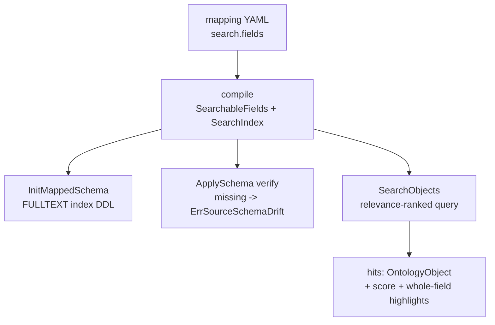
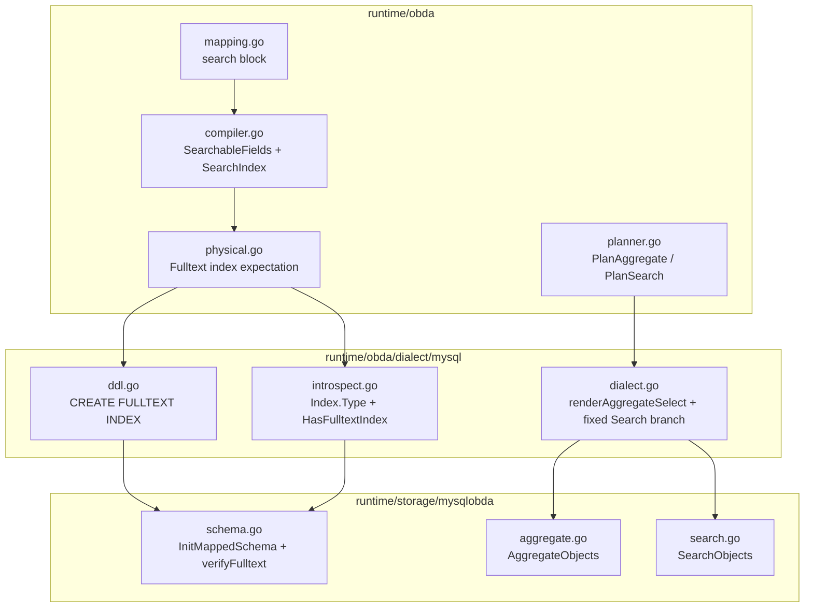

# mysqlobda Aggregate and Search - Plan

## Goal Capsule

- **Objective:** 为 `runtime/storage/mysqlobda` 补齐 `AggregateObjects` 与 `SearchObjects` 两个 SPI 接口。聚合编译为原生 GROUP BY；搜索按 obda-spec-v3 既定闭环落地，打通"映射声明 → FULLTEXT 索引 → 全文检索"整条链路。
- **Product authority:** 2026-09-10 对话逐项确认：契约取 spec-v3 闭环（非 memory provider 行为对齐）；映射用模型级 `search.fields`；Init 建索引 + ApplySchema 强制 verify；`query.Fields` 只接受空或全等、不匹配报 `ErrUnsupportedCapability`；三个查询接口 filter 统一为仅 eq 并顺带修复 QueryObjects 的静默 eq 缺陷；score/高亮取 MySQL 原生口径。
- **Open blockers:** 无。全部五个 Deferred to Planning 问题已在 Planning Contract 中作为 KTD 落定。
- **Execution domain:** Go 代码（`runtime/obda`、`runtime/obda/dialect/mysql`、`runtime/storage/mysqlobda`）。
- **Stop conditions:** 阻塞即停的条件——实现中发现需求文档的 R-IDs 与代码现实冲突（需回改 Product Contract），或 MySQL 集成环境（`TEST_DB_URL`）不可用导致语义锁测试全部无法运行。

---

## Product Contract

*Preservation note: Product Contract 承自 brainstorm，经 doc-review 三处修正——R6 不再要求填充 `SearchIndex`（守卫迁至 SearchableFields）、R12 补 `Omit.DeletedAt` 例外（与 R4 对齐）、AE6 标签改为仅 R1；其余 R1–R14/AE1–AE8 文本原样。enrichment 自 Planning Contract 起。*

### Summary

mysqlobda 落地 `AggregateObjects`（SQL GROUP BY 原生聚合）与 `SearchObjects`（基于映射声明的 FULLTEXT 检索）。映射文档新增模型级 `search.fields` 声明；未声明 searchable 的模型执行非空搜索时报 `ErrUnsupportedCapability`，空白 query 返回空结果。三个查询接口（Query/Aggregate/Search）的 filter 行为统一为仅支持单叶子 eq，其余显式报错。

### Problem Frame

mysqlobda 是按计划分阶段收口的 OBDA provider：CRUD、Traverse、QueryObjects 已落地，`AggregateObjects`/`SearchObjects` 仍继承 `spi.UnimplementedStorageProvider` 返回 `ErrUnimplemented`（`runtime/storage/mysqlobda/provider.go:35`）。设计规格已写明这两个接口的既定闭环（`docs/design/obda-spec-v3.md:1147`），但链路是断的：`CompiledModel.SearchIndex`/`SearchableFields` 字段存在却无任何映射路径赋值（`runtime/obda/compiler.go:33`）；`sqlast.AggregateSelect` 已声明却无任何方言渲染（`runtime/obda/sqlast/ast.go:117`）；MySQL 方言的全文检索渲染丢 ORDER BY/LIMIT 且不追加绑定参数（`runtime/obda/dialect/mysql/dialect.go:133`）。补齐这两个接口因此不是单点实现，而是把半截链路接通。同时核验发现 QueryObjects 的 filter 编译从不检查 `FilterExpression.Operator`，非 eq 操作符被静默当作等值比较执行（`runtime/storage/mysqlobda/query.go:120`、`runtime/obda/planner.go:437`）——新接口若照抄会继承错误行为，本次一并修正。

### Key Decisions

- **契约取 spec-v3 闭环，不向 memory provider 行为对齐。** 搜索需要映射声明才可用；跨 provider 的打分数值不承诺一致。聚合因 SQL 与 memory 语义天然同构（NULL 分组、count 跳 NULL 等），实际分歧仅剩零组边界（见 R5）。
- **`search.fields` 采用模型级声明块。** 与既有 `identity:`/`tenant:`/`system:` 风格一致；编译为 searchable 物理列集合与一个复合 FULLTEXT 索引；verify 按列清单核对索引存在，不关心索引名。
- **Init 建索引、ApplySchema 强制 verify。** `InitMappedSchema` 发射 FULLTEXT 索引 DDL；`verifyMappedSchema` 核对缺失报 `ErrSourceSchemaDrift`——与唯一索引处理对称，声明即契约、fail-closed。
- **`query.Fields` 只接受空或与声明集合全等。** 不匹配报 `ErrUnsupportedCapability`：复合 FULLTEXT 索引服务不了子集检索，诚实报错优于静默忽略；且不新造 sentinel（`ErrInvalidArgument` 在代码库与 spec 中均不存在）。
- **score 与高亮取 MySQL 原生口径。** score 用全文相关性原值并按其降序；高亮返回声明 searchable 字段的整字段值，不做逐字段命中检测（逐列 MATCH 需要逐列索引，不值得）。
- **filter 三接口统一为仅 eq，顺带修复 QueryObjects。** 非 eq 操作符与 And/Or/Not 复合一律显式报错；QueryObjects 不再把非 eq 静默编译为等值比较。filter 编译能力扩展（更多操作符、复合条件）是独立后续任务。

### Requirements

**聚合（AggregateObjects）**

- R1. 聚合编译为单条原生 GROUP BY 查询，函数集为 count/sum/avg/min/max；`count` 配 `*` 计行数、配字段计非 NULL 值数。
- R2. 校验前置：`Fields` 为空报错；函数名不在支持集报错，即使零行命中也报。校验错误为普通错误文本，不新增 error sentinel。
- R3. 聚合值默认别名为 `fn_field`；`OrderBy` 先解析 groupBy 字段、再解析聚合别名，未知名报错；`TotalGroups` 在分页切片前计算。
- R4. 聚合恒排除软删除对象（`deleted_at IS NULL`，映射 `Omit.DeletedAt` 除外）并保持租户隔离。
- R5. 零命中边界取 SQL 原生行为：无 groupBy → 单组（count 为 0，其余 NULL）；有 groupBy → 零组。与 memory provider 的分歧已知并接受。

**搜索映射与 DDL（search.fields 链路）**

- R6. 映射文档模型级新增 `search.fields`（逻辑字段列表），parse/validate/compile 打通至 `SearchableFields`（物理列）；validate 拒绝引用模型上不存在的逻辑字段。
- R7. 声明了 `search.fields` 的模型：`InitMappedSchema` 为声明列发射复合 FULLTEXT 索引；`verifyMappedSchema` 按列清单核对索引存在，缺失报 `ErrSourceSchemaDrift`。
- R8. searchable 列须为可全文索引的文本类列，不可索引时在验证环节失败。



**搜索行为（SearchObjects）**

- R9. 无 searchable 映射且 query 非空 → `ErrUnsupportedCapability`（不是空结果）；空白 query → 空 hits、TotalCount 为 0，无论有无映射。
- R10. `query.Fields` 为空搜索声明集合；非空时必须与声明集合元素全等，否则 `ErrUnsupportedCapability`。
- R11. 结果按全文相关性降序；score 为相关性原值；高亮为声明 searchable 字段的整字段值。
- R12. 命中对象经既有行装配路径产出 `OntologyObject`；软删除排除（`deleted_at IS NULL`，映射 `Omit.DeletedAt` 除外）并保持租户隔离；TotalCount/HasNextPage 分页语义与 QueryObjects 一致。

**Filter 统一（三接口，含 QueryObjects 修复）**

- R13. QueryObjects、AggregateObjects、SearchObjects 的 `FilterExpression` 统一：单叶子 eq 编译执行；非 eq 操作符（ne/gt/gte/lt/lte/in/contains/startsWith/exists）与 And/Or/Not 复合一律显式报错。修复 QueryObjects 现状的非 eq 静默当 eq。

**方言与计划器（链路收口）**

- R14. MySQL 方言可渲染聚合查询与带 ORDER BY、LIMIT/OFFSET、绑定参数的全文检索语句；既有全文渲染丢排序分页、丢参数的缺陷一并修复。

### Acceptance Examples

- AE1. **Covers R9.** Given 模型未声明 `search.fields`，When 以非空 query 调用 `SearchObjects`，Then 返回 `ErrUnsupportedCapability` 而非空结果。
- AE2. **Covers R9.** Given 任意模型（含已声明 searchable 的），When query 为空白（`""` 或 `"   "`），Then 返回空 hits、TotalCount 为 0、无错误。
- AE3. **Covers R10.** Given 声明 `search.fields: [name, city]`，When `query.Fields` 传 `[name]` 或 `[name, city, addr]`，Then 返回 `ErrUnsupportedCapability`。
- AE4. **Covers R5.** Given 无匹配行且无 groupBy，When 聚合，Then 返回单个空 Keys 组，count 值为 0，sum/avg/min/max 为 nil。
- AE5. **Covers R5.** Given 无匹配行且带 groupBy，When 聚合，Then 返回零组、TotalGroups 为 0。
- AE6. **Covers R1.** Given 三行数据其中一行某字段为 NULL，When `count(field)`，Then 值为 2；When `sum(field)` 且无非空数值，Then 值为 nil。
- AE7. **Covers R13.** Given 任一查询接口，When filter 操作符为 `ne`（或嵌套 And/Or），Then 返回显式错误；QueryObjects 修复后不再静默按 eq 执行。
- AE8. **Covers R7.** Given 映射声明了 `search.fields` 且物理表缺 FULLTEXT 索引，When `ApplySchema`，Then 返回 `ErrSourceSchemaDrift`。

### Scope Boundaries

- sqliteobda 的同款补齐不在本次范围（该 provider 此两接口维持 `ErrUnimplemented`）；sqlite dialect 的 Search 渲染分支有同款早退缺陷，但无生产调用方，同样不动。
- filter 编译能力扩展（And/Or 递归、比较/集合操作符）为独立后续任务，扩展后三接口同时受益。
- BulkMutate、temporal、EnsureIndex 系列 SPI 不动；memory provider 不改（它是语义参照，不是实现目标）。
- 子集检索与多索引组声明（每个字段组合一个 FULLTEXT 索引）不做，需要时再扩展映射语法。
- 不做跨 provider 打分归一或相关性标准化。
- **随实现提交的伴随产出：**`docs/solutions/` 沉淀本次 FULLTEXT DDL/verify 与 filter 统一决策（沿 `docs/solutions/design-patterns/mysql-port-divergence-of-active-unique-index.md` 的格式）——属 DoD 门槛，非后续独立任务。

### Dependencies / Assumptions

- MySQL 8.0+ InnoDB，FULLTEXT 能力假定可用（沿用 `docs/plans/2026-08-27-001-feat-mysql-obda-provider-plan.md` 的假设）；`innodb_ft_min_token_size` 默认 3，短于 3 字符的词不命中——记为已知 MySQL 行为，非缺陷。
- 测试沿用既有基建：真实 MySQL 经 `TEST_DB_URL` 连接，未设置时 skip；包内无 sqlmock。
- `Capabilities()` 不变：`SupportsFullTextSearch` 已为 true（实现后声明与事实终于一致）；聚合无独立能力位。

### Sources / Research

- SPI 契约：`runtime/spi/ontology.go:289`（AggregateQuery/SearchQuery 类型）、`runtime/spi/errors.go:59`（ErrUnsupportedCapability 语义）、`runtime/spi/unimplemented.go:46`（现状 ErrUnimplemented）。
- 语义参照：`runtime/storage/memory/provider.go:1267`（聚合）与 `:1493`（搜索）——函数集、校验、软删除、别名、零组、打分/高亮语义出处。
- mysqlobda 现状：`runtime/storage/mysqlobda/query.go:12`（QueryObjects 模式：limit 默认/上限、COUNT 子查询、limit+1）、`runtime/storage/mysqlobda/schema.go:14`（Init/verify 分工）、`runtime/storage/mysqlobda/query.go:120`（filter 现状，operator 未检查）。
- 断链证据：`runtime/obda/compiler.go:33`（SearchIndex/SearchableFields 无赋值路径）、`runtime/obda/planner.go:98`（PlanSearch 无生产调用方）、`runtime/obda/sqlast/ast.go:117`（AggregateSelect 无渲染）、`runtime/obda/dialect/mysql/dialect.go:133`（Search 渲染缺陷）。
- 规格与先例：`docs/design/obda-spec-v3.md:1129`、`:1147`（既定闭环）、`docs/plans/2026-08-27-001-feat-mysql-obda-provider-plan.md`（FULLTEXT 假设与 R4）。
- 机构学习：`docs/solutions/design-patterns/mysql-port-divergence-of-active-unique-index.md`——DDL 与 introspection 共享常量、显式 `ErrUnsupportedCapability` 守卫、精确 DDL 文本断言 + 真实 MySQL 集成测试锁语义。

---

## Planning Contract

### Key Technical Decisions

- **KTD1: 分页默认值对齐 QueryObjects。** 聚合与搜索的 `Limit` 沿用 `<=0 → 100`、硬上限 1000、`Offset >= 0`（`runtime/storage/mysqlobda/query.go:65-77` 模式）。理由：provider 内三个查询接口行为一致，且避免大表上的无界 GROUP BY/搜索结果集。接受的分歧：memory 聚合 `limit<=0` 意为全量——这是计划层新增的分页分歧，不在 Product Contract 首条 Key Decision 的值语义分歧清单内（该清单只覆盖聚合值语义，零组边界见 R5）；取向一致（契约取 MySQL 原生）。
- **KTD2: 排序确定性靠聚合安全的 tiebreak。** MySQL 8 默认 `sql_mode=ONLY_FULL_GROUP_BY` 拒绝 GROUP BY 查询的 ORDER BY 引用未分组/非聚合列——聚合的 tiebreak 不能用裸 identity 列，改为追加隐藏聚合列 `MIN(`<identity>`)`（别名如 `of_tiebreak`），用户 OrderBy（组键/聚合别名）之后按它排序；搜索无 GROUP BY 限制，固定 `of_score DESC` 后接 identity 裸列 tiebreak。计数子查询去除 ORDER BY（COUNT 不需要序）。理由：保留 QueryObjects identity-tiebreak 的稳定翻页意图（`query.go:52-54`）同时满足 ONLY_FULL_GROUP_BY。
- **KTD3: FULLTEXT 索引 DDL 为独立语句，命名留在方言层。** `MappedTableStatements` 对声明 search 的模型追加 `CREATE FULLTEXT INDEX` 语句（镜像 `uniqueIndex` 模式，`runtime/obda/dialect/mysql/ddl.go:272`）；索引名 `ft_<table>` 的派生 helper 放 MySQL 方言包内（与 `uniqueIndexName`、`ActiveKeyColumn` 同层，不把 MySQL 命名约定烧进方言中立的 obda 层）。introspection 验证按列清单 + FULLTEXT 类型匹配、不关心索引名（R7），派生名的唯一消费方是 DDL 发射——验证不依赖名称即无共享漂移面。
- **KTD4: 计数一律 COUNT 子查询。** `TotalGroups`/`TotalCount` 用 `SELECT COUNT(*) FROM (<去 Limit 与 ORDER BY 的查询>) AS q`（`query.go:55-64` 模式）。理由：与 QueryObjects 一致；GROUP BY 子查询计数天然正确（无 groupBy 时恒为 1，与 R5 单组语义吻合）。
- **KTD5: R8 双层执行。** compile 时校验 searchable 逻辑字段的 PropertyTypes 落在文本族（非 int/long/bool/double/float/decimal，对照 `ddl.go:299` `sqlType` 的数值/布尔集合），违规报 `ErrInvalidMapping`；verify 时按列清单核对 FULLTEXT 索引存在，缺失报 `ErrSourceSchemaDrift`。理由：映射自带类型信息，早失败；物理现实由 introspection 兜底。
- **KTD6: 搜索 SQL 形状与参数位次。** WHERE 渲染为 `WHERE (tenant = ?) AND MATCH (cols) AGAINST (?) [AND deleted_at IS NULL]`——租户参数位 1；SELECT 追加 score 列 `MATCH (cols) AGAINST (?) AS of_score`，SELECT 与 WHERE 两处 MATCH 各占一个 `?`，参数由 planner 复制：`PlanSearch` 返回 args `[tenant, query, query]`（位次 1 租户、2/3 两处 MATCH），分页调用再追加 `limit+1`/`offset`；`ORDER BY of_score DESC` 用别名排序（MySQL 支持，且聚合外的 SELECT 无 ONLY_FULL_GROUP_BY 限制）；Search 分支修复后落入共享的 ORDER BY/LIMIT 渲染路径而非早退。MATCH 列清单由 planner 从 `SearchableFields` 填充（`FullTextMatch` 增加列集表示）；`PlanSearch` 的空映射守卫从 `SearchIndex == ""` 迁移为 `len(SearchableFields) == 0`，`CompiledModel.SearchIndex` 不再要求填充（索引名只在 MySQL 方言层派生，见 KTD3）。
- **KTD7: 聚合 AST 扩展 + provider 新文件。** `AggregateSelect` 补 `Order` 字段（现有 `LimitOffset` 已含 Offset），MySQL `Render` 增加 case；新增 planner 函数 `PlanAggregate` 保持 `PlanX(binding, tenant, ...) (stmt, args, error)` 形态；provider 侧新建 `aggregate.go`/`search.go` 镜像 `query.go` 的 pin→translate→plan→render→scan 结构，均直连 `p.db`（与 QueryObjects 一致）。
- **KTD8: filter 收紧规则。** `Operator == ""` 或 `"eq"` 视作 eq（保留现状默认值语义），其余操作符与 And/Or/Not 一律 `fmt.Errorf("%w: unsupported filter ...", spi.ErrInvalidMapping)`；同时收紧 `planner.compileFilter`（`planner.go:437`）与 provider `translateFilter`（`query.go:120`）两处。
- **KTD9: 映射 search 块语义。** `search: {fields: [逻辑字段名]}`，空列表报 `ErrInvalidMapping`（声明即意图）；解析沿现状非严格 YAML（拼写错误的键被静默忽略的风险见 Risks）。错误类型分两轨：search 块校验（空列表、字段不存在、非文本族）一律报 `ErrInvalidMapping`（映射错误 sentinel）；聚合入参校验（R2）用普通 `fmt.Errorf` 文本（镜像 memory 的校验文本），不新增 sentinel。

### High-Level Technical Design

各单元在三层包间的数据流（实线 = 本次新增/修改的路径）：



方向性 SQL 形状（非实现规范）：

```sql
-- 聚合（U3/U5）
SELECT `city`, COUNT(`x`) AS `count_x`, SUM(`amount`) AS `sum_amount`
FROM `t` WHERE `tenant` = ? AND `deleted_at` IS NULL
GROUP BY `city` ORDER BY `city` ASC, MIN(`id`) ASC LIMIT ? OFFSET ?;

-- 搜索（U4/U6）
SELECT `cols...`, MATCH (`name`, `city`) AGAINST (?) AS `of_score`
FROM `t`
WHERE (`tenant` = ?) AND MATCH (`name`, `city`) AGAINST (?) AND `deleted_at` IS NULL
ORDER BY `of_score` DESC, `id` ASC LIMIT ? OFFSET ?;
```

### Assumptions

- filter 的 `Operator == ""` 默认 eq：现有测试与调用方（`planner_test.go`、memory 语义）按此保留；若执行时发现依赖其他默认，在单元内修正并记录。
- InnoDB 默认全文 parser（非 ngram）、默认 stopword 表；测试 fixture 使用 ≥3 字符的常见英文词规避 `innodb_ft_min_token_size` 噪声。
- `InspectTable` 的指纹只含列不含索引（`introspect.go:57-63`）——加 FULLTEXT 索引不会触发 HealthCheck 漂移 fail-closed；与唯一索引现状一致，接受。

### Risks

- **非严格 YAML 解析掩盖 search 块拼写错误**（`search.feilds` 被静默忽略 → 运行时报 unsupported 而非解析错误）。缓解：U1 编译产物单测断言 `SearchableFields` 非空；全局改严格解析超范围，不做。
- **InnoDB FULLTEXT 行为差异**（min token、stopwords、相关性数值不稳定）。缓解：集成测试断言排序关系与 score>0，不断言具体 score 数值。
- **参数位次回归**：Search 渲染涉及 `Param{Position}` 复用，改错会静默错位。缓解：U4 渲染金样断言完整 SQL 文本 + 集成测试端到端验证。

---

## Implementation Units

### U1. Mapping `search` block: parse, compile, physical expectation

- **Goal:** `search.fields` 声明从 YAML 进到 `CompiledModel.SearchableFields`（物理列），并在 physical 层产出索引用期望。`SearchIndex` 不再由编译填充（守卫迁至 SearchableFields，见 KTD6）。
- **Requirements:** R6, R8（类型校验半层）。
- **Dependencies:** 无。
- **Files:** `runtime/obda/mapping.go`（Model 增 `Search` 块结构）、`runtime/obda/compiler.go`（compileModel 填充与校验）、`runtime/obda/physical.go`（PhysicalTable 增 fulltext 期望）、`runtime/obda/compiler_test.go`、`runtime/obda/physical_test.go`。
- **Approach:** `SearchSpec{Fields []string}` 挂 Model；`compileModel` 在 FieldByLogical 建成后校验：列表非空、每个逻辑字段存在、PropertyTypes 属文本族（KTD5/KTD9），填充 `SearchableFields`（`SearchIndex` 不再要求填充，KTD6 守卫迁移）；`Binding()` 已透传 search 字段（`compiler.go:117-125`），无需改。physical 层只携带列清单期望（FULLTEXT 索引名在 MySQL 方言内派生，KTD3）。
- **Patterns to follow:** identity 列校验（`compiler.go:266-272`）；`OmitFlags` 解析（`mapping.go:88-112`）。
- **Test scenarios:**
  - 声明两个合法 string 字段 → SearchableFields 为对应物理列；SearchIndex 保持零值。
  - 引用不存在的逻辑字段 → `ErrInvalidMapping`。
  - 引用 int/bool 类型字段 → `ErrInvalidMapping`（R8）。
  - `fields: []` → `ErrInvalidMapping`。
  - 未声明 search → 两字段保持零值；physical 表无 fulltext 期望。
  - 声明后 physical 期望含列清单。
- **Verification:** `go test ./obda/...` 绿；编译产物字段断言通过。

### U2. FULLTEXT DDL emission + index introspection + verify

- **Goal:** InitMappedSchema 发射 FULLTEXT 索引；ApplySchema 按列清单强制核对，缺失 fail-closed。
- **Requirements:** R7, R8（物理兜底层）。
- **Dependencies:** U1。
- **Files:** `runtime/obda/dialect/mysql/ddl.go`（发射语句）、`runtime/obda/dialect/mysql/introspect.go`（Index 增 Type、`HasFulltextIndex`）、`runtime/storage/mysqlobda/schema.go`（verifyFulltext）、`runtime/obda/dialect/mysql/ddl_test.go`、`runtime/storage/mysqlobda/apply_schema_test.go`。
- **Approach:** `MappedTableStatements` 在 unique 语句后追加 `CREATE FULLTEXT INDEX` 语句（名称由方言内 helper 派生 `ft_<table>`，与 `uniqueIndexName` 同层，KTD3）；`InspectIndexes` 增选 `INDEX_TYPE`；`HasFulltextIndex(indexes, columns)` 按 sorted 列清单 + FULLTEXT 类型匹配（镜像 `HasUniqueIndex`，`introspect.go:137`）；`verifyMappedSchema` 对带期望的表执行核对（镜像 `verifyUniques`）。
- **Patterns to follow:** `uniqueIndex` DDL（`ddl.go:272`）；`ActiveKeyColumn` 共享常量先例（机构学习）；`TestHasUniqueIndex`（`ddl_test.go:262`）。
- **Test scenarios:**
  - DDL 单测：声明 search 的模型，`MappedTableStatements` 含精确 `CREATE FULLTEXT INDEX` 文本（列序、反引号、名称）。
  - `HasFulltextIndex` 单测：列清单全等命中；BTREE 同列不命中；列序不同命中（排序后比较）。
  - 集成：Init 后 ApplySchema 成功；手工建表缺索引 → `ErrSourceSchemaDrift`。Covers AE8.
  - 集成：未声明 search 的模型不发射、不核对。
- **Verification:** `go test ./obda/dialect/mysql/...` 绿；`TEST_DB_URL` 下 mysqlobda 集成绿。

### U3. Aggregate AST + MySQL render

- **Goal:** `AggregateSelect` 可被 MySQL 方言完整渲染（GROUP BY、聚合函数、ORDER BY、LIMIT/OFFSET 占位符）。
- **Requirements:** R14（聚合半边）。
- **Dependencies:** 无（与 U1/U2 并行可行）。
- **Files:** `runtime/obda/sqlast/ast.go`（AggregateSelect 增 `Order []Order`）、`runtime/obda/dialect/mysql/dialect.go`（`renderAggregateSelect` + Render case）、`runtime/obda/dialect/mysql/dialect_test.go`。
- **Approach:** 渲染 `SELECT groupCols..., aggs... FROM t WHERE ... GROUP BY cols ORDER BY ... LIMIT ? OFFSET ?`；聚合函数白名单映射 count/sum/avg/min/max → SQL 同名；`Field == "*"` 仅对 count 合法（count(*)），其他 fn 配 `*` 由 provider 校验拒绝（R2 层）；未知构造返回 `ErrUnsupportedCapability`（守卫先例 `dialect.go:53`）。
- **Patterns to follow:** `renderSelect` 的 ORDER/LIMIT 段（`dialect.go:155-172`）；INSERT 精确文本断言（`dialect_test.go:118`）。
- **Test scenarios:**
  - 渲染含 GROUP BY 列、聚合别名、ORDER BY 方向、`LIMIT ? OFFSET ?`。
  - 无 groupBy：合法（平铺单组）。
  - 未知 fn → `ErrUnsupportedCapability`。
- **Verification:** 渲染断言绿。

### U4. Search planner + fixed Search render

- **Goal:** `PlanSearch` 产出列清单完整的 FullTextMatch；MySQL Search 分支渲染 score 列、正确 WHERE 形状、落入 ORDER BY/LIMIT 路径。
- **Requirements:** R14（搜索半边）、R11（score 排序的渲染基础）。
- **Dependencies:** U1（SearchableFields 来源）。
- **Files:** `runtime/obda/sqlast/ast.go`（FullTextMatch 增列集表示）、`runtime/obda/planner.go`（PlanSearch 填列）、`runtime/obda/dialect/mysql/dialect.go`（Search 分支重写）、`runtime/obda/planner_test.go`、`runtime/obda/dialect/mysql/dialect_test.go`。
- **Approach:** KTD6：WHERE 为 `(tenant=?) AND MATCH (cols) AGAINST (?)`；`Search != nil` 时渲染自动追加 `of_score` 选列与 `ORDER BY of_score DESC` 前置；不再早退；sqlite dialect 不动（Scope Boundaries）。
- **Patterns to follow:** 既有 `TestPlanSearchHasFullTextMatchWithoutFTSKeyword` 只约束 planner（`planner_test.go:97`），方言层新增 MATCH 金样。
- **Test scenarios:**
  - planner：SearchableFields 非空 → FullTextMatch 带全部列、args `[tenant, query, query]`（SELECT + WHERE 两处 MATCH）；空 SearchableFields → `ErrUnsupportedCapability`（守卫自 `SearchIndex` 迁移，更新 planner_test 既有 binding 构造）。
  - 渲染金样：完整 SQL 文本含 `MATCH (`col1`, `col2`) AGAINST (?)`、`AS `of_score``、`ORDER BY `of_score` DESC`、`LIMIT ? OFFSET ?`，WHERE 租户在前。
  - Search + Where + Order 共存：`of_score DESC` 前置后接显式 Order。
- **Verification:** planner + 渲染断言绿。

### U5. Provider AggregateObjects

- **Goal:** mysqlobda 落地 `AggregateObjects` 端到端。
- **Requirements:** R1-R5；AE4, AE5, AE6。
- **Dependencies:** U3（渲染）、U7 同文件族的 filter 语义（可先行用现有 translateFilter，U7 收紧后自动生效）。
- **Files:** `runtime/storage/mysqlobda/aggregate.go`（新）、`runtime/obda/planner.go`（PlanAggregate）、`runtime/storage/mysqlobda/aggregate_test.go`（新，集成）。
- **Approach:** pin → model → 前置校验（空 Fields / 非法 fn / `*` 非 count，普通错误文本，R2）→ groupBy/agg 字段经 FieldByLogical 转列，未知报 `ErrInvalidMapping` → translateFilter（eq only；`Filter` 为 nil 视为无过滤）→ PlanAggregate（租户位 1，KTD7）→ 追加 deleted_at is_null（Omit 除外，R4）→ Order 解析（groupBy 逻辑名 → 聚合别名 → 报错，R3）+ `MIN(identity)` 隐藏 tiebreak 聚合列（KTD2，ONLY_FULL_GROUP_BY 安全）→ TotalGroups 计数子查询（去 Limit/ORDER BY，KTD4）→ limit/offset（KTD1）→ 扫描组装 `AggregateGroup{Keys: 逻辑名→值, Values: 别名→值(NULL→nil)}`。零行语义由 SQL 天然给出（R5）。
- **Patterns to follow:** `query.go` 全流程（pin/order/tiebreak/计数/limit+扫描）；memory 校验文本（`memory/provider.go:1274-1283`）。
- **Test scenarios:**（集成，TEST_DB_URL）
  - 多组分组 + count/sum/avg/min/max 各函数值正确。
  - Covers AE4. 无 groupBy 零命中 → 单组 count=0、其余 nil。
  - Covers AE5. 有 groupBy 零命中 → 零组、TotalGroups=0。
  - Covers AE6. count(field) 跳 NULL；sum 无数值 → nil。
  - 软删除行排除；跨租户隔离。
  - OrderBy 按组键与按别名均可；未知名报错；limit/offset/TotalGroups 分页正确。
  - 空 Fields / 非法 fn / `sum` 配 `*` → 错误。
  - filter eq 生效。
- **Verification:** 集成全绿；`errors.Is` 断言用 `ErrInvalidMapping`。

### U6. Provider SearchObjects

- **Goal:** mysqlobda 落地 `SearchObjects` 端到端。
- **Requirements:** R9-R13；AE1, AE2, AE3, AE7。
- **Dependencies:** U4、U2（集成 fixture 需经 InitMappedSchema 的 FULLTEXT DDL 建表）。
- **Files:** `runtime/storage/mysqlobda/search.go`（新）、`runtime/storage/mysqlobda/search_test.go`（新，集成）。
- **Approach:** pin → model → 空白 query（trim 后空）→ 空 hits（AE2，无论有无映射）→ 无 SearchableFields 且非空 → `ErrUnsupportedCapability`（AE1）→ `query.Fields` 集合与声明全等校验，不等 → `ErrUnsupportedCapability`（AE3，排序后比较；含未知字段名同走此分支）→ translateFilter（eq only；`Filter` 为 nil 视为无过滤）→ PlanSearch → deleted_at is_null（`Omit.DeletedAt` 除外，R12）→ identity tiebreak Order（KTD2/KTD6）→ TotalCount 计数子查询 → limit+1 取数 → 行经 `assemble` 产出对象，Score 取 of_score（float），Highlights 为 searchable 逻辑字段的字符串整值（KTD 口径）→ HasNextPage。
- **Patterns to follow:** `query.go` 计数/limit+1/扫描循环；`objects.go` assemble。
- **Test scenarios:**（集成；fixture 词 ≥3 字符）
  - 相关性排序：两行命中度不同的词，高者在前；score 均 > 0。
  - Covers AE1/AE2/AE3 三条错误与空结果分支。
  - 软删除行永不命中；跨租户隔离。
  - filter eq 生效；Covers AE7. `ne`/嵌套 And filter → 显式错误。`query.Fields` 含未知字段 → 集合不等 → `ErrUnsupportedCapability`。
  - limit/offset/HasNextPage/TotalCount 正确。
  - Highlights 含整字段值；未声明 search 的字段不参与。
- **Verification:** 集成全绿。

### U7. Filter unification (both compile sites)

- **Goal:** 三接口 filter 统一为单叶子 eq；修复 QueryObjects 静默 eq。
- **Requirements:** R13；AE7。
- **Dependencies:** 无（建议在 U5/U6 前落地，语义即时生效）。
- **Files:** `runtime/obda/planner.go`（compileFilter）、`runtime/storage/mysqlobda/query.go`（translateFilter）、`runtime/obda/planner_test.go`、`runtime/storage/mysqlobda/query_test.go`。
- **Approach:** KTD8：两处增 `Operator` 检查——`""`/`"eq"` 放行，其余报 `ErrInvalidMapping`（含操作符名）；And/Or/Not 拒绝保持既有文本。共享层收紧同时改变 sqliteobda.QueryObjects 的 filter 行为（其经 `obda.PlanQuery` 使用 compileFilter）：非 eq 从静默变显式报错，属预期一致化；既有 sqliteobda 测试只传空/eq filter，回归保持绿。
- **Test scenarios:**
  - planner 单测：`Operator: "gt"` → `ErrInvalidMapping`；`Operator: "eq"` 正常；`""` 正常；And 复合 → 错误。
  - 集成：Covers AE7. QueryObjects 传 `ne` filter → 错误返回（不再静默 eq）。
  - 回归：现有 eq filter 查询测试保持绿。
- **Verification:** 单测 + 集成绿。

---

## Verification Contract

- **单元与门禁（无环境依赖）:** `cd runtime && go vet ./... && gofmt -l .`（输出为空）与 `go test ./...`——未设 `TEST_DB_URL` 时集成用例自动 skip，其余全绿。
- **语义锁（需真实 MySQL）:** `TEST_DB_URL=<mysql8-dsn>` 下 `go test ./storage/mysqlobda/... ./obda/dialect/mysql/...`——AE1-AE8 与相关性排序等 DB 强制不变式全部执行。
- **回归:** `go test ./storage/memory/... ./storage/sqliteobda/... ./obda/...` 保持绿（memory 不改；sqliteobda 代码不动，其 QueryObjects filter 行为随共享 compileFilter 一致化收紧，见 U7）。
- **渲染金样:** U3/U4 的精确 SQL 文本断言在 `mysql_test` 内，无环境依赖即跑。

## Definition of Done

- U1-U7 全部完成；R1-R14 各有对应实现与测试；AE1-AE8 均有测试覆盖并通过。
- 带 `TEST_DB_URL` 的全量测试绿；不带时（skip 模式）同样绿；`go vet`/`gofmt` 干净。
- QueryObjects 行为变化（filter 收紧）有测试固化；无遗留的实验/死代码残留在 diff 中。
- 已知行为（min token 长度、fail-closed verify）在代码注释处有说明。
- 随实现提交的伴随产出（`docs/solutions/` 沉淀条目）已写入并随实现 PR 提交。
