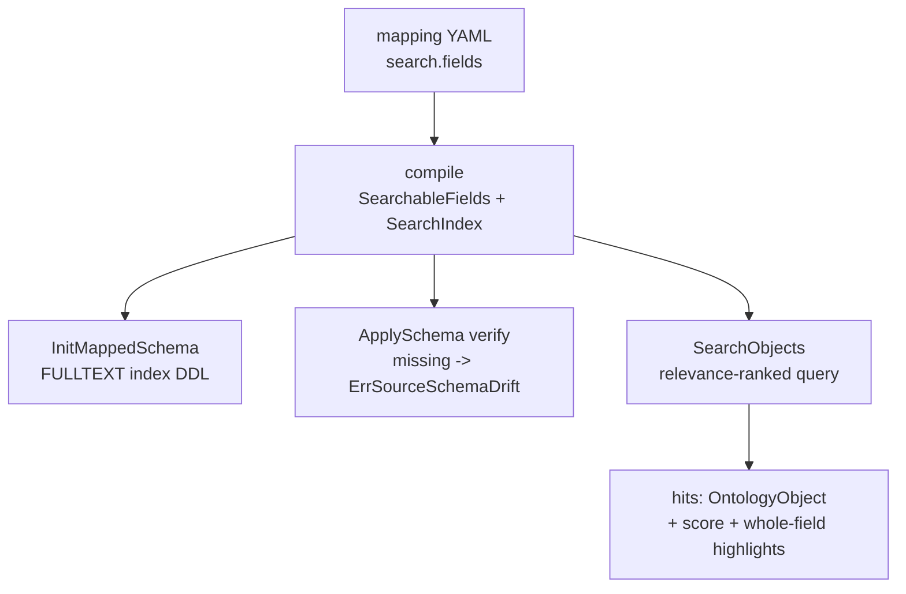

# mysqlobda Aggregate and Search - Plan

## Goal Capsule

- **Objective:** 为 `runtime/storage/mysqlobda` 补齐 `AggregateObjects` 与 `SearchObjects` 两个 SPI 接口。聚合编译为原生 GROUP BY；搜索按 obda-spec-v3 既定闭环落地，打通"映射声明 → FULLTEXT 索引 → 全文检索"整条链路。
- **Product authority:** 2026-09-10 对话逐项确认：契约取 spec-v3 闭环（非 memory provider 行为对齐）；映射用模型级 `search.fields`；Init 建索引 + ApplySchema 强制 verify；`query.Fields` 只接受空或全等、不匹配报 `ErrUnsupportedCapability`；三个查询接口 filter 统一为仅 eq 并顺带修复 QueryObjects 的静默 eq 缺陷；score/高亮取 MySQL 原生口径。
- **Open blockers:** 无阻塞规划的事项；分页默认值等实现取舍见 Outstanding Questions。
- **Execution domain:** Go 代码（`runtime/obda`、`runtime/obda/dialect/mysql`、`runtime/storage/mysqlobda`）。

---

## Product Contract

### Summary

mysqlobda 落地 `AggregateObjects`（SQL GROUP BY 原生聚合）与 `SearchObjects`（基于映射声明的 FULLTEXT 检索）。映射文档新增模型级 `search.fields` 声明；未声明 searchable 的模型执行非空搜索时报 `ErrUnsupportedCapability`，空白 query 返回空结果。三个查询接口（Query/Aggregate/Search）的 filter 行为统一为仅支持单叶子 eq，其余显式报错。

### Problem Frame

mysqlobda 是按计划分阶段收口的 OBDA provider：CRUD、Traverse、QueryObjects 已落地，`AggregateObjects`/`SearchObjects` 仍继承 `spi.UnimplementedStorageProvider` 返回 `ErrUnimplemented`（`runtime/storage/mysqlobda/provider.go:35`）。设计规格已写明这两个接口的既定闭环（`docs/design/obda-spec-v3.md:1147`），但链路是断的：`CompiledModel.SearchIndex`/`SearchableFields` 字段存在却无任何映射路径赋值（`runtime/obda/compiler.go:33`）；`sqlast.AggregateSelect` 已声明却无任何方言渲染（`runtime/obda/sqlast/ast.go:117`）；MySQL 方言的全文检索渲染丢 ORDER BY/LIMIT 且不追加绑定参数（`runtime/obda/dialect/mysql/dialect.go:133`）。补齐这两个接口因此不是单点实现，而是把半截链路接通。同时核验发现 QueryObjects 的 filter 编译从不检查 `FilterExpression.Operator`，非 eq 操作符被静默当作等值比较执行（`runtime/storage/mysqlobda/query.go:120`、`runtime/obda/planner.go:437`）——新接口若照抄会继承错误行为，本次一并修正。

### Key Decisions

- **契约取 spec-v3 闭环，不向 memory provider 行为对齐。** 搜索需要映射声明才可用；跨 provider 的打分数值不承诺一致。聚合因 SQL 与 memory 语义天然同构（NULL 分组、count 跳 NULL 等），实际分歧仅剩零组边界（见 R5）。
- **`search.fields` 采用模型级声明块。** 与既有 `identity:`/`tenant:`/`system:` 风格一致；编译为 searchable 物理列集合与一个复合 FULLTEXT 索引；verify 按列清单核对索引存在，不关心索引名。
- **Init 建索引、ApplySchema 强制 verify。** `InitMappedSchema` 发射 FULLTEXT 索引 DDL；`verifyMappedSchema` 核对缺失报 `ErrSourceSchemaDrift`——与唯一索引处理对称，声明即契约、fail-closed。
- **`query.Fields` 只接受空或与声明集合全等。** 不匹配报 `ErrUnsupportedCapability`：复合 FULLTEXT 索引服务不了子集检索，诚实报错优于静默忽略；且不新造 sentinel（`ErrInvalidArgument` 在代码库与 spec 中均不存在）。
- **score 与高亮取 MySQL 原生口径。** score 用全文相关性原值并按其降序；高亮返回声明 searchable 字段的整字段值，不做逐字段命中检测（逐列 MATCH 需要逐列索引，不值得）。
- **filter 三接口统一为仅 eq，顺带修复 QueryObjects。** 非 eq 操作符与 And/Or/Not 复合一律显式报错；QueryObjects 不再把非 eq 静默编译为等值比较。filter 编译能力扩展（更多操作符、复合条件）是独立后续任务。

### Requirements

**聚合（AggregateObjects）**

- R1. 聚合编译为单条原生 GROUP BY 查询，函数集为 count/sum/avg/min/max；`count` 配 `*` 计行数、配字段计非 NULL 值数。
- R2. 校验前置：`Fields` 为空报错；函数名不在支持集报错，即使零行命中也报。校验错误为普通错误文本，不新增 error sentinel。
- R3. 聚合值默认别名为 `fn_field`；`OrderBy` 先解析 groupBy 字段、再解析聚合别名，未知名报错；`TotalGroups` 在分页切片前计算。
- R4. 聚合恒排除软删除对象（`deleted_at IS NULL`，映射 `Omit.DeletedAt` 除外）并保持租户隔离。
- R5. 零命中边界取 SQL 原生行为：无 groupBy → 单组（count 为 0，其余 NULL）；有 groupBy → 零组。与 memory provider 的分歧已知并接受。

**搜索映射与 DDL（search.fields 链路）**

- R6. 映射文档模型级新增 `search.fields`（逻辑字段列表），parse/validate/compile 打通至 `SearchableFields`（物理列）与 `SearchIndex`；validate 拒绝引用模型上不存在的逻辑字段。
- R7. 声明了 `search.fields` 的模型：`InitMappedSchema` 为声明列发射复合 FULLTEXT 索引；`verifyMappedSchema` 按列清单核对索引存在，缺失报 `ErrSourceSchemaDrift`。
- R8. searchable 列须为可全文索引的文本类列，不可索引时在验证环节失败。

**搜索行为（SearchObjects）**

- R9. 无 searchable 映射且 query 非空 → `ErrUnsupportedCapability`（不是空结果）；空白 query → 空 hits、TotalCount 为 0，无论有无映射。
- R10. `query.Fields` 为空搜索声明集合；非空时必须与声明集合元素全等，否则 `ErrUnsupportedCapability`。
- R11. 结果按全文相关性降序；score 为相关性原值；高亮为声明 searchable 字段的整字段值。
- R12. 命中对象经既有行装配路径产出 `OntologyObject`；软删除恒排除并保持租户隔离；TotalCount/HasNextPage 分页语义与 QueryObjects 一致。

**Filter 统一（三接口，含 QueryObjects 修复）**

- R13. QueryObjects、AggregateObjects、SearchObjects 的 `FilterExpression` 统一：单叶子 eq 编译执行；非 eq 操作符（ne/gt/gte/lt/lte/in/contains/startsWith/exists）与 And/Or/Not 复合一律显式报错。修复 QueryObjects 现状的非 eq 静默当 eq。

**方言与计划器（链路收口）**

- R14. MySQL 方言可渲染聚合查询与带 ORDER BY、LIMIT/OFFSET、绑定参数的全文检索语句；既有全文渲染丢排序分页、丢参数的缺陷一并修复。

### Acceptance Examples

- AE1. **Covers R9.** Given 模型未声明 `search.fields`，When 以非空 query 调用 `SearchObjects`，Then 返回 `ErrUnsupportedCapability` 而非空结果。
- AE2. **Covers R9.** Given 任意模型（含已声明 searchable 的），When query 为空白（`""` 或 `"   "`），Then 返回空 hits、TotalCount 为 0、无错误。
- AE3. **Covers R10.** Given 声明 `search.fields: [name, city]`，When `query.Fields` 传 `[name]` 或 `[name, city, addr]`，Then 返回 `ErrUnsupportedCapability`。
- AE4. **Covers R5.** Given 无匹配行且无 groupBy，When 聚合，Then 返回单个空 Keys 组，count 值为 0，sum/avg/min/max 为 nil。
- AE5. **Covers R5.** Given 无匹配行且带 groupBy，When 聚合，Then 返回零组、TotalGroups 为 0。
- AE6. **Covers R1, R3.** Given 三行数据其中一行某字段为 NULL，When `count(field)`，Then 值为 2；When `sum(field)` 且无非空数值，Then 值为 nil。
- AE7. **Covers R13.** Given 任一查询接口，When filter 操作符为 `ne`（或嵌套 And/Or），Then 返回显式错误；QueryObjects 修复后不再静默按 eq 执行。
- AE8. **Covers R7.** Given 映射声明了 `search.fields` 且物理表缺 FULLTEXT 索引，When `ApplySchema`，Then 返回 `ErrSourceSchemaDrift`。

### Scope Boundaries

- sqliteobda 的同款补齐不在本次范围（该 provider 此两接口维持 `ErrUnimplemented`）。
- filter 编译能力扩展（And/Or 递归、比较/集合操作符）为独立后续任务，扩展后三接口同时受益。
- BulkMutate、temporal、EnsureIndex 系列 SPI 不动；memory provider 不改（它是语义参照，不是实现目标）。
- 子集检索与多索引组声明（每个字段组合一个 FULLTEXT 索引）不做，需要时再扩展映射语法。
- 不做跨 provider 打分归一或相关性标准化。

### Dependencies / Assumptions

- MySQL 8.0+ InnoDB，FULLTEXT 能力假定可用（沿用 `docs/plans/2026-08-27-001-feat-mysql-obda-provider-plan.md` 的假设）；`innodb_ft_min_token_size` 默认 3，短于 3 字符的词不命中——记为已知 MySQL 行为，非缺陷。
- 测试沿用既有基建：真实 MySQL 经 `TEST_DB_URL` 连接，未设置时 skip；包内无 sqlmock。
- `Capabilities()` 不变：`SupportsFullTextSearch` 已为 true（实现后声明与事实终于一致）；聚合无独立能力位。

### Outstanding Questions

**Deferred to Planning**

- 聚合与搜索的默认 limit 与硬上限是否沿用 QueryObjects 的 100/1000。
- 聚合 OrderBy 的 tiebreak 是否沿用 identity 列；方向默认值。
- FULLTEXT 索引命名派生规则与 DDL 发射形式（建表内联 `FULLTEXT KEY` 或独立 `CREATE FULLTEXT INDEX`）。
- `TotalGroups`/`TotalCount` 计数查询形式（是否沿用 COUNT 子查询模式）。
- R8 的文本类列校验放在 compile/validate 还是 ApplySchema introspection 环节。

### Sources / Research

- SPI 契约：`runtime/spi/ontology.go:289`（AggregateQuery/SearchQuery 类型）、`runtime/spi/errors.go:59`（ErrUnsupportedCapability 语义）、`runtime/spi/unimplemented.go:46`（现状 ErrUnimplemented）。
- 语义参照：`runtime/storage/memory/provider.go:1267`（聚合）与 `:1493`（搜索）——函数集、校验、软删除、别名、零组、打分/高亮语义出处。
- mysqlobda 现状：`runtime/storage/mysqlobda/query.go:12`（QueryObjects 模式：limit 默认/上限、COUNT 子查询、limit+1）、`runtime/storage/mysqlobda/schema.go:14`（Init/verify 分工）、`runtime/storage/mysqlobda/query.go:120`（filter 现状，operator 未检查）。
- 断链证据：`runtime/obda/compiler.go:33`（SearchIndex/SearchableFields 无赋值路径）、`runtime/obda/planner.go:98`（PlanSearch 无生产调用方）、`runtime/obda/sqlast/ast.go:117`（AggregateSelect 无渲染）、`runtime/obda/dialect/mysql/dialect.go:133`（Search 渲染缺陷）。
- 规格与先例：`docs/design/obda-spec-v3.md:1129`、`:1147`（既定闭环）、`docs/plans/2026-08-27-001-feat-mysql-obda-provider-plan.md`（FULLTEXT 假设与 R4）。
