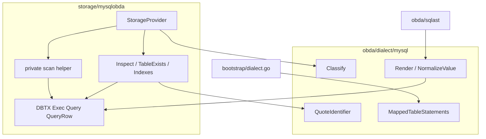
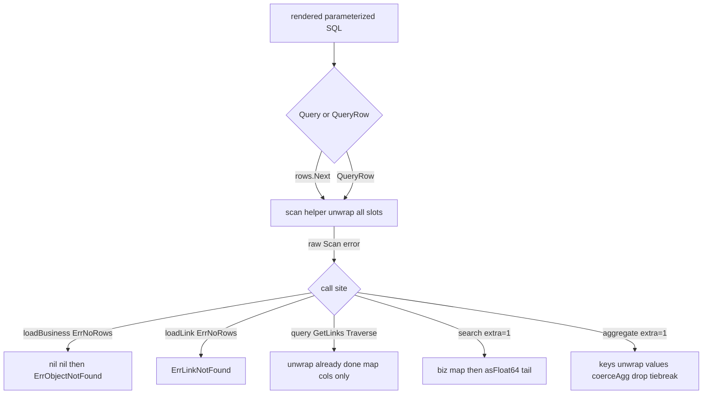

# refactor: mysqlobda scan helper and dialect introspect boundary

## Summary

`mysqlobda` 继续用 `database/sql` 执行 `sqlast` + `Dialect.Render` 产出的参数化 SQL，不引入 xorm。本轮抽包内位置扫描 helper 替换 7 处 `dest/ptrs` 样板，并把 `obda/dialect/mysql` 的活连接 introspect 迁入 `storage/mysqlobda`，让 dialect 只做纯渲染。`Classify`、DDL、quote 留在 dialect；sqlite 与共享 helper 不动。

---

## Problem Frame

`runtime/internal/orm/db.go` 已有 xorm Engine 构造，容易让人把 `mysqlobda` 的手写 `database/sql` 当成过时写法。`mysqlobda` 的表形来自运行时 mapping YAML，行落入 `map[string]any`，SQL 由 planner 闭包 AST 再经 dialect 渲染。xorm 的 struct 映射、`ScanInterfaceMaps` 按列名建 map、以及 `TZLocation` 转换层都会破坏 JOIN 同名列与 RFC3339 时间契约（see origin）。

同时 `obda/dialect/mysql` 声称只做 sqlast → SQL，却在 `introspect.go` 直接吃 `*sql.DB` 查 `information_schema`。整包并入 storage 会推翻 spec v3 的方言扩展槽，也会丢掉对 `activation` / `p.db` 的硬墙。正确切口是「是否触库」，不是「谁调用得多」。

---

## Requirements

**执行层与扫描**

- R1. `mysqlobda` 继续通过 `database/sql`（含现有 `DBTX`）执行 dialect 渲染出的参数化 SQL。不引入 xorm Engine / Session / `QueryInterface`。
- R2. 行读取继续按列位置扫描，不按 `rows.Columns()` 列名建 map。JOIN 路径（`PlanGetLinksJoin`）不得因同名列互相覆盖。
- R3. 读出类型契约仍是 `unwrap` 再 `Dialect.NormalizeValue`。时间戳对外表示仍是 RFC3339 字符串，不经过 xorm 的 `TZLocation` / `Interface2Interface`。
- R4. 7 处 `ptrs[i] = &dest[i]` 样板收敛到 `storage/mysqlobda` 包内私有 helper。`unwrap` 仍为该包私有。本轮不抽到共享包，也不改 `sqliteobda`。
- R5. `search.go` 的 `of_score` 等尾部 extra 列仍由调用方从扫描结果尾部自取，不并进业务列 map。

**方言边界**

- R6. `obda/dialect/mysql` 只保留不碰活连接的代码：`dialect.go`、`ddl.go`、`quote.go`、`errors.go` 及其纯字符串测试。
- R7. `introspect.go`（`InspectTable` / `TableExists` / `InspectIndexes` / `HasUniqueIndex` / `HasFulltextIndex` 及关联类型）移入 `storage/mysqlobda`。调用方改为包内符号，不再经 `mysqldialect.` 跨包调用。
- R8. `Classify` 留在 `obda/dialect/mysql`。错误分类语义不变（1062 → cardinality / version；1146 / 1049 → drift）。
- R9. `bootstrap/dialect.go` 继续从 `obda/dialect/mysql` 取 `MappedTableStatements` / `DropTableStatements`。DDL 渲染不随 introspect 搬家。
- R10. 移动后 `obda/dialect/mysql` 的测试仍可不连 `TEST_DB_URL` 跑通。introspect 相关测试随文件进入 `mysqlobda`；活查询继续走 `internal/testdb` + `TEST_DB_URL`。纯函数 `Has*` 测试不得绑 `testdb`。

**行为不变**

- R11. SPI 表面、乐观锁 `RowsAffected`、`sql.ErrNoRows` → `ErrObjectNotFound`、fingerprint drift fail-closed、事务 `Conn` 钉住语义均保持现状。`loadLink` 缺行仍是 `ErrLinkNotFound`，不得与缺对象合成同一 sentinel。本轮不是功能变更。

---

## Key Technical Decisions

- **不上 xorm。** Pattern A（Engine/Session 替换 `sql.DB`/`sql.Tx`）在 JOIN 同名列、类型转换、缺少 `QueryRow` 三处已被否决。Pattern B（仅用 `orm.NewEngine` 建连）收益不够支付依赖与 `ShowSQL` 绕过 `runtime/internal/log` 的成本。执行层保持 `DBTX`（see origin）。
- **helper 只做位置扫描。** 分配 dest/ptrs、`Scan`、对每个槽位 `unwrap`，返回与 `len(cols)+extra` 等长的切片和 **未经包装的** Scan error。不 `Classify`、不按列名建 map、不 `coerceAgg`、不吞 `sql.ErrNoRows`。`== sql.ErrNoRows` 分支、业务 map、`asFloat64`、`coerceAgg` 留在原调用点。
- **按是否触库切开，不整包搬家。** `dialect.go` / `ddl.go` / `quote.go` / `errors.go` 留在 `obda/dialect/mysql`。活查询与 `Index`/`Column`/`Snapshot` 及 `Has*` 随 `introspect.go` 进入 `mysqlobda`。`Has*` 是纯函数但不拆文件：它们消费 `Index`，类型与函数必须同走（决议 origin D1）。
- **ident 校验走已导出 `QuoteIdentifier`。** 搬家后不可见未导出 `quote()`。三个查询函数改为 `mysqldialect.New().QuoteIdentifier(table)`，只取 error、不复制 `identRe`。`HasUniqueIndex` 继续引用 `mysqldialect.ActiveKeyColumn`，禁止再写一份 `"of_active"`（学习：DDL 与校验共用常量）。
- **搬家后调用改为包内标识符。** 生产调用方去掉 `mysqldialect.` 前缀。标识符保持导出，以便现有 `package mysqlobda_test` 继续直接测 `Has*`；不把未导出当成额外 API 收缩。
- **spec 增补 mysql，不改 sqlite 归属。** §3.1 / §19 目前只写 sqlite。本轮增加 mysql 行：活 introspect 在 `storage/mysqlobda`；sqlite 的「introspect 在 dialect」一行不动。`runtime/Makefile` 的 `MYSQL_PACKAGES` 仍列出 `./obda/dialect/mysql/...`（决议 origin D2）。

---

## High-Level Technical Design

搬家后依赖仍单向、无环。`database/sql` 从 dialect/mysql 消失。

扫描后处理不得并进 helper。`Query`/`QueryRow` 执行失败仍 `Classify`；`rows.Scan` 失败仍原样返回。

---

## Scope Boundaries

**In scope**

- `storage/mysqlobda` 私有位置扫描 helper，替换 7 处样板
- `obda/dialect/mysql/introspect.go` 迁入 `storage/mysqlobda`
- 同步 `docs/design/obda-spec-v3.md` §3.1 与 §19 的 mysql 包边界

**Out of scope**

- 用 xorm 替换 `mysqlobda` 或 `sqliteobda` 执行层
- 在 `bootstrap` 用 `orm.NewEngine` 建连接
- 把整个 `obda/dialect/mysql` 并入 `storage/mysqlobda`
- 移动 `Classify`、DDL 渲染、quote
- 改 `sqlast`、planner、Engine、SPI
- 删除或成文 `runtime/internal/orm`（origin Q2）
- 把 xorm 分工边界写入 spec / `CLAUDE.md`（origin Q1）

### Deferred to Follow-Up Work

- sqlite introspect 搬迁，以恢复与 mysql 的对称：等本轮落地并在 `TEST_DB_URL` 上跑过后再开（origin D3）
- 共享 scan helper / 共享 `unwrap`
- `docs/solutions/design-patterns/mysql-port-divergence-of-active-unique-index.md` 仍把 `introspect.go` 记在 dialect 包；路径过时，契约（共用 `ActiveKeyColumn` + 真库）仍适用，另开 `/ce-compound` 更新

---

## Implementation Units

### U1. Private position-scan helper

- **Goal:** 用包内私有 helper 消掉 7 处 `dest/ptrs` 样板，位置语义与类型契约不变。
- **Requirements:** R1, R2, R3, R4, R5, R11
- **Dependencies:** none
- **Files:**
  - create: `runtime/storage/mysqlobda/scan.go`
  - create: `runtime/storage/mysqlobda/scan_test.go`
  - modify: `runtime/storage/mysqlobda/query.go` (`QueryObjects`)
  - modify: `runtime/storage/mysqlobda/search.go` (`SearchObjects`)
  - modify: `runtime/storage/mysqlobda/objects.go` (`loadBusiness`)
  - modify: `runtime/storage/mysqlobda/links.go` (`GetLinks`, `Traverse`, `loadLink`)
  - modify: `runtime/storage/mysqlobda/aggregate.go` (`AggregateObjects`)
  - lock via existing: `runtime/storage/mysqlobda/query_test.go`, `search_test.go`, `objects_test.go`, `links_test.go`, `aggregate_test.go`
- **Approach:** helper 接收 `Scan(...any) error` 与槽位数 `n`（`len(cols)+extra`）。调用方传入自己的列名切片，**禁止**改读 `rows.Columns()`。可选的 map 辅助只消费 `cols`，长度止于 `len(cols)`。不把 `COUNT(*)` / introspect 的 typed `Scan` / `apply_schema_test` 探活 Scan 收进 helper。`unwrap` 留在 `objects.go`。
- **Execution note:** 先用假 `Scan` 实现锁住 helper 契约（原样 error、全槽 unwrap、长度），再替换 7 处调用；现有 SPI 测试作行为表征，不改产品语义。
- **Technical design:** 方向性示意，不是冻结签名：`scan(sc, n) ([]any, error)` 内部分配 dest/ptrs → `sc.Scan` → 逐槽 `unwrap` → 返回 dest。search 用 `n=len(bizCols)+1` 后自取尾部；aggregate 同理丢弃 `of_tiebreak`。
- **Patterns to follow:** 现有 7 处循环的位置合同；`asFloat64` / `coerceAgg` 已自行 `unwrap`，对已 unwrap 值须保持幂等。
- **Test scenarios:**
  - Happy path: 假 scanner 写入 `n` 个槽位；helper 返回等长切片，且 `[]byte` 已被 `unwrap` 成 string。
  - Covers AE1. Given `Borrows` 走 `GetLinks`，host/peer 都有 `id`。When 扫描一行。Then outbound/inbound 的 link/对象 `id` 仍是创建时的那一侧，不被对侧 `id` 覆盖。现有 `TestGetLinksAndTraverse` 是锁点；若只断言条数则补一侧 `id` 相等。不要为了证明覆盖去改 planner SELECT。
  - Covers AE2. Given 已创建对象。When `GetObject` / `QueryObjects`。Then `spi.FieldCreatedAt` 是可按 RFC3339 解析的 string，不是 `time.Time`。`assemble` 对任意值 `fmt.Sprint`，只查 Go 类型不够；要能解析回时间。
  - Edge: search extra=1 时对象字段无 `of_score`，`SearchHit.Score` 仍有值。aggregate extra=1 时 `AggregateGroup` 无 `of_tiebreak`；keys 只 unwrap、values 仍走 `coerceAgg`。
  - Error: 假 scanner 返回 `sql.ErrNoRows` 时 helper 返回值满足 `err == sql.ErrNoRows`（不是 `errors.Is` 包装后的新 error）。`GetObject` 缺行仍是 `ErrObjectNotFound`；`DeleteLink`/`GetLink` 缺行仍是 `ErrLinkNotFound`。
  - Integration: `Query` 失败路径仍 `Classify`；`rows.Scan` 失败仍不 `Classify`。事务路径 `loadBusiness`/`loadLink` 继续扫传入的 `DBTX`，helper 不改查 `p.db`。
- **Verification:** 7 处样板消失；`sqliteobda` 零 diff；现有 mysqlobda SPI 测试在 `TEST_DB_URL` 下行为与改前一致。

### U2. Move mysql introspect into mysqlobda

- **Goal:** 活连接 introspect 进入 storage；dialect 包不再 import `database/sql`。
- **Requirements:** R6, R7, R8, R9, R10, R11
- **Dependencies:** none（与 U1 无代码依赖；建议 U1 之后落地，失败面分开）
- **Files:**
  - create: `runtime/storage/mysqlobda/introspect.go`（自 `runtime/obda/dialect/mysql/introspect.go` 迁入）
  - create: `runtime/storage/mysqlobda/introspect_test.go`（迁 `TestHasUniqueIndex` / `TestHasFulltextIndex`，可加非法 ident；保持 `package mysqlobda_test`）
  - delete: `runtime/obda/dialect/mysql/introspect.go`
  - modify: `runtime/obda/dialect/mysql/ddl_test.go`（删除两个 Has* 测试；DDL 字符串测试与 `ActiveKeyColumn` 断言留下）
  - modify: `runtime/storage/mysqlobda/schema.go`（`verifyTable` / `verifyUniques` / `verifyFulltext` 改包内符号）
  - modify: `runtime/storage/mysqlobda/provider.go`（`fingerprint` 改包内符号）
  - lock via existing: `runtime/storage/mysqlobda/apply_schema_test.go`
  - lock via existing: `runtime/obda/dialect/mysql/dialect_test.go`（`TestClassify` 不动）
  - no change: `runtime/bootstrap/dialect.go`、`runtime/Makefile`
- **Approach:** 文件级搬家，语义不改。`Inspect*` 仍吃 `*sql.DB`（fingerprint / verify 走 `p.db`，不进事务）。ident 改 `QuoteIdentifier`。`HasUniqueIndex` 继续 append `mysqldialect.ActiveKeyColumn`。符号保持导出。sqlite 对照：`runtime/obda/dialect/sqlite/introspect.go` 本轮零 diff。
- **Patterns to follow:** 现有 `information_schema` SQL 与列集全等匹配（不比索引名）；FULLTEXT 按 `INDEX_TYPE` + 列清单（学习：方言中立层不烧索引名）。
- **Test scenarios:**
  - Happy path: `ApplySchema` 在真实表上仍能 `TableExists` + `InspectTable` + unique/fulltext verify；fingerprint 哈希稳定。
  - Covers AE3. Given 只测 `obda/dialect/mysql` 且未设 `TEST_DB_URL`。When 测试结束。Then 全部通过；没有测试因缺库 skip 导致整包无断言；包内不再引用已搬走的 `Index` 类型。
  - Covers AE4. `TestClassify` 仍在 dialect：`Error 1062` 且信息含 `version` → `spi.ErrVersionConflict`。
  - Edge: `HasUniqueIndex` 在 `requireActiveKey` 时必须带 `ActiveKeyColumn` 才匹配；`HasFulltextIndex` 列序无关、BTREE 不匹配。这两条继续 **无 `testdb.Open`**。
  - Error: 非法表名在触库前失败（可用 `nil` `*sql.DB` 证明走到 `QuoteIdentifier` 即返回）。缺表时 `InspectTable` 仍报 not found；`TableExists` 为 false。缺失 unique/fulltext 仍 `ErrSourceSchemaDrift`。
  - Integration: `bootstrap` DDL 打印路径不编译 introspect、不连库。`go-sql-driver/mysql` 仍只被 provider/bootstrap blank import，不被 dialect 引用。
- **Verification:** `obda/dialect/mysql` 无 `database/sql` import；`mysqlobda` 内无 `mysqldialect.Inspect*` / `Has*` 调用；Makefile 仍测两个包。

### U3. Document mysql package boundary in spec v3

- **Goal:** spec 写出本轮切口，避免读者按 sqlite 行推断 mysql introspect 仍在 dialect。
- **Requirements:** R6, R7（文档面）
- **Dependencies:** U2
- **Files:**
  - modify: `docs/design/obda-spec-v3.md` §3.1 包依赖表与单向图；§19 Package layout
- **Approach:** 在 sqlite 图旁增加平行的 mysql 边。§3.1 表新增 `runtime/obda/dialect/mysql`（quoting、Render、mapped-table DDL、`Classify`、`NormalizeValue`；MUST NOT 碰活连接）与 `runtime/storage/mysqlobda`（`StorageProvider` + live introspect）。sqlite 行的 introspect 归属不改。§19 为 mysql dialect 列出 `dialect.go ddl.go errors.go quote.go`（无 `introspect.go`）；为 `mysqlobda` 列出 provider 文件并包含 `introspect.go`。不顺手改 sqlite 段里过时的 `sidecar.go` 注释。
- **Patterns to follow:** 现有 §3.1 表格列（包 / 职责 / MUST NOT）与 §19 目录树注释风格。
- **Test scenarios:**
  - Test expectation: none -- 纯文档。校对清单：sqlite introspect 仍写在 dialect/sqlite；mysql live introspect 写在 storage/mysqlobda；`Classify` 两端都在 dialect。
- **Verification:** 按 §3.1 / §19 能独立画出与 U2 一致的依赖图，且不暗示 postgres/duckdb 必须把 introspect 放进 provider。

---

## Acceptance Examples

- AE1. **Covers R2, R4.** Given `Borrows` 走 `PlanGetLinksJoin`，两侧表都有 `id` / `tenant_id` / `version`。When 扫描一行。Then 业务列按 select 位置填入，host 的 `id` 不被 peer 的 `id` 覆盖。
- AE2. **Covers R3, R11.** Given 对象有 `created_at`。When `GetObject` / `QueryObjects`。Then `spi.FieldCreatedAt` 仍是 RFC3339 字符串，不是 `time.Time`。
- AE3. **Covers R6, R7, R10.** Given 只跑 `obda/dialect/mysql` 测试且未设 `TEST_DB_URL`。When 测试结束。Then 全部通过；没有测试因缺库 skip 导致整包无断言。
- AE4. **Covers R8, R11.** Given MySQL 返回 `Error 1062` 且信息含 `version`。When `Classify`。Then 仍是 `spi.ErrVersionConflict`。

---

## System-Wide Impact

本轮后 mysql 与 sqlite 的 introspect 归属暂时不对称：mysql 在 storage，sqlite 仍在 dialect。这是 origin 允许的中间态，也是 §3.1 必须把两行写清楚的原因。SPI、租户钉住、OCC、`TEST_DB_URL` 真库约定不变。`xorm.io/xorm` 仍只被 `runtime/internal/orm` 引用且零调用方，本轮不删。未来 postgres/duckdb 方言仍落在 `obda/dialect/<name>` 渲染槽；是否把 introspect 放进对应 storage 包，跟本轮 mysql 切口对齐，而不是跟 sqlite 旧行对齐。

---

## Risks and Dependencies

- **helper 包装 `ErrNoRows`：** `loadBusiness` / `loadLink` 用 `err == sql.ErrNoRows`。任何 `%w` 包装都会拆掉缺对象 vs 缺 link。缓解：helper 原样返回 `Scan` error；U1 假 scanner 锁 `==`。
- **extra 列并进业务 map：** `of_score` / `of_tiebreak` 会漏进 SPI。缓解：helper 不建含 extra 的 map；U1 用现有 search/aggregate 测试加「对象上无该键」断言。
- **Has* 测试留在 dialect：** 类型搬走后 dialect 包编不过，或误绑 `TEST_DB_URL` 导致 AE3 空转。缓解：测试随类型迁入 `introspect_test.go`，不调用 `testdb`。
- **复制 `of_active`：** DDL 与 verify 静默分叉。缓解：只引用 `mysqldialect.ActiveKeyColumn`。
- **依赖：** MySQL 行为锁需要 `.env` 的 `TEST_DB_URL` 真库（`runtime/internal/testdb`）；不要自启 docker。无库时仍可完成 U1 假 scanner、U2 Has*/ident、U2/U3 dialect 纯测试与 spec。

---

## Open Questions

- Q1. §2.4 的 xorm 分工边界是否写入 `docs/design/obda-spec-v3.md` 或 `CLAUDE.md`。不是本轮。
- Q2. `runtime/internal/orm` 当前零调用方：保留为未来编译期内部表基础设施，还是移除以免误导。不是本轮。

U1 helper 的最终函数名、是否单独提供 `bizMap`，留给实现时按调用点重复度决定。

---

## Alternative Approaches Considered

- **xorm Engine/Session 替换 DBTX。** 缩短 `loadBusiness`，但 JOIN 名键覆盖、时间类型、无 `QueryRow` 三个阻断已核实。否决。
- **xorm 仅用于 `sql.Open` 之上。** 正确但无收益。不取。
- **整包 `dialect/mysql` 并入 `mysqlobda`。** 今日只有 bootstrap 是包外 DDL 消费者，能编过，但毁掉与 sqlite 的扩展槽对称，并让渲染层碰到 `p.db`。否决。
- **只搬家查询函数、Has* 留在 dialect。** `Index` 类型分裂或反向依赖。否决；纯函数跟类型走。

---

## Documentation Notes

U3 是本轮唯一文档变更。`CLAUDE.md` 的 `TEST_DB_URL` 真库约定不改。solutions 里 dialect 路径过时见 Deferred。

---

## Sources and Research

- Origin: `docs/brainstorms/2026-09-11-mysqlobda-xorm-and-dialect-boundary-requirements.md`（Pattern C 确认、xorm 三阻断、包边界否决整包搬家）
- `docs/design/obda-spec-v3.md` §3.1、§19（当前只钉 sqlite；本文件约束包边界）
- `docs/plans/2026-08-27-001-feat-mysql-obda-provider-plan.md`（mysql 方言槽镜像 sqlite）
- `docs/solutions/design-patterns/mysql-port-divergence-of-active-unique-index.md`（DDL 与 introspect 共用 `ActiveKeyColumn`；provider 只说 `database/sql`）
- `docs/solutions/design-patterns/mysql-fulltext-search-and-eq-only-filter.md`（verify 按列清单 + `INDEX_TYPE`，不烧索引名）
- 7 处扫描：`query.go` `QueryObjects`；`search.go` `SearchObjects`；`objects.go` `loadBusiness`；`links.go` `GetLinks` / `Traverse` / `loadLink`；`aggregate.go` `AggregateObjects`
- xorm v1.4.1：`ScanInterfaceMaps` 按列名；`row2mapInterface` 经 `TZLocation`；raw API 无 `QueryRow`
- 本轮跳过外部调研：本地 7 处扫描与 introspect 成例足够；xorm 评估已在 origin 完成
