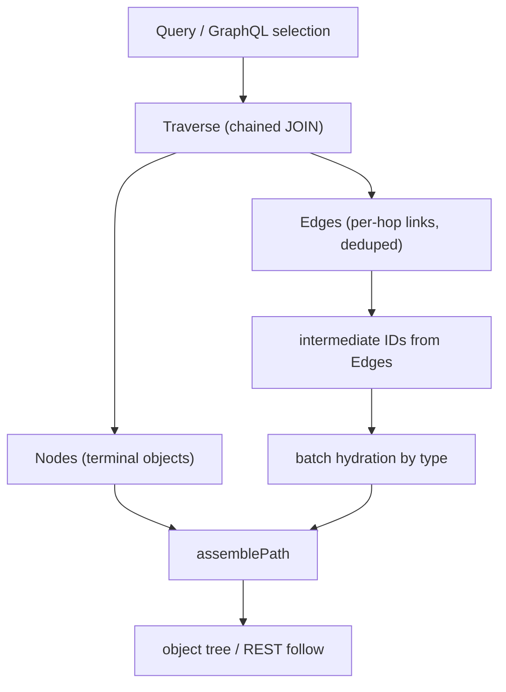
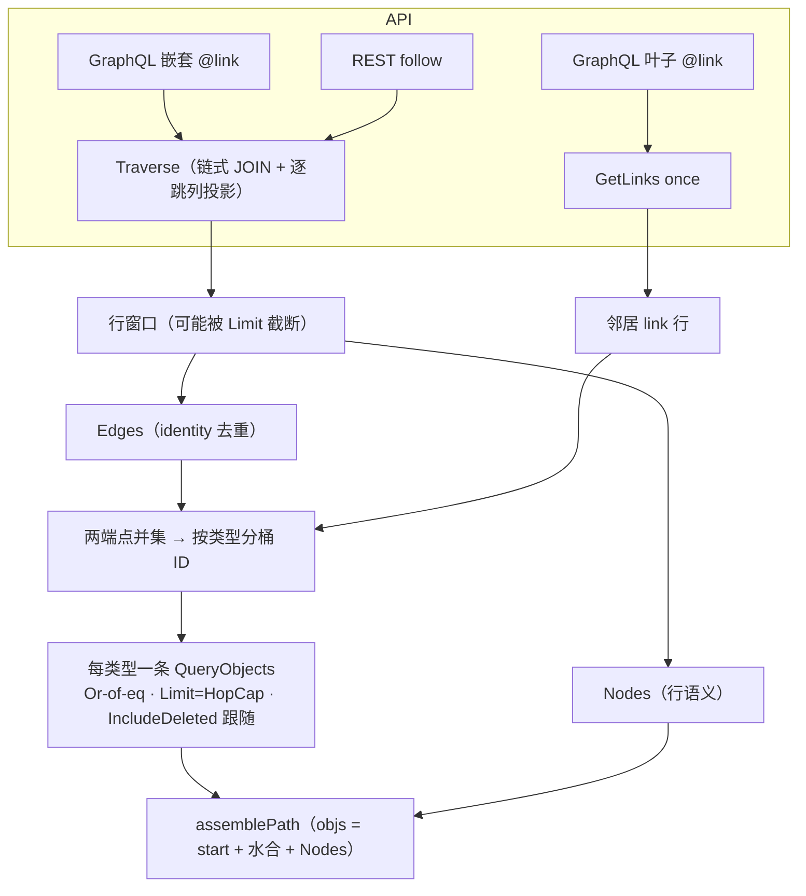

# Traverse Nodes+Edges Contract - Plan

## Goal Capsule

- **Objective:** `TraversalResult` 收敛为 `Nodes + Edges`：删除 Go SPI 的 `Visited` 字段（对齐 TS）；MySQL `Traverse` 从 terminal-only 升级为返回每跳 `Edges`（junction 跳投影 link 行，inline 跳按宿主列合成）；engine Expand 层从 `Edges` 批量水合中间层对象（GraphQL 展开与一跳叶子路径共用一条水合路径）；`runtime/storage/sqliteobda` 整包删除，MySQL 成为唯一 SQL provider。
- **Product authority:** 本 plan（Product Contract 来自 ce-brainstorm，Planning Contract 及以下为 ce-plan 富化）。采纳 `docs/draft/q2-visited-draft.md` 方案B。对 `docs/brainstorms/2026-09-07-obda-inline-link-fk-requirements.md` 无契约冲突；其 R16/A5/F5/AE8（SQLite 拒绝 inline）随 sqliteobda 删除被取代（见 Compatibility）。
- **Open blockers:** 无。剩余 open questions 均为 deferred-to-implementation。

---

## Product Contract

Product Contract preservation: changed R8/F2/AE3 — N+1 归属修正为 GraphQL 一跳叶子展开路径（REST follow 本就走 Traverse 模式，由真实 Edges 单独修复）；added R12 — 截断下的同窗口不变量；F1/AE4/AE5 仅同步上述决策带出的限定语（部分树、engine 层、TEST_DB_URL 前提）。其余 R/A/F/AE 未动。

### Summary

把 Traverse 契约收敛为「结果 + 拓扑」：`TraversalResult` 只留 `Nodes / Edges / TotalCount`，`Visited` 从 Go SPI 删除。MySQL `Traverse` 真正返回每跳 `Edges`（junction 跳投影 link 行，inline 跳按宿主列合成）。中间层对象 payload 降级为 Expand 层的派生数据：从 `Edges` 提取中间层 ID 后按类型批量水合，消灭现有 N+1。sqliteobda 整包删除。

### Problem Frame

`Visited` 的起因是 GraphQL 字段展开需要中间层 payload：`runtime/query/expand.go` 的 `assemblePath` 是它唯一的消费方，缺了它多跳展开静默返回空树。但拓扑（`Edges`）与对象 payload 是两层东西——TS SPI（`packages/spi/src/ontology.ts`）从未有 `visited` 字段，Go 是移植时加的；为避免一次补查 SQL 把 hydration 提升成 Traverse 基础协议，职责边界不干净。

现状比方案B的描述更残缺：两个 SQL provider 的 `Traverse` 已是链式 JOIN，但只投影终点列——`Edges` 与 `Visited` 都是空切片。后果是 SQL 后端的多跳展开与 REST follow 完全断裂（`runtime/e2e/graphql_rest_test.go:50-56` 因此 skip mysql），GraphQL 一跳叶子展开另有逐对象 `GetObject` 的 N+1 循环（`runtime/query/execute.go:127-141`）。`PlanTraverse` 每跳本就 JOIN link 表与目标表，补投影 link 列即可得到 `Edges`，边际成本低。

### Key Decisions

- **删除字段而非保留恒空。** 与 TS 契约对齐，编译期暴露全部引用点，一次改干净；不留下永远为空的幽灵字段。
- **MySQL 是唯一 SQL provider，sqliteobda 整包删除。** 不再维护 SQLite 路径；bootstrap 后端收敛为 mysql + memory（memory 分支为新增，承接原走 sqlite 的 CLI 测试）。
- **`Edges` 是 Traverse 的一等输出。** junction 跳投影 link 行；inline 跳没有 link 表，从宿主行（host 主键 + FK 列）合成。fan-out 笛卡尔积按 identity 去重（仅 Edges；Nodes 保留行语义）。
- **inline edge 的 identity 与 `GetLinks` 完全一致。** 同一 inline link 在两个 SPI 出口的 id、系统字段派生规则相同，调用方无需感知物理分叉。
- **水合放 engine 层，provider 无关。** Traverse 模式与 GraphQL 一跳叶子展开共用一条批量水合路径；memory 后端的多跳展开同样受益（`Visited` 删除后这是唯一通道）。
- **中间层可见性与终点同口径。** 同一 `IncludeDeleted` 语义；JOIN 层（`OmitTargetDeleted`）今天已如此，水合侧对齐，不引入回归。

### Requirements

**SPI 契约**

- R1. Go `TraversalResult` 删除 `Visited` 字段，只留 `Nodes / Edges / TotalCount`，doc comment 同步；形状与 TS `packages/spi` 一致。
- R2. `Traverse` 的 `Edges` 返回每跳 walked links，fan-out 重复按 link identity 去重，结果非 nil；`Nodes` 仍只含最后一跳的对象。
- R3. inline 跳的 `Edges` 条目从宿主行合成，identity、version 与系统字段的派生规则与该 link 经 `GetLinks` 返回时完全一致。
- R12. `Edges`、`Nodes` 与水合输入取自同一 Traverse 行窗口；fan-out 超过 Limit 上限时返回部分树，属指定行为而非错误。

**MySQL Traverse**

- R4. mysqlobda `Traverse` 返回真实 `Edges`，不再恒空：junction 跳投影 link 行列，inline 跳投影宿主主键与 FK 列。
- R5. 现有 JOIN 语义不变：tenant 边界、每跳 `deleted_at` 口径（`OmitLinkDeleted / OmitTargetDeleted`）、8 跳上限、终点排序与分页，以及 Nodes/TotalCount 的行语义（重复终点不去重）。

**Expand 水合**

- R6. 多跳展开在组树前从 `Edges` 提取中间层对象 ID，按对象类型批量水合；SQL 数有界（每中间类型至多一条），不出现逐对象 `GetObject`。
- R7. 水合的中间层可见性与终点一致：默认排除软删，`IncludeDeleted` 时可见（engine 层契约；API 参数入口不在本轮范围）。
- R8. GraphQL 一跳叶子展开（`expandGetLinks` 路径）改用同一批量水合路径，消除现有 N+1；水合未命中的对象静默剪枝，查询错误照常传播。
- R9. 多跳展开在 memory 与 mysql 两个后端都产出树（FirstHop、中间层、终点）；`graphql_rest_test.go` 的 mysql skip 移除。

**Provider 清理**

- R10. `runtime/storage/sqliteobda` 整包删除；bootstrap 引用清理，后端只剩 mysql 与 memory。
- R11. memory provider 停止填充 `Visited`（字段已删），`Traverse` 继续返回 `Nodes / Edges`。

### Compatibility: inline-FK requirements

与 `docs/brainstorms/2026-09-07-obda-inline-link-fk-requirements.md` 逐条对照（其 R-IDs 加「FK-」前缀引用）：

- **无契约冲突。** 该文档不约束 `TraversalResult` 形状；FK-R14 只要求 Traverse 能解析 inline 关联、只 JOIN 宿主与对端——`inlineHopOn` 已实现，本轮不动 JOIN 形状，只加列投影。
- **FK-R9 对齐是一致性要求而非冲突。** inline link 的 identity 从宿主主键派生、系统字段复用宿主行——R3 要求 Traverse 合成的 edge 遵守同一派生，与 `assembleInlineLink` 一致。
- **FK-R16 / A5 / F5 / AE8 被 supersede。** 「SQLite 遇到 inline 必须失败」整组要求随 sqliteobda 删除而过时：provider 不存在，无需拒绝逻辑，也不存在「同一 mapping 两种物理形态」的顾虑。不恢复、不迁移。
- **draft §6 的 link-to-link 直链 JOIN 只对 junction 跳成立。** inline 跳没有 link 表，`Edges` 必须合成——这正是 FK-R14 的形态，planner 已按 `TraverseHop.Inline` 分派。实现 `PlanTraverse` 列投影时不得为 inline 跳虚构 link 表。

### Key Flows

- F1. 多跳 GraphQL 展开（Traverse 模式）
  - **Trigger:** `a(id:"...") { b { c { name } } }` 之类的 2-hop 选择。
  - **Steps:** engine 拆步 → `Traverse` 返回 Nodes + 每跳 Edges → 从 Edges 提取中间层 ID → 按类型批量水合 → `assemblePath` 组树。
  - **Outcome:** 完整 `A → B → C` 树（fan-out 超限为指定部分树），B 的业务字段已 hydrate；SQL 数 = 1 (Traverse) + 每中间类型 1 (水合)。
  - **Covered by:** R2, R4, R6, R9, R12
- F2. GraphQL 一跳叶子展开与 REST follow
  - **Trigger:** GraphQL 叶子 @link 字段（无嵌套选择）；REST `GET /{type}/{id}/follow`。
  - **Steps:** 叶子路径 `GetLinks` 取邻居 link → 批量水合邻居对象；REST follow 走 Traverse 模式，与 F1 同路径。
  - **Outcome:** 叶子路径无逐对象 GetObject；REST follow 在 mysql 从全路径空响应变为可用（由真实 Edges 修复，无需水合参与的单跳场景）。
  - **Covered by:** R4, R8, R9

### Acceptance Examples

- AE1. **Covers R2, R4, R6, R9.** Given mysql 后端 2-hop junction 链 `Patient → Admission → Ward`。When GraphQL 展开第一层字段。Then 返回完整树，`Ward.name` 已 hydrate，`Edges` 含两跳 link 且无重复。
- AE2. **Covers R3, R4.** Given 路径含 inline 跳（如 `Book → Member` 走宿主 FK）与 junction 跳混合。When `Traverse`。Then `Edges` 同时含两种跳；inline edge 的 `_id` 与同一关联经 `GetLinks` 返回的 `_id` 相同。
- AE3. **Covers R8.** Given mysql 后端某 GraphQL 一跳叶子字段有 M 个邻居。When 展开该字段。Then 邻居水合 SQL 数为 1（按类型），不随 M 增长；REST follow 在 mysql 返回非空 nodes。
- AE4. **Covers R7.** Given 2-hop 链的中间层对象被软删（engine 层验证）。When 默认展开。Then 该分支不可见；When 水合带 `IncludeDeleted`。Then 该分支可见——与终点行为同口径。
- AE5. **Covers R1, R10, R11.** Given 本轮改动合入且 CI 设置 `TEST_DB_URL`。Then 全仓编译通过（无 `Visited` 残留引用），bootstrap 后端仅 mysql/memory，原 mysql skip 的 2-hop e2e 在两个后端均通过（未设 `TEST_DB_URL` 时 mysql 腿按现状退化为 memory-only）。

### Success Criteria

- 多跳 GraphQL 展开与一跳叶子展开在 mysql 可用且无 N+1：水合 SQL 数有界且与邻居数量无关。
- Go 与 TS 的 `TraversalResult` 契约一致；`Visited` 无代码残留。
- 与 inline-FK brainstorm 无被违反的要求；被取代的 FK-R16 组有显式标注（本文档 Compatibility 节）。

### Scope Boundaries

**Deferred for later**

- `TraverseOptions.IncludeIntermediateObjects` 可选能力（draft §9，原文自定位第二阶段）。
- draft §8/§11 的 Query IR → Planner → Hydrate 远期分层愿景；本轮只落 Traverse/Expand 契约。
- `IncludeDeleted` 的 GraphQL 参数 / REST query 入口及 `expandGetLinks` 对应语义（本轮 R7 仅 engine 层）。
- `GetLinks` 的 peer-deleted 不对称（link 行与 peer 对象删除口径差异）与 provider 间既有分叉（hop cap 8 vs 10、`TraversalStep.Filter` mysql 忽略）——冻结现状，不在本轮对齐。

**Superseded by this round**

- inline-FK brainstorm 的 SQLite 组要求（FK-R16/A5/F5/AE8）与「SQLite 不实现 inline」成功判据——provider 已删除。

**Outside this product's identity**

- TS 侧改动（`visited` 字段本就不存在）。
- 恢复 BFS 逐步 GetLinks 路径或为 SQLite 重新引入任何 OBDA provider。

### Dependencies / Assumptions

- inline-FK 已在 MySQL 全量实现且 FK-R14 满足（`resolveInline`/`compileInlineLink`、`validateInlineLink`、`hostTableShape`、`planGetLinksJoinInline`、`inlineHopOn`）——本轮只加 `Edges` 列投影，不改 JOIN 结构。
- `PlanTraverse` 每跳已 JOIN 目标对象表（planner.go:398-415），中间层 `deleted_at` 过滤已在 JOIN 层存在；R7 只是让水合侧对齐现状。
- mysql 的 filter 路径今天只支持单叶子 `eq`（`compileFilter`、`translateFilter` 双双拒绝 Or/In），sqlast 也无 or/in 谓词——批量水合的取数通道需要先做窄扩展（见 KTD1）。
- 本文引用的代码现状断言（15 条）已于 2026-09-11 经独立验证全部 confirmed；Phase 1 研究的关键行号引用见 Sources。

### Outstanding Questions

**Deferred to implementation**

- Or-of-eq 水合查询是否分块（单条 1000 占位符 vs 分批），默认单条、实现时按需分块。
- `compileFilter` 对 `_id`（identity 列）的 eq 映射是否直达物理列——实现时验证，不通则补 identity 列映射。

### Sources / Research

- 问题与分析：`docs/draft/q2-visited.md`；方案B：`docs/draft/q2-visited-draft.md`
- 冲突分析对象：`docs/brainstorms/2026-09-07-obda-inline-link-fk-requirements.md`
- TS 契约对照：`packages/spi/src/ontology.ts:156-160`
- 代码现状：`runtime/spi/ontology.go:248-258`（Visited 定义）、`runtime/query/expand.go:133-165`（assemblePath/neighbors）、`runtime/query/execute.go:127-141`（N+1）、`runtime/obda/planner.go:318-457`（TraverseHop/PlanTraverse）、`runtime/storage/mysqlobda/links.go:273-289,381-520`、`runtime/storage/memory/provider.go:758-901`、`runtime/storage/sqliteobda/provider.go:82-84`、`runtime/e2e/graphql_rest_test.go:50-56`
- Phase 1 研究锚点：filter 只支持 eq（`runtime/obda/planner.go:489-494`、`runtime/storage/mysqlobda/query.go:120-137`、`runtime/obda/dialect/mysql/dialect.go:363-418`）；expand 调用面（`runtime/api/compile.go:95-102`、`runtime/api/http.go:90-96`、`runtime/api/node.go:54`）；inline 组装（`runtime/storage/mysqlobda/inline.go:182-244`）；link 行形状（`runtime/obda/compiler.go:130-177`、`runtime/storage/mysqlobda/links.go:634-677`）；行语义守卫（`runtime/storage/mysqlobda/links_test.go:368-401`）；HopCap=1000（`runtime/query/ir.go:10-11`）；bootstrap 后端（`runtime/bootstrap/conf.go:26,121-128`、`runtime/bootstrap/dialect.go:19-26`）；cmd 测试 sqlite 依赖（`runtime/cmd/run_test.go:31`、`runtime/cmd/sdl_test.go:27`、`runtime/cmd/seed_test.go:21,54`、`runtime/cmd/ddl_test.go:169`）；memory BFS（`runtime/storage/memory/provider.go:758-901`）；位置扫描模式（`runtime/storage/mysqlobda/scan.go:7-28`）
- Institutional learnings：`docs/solutions/design-patterns/mysql-fulltext-search-and-eq-only-filter.md`（args 按占位符出现顺序绑定；of_ 前缀隐藏列先例；跨入口共享一条规则）、`docs/solutions/design-patterns/mysql-port-divergence-of-active-unique-index.md`（grep 实际用法再定论；按 DB 不变量枚举分叉）
- 测试锚点：`runtime/storage/memory/provider_link_extra_test.go:127-163`、`runtime/engine/read_test.go:131-211`、`runtime/storage/mysqlobda/links_test.go:533-541`、调用计数 fakes（`runtime/api/resolvers_test.go:646`、`runtime/query/execute_test.go:268`）

---

## Planning Contract

### Key Technical Decisions

- KTD1. **水合通道 = QueryObjects + Or-of-eq 窄扩展，不新增批量 SPI 方法。** mysql renderer 增加 `or` 谓词（复用 `Predicate.Children`，零 AST 类型改动），`compileFilter` / `translateFilter` 仅接受「多个 `eq` 叶子的 Or」，其余算子继续拒绝。理由：不扩 SPI 契约面；顺带补齐 mysql 对 SPI `FilterExpression` 已承诺而未实现的 Or 语义（memory 已支持，修复 parity 陷阱）；新批量方法同样绕不开多 ID SQL 构造，只是换个地方写。锁定手段：golden SQL 文本 + 完整 args 顺序断言（learnings：args 按 `?` 文本出现顺序绑定，错绑不报错）。
- KTD2. **逐跳投影 = 列清单 + 位置扫描，零列别名。** `PlanTraverse` 在终点列之后按跳追加桶列：junction 跳投影该跳 link binding 的全部 `SelectColumns`（别名 `l<i>`）；inline 跳投影宿主 binding 列（host 别名按 `FKOnPrev` 解析，复用 planner 既有的 hostAlias 逻辑）。返回 `TraverseLayout` 描述每桶的列序与角色；行扫描沿用 `scan.go` 位置模式 + 逐桶 `bizMap` 切片（2026-09-11-001 计划 R2 定下的模式，位置扫描天然容忍跨桶同名列）。
- KTD3. **Edge 组装复用现有 assembler，去重 key 分桶。** junction 桶逐行喂 `assembleLink`，inline 桶逐行喂 `assembleInlineLink`——identity 与系统字段派生和 `GetLinks` 按构造一致（learnings：跨入口共享一条规则，防止平行实现漂移）。Edges 去重：junction 用 `linkType:linkID`，inline 用 `linkType:hostID`。Nodes 与 TotalCount 保留笛卡尔行语义（重复终点不去重），由既有 `TestTraverseDuplicateTerminalsAndPaging` 守卫。
- KTD4. **水合语义。** 中间层 ID 提取 = 全部 Edges 两端点的并集，按对象类型分桶（对同一 link 类型出现在多跳的自引用链才正确）；排除终点类型与起点类型。每类型一条 `QueryObjects`（Or-of-eq filter，显式 `Limit = HopCap`，`IncludeDeleted` 跟随 traverse 调用）。未命中静默剪枝（维持现状 `ErrObjectNotFound` 容忍），查询硬错误传播。水合经 ctx 绑定的 engine 调用，租户隔离继承自 `RequestContext`。
- KTD5. **bootstrap 后端收敛 = mysql | memory。** `DB_DRIVER` 值域改为 mysql/memory，新增 memory 分支；sqliteobda、`runtime/obda/dialect/sqlite`、`modernc.org/sqlite` 依赖一并删除；cmd 的 CLI 测试 `DB_DRIVER` 从 sqlite 迁到 memory（否则需要真实 MySQL 才能跑测试）。
- KTD6. **e2e 双后端矩阵保持 memory + mysql。** `TEST_DB_URL` 缺省时 mysql 腿按现状退化为 memory-only；CI 若要断言双后端，需显式设置（AE5 的前提条件）。

### High-Level Technical Design

新执行路径（两种展开模式汇入同一条水合）：

投影列布局（方向性示意，非实现规格）：单条 SELECT 按固定顺序排列 `[终点列 @ sN] [hop0 桶列] [hop1 桶列] ...`；`TraverseLayout` 记录每桶的 `(角色 junction|inline, 表别名, 列名序, 链接类型)`，扫描器按偏移切桶、逐桶 `bizMap` → `assembleLink` / `assembleInlineLink` → 按 KTD3 key 去重进 `Edges`。

### System-Wide Impact

- **SPI 契约**：`TraversalResult` 形状变更波及全部 provider 实现与 fakes（memory、mysqlobda、unimplemented、两处测试 fake）；与 TS 镜像对齐是本轮的目的之一。
- **运行环境语义**：`DB_DRIVER` 值域变化（sqlite 不再合法）；cmd CLI 的存储选项与文档文案随之更新。
- **查询能力面**：mysql 的 `QueryObjects` 从「仅单 eq」扩到「Or-of-eq」，是 SPI 已承诺语义的补齐，非新契约。

### Risks & Dependencies

- **args 顺序回归**：投影加列不改 WHERE，但 layout 改动触碰 SELECT 组装——golden SQL + 全 args 断言是唯一可靠防线（历史错绑零报错）。
- **Limit 双 1000 无余量**：Traverse 行上限与 `QueryObjects` page cap 同为 1000；水合显式传 `Limit = HopCap` 保证不丢；未来 HopCap 上调需同步检查 page cap。
- **重复终点行语义**：`Edges` 去重与 `Nodes` 不去重并存，是最容易被"顺手优化"破坏的契约——守卫测试保留并前移引用。
- **上游依赖**：无外部服务变更；全部依赖为 repo 内已实现能力（inline-FK、planner、scan helpers）。

---

## Implementation Units

### U1. Or-of-eq 过滤通道（sqlast + filter 编译窄扩展）

- **Goal:** mysql 查询路径支持「多个 eq 的 Or」，作为批量水合的取数通道。
- **Requirements:** KTD1；为 R6 提供通道。
- **Dependencies:** —
- **Files:** `runtime/obda/dialect/mysql/dialect.go`（渲染 `or`）、`runtime/obda/planner.go`（`compileFilter`）、`runtime/storage/mysqlobda/query.go`（`translateFilter`）、`runtime/obda/planner_test.go`、`runtime/storage/mysqlobda/query_test.go`
- **Approach:** renderer 在 op 为 `or` 且 Children 非空时以括号包裹的 OR 连接渲染；`compileFilter` / `translateFilter` 递归接受 Or，其叶子必须为 `eq`，其余组合继续返回 unsupported。不实现完整求值器（And/Not/比较算子明确不在范围）。
- **Patterns to follow:** 现有 `and`/`eq` 谓词渲染（`dialect.go:363-418`）；`compileFilter` 现有错误路径。
- **Test scenarios:**
  - Or-of-eq 渲染 golden SQL 文本（含括号形状）+ 完整 args 顺序断言。Covers KTD1。
  - 非 eq 叶子（`neq`/嵌套 Or）仍被拒绝，错误不变。
  - 空 Children 的 Or 拒绝。
  - mysql 集成：`QueryObjects` 带 Or-of-eq filter 返回并集（TEST_DB_URL 下）。
- **Verification:** `go test ./runtime/obda/... ./runtime/storage/mysqlobda/...` 通过；golden 断言覆盖新谓词。

### U2. sqlite 退场（provider + dialect + bootstrap + cmd 测试迁移）

- **Goal:** SQLite 路径整体移除，bootstrap 收敛为 mysql | memory。
- **Requirements:** R10；为后续 planner 改动扫清调用面。
- **Dependencies:** —（与 U1 无序）
- **Files:** 删除 `runtime/storage/sqliteobda/`、`runtime/obda/dialect/sqlite/`；`runtime/bootstrap/bootstrap.go`、`runtime/bootstrap/conf.go`、`runtime/bootstrap/dialect.go`、`runtime/bootstrap/open_test.go`、`runtime/bootstrap/bootstrap_test.go`；`runtime/cmd/main.go` 及 `runtime/cmd/{run,sdl,seed,ddl}_test.go`；`go.mod`
- **Approach:** bootstrap `DB_DRIVER` 值域 mysql/memory，openProvider 新增 memory 分支；`OpenSQLite` 与 sqlite conf 分支删除；7 个 `TestOpenSQLite_*` 与 open_test 的 sqlite conf 用例迁移为 memory 等价；cmd 四个测试文件的 `DBDriver: "sqlite"` 改 memory；`cmd/main.go` 存储选项文案更新；`modernc.org/sqlite` 从 go.mod 移除。
- **Test scenarios:**
  - `DB_DRIVER=memory` 可完成 open + 基本读写（迁移后的 bootstrap 测试）。
  - `DB_DRIVER=sqlite` 返回明确的配置错误。
  - cmd CLI 测试在 memory 后端全绿（迁移后）。
  - Test expectation: 其余为删除性验证——`grep -r sqliteobda runtime/` 无结果。
- **Verification:** 全仓编译通过；`go test ./runtime/bootstrap/... ./runtime/cmd/...` 通过。

### U3. PlanTraverse 逐跳列投影与 TraverseLayout

- **Goal:** planner 产出含每跳桶列的单条 SELECT，并返回可扫描的布局清单。
- **Requirements:** R2, R3, R4（SQL 部分），R5（语义保持）。
- **Dependencies:** U2（sqliteobda 已删，无需适配将死调用点）。
- **Files:** `runtime/obda/planner.go`、`runtime/obda/planner_test.go`
- **Approach:** `PlanTraverse` 返回值增加 `TraverseLayout`（每桶：角色/别名/列名序/link 类型；终点桶）；列序 = `[终点列] [hop0] [hop1] ...`；junction 桶列 = 该跳 link binding `SelectColumns` @ `l<i>`；inline 桶列 = 宿主 binding 列 @ hostAlias（`FKOnPrev` 决定 prev/next）；JOIN/WHERE/Order/args 全部不变。调用点（mysqlobda）暂以 `_` 忽略 layout，U4 接上。
- **Patterns to follow:** `PlanGetLinksJoin` 的 qualified-column 投影（planner.go:255-258）；既有 golden planner 测试。
- **Test scenarios:**
  - 2-hop junction golden SQL：列序、`l0`/`l1` 限定名、JOIN/WHERE 与改造前逐字符一致（除 SELECT 列）。
  - junction + inline 混合链：inline 桶列落在正确 host 别名（FKOnPrev 两种取向各一例）。Covers AE2 的 SQL 形状面。
  - 1-hop 退化：无中间桶，终点 + 单桶。
  - args 完整断言不变（`[tenant, startID]`）。
  - 8 跳上限行为不变。
- **Verification:** `go test ./runtime/obda/...`；golden 快照更新经人工审阅确认仅 SELECT 列变化。

### U4. mysqlobda Traverse 返回真实 Edges

- **Goal:** 行扫描按 layout 切桶、组装并去重 Edges；Nodes/TotalCount 行语义不动。
- **Requirements:** R2, R3, R4, R5。
- **Dependencies:** U3。
- **Files:** `runtime/storage/mysqlobda/links.go`、`runtime/storage/mysqlobda/scan.go`（如需桶切片 helper）、`runtime/storage/mysqlobda/inline.go`（如需导出复用点）、`runtime/storage/mysqlobda/links_test.go`、`runtime/storage/mysqlobda/inline_test.go`
- **Approach:** 总列数一次 `scan`，按 `TraverseLayout` 偏移切桶 → 逐桶 `bizMap` → junction 桶 `assembleLink`、inline 桶 `assembleInlineLink`；Edges 按 KTD3 key 去重（junction `linkType:linkID` / inline `linkType:hostID`）；Nodes/TotalCount/排序/分页路径不动；`emptyTraversal` 保持 Edges 非 nil 空切片。
- **Patterns to follow:** `scan.go` 位置扫描；junction GetLinks 的 `scan → bizMap → assembleLink` 链（links.go:354-365）。
- **Test scenarios:**
  - 2-hop：Edges 含两跳 link 行、字段完整（`_id`/`_fromId`/`_toId`/version/系统字段）、无重复。Covers AE1（Edges 部分）。
  - 混合链：inline edge 的 `_id` 与 `GetLinks` 出口一致（同一 link 双出口对照断言）。Covers AE2。
  - 重复终点（2 条平行 link）：Nodes 仍 2 行、TotalCount=2，Edges 2 条（不同 linkID）——既有 `TestTraverseDuplicateTerminalsAndPaging` 不改断言直接通过。
  - 同一 link 跨笛卡尔行重复出现：Edges 去重后 1 条。
  - 断链（类型不匹配）、软删中间层、软删 link、软删起点、deleted peer：既有测试语义不变，`assertTerminalOnly` 重写为逐跳 edge 断言（空链 Edges=[] 非 nil）。
  - inline 1-hop：`TestInlineTraverseOneHop` 扩展断言合成 edge `_id == hostID`。
- **Verification:** TEST_DB_URL 下 `go test ./runtime/storage/mysqlobda/...` 通过。

### U5. engine 批量水合（expand 重构 + N+1 消除）

- **Goal:** 两种展开模式共用「Edges → 按类型批量水合 → assemblePath」；一跳叶子路径的逐对象 GetObject 消失。
- **Requirements:** R6, R7, R8, R12（engine 侧）。
- **Dependencies:** U1（取数通道）、U4（真实 Edges；memory 后端 BFS Edges 现成）。
- **Files:** `runtime/query/expand.go`、`runtime/query/execute.go`、`runtime/query/execute_test.go`、`runtime/api/resolvers_test.go`（fakes 扩展计数）
- **Approach:** 新水合 helper：输入 `tr.Edges` + 步骤类型集合，输出 `objs` 增量；类型集合 = 路径中间类型（全部步类型 − 终点 − 起点）；ID = Edges 两端点并集按类型分桶；每类型一条 `QueryObjects`（Or-of-eq、`Limit=HopCap`、`IncludeDeleted` 跟随 traverse options）。`assemblePath` 的 `objs` 来源改为 start + 水合结果 + Nodes（`tr.Visited` 读取此时即可删除，字段仍在，U6 再删定义）；`expandGetLinks` 的 GetObject 循环替换为同一 helper。miss 静默剪枝，硬错误传播。
- **Patterns to follow:** 现有 `expandMemo` 合并；`ErrObjectNotFound` 容忍先例（execute.go:134-137）。
- **Test scenarios:**
  - 计数断言：M 邻居一跳叶子展开，`GetObject` 0 次、`QueryObjects` 每类型 ≤1 次（用既有 counting fakes）。Covers AE3。
  - 多跳树完整：memory fake 下 2-hop FirstHop/中间层/终点齐备。Covers AE1。
  - 软删中间层：默认分支不可见；helper 带 IncludeDeleted 时可见（直接单测 helper）。Covers AE4（engine 层）。
  - 跨租户：另一租户的中间层对象不进入树（水合走 ctx 绑定调用）。
  - miss 容忍：水合返回缺 ID 时对应分支剪枝、无错误；查询报错时整个展开报错。
  - 截断一致性：构造超行窗口场景，Edges 与 Nodes 来自同一窗口、树为部分树（指定行为）。Covers R12。
- **Verification:** `go test ./runtime/query/... ./runtime/api/...` 通过。

### U6. SPI 删 Visited 与引用面收敛

- **Goal:** `TraversalResult` 删字段；memory 停填；相关测试按新契约重写。
- **Requirements:** R1, R11。
- **Dependencies:** U5（水合已接管中间层，删字段不破坏行为）。
- **Files:** `runtime/spi/ontology.go`、`runtime/storage/memory/provider.go`、`runtime/engine/read_test.go`、`runtime/storage/memory/provider_link_extra_test.go`、`runtime/storage/mysqlobda/links_test.go`（残留字面量清理）、`runtime/spi/unimplemented.go`（如引用）
- **Approach:** 删字段 + doc comment 改写（Nodes/Edges/TotalCount 语义 + 一跳空 Edges 约定）；memory BFS 删 `visited` 累积与返回；`TestEngine_Traverse_TwoHopVisitedAndCrossTenant` 重写为「Edges + 水合后树」断言并保留跨租户中间层检查；memory provider_link_extra 测试的 visited 断言改写为 Edges 断言。
- **Test scenarios:**
  - 全仓编译（字段删除的编译期暴露）。
  - 重写后的 engine 测试：2-hop 树完整 + 中间层租户隔离（水合后视角）。Covers R11 与租户安全。
  - memory 1-hop：Edges 非空、（Visited 断言删除）。
  - `grep -rn "\.Visited" runtime/` 无结果。
- **Verification:** `go build ./... && go test ./runtime/...`（无 TEST_DB_URL 时 mysql 集成腿按现状跳过）。

### U7. e2e 双后端验收

- **Goal:** 解除 mysql skip，双后端树一致，REST follow 在 mysql 可用。
- **Requirements:** R9；AE1/AE3/AE5 的端到端落点。
- **Dependencies:** U4, U5, U6。
- **Files:** `runtime/e2e/graphql_rest_test.go`（skip 移除 + 断言补强）
- **Approach:** 删除 `backendMemory` skip；`two hop branches readers` 子测在双后端跑；补 mysql 断言：REST follow 返回非空 nodes、2-hop GraphQL 树与 memory 一致（同 fixture 期望）。
- **Test scenarios:**
  - 双后端（有 TEST_DB_URL 时）2-hop 树断言一致。Covers AE1, AE5。
  - mysql REST follow 非空。Covers AE3 后半。
  - 未设 TEST_DB_URL：mysql 腿退化 memory-only，测试不假绿（现状语义保持）。
- **Verification:** `TEST_DB_URL=... go test ./runtime/e2e/...`；无 DSN 环境跑一遍确认退化路径。

---

## Verification Contract

| 范围 | 命令 / 门槛 |
|---|---|
| 全仓编译 | `go build ./...`（runtime 模块） |
| planner / sqlast | `go test ./runtime/obda/...`（golden SQL + args 断言必须覆盖新谓词与新列序） |
| mysql provider | `TEST_DB_URL=<mysql dsn> go test ./runtime/storage/mysqlobda/...`（无 DSN 时集成腿跳过） |
| engine / query / api | `go test ./runtime/engine/... ./runtime/query/... ./runtime/api/...` |
| bootstrap / cmd | `go test ./runtime/bootstrap/... ./runtime/cmd/...`（memory 后端） |
| e2e 双后端 | `TEST_DB_URL=<mysql dsn> go test ./runtime/e2e/...`；无 DSN 再跑一遍确认退化 |
| N+1 验收 | 调用计数 fakes：一跳叶子展开 `GetObject==0` 且 `QueryObjects` 每类型 ≤1 |
| 残留检查 | `grep -rn "Visited" runtime/`（除注释性迁移说明外无结果）；`grep -rn "sqliteobda\|dialect/sqlite" runtime/` 无结果 |

## Definition of Done

- R1–R12 全部满足；方案B 契约（Nodes+Edges、批量水合、无 N+1、mysql 唯一 SQL provider）在双后端可演示。
- `Visited`、`sqliteobda`、`obda/dialect/sqlite`、`modernc.org/sqlite` 无残留引用。
- 既有守卫不回退：重复终点行语义（`TestTraverseDuplicateTerminalsAndPaging`）、软删路径剪枝、租户隔离（水合后视角复测）。
- 实验与中途适配代码（如 U3 的 `_` 占位）在后续 unit 中全部接净；`docs/solutions/` 两篇含 sqlite 引用的 learning 待删除合入后另行刷新（deferred，不阻塞本计划）。
