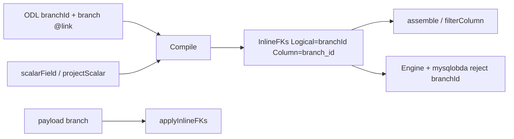

# feat: inline FK scalar projection

## Summary

给 inline FK 增加只读标量投影：host ODL 上的 `{HostNavField}Id`（导航字段 `branch` → `branchId`，不是链接名 `RegisteredAt`）映射到已有宿主列，可进 GetObject / QueryObjects filter / OrderBy / Aggregate。写入该键硬拒绝。关系仍只经导航名写入。不取消列冲突校验，不新增物理列。

## Problem Frame

inline 链接把 FK 落在宿主表（`RegisteredAt` → `reader.branch_id`）。`Binding()` 已选出该列，但 `assemble` 与 `filterColumn` 只认 `model.fields`。把同一列再写进 `fields` 会撞 `checkFKCollision`，并与 `applyInlineFKs` 双写。GraphQL Filter 只收录 IR 标量，不含 `@link`。结果是：要么 SDL 没有 `branchId`，要么有字段却筛不了。agent-pack 的 `Message.chatId` 是这个裂缝的活标本；本轮金路径是 library-pack 简化版 `Reader` + `RegisteredAt`。

---

## Requirements

- R1. HostNavField 是 host ODL 上的导航字段名（`branch`），不是 LinkType 名。host 对象上类型为 `ID` 的标量，约定名为 `{HostNavField}Id` 时，Compile 把它绑到该 inline 的 `FKColumn`，作为只读投影。YAML 可改逻辑名或关闭投影。
- R2. 投影不进入 `model.fields` 写映射，不新增物理列。`checkFKCollision` 对 identity / tenant / fields / 系统列仍然失败。`search.fields` 含投影名 → `ErrInvalidMapping`。
- R3. GetObject / QueryObjects 读回投影键，值为对端 engine id；FK 空时键仍在、值为 null。`filter` / `orderBy` / aggregate `groupBy` 认该逻辑名，走既有 eq / or-of-eq 通道。
- R4. 调用方 Create properties / Update **patch** 含投影键 → 硬拒绝（`ErrInvalidMapping`）。已物化对象上的投影键不得经 mergePatch 回灌成「写入」。同时带导航名与投影键也拒绝。改关系只走导航名（或既有 CreateLink / DeleteLink）。
- R5. 投影永不作为 Create 必填项。关系必填只看 host 导航 / `FKNullable`。ODL 标量 `Required`/`NonNull` 必须与导航 `NonNull` 一致，否则 Compile 失败。
- R6. ODL 声明了约定名或 YAML 指定名、却未绑定投影（也未把该属性映射到**另一列**）→ Compile 失败，禁止再出现「SDL 有字段、存储不认」的裂缝。
- R7. 金路径：library-pack 简化版 `Reader` 增加可空 `branchId: ID`。`readers(filter: { branchId: { eq: $id } })` 与 GetObject 读回该键必须在 MySQL 上成立。不把 agent-pack 当验收包。
- R8. `docs/design/obda-spec-v3.md` 与 `CONCEPTS.md` 写入 mapping 规则与词条（约定、YAML、只读、冲突、必填对齐）。

---

## Key Technical Decisions

- KTD-1. **投影是 OBDA 绑定，不是新 FieldRole。** 标量留在 ODL 为 `RoleProperty`。Compile 产出只读绑定；Engine 按 compiled 元数据拒绝写入。不发明 IR 角色，也不把 `@link` 收进 Filter。
- KTD-2. **约定 `{HostNavField}Id`，YAML 可改名或关闭。** `projectScalar` 为 `*bool`：省略/nil = 开启；显式 `false` 关闭。同时写 `scalarField` 与 `projectScalar: false` → Compile 失败。省略 `scalarField` 且投影开启且 host 有该 ID 属性则自动绑。`scalarField: <name>` 改逻辑名（属性必须存在且类型 ID）。关闭时该属性要么不在 ODL，要么在 `fields` 里映射到**不同**列，否则 Compile 失败。
- KTD-3. **FK 列始终进 Binding.SelectColumns；Logical 仅在绑定时有值。** 有投影时 `InlineFKs.Logical` = `branchId`。无投影时 Logical 为空，列仍选出。`assemble` / `filterColumn` / OrderBy / groupBy 跳过空 Logical，绝不把 `HostNavField` 当标量键写出。写入仍只用 `CompiledLink.HostNavField`。
- KTD-4. **Engine 与 mysqlobda 双拒绝调用方 payload。** 只扫 Create properties 与 Update patch，不扫 mergePatch 后的已读对象。mysqlobda 对直调 SPI 同样只扫调用方 props。未知键继续既有「Engine 跳过」行为，但约定名一旦出现在 ODL 就不再是未知键。
- KTD-5. **不把投影编进 `search.fields`。** 本轮不扩展 FULLTEXT。若 mapping 把投影名列入 `search.fields` → `ErrInvalidMapping`。
- KTD-6. **金路径改 library-pack 简化版。** `reader.odl` 增加 `branchId: ID`（与可空 `branch: Branch` 对齐）。`library-pack.md` Reader 字段表同步。其它 inline（`authorId` 等）本轮不强制铺开；约定一旦落地会自动绑已有 ODL 属性。
- KTD-7. **Spec 落点：§4.4 规则条 + §15.7 一段。** 不新开一章。写明：禁止用 `fields` 映射 inline FK 列来「开放 filter」。

---

## High-Level Technical Design

Write 只消费导航名。Read/filter 只消费投影名。同一物理列，两套逻辑名，职责不交叉。

---

## Scope Boundaries

### In scope

Compile 绑定、读/filter/order/agg、写拒绝、library-pack `Reader.branchId`、agent-pack `chatId` 可空性对齐（使现有 pack 仍能 Compile）、spec v3 与 `CONCEPTS.md`。

### Out of scope

- 嵌套 `@link` 的 Relay Connection 分页（继续用根级 list + filter，或 `chat { messages }` 无 pageInfo）
- junction 端点列的同类标量别名
- 取消 `checkFKCollision`
- 为投影建 SQL FOREIGN KEY
- 自动给 Book/Author 等补齐全部 `*Id`（约定在场即可，不强制改 ODL）
- agent-pack 作为验收金路径（约定会对 `chatId` 生效，但不以其为 AE）

### Deferred to Follow-Up Work

- memory provider 投影读回（Engine 写拒绝可单测；MySQL 承担读/filter AE）
- 字段 ACL 把投影当 RoleProperty 的权限模型

---

## Implementation Units

### U1. Compile binds the scalar projection

**Goal:** Compile 按约定/YAML 把 host ID 标量绑到 inline FK 列，非法组合失败。

**Requirements:** R1, R2, R5, R6

**Dependencies:** none

**Files:**
- `runtime/obda/mapping.go`
- `runtime/obda/compile_link.go`
- `runtime/obda/compiler.go`
- `runtime/obda/compiler_inline_test.go`
- `domain-packs/agent-pack/schema/message.odl`

**Approach:** Link YAML 增加 `scalarField`（string）与 `projectScalar`（`*bool`，省略=开启）。同时出现 `scalarField` 与 `projectScalar: false` → 失败。inline 编译成功后：投影开启则解析逻辑名（YAML 名优先，否则 `{HostNavField}Id`）；host schema 上该属性必须是非 list 的 `ID`；`Required` 必须等于导航 `NonNull`。绑定写入 `InlineFKs`：列始终追加；Logical 仅投影开启时为投影名，否则空。`fields` 仍不得占用 FK 列。`projectScalar: false` 且 ODL 仍有该属性且未映射到其它列 → `ErrInvalidMapping`。两条 inline 投影到同一逻辑名 → 失败。同一 PR 把 agent-pack `chatId: ID!` 改为 `chatId: ID`，与可空 `chat: Chat` 对齐，否则 LoadMappings 会失败。不把 agent-pack 当金路径 AE。

**Patterns to follow:** `checkFKCollision`、`TestCompileInlineFKCollision`、`Compile` 往 host 追加 `InlineFKs`。

**Test scenarios:**
- Happy: library 形 `RegisteredAt` + ODL `branchId: ID` + 可空 `branch` → `InlineFKs` 为 `{branchId, branch_id}`，`Fields` 不含该列。
- Happy: `scalarField: registeredBranchId` 且 ODL 有该属性 → 逻辑名覆盖。
- Edge: 省略 ODL 标量且未写 `scalarField` → 无投影，compile 成功（纯导航仍合法）。
- Error: `fields.branchId.column: branch_id` → 仍 collides with field。
- Error: `projectScalar: false` 但 ODL 有未映射的 `branchId` → `ErrInvalidMapping`。
- Error: `branchId: ID!` 但导航可空 → `ErrInvalidMapping`。
- Error: 两 inline 都投影 `fooId` → `ErrInvalidMapping`。
- Error: `search.fields` 含投影名 → `ErrInvalidMapping`。
- Error: 同时写 `scalarField` 与 `projectScalar: false` → `ErrInvalidMapping`。

**Verification:** `go test ./obda/ -run CompileInline` 覆盖上述案例。

### U2. Read and filter through the projection

**Goal:** 选出的 FK 列投影到对象属性，并能 eq 过滤 / 排序 / 分组。

**Requirements:** R3

**Dependencies:** U1

**Files:**
- `runtime/storage/mysqlobda/objects.go`
- `runtime/storage/mysqlobda/query.go`
- `runtime/storage/mysqlobda/aggregate.go`
- `runtime/storage/mysqlobda/inline_test.go`
- `runtime/storage/mysqlobda/query_test.go`
- `runtime/storage/mysqlobda/apply_schema_test.go`
- `runtime/storage/mysqlobda/testdata/library_inline.obda.yaml`

**Approach:** `assemble` 只把 `InlineFKs` 中 Logical 非空的条目写入 `OntologyObject`（值为对端 id 字符串；FK 空则为 null，键仍在）。`filterColumn`、OrderBy、groupBy 同一 lookup：`FieldByLogical` miss 再查 Logical 非空的 InlineFKs。不要把投影 append 进 `Fields`。`Binding().SelectColumns` 已含 FK 列，不必改 planner。测试用 `inlineSchema()` 给 Reader 增加 `branchId: ID` 属性，**不要**把 `branchId` 写进 testdata YAML 的 `fields`。

**Patterns to follow:** `filterColumn` 对 `_id` 的别名解析；eq-only `translateFilter`。

**Test scenarios:**
- Happy: CreateObject 只带 `branch`；GetObject 含 `branchId` 等于对端 id。
- Happy: `QueryObjects` filter `{Field: branchId, Operator: eq}` 只返回该分馆读者。
- Happy: OrderBy `branchId` 可执行（空 FK 排序跟现有 NULL 列语义）。
- Happy: aggregate `groupBy: [branchId]` 可执行。
- Edge: FK 为空 → 对象上 `branchId` 键在、值为 null；filter eq 某 id 不命中。
- Error: 未知逻辑名仍 `unknown filter field`。
- Error: `ne` 仍拒绝（与现网 filter 一致）。

**Verification:** MySQL 真实库，`go test ./storage/mysqlobda/ -run 'Inline|QueryFilter|Aggregate'`。

### U3. Reject writes of the projection key

**Goal:** payload 出现投影键时 Create/Update 失败，不得写列、不得与导航静默合流。

**Requirements:** R4, R5

**Dependencies:** U1

**Files:**
- `runtime/engine/engine.go`
- `runtime/engine/objects_test.go`
- `runtime/storage/mysqlobda/inline.go`
- `runtime/storage/mysqlobda/inline_test.go`

**Approach:** 只检查调用方 Create properties 与 Update patch。投影键出现则失败，即使它是 `RoleProperty`。不要在 mergePatch 之后的合体对象上扫投影键——GetObject 带回的 `branchId` 不得让后续 `UpdateObject({name})` 失败。Create 必填循环跳过投影键。mysqlobda 对调用方 props 同样拒绝投影键。`applyInlineFKs` 继续只读 `HostNavField`。

**Patterns to follow:** `inlineNavWritable` 查 compiled；`TestEngine_CreateObject_InlineNavAccepted` 的导航写路径保持不变。

**Test scenarios:**
- Happy: 只带 `branch` 创建成功。
- Error: 只带 `branchId` → Engine 失败，无行。
- Error: 同时带 `branch` 与 `branchId` → 失败。
- Error: Update 只 patch `branchId` → 失败，FK 不变。
- Happy: 已有 `branchId` 的 Reader，Update 只 patch `name` → 成功，FK 不变。
- Edge: 必填 inline 仍要求导航名，不要求投影名。

**Verification:** Engine 单测不依赖 MySQL；mysqlobda 补一条直调 SPI 拒绝。

### U4. library-pack gold path

**Goal:** 简化版 Reader 暴露 `branchId`，MySQL GraphQL/SPI 能按它过滤。

**Requirements:** R7

**Dependencies:** U1, U2, U3

**Files:**
- `domain-packs/library-pack/schema/reader.odl`
- `domain-packs/library-pack/library-pack.md`
- `domain-packs/library-pack/obda/library.obda.yaml`（仅当需要显式 `scalarField` 注释；约定下可不动 links）
- `runtime/e2e/graphql_test.go` / `runtime/e2e/graphql_test.md`

**Approach:** 简化版与正常版共用 `reader.odl`，加 `branchId: ID`（可空）。`library-pack.md` Reader 字段列表补上。mapping 不把 `branchId` 写入 `fields`（links 省略 `projectScalar` 即开启）。e2e Connection：`readers(filter: { branchId: { eq: $id } }) { edges { node { id branchId } } }`。mysqlobda testdata / `inlineSchema()` 已在 U2 改过，本单元共用。不把 agent-pack 当 AE。

**Patterns to follow:** CLAUDE.md gold-path；e2e 现有 library list 形状。

**Test scenarios:**
- Covers R7. Given 读者已 `CreateLink`/`branch` 指向分馆 B。When GraphQL `readers(filter: { branchId: { eq: $id } }) { edges { node { id branchId } } }` 且 `$id = B.id`。Then 命中该读者，`branchId = B.id`。
- Edge: 无分馆的读者不出现在该 filter 中；其 Get 上 `branchId` 为 null。

**Verification:** e2e GraphQL + 简化版 fixture 在 MySQL 上跑通。

### U5. Spec and glossary

**Goal:** mapping 语言与词汇表写明这条规则。

**Requirements:** R8

**Dependencies:** U1（规则文本与 YAML 键名以 U1 为准）

**Files:**
- `docs/design/obda-spec-v3.md`
- `CONCEPTS.md`

**Approach:** §4.4 增加规则条目：inline FK 列不得出现在 host `fields`；只读投影约定 `{HostNavField}Id`；`scalarField` / `projectScalar`（省略=开启）；`search.fields` 不得含投影名；写投影键非法。§15.7 在 inline 段落后补一段与 library `RegisteredAt`/`branchId` 示例。`CONCEPTS.md` 增加 Inline FK scalar projection 词条。

**Test expectation:** none — 文档。对照 U1 YAML 键名，避免 spec 与代码分叉。

**Verification:** spec 示例能被 U1 测试 YAML 原文引用。

---

## Acceptance Examples

- AE1. Covers R1, R3, R7. Given library 简化版 Reader 已注册到 Branch B。When `readers(filter: { branchId: { eq: $id } }) { edges { node { id branchId } } }` 且 `$id = B.id`。Then 返回该读者且 `branchId = B.id`。
- AE2. Covers R4. Given 合法 Reader payload。When Create 带 `branchId`（无论是否同时带 `branch`）。Then 失败，无行。
- AE3. Covers R2. Given mapping `fields` 把某业务列或 `branchId` 指到 `branch_id`。When Compile。Then `ErrInvalidMapping`。
- AE4. Covers R6. Given ODL 有 `branchId` 且 `projectScalar: false` 且无其它列映射。When Compile。Then 失败。

---

## Risks & Dependencies

- Engine 今日把未知键跳过：ODL 加上 `branchId` 之后若 Compile 未绑定，Create 会把 `branchId` 当可写 Property。U1 R6 与 U3 必须同 PR，不能只改 pack。
- `translateFilter` 只 eq：SDL 的 `IDFilter.ne/in` 仍会 400。本轮不拓宽算子。
- agent-pack `chatId` 可空性由 U1 同 PR 改为 `ID`（保持 `chat: Chat` 可空）。不把它列入金路径 AE。

---

## Sources & Research

- `runtime/obda/compile_link.go` `checkFKCollision`；`compiler.go` `InlineFKs` / `Binding()`
- `runtime/storage/mysqlobda/query.go` `filterColumn`；`objects.go` `assemble`；`inline.go` `applyInlineFKs`
- `runtime/engine/engine.go` `validateObjectPayload` / `inlineNavWritable`
- `runtime/projection/graphql/sdl.go` `filterableFields`（不含 LinkNav）
- `docs/plans/2026-09-07-002-feat-obda-inline-link-fk-plan.md` KTD-4 / KTD-13
- `docs/solutions/architecture-patterns/go-runtime-mysql-obda-pipeline.md`
- `docs/solutions/design-patterns/mysql-fulltext-search-and-eq-only-filter.md`
