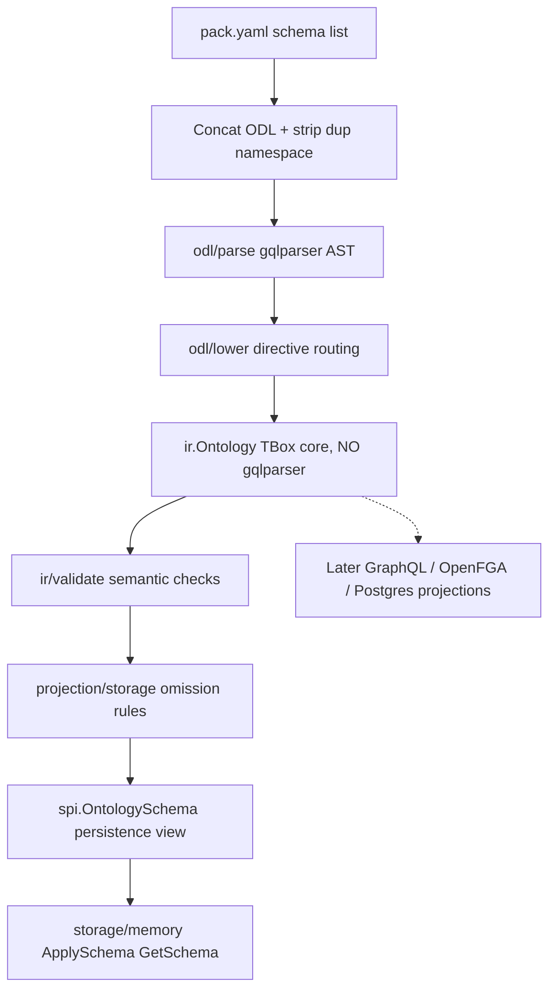

# IR-First Layered Pipeline for Ontology-Based Data Access (Go Runtime)

Track: architecture_pattern
Status: implemented in `runtime/` (Go Phase 1 — SPI, ODL Parser, Ontology IR)

## Context

Open Foundry's TypeScript implementation historically split schema truth across three competing representations: a `ParsedSchema` (a GraphQL-flavored AST produced by an SDL parser), an `OntologySchema` (a storage-projection view consumed by backends), and action YAML (the behavioral surface). Each layer re-derived what a "field" meant from the representation nearest to it, so the semantic intent of an ODL declaration — is this field a primary key, a link navigation, a computed value, or a plain property? — leaked across boundaries. The plan at `docs/plans/2026-08-10-001-feat-go-phase1-ontology-ir-plan.md:14-16` frames this gap plainly: TypeScript "splits schema truth across `ParsedSchema` (GraphQL AST), `OntologySchema` (storage projection), and action YAML," and the remedy is to "put Ontology IR first so later engine/query/API work does not re-bind to SDL or storage shapes."

A new Go runtime (`runtime/`, module `github.com/openfoundry/runtime`, Go 1.25.0 per `runtime/go.mod:1-3`) was established to host the semantic core before any engine, query, GraphQL, REST, or Postgres layers exist. The first phase's job was deliberately narrow: define the TBox (terminology box — types and their relationships) as a parser-free, storage-free IR; parse the existing ODL dialect into it; project it once into a storage schema; and prove the round-trip through an in-memory SPI provider. Nothing else. The gap, in short, was the absence of a stable semantic middle layer that every later projection could bind to without re-reading SDL or re-shaping storage JSON.

A related dead end surfaced during the runtime's evolution: an identity-envelope encoding (`EncodeDirect`/`DecodeDirect`/`EncodePhysicalKey` in the now-deleted `runtime/obda/identity.go`, removed in commit `4e8c56e`) was introduced to wrap `_id` with a type tag, then removed as unnecessary complexity once the Engine took over casting the raw UUIDv7 `_engineObjectId` and providers stopped re-encoding it (session history). The lesson reinforces the IR-first discipline: identity is a storage concern projected *downhill* from the SPI, not something each layer re-wraps — so encoding belongs at the API boundary, never in the semantic core.

## Guidance

The architectural practice this learning captures is the **IR-first layered pipeline with enforced import boundaries**. Each layer has one job, consumes the layer immediately below, and is forbidden from leaking its internal types upward. The pipeline, as drawn in the plan at `docs/plans/2026-08-10-001-feat-go-phase1-ontology-ir-plan.md:44-55`, is:



### Layer 1 — `odl/parse`: a throwaway syntax view

`runtime/odl/parse.go:20-37` defines `Parse(sources ...Source) (*ast.SchemaDocument, error)`. It wraps `parser.ParseSchemas` from `github.com/vektah/gqlparser/v2` (the dependency declared at `runtime/go.mod:7`) and does nothing more. The returned `*ast.SchemaDocument` is a gqlparser AST — a syntax tree, not a semantic IR. The doc comment on the function is explicit: "Callers must `Lower` the result into `ir.Ontology`; do not treat the AST as IR." The decision to use parse-only APIs (`ParseSchema`/`ParseSchemas`) rather than `LoadSchema` (which performs GraphQL semantic validation) is recorded at `docs/plans/2026-08-10-001-feat-go-phase1-ontology-ir-plan.md:33`. This keeps the parser a pure syntax concern: ODL's custom directives (`@linkType`, `@actionType`, `@primary`, `@link`, `@computed`) are unknown to GraphQL's validator and would be rejected by `LoadSchema`; parse-only accepts them and leaves their meaning to the lowerer.

### Layer 2 — `odl/lower`: directive routing into FieldRole

`runtime/odl/lower.go:13-42` defines `Lower(doc *ast.SchemaDocument) (*ir.Ontology, error)`. This is the boundary where syntax becomes semantics. The lowerer walks definition kinds (`ast.Object`, `ast.Enum`, `ast.Interface`, `ast.Scalar`) and routes object-like definitions by their directives: `@linkType` produces an `ir.LinkType` (`lower.go:82-92`), `@actionType` produces an `ir.ActionType` (`lower.go:93-100`), and everything else defaults to an `ir.ObjectType` (`lower.go:102-113`).

The crucial decision is that **FieldRole is assigned here, at lower time, not read from directive bags later**. The `FieldRole` enum lives at `runtime/ir/ontology.go:4-12`:

```go
// runtime/ir/ontology.go:4-12
type FieldRole int

const (
    RoleProperty FieldRole = iota
    RolePrimary
    RoleParam
    RoleLinkNav
    RoleComputed
)
```

The field-lowering switch at `runtime/odl/lower.go:150-196` maps each directive to a role and optional ref: `@primary` → `RolePrimary` (`lower.go:152-153`); `@param` → `RoleParam` (`lower.go:154-155`); `@link` → `RoleLinkNav` plus a populated `*LinkRef` (`lower.go:166-172`); `@computed` → `RoleComputed` plus a `*ComputedRef` (`lower.go:173-180`). Storage-relevant flags (`@unique`, `@indexed`, `@searchable`, `@readonly`, `@immutable`, `@sensitive`, `@constraint`, `@default`, `@deprecated`, `@terminology`) are flattened into a `FieldFlags` struct (`runtime/ir/ontology.go:77-90`) at the same pass. After `Lower` returns, the gqlparser AST is discardable: the IR holds typed roles, typed refs, and flattened flags — never raw directive lists.

### Layer 3 — `ir.Ontology`: the gqlparser-free TBox core

`runtime/ir/ontology.go:156-164` defines the `Ontology` struct:

```go
// runtime/ir/ontology.go:156-164
type Ontology struct {
    Namespace  *Namespace
    Objects    []ObjectType
    Links      []LinkType
    Actions    []ActionType
    Enums      []EnumType
    Interfaces []InterfaceType
    Scalars    []ScalarType
}
```

The `ir` package imports only `fmt` and `strings` (visible at `runtime/ir/validate.go:3-6`). There is no `gqlparser` import anywhere in `runtime/ir/`. This is the load-bearing boundary of the whole pattern: the semantic core is parser-agnostic. A later GraphQL generator, an OpenFGA projection, or a Postgres DDL generator can attach to `ir.Ontology` without ever depending on the SDL parser that produced it.

`runtime/ir/validate.go:34-108` defines `Validate(o *Ontology) error`, the post-merge semantic gate. It checks: no duplicate type names across objects and links (`validate.go:40-51`); exactly one `RolePrimary` field per object (`validate.go:59-73`); link `From`/`To` endpoints resolve to object types (`validate.go:75-82`); every action field has `RoleParam` (`validate.go:84-95`); and enum value names are unique (`validate.go:97-105`). These are TBox invariants — they hold regardless of how the IR is later projected.

### Layer 4 — `projection/storage`: the one-way omission projection

`runtime/projection/storage.go:12-31` defines `ProjectStorage(o *ir.Ontology) spi.OntologySchema`, a pure function that mirrors the TypeScript `convertObjectType` / `convertLinkType` / `toOntologySchema` conversion in `packages/api/src/schema-loader.ts` (cited in the plan at `docs/plans/2026-08-10-001-feat-go-phase1-ontology-ir-plan.md` lines 37 and 185). The projection reads **roles, not directive bags**, because the lowerer already collapsed directives into roles.

The omission rules at `runtime/projection/storage.go:38-69` are:

- **Primary is omitted** from object properties (it is the identity column, not a user property) — `storage.go:51-53` skips `RolePrimary`.
- **Computed is omitted** — `storage.go:51-53` skips `RoleComputed`.
- **LinkNav is extracted, not stored as a property** — it is routed into a `LinkNavigation` slice (`storage.go:39-50`) so that OBDA compile can bind inline FK nullability without re-reading IR.
- **Indexes are synthesized** from flags: `@unique` → `IndexBTREE` with `Unique: true` (`storage.go:61-63`); `@indexed` → `IndexBTREE` (`storage.go:64-65`); `@searchable` → `IndexFULLTEXT` (`storage.go:66-68`).
- Link types project all their fields as properties, including the `id` primary (`storage.go:84-103`), because link rows are first-class stored rows.
- Actions, enums, and interfaces are **kept in IR only** — they never appear on `spi.OntologySchema`. The test at `runtime/projection/storage_test.go:59-62` asserts this directly.

The result is sorted by name for stable output (`storage.go:19-20,25-26`), so golden comparisons and schema diffs are deterministic.

### Layer 5 — `spi.OntologySchema` and the `StorageProvider` surface

`runtime/spi/ontology.go:99-103` defines the persistence view:

```go
// runtime/spi/ontology.go:99-103
type OntologySchema struct {
    Version     int                   `json:"version"`
    ObjectTypes []ObjectTypeDefinition `json:"objectTypes"`
    LinkTypes   []LinkTypeDefinition   `json:"linkTypes"`
}
```

`runtime/spi/provider.go:4-37` defines the full `StorageProvider` interface — schema lifecycle (`ApplySchema`, `GetSchema`), object CRUD, link CRUD, queries, aggregation, search, bulk mutation, graph traversal, transactions, temporal reads, index management, health, and capabilities. The interface ends with an unexported method:

```go
// runtime/spi/provider.go:36
mustEmbedUnimplementedStorageProvider()
```

This is the **SPI stub pattern**: every concrete provider must embed `UnimplementedStorageProvider` (which satisfies the unexported method at `runtime/spi/unimplemented.go:12`), so the interface cannot be satisfied by accident with empty method sets. Every non-overridden method on `UnimplementedStorageProvider` returns `fmt.Errorf("%w: %s", ErrUnimplemented, method)` via the `unimplemented` helper at `runtime/spi/unimplemented.go:14-16` — the method name is always in the message, so a caller hitting an unimplemented surface sees exactly which operation is missing. For example (`runtime/spi/unimplemented.go:26-28`):

```go
func (UnimplementedStorageProvider) CreateObject(RequestContext, string, map[string]any) (OntologyObject, error) {
    return nil, unimplemented("CreateObject")
}
```

### Layer 6 — `storage/memory`: the schema-only concrete provider

`runtime/storage/memory/provider.go:20-46` defines `Provider`, which embeds `spi.UnimplementedStorageProvider` and overrides only the schema surface (and, in later phases, object/link lifecycle). Phase 1's override is `ApplySchema` (`provider.go:73-92`) and `GetSchema` (`provider.go:95-107`). `ApplySchema` deep-clones the incoming schema via JSON round-trip (`provider.go:136-146`) and stores it by version in a `map[int]spi.OntologySchema`; `GetSchema` returns a fresh clone so callers cannot mutate stored state. The clone-on-get contract is asserted by the mutation-isolation test at `runtime/storage/memory/provider_test.go:38-46`.

### Pack gold path: read the schema list, merge, never load `core`

`runtime/pack/loader.go:44-75` defines `LoadDir(packDir string) (*ir.Ontology, error)`. It reads `pack.yaml` via a minimal `Manifest` struct (`loader.go:16-23`) that knows only the `schema:`, `actions:`, `obda:`, and `seed:` lists. The gold path uses the `schema:` list **only** — it does not load dependency packs (the plan is explicit at `docs/plans/2026-08-10-001-feat-go-phase1-ontology-ir-plan.md:35`: "do not load `domain-packs/core` despite pack dependency declaration") and does not touch action YAML (`docs/plans/2026-08-10-001-feat-go-phase1-ontology-ir-plan.md:40`).

The namespace-merge rule is a regex strip at `runtime/pack/loader.go:25` and `loader.go:60-63`: the first schema file keeps its `extend schema @namespace(...)` extension; every subsequent file has its namespace extension stripped by `namespaceExtendRe.ReplaceAllString`. This mirrors the TypeScript pack-concat behavior. After concatenation, the loader calls `odl.ParseAndLower` (`loader.go:67`) and then `ir.Validate` (`loader.go:71-73`), so a pack that lowers but fails semantic checks still fails the gold path.

One constraint surfaced in practice: the loader hardcodes the manifest filename to `pack.yaml`, so two manifests cannot share one directory (session history). Workarounds using `../` traversal via `path.Join` work but were flagged as hacky; the preferred design keeps a single `pack.yaml` loading the full ontology and expresses subsets through seed projection rather than a second manifest.

## Why This Matters

The boundary discipline — `parse ≠ ir ≠ projection ≠ spi ≠ storage` — is what makes the runtime extensible without regressions. Concretely:

1. **A gqlparser-free IR is a stability contract.** Because `runtime/ir/` imports no parser types (verified: `runtime/ir/validate.go:3-6` imports only `fmt` and `strings`), upgrading or swapping the SDL parser cannot ripple into the semantic core or any projection that binds to it. A future move to a hand-written ODL parser, or to a different GraphQL parser, touches `runtime/odl/` only.

2. **FieldRole collapses directive ambiguity once.** If projection read directive bags, every projection (storage, GraphQL, OpenFGA, REST) would re-implement the `@primary`/`@link`/`@computed` dispatch and could disagree. By assigning roles at lower time (`runtime/odl/lower.go:150-196`), the system has one authoritative interpretation; projections read `f.Role` and cannot drift. The storage projection's omission switch (`runtime/projection/storage.go:38-53`) is a three-line `if` on `RolePrimary`/`RoleComputed`/`RoleLinkNav` — no directive parsing, no flag guessing.

3. **The projection is one-way and pure.** `ProjectStorage` (`runtime/projection/storage.go:12`) takes `*ir.Ontology` and returns `spi.OntologySchema` with no receiver state, no I/O, no error path. It is trivially testable and trivially replaceable — a Postgres DDL projection or an OpenFGA tuple projection can be a sibling function with the same signature.

4. **The SPI stub pattern prevents silent no-ops.** The unexported `mustEmbedUnimplementedStorageProvider` method (`runtime/spi/provider.go:36`, satisfied at `runtime/spi/unimplemented.go:12`) forces every provider to embed the stub. A provider that forgets to implement `CreateObject` does not silently return zero values — it returns `ErrUnimplemented: CreateObject` with the method name in the message (`runtime/spi/unimplemented.go:14-16` and `:26-28`). A new backend can land schema-only (as memory did in Phase 1) and be honest about every other surface.

5. **Storage shapes cannot leak back into the ontology.** Because `spi.OntologySchema` is a projection *output*, not an input, and `ir.Ontology` never imports `spi`, there is no code path by which a storage backend's property naming or index choices can corrupt the TBox. The data flows downhill only.

## When to Apply

Apply this pattern when:

- **You are establishing a new runtime or language port of an ontology-based (or schema-driven) data-access system**, and you have the chance to define the semantic core before projections multiply. The cost of the discipline is paid once, at Phase 1; the benefit compounds with every projection added later.
- **You are tempted to let parser AST types escape into the semantic core.** If you find yourself importing `gqlparser/ast` (or `graphql-go`, or any parser package) from a package named `ir` or `model` or `schema`, stop — the IR is no longer parser-free, and a parser upgrade has become a semantic-core change. Put the import behind a `parse`/`lower` pair and discard the AST at the boundary.
- **You are designing an SPI with a large surface where most methods will be unimplemented initially.** Use the unexported-method embed trick (`mustEmbedUnimplementedStorageProvider` at `runtime/spi/provider.go:36`) so the interface cannot be satisfied accidentally, and have the stub return a wrapped sentinel error carrying the method name (`runtime/spi/unimplemented.go:14-16`). This lets a backend ship partial and be honest about the gap.
- **You have multiple projections of one semantic source.** GraphQL, REST, OpenFGA, Postgres DDL, and an in-memory store are all projections of the same TBox. If each re-derives the meaning of a field from raw syntax or storage JSON, they will disagree. Make the IR the single interpretation point.

Do not apply this pattern when the system has exactly one consumer of the schema and no expectation of a second — the layer ceremony is overhead without payoff. And do not mistake "IR-first" for "IR-only": the projection layer and the SPI still exist; the point is their *direction*, not their absence.

## Examples

### The gold path, end to end

The canonical proof that the pipeline holds together is `TestApplyGetRoundTrip` at `runtime/storage/memory/provider_test.go:12-47`. It exercises every layer in five calls:

```go
// runtime/storage/memory/provider_test.go:12-36 (abridged)
func TestApplyGetRoundTrip(t *testing.T) {
    dir, err := pack.SupplyChainDir()          // resolve domain-packs/supply-chain
    onto, err := pack.LoadDir(dir)             // parse + lower + validate → ir.Ontology
    schema := projection.ProjectStorage(onto)  // ir.Ontology → spi.OntologySchema
    p := memory.New()
    ctx := spi.RequestContext{TenantID: "t1"}
    res, err := p.ApplySchema(ctx, schema)      // version 0 → 1
    got, err := p.GetSchema(ctx, nil)          // round-trip: same object/link counts
    // ...asserts len(got.ObjectTypes) == len(schema.ObjectTypes) etc.
}
```

The counts asserted by the pack loader test at `runtime/pack/loader_test.go:23-34` confirm the supply-chain pack yields 6 object types, 7 link types, 4 action types, and a non-empty enum set — and that `o.Namespace.Name == "supply.chain"` (the namespace strip worked). These are the real supply-chain counts, asserted against the in-repo `domain-packs/supply-chain` pack, not a fixture.

### Projection omission, concretely

`runtime/projection/storage_test.go:11-63` constructs a fixture `Ontology` with one object carrying all five field roles — a `RolePrimary` `id`, a `RoleProperty` `name` flagged `Unique` + `Indexed`, a `RoleLinkNav` `bins`, a `RoleComputed` `count`, and a `RoleProperty` `notes` flagged `Searchable` — plus an action and an enum. After `ProjectStorage`, the test asserts:

- `id` (primary) is **absent** from properties (`storage_test.go:38-40`).
- `bins` (link nav) is **absent** from properties but present in `Navigations` with `LinkType: "InBin"` (`storage_test.go:42-49`).
- `count` (computed) is **absent** from properties (`storage_test.go:50-52`).
- `name` is `Required` (its `Type.NonNull` propagated) and produces at least two indexes (one BTREE-unique, one BTREE-plain) (`storage_test.go:53-58`).
- `notes` produces a FULLTEXT index from `Searchable` (`storage.go:66-68`).
- The action and enum do not surface on the storage schema (`storage_test.go:59-62`).

This is the omission contract in executable form: roles assigned at lower time are the sole input to what storage persists.

### The unimplemented surface is honest

A memory provider created with `memory.New()` (`runtime/storage/memory/provider.go:57-66`) overrides schema, health, and capabilities, but inherits every other method from `UnimplementedStorageProvider`. Calling, say, `CreateObject` on a fresh provider returns `ErrUnimplemented: CreateObject` — the method name is in the error, so a Phase 2 caller can distinguish "not yet implemented" from "not found" or "conflict." The `mustEmbedUnimplementedStorageProvider` unexported method guarantees that no struct can claim to implement `StorageProvider` without the stub, so the honesty is enforced by the compiler, not by convention.

## Related

- `docs/solutions/architecture-patterns/go-runtime-query-ir-pipeline.md` — sibling pipeline: Query IR compiles GraphQL/REST reads onto Engine; Ontology IR is the TBox it binds to.
- `docs/solutions/architecture-patterns/go-runtime-mysql-obda-pipeline.md` — sibling pipeline: SPI verbs compiled to parameterized MySQL (mapping, PhysicalSchema, planner, dialect).
- `docs/solutions/architecture-patterns/traverse-nodes-edges-batch-hydration.md` — complementary deep-dive on one storage primitive (Traverse per-hop edge projection and batch hydration) that sits downstream of this pipeline's storage projection layer.
- `docs/plans/2026-08-10-001-feat-go-phase1-ontology-ir-plan.md` — the origin plan for Go Phase 1.
- `docs/brainstorms/2026-08-10-go-phase1-ontology-ir-requirements.md` — the origin requirements (R1–R11, AE1–AE4, F1).
