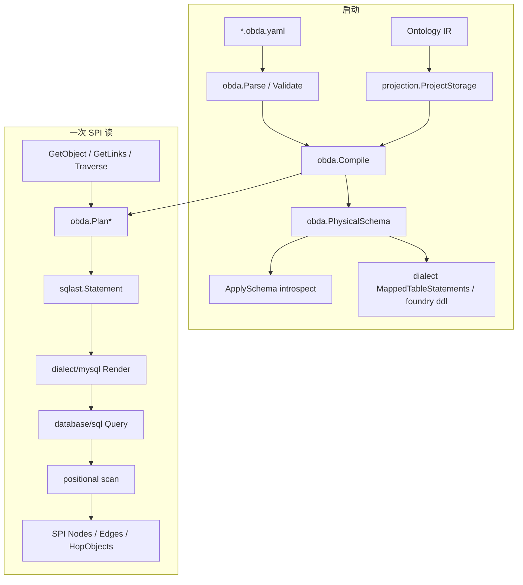

# mysql-obda Layered Pipeline: SPI request to parameterized MySQL

Track: architecture_pattern
Status: implemented in `runtime/obda` + `runtime/storage/mysqlobda`（`DB_DRIVER=mysql|memory`）

Ontology IR 回答「有哪些类型」。Query IR 回答「这一次读要 Engine 做什么」。本文是第三条线：Engine 已经把一次读变成 SPI 动词之后，**mysql-obda 怎样把它编成参数化 SQL**。

`docs/design/obda-spec-v3.md` 仍是 mapping 语言与包边界的权威草稿，但页眉与若干条款停在 SQLite / sidecar / 身份信封时代。冲突时：**以当前 Go 代码为准**；下文「落地与设计稿」表列出被 brainstorm / plan 翻案后的最终结果。

## Context

OBDA 的产品定义没变：ODL 是语义源，mapping 只说物理对应，provider 是可注入 Engine 的完整 `StorageProvider`，不是 Sync Engine overlay，也不是第四个图数据库。

变的是落地剖面。spec v3 写 `runtime target: sqliteobda`、v1 方言 SQLite、Core → Dialect → SQLite。2026-08-21 的 MySQL brainstorm 还带着 sidecar 补系统列、temporal/bulk 全开。随后一串 plan 把这条链收成今天的形状：

- 连接与方言退出 YAML（`docs/plans/2026-09-04-001-refactor-obda-remove-sources-plan.md`）
- 身份列存裸 `_id`，删除信封（`docs/plans/2026-09-07-003-feat-obda-single-column-identity-plan.md`）
- 物理期望从 compiled mapping 派生，DDL / Init / verify 共用（`docs/plans/2026-09-07-001-refactor-obda-physical-schema-expectation-plan.md`）
- 无属性 M2O/O2M/O2O 默认 inline FK（`docs/plans/2026-09-07-002-feat-obda-inline-link-fk-plan.md`）
- sqliteobda 删除，bootstrap 只认 `mysql` | `memory`（PR #8）
- Traverse 从「只交终点、Edges 空」演进到 Nodes+Edges，再 opt-in 中间列投影（Query IR 篇）

`runtime/obda/doc.go` 仍写「v1 adapter is SQLite」——以本文与 `runtime/bootstrap/conf.go:24-25` 为准。

mysql-obda **看不见 Query IR**。它只看见 `spi.StorageProvider` 动词与 `TraversalOptions`。Query IR 的 Expand 分类、树装配、memo 不进入本层。

## Guidance

启动时把 mapping 编成不可变 `Compiled` 并核对物理表；请求时 planner 产出方言无关 `sqlast`，MySQL dialect 渲染，`database/sql` 按位置执行与扫描。



Core（`runtime/obda`）不 import 驱动。Dialect 不重定义 SPI 语义。Provider 不手写 SQL 字符串。

### Layer 1 — YAML 只描述逻辑绑定，不持有连接

`runtime/obda/mapping.go:4-14`：`Document` 含 `apiVersion` / `kind` / `metadata` / `schema` / `models` / `links`。没有 `sources`、`sourceRef`、`dsnRef`、dialect 字段。

library-pack 金映射（`domain-packs/library-pack/obda/library.obda.yaml`）：

```yaml
apiVersion: openfoundry.io/obda/v1
kind: OBDAConfig
models:
  Book:
    relation: {kind: table, name: book}
    identity: {strategy: direct, columns: [id], insert: generated}
    tenant: {strategy: column, column: tenant_id}
    system: {strategy: native}
    fields: { title: {column: title}, ... }
links:
  AvailableAt:
    relation: {kind: table, name: available_at}
    from: {object: Book, columns: [from_id]}
    to: {object: Branch, columns: [to_id]}
  RegisteredAt:
    relation: {kind: inline}
    from: {object: Reader}
    to: {object: Branch, columns: [branch_id]}
```

Cardinality、`@primary`、constraint 仍以 ODL 为准。mapping 不重述它们。DSN 由组装层 `sql.Open` 后注入：`mysqlobda.Open(db, mapping, opts)`（`provider.go:52-64`）。方言由所选 provider 包决定：选 `mysqlobda` 即 MySQL。`pack.LoadMappings`（`runtime/pack/mappings.go:20-66`）读 `pack.yaml` 的 `obda:` 清单，parse → validate → 对 Ontology IR 的存储投影 `Compile`，并拒绝跨文件的 model / link / 表名碰撞。

### Layer 2 — Parse / Validate：无库语义闸

`obda.Parse`（`runtime/obda/parse.go:23`）拒绝 YAML 里的明文凭证键（`dsn` / `password` / `uri` / …）。`obda.Validate`（`validate.go:27`）检查 `apiVersion == openfoundry.io/obda/v1`、`kind == OBDAConfig`，以及 **identity 恰好一列**（`validate.go:91`）。inline 与 table 链接走不同校验。还不碰 OntologySchema，也不连库。

### Layer 3 — Compile：mapping × 存储投影 → 不可变 Compiled

`obda.Compile(schema, doc)`（`compiler.go:179-196`）的 `schema` 是 `spi.OntologySchema`（Ontology IR 的存储投影），不是 gqlparser AST，也不是 ODL 原文。每个 ObjectType / LinkType 必须在 mapping 里有绑定，否则 `ErrInvalidMapping`。

产出 `CompiledModel` / `CompiledLink`：物理表、identity 列、tenant 列、系统列 omit、逻辑字段→列、`SearchableFields`（**不是**索引名）、inline 时的 `HostModel` / `FKColumn` / `FKNullable`。

inline 资格（`compile_link.go:47-56`）：无业务属性，且 cardinality 为 M2O / O2M / O2O。默认 inline；`kind: table` 退出为联结表。M2M 永不 inline，未写 `kind: table` 则编译失败。FK 可空性只看 host 对象上指向对端的导航字段（`Member!` → NOT NULL）。

`CompiledModel.Binding()`（`compiler.go:80-127`）是 planner 看到的列集：identity、tenant、fields、inline FK、未 omit 的系统列。planner 不读 YAML。

### Layer 4 — PhysicalSchema：方言无关的表期望

`obda.PhysicalSchema`（`physical.go:44-80`）从 `Compiled` 派生：表、必需要列、cardinality UNIQUE（是否排除软删行）、FULLTEXT 列清单。不含 SQL 类型、引号、生成列、索引名。

inline 链接 **不产生自己的表**；FK 列出现在 host 表的期望里。junction 链接各一张表。

这一份期望被三处消费：

1. `foundry ddl` 按方言打印 CREATE，不连库。
2. `InitMappedSchema`（`schema.go:14-27`）opt-in 建表；`ApplySchema` **从不**调用它。
3. `ApplySchema.verifyMappedSchema`（`schema.go:30-43`）用 live introspect 对照期望：缺表 / 缺列 / 缺 UNIQUE / 缺声明的 FULLTEXT → 不得激活。列校验是期望 ⊆ 实列，允许多余列（MySQL 的 `of_active` 因此不会假漂移）。

### Layer 5 — Provider：Open 不激活，ApplySchema 才绑定

`Open` ping 数据库、绑定 `mysqldialect.New()`，不 `ApplySchema`。激活发生在 `ApplySchema`：Compile → verify → fingerprint → 写入 `activation`。未激活的 SPI 读走 `ErrMappingNotActive`（fail-closed）。

`Capabilities`（`provider.go:142-152`）：事务开、图遍历开（深度 8）、全文开；**temporal / bulk 关**，对应方法返回 `ErrUnsupportedCapability`。这比 2026-08-21 brainstorm 的「每个 SPI 方法都有成功路径」窄，与后来「镜像当时 sqliteobda 能力集」的 plan 一致。

`DB_DRIVER` 默认 `mysql`（`bootstrap/conf.go:25`）。`memory` 无 SQL、无 DDL、无 `DB_URL`。未知 driver 失败，不回退。

### Layer 6 — Planner：闭包 sqlast，不发射 SQL 文本

`runtime/obda/sqlast` 是方言无关计划。`Param.Position` 是 1-based 槽位标注；**MySQL 渲染忽略它**，绑定顺序跟文本里 `?` 的出现位走。

| SPI | Planner |
|---|---|
| `GetObject` | `PlanGetObject`：`WHERE tenant=? AND id=?`，软删行仍选出（上层决定可见性） |
| `QueryObjects` | filter + page；filter 默认只放行 eq，外加 or-of-eq 批量通道 |
| `GetLinks` | `PlanGetLinksJoin`：一跳 JOIN |
| `Traverse` | `PlanTraverse`：链式 INNER JOIN，列桶布局 |
| `SearchObjects` | `PlanSearch`：`MATCH ... AGAINST` 的中立 `FullTextMatch` 节点 |
| `CreateObject` | `PlanCreateObject`：INSERT，无 `Returning` |

`PlanTraverse`（`planner.go:369-375`）：FROM 是起点对象表；每一跳 JOIN 链接表再 JOIN 目标（inline 跳过链接表，直接 JOIN 对端）。SELECT 先终点列，再每跳边桶，再可选中间对象桶。WHERE / ORDER / args 不随投影改变，args 仍是 `[tenant, startID]`。

### Layer 7 — Dialect：纯渲染 + DDL + 错误分类，不触库

`runtime/obda/dialect/dialect.go:26-33`：`Name` / `Capabilities` / `QuoteIdentifier` / `Placeholder` / `Render` / `NormalizeValue`。

MySQL 适配器（`dialect/mysql/dialect.go`）：反引号、`Placeholder` 恒为 `?`、`Render` 覆盖 Select/Insert/Update/Delete/AggregateSelect。`Returning` 显式 `ErrUnsupportedCapability`——不是绕过缺口，是防止将来有人设置该字段被静默丢弃。真正的方言分叉在 DDL：

- 软删基数唯一：虚拟列 `of_active = IF(deleted_at IS NULL, 1, NULL)` + `UNIQUE (tenant, endpoint, of_active)`。活跃行碰撞；软删行的 NULL 互不相撞。这不是 sidecar 表。
- FULLTEXT 名 `ft_<table>` 只出现在 DDL 文本；verify 按**排序后的列清单** + `INDEX_TYPE=FULLTEXT` 匹配（见 `docs/solutions/design-patterns/mysql-fulltext-search-and-eq-only-filter.md`）。
- `Classify` 把驱动错误号映射到 SPI sentinel，留在 dialect（不触库）。

introspection（`information_schema`）在 `storage/mysqlobda`，不在 dialect。xorm 不进这条路径：表形来自运行时 YAML，JOIN 同名列必须按位置扫描（`docs/plans/2026-09-11-001-refactor-mysqlobda-scan-dialect-boundary-plan.md`）。

### Layer 8 — mysqlobda 执行：参数化 SQL + 位置扫描

Provider 调用 planner → `dialect.Render` → `db.Query` / `Exec`。行读取走 `scan` + `bizMap`（`scan.go:7-27`）：按偏移切桶，从不 `rows.Columns()` 建全局列名 map。`GetObject`（`objects.go:105-114`）按 `(type, tenant, raw id)` 查表；错类型 = 空查 not-found，不再从 id 解码类型。

写入是「先插后读」：`insertBusiness` 再 `loadObject`。Engine 在 `insert: generated` 时铸造 UUIDv7，经 `_engineObjectId` 注入；identity 列存该裸值。HTTP 原样透传 `_id`。

Traverse 在 provider 内把 `Project` 写成 `MidSelect`，扫描进 `HopObjects`；`SkipTotalCount` 跳过 COUNT 派生表；`StartConfirmed` 跳过起点 `loadObject`。超限用 `LIMIT cap+1` 探顶（Query IR 篇 Layer 7–8）。

## 落地与设计稿

以**当前代码**为最终结果。早期文档未改的句子不要当实现契约。

| 主题 | 曾写在 | 落地 |
|---|---|---|
| v1 方言 / runtime target | spec v3 页眉、`obda/doc.go`：SQLite / sqliteobda | `DB_DRIVER=mysql\|memory`；sqliteobda 与 `dialect/sqlite` 已删 |
| sidecar `of_*` 表补系统列 | 2026-08-21 MySQL brainstorm R14 | 业务表 native 系统列；无 sidecar 表。`of_active` 是生成列，不是表 |
| YAML `sources` / `dsnRef` | spec v3 早期、mapping design | 永久删除。连接由 `Open(db, mapping)` 注入 |
| 身份信封 `EncodeDirect` | spec §5、direct-native 早期 | 删除。identity 一列 = SPI `_id` 裸值 |
| 「MySQL 唯一分叉是没有 RETURNING」 | 2026-08-27 MySQL plan R5 | 幻觉：planner 从不设 Returning。真分叉是软删 UNIQUE |
| Traverse 只交终点、Edges 空 | 2026-08-26 chained-JOIN、MySQL plan R13 | Nodes+Edges；opt-in `HopObjects`。memory 不再是「唯一能拼树」的后端 |
| 每个 SPI 方法都有成功路径 | 2026-08-21 brainstorm R12–R13 | temporal / bulk 保持 `ErrUnsupportedCapability` |
| dialect 负责 introspection | spec v3 方言职责表 | introspect 在 `mysqlobda`；dialect 只渲染 / DDL / Classify |
| compile 产物带 SearchIndex 名 | 早期 compile | 只保留 `SearchableFields`；索引名留在方言 DDL |
| filter 静默当 eq | 早期 QueryObjects | 非 eq fail-closed；唯一拓宽是 or-of-eq |
| 一 LinkType 一张表 | 物理期望落地前 | 无属性 M2O/O2M/O2O 默认 inline；M2M / 有属性仍是 junction |
| sqlite 拒绝 inline | inline plan R（sqlite 失败） | sqlite 后端已不存在；inline 是 MySQL 金路径的一部分 |

仍然成立、不要翻案的原则：ODL 是语义源；mapping 不重述业务类型；Core 不发射某数据库 SQL；租户谓词运行时注入、调用方覆盖不了；全部运行期值参数化，标识符只来自 compiled mapping。

## Why This Matters

1. **三层 IR 在存储边界收口。** Ontology IR 投影出 `OntologySchema`；Query IR 停在 Engine；本层把 SPI 编成 SQL。把 `PlanTraverse` 的 AST 叫做 Query IR、或让 resolver import mysqlobda，都会把这三层重新焊死。

2. **spec 页眉过期不等于 mapping 语言过期。** `*.obda.yaml` 的 `apiVersion` 仍是 `openfoundry.io/obda/v1`。变的是连接、身份、方言选择、Traverse 结果形状。读 spec 时先对这张表，再对 YAML 字段。

3. **方言分叉要写在 DB 强制不变式上，不要写在语法清单上。** RETURNING、xorm、FTS5 虚拟表都曾是假分叉。活着的分叉是：MySQL UNIQUE 的 NULL 语义（`of_active`）、`?` 按出现序绑定、FULLTEXT 按列清单 verify、JOIN 同名列按位置扫描。

4. **物理期望是 DDL 与 verify 的单一事实源。** 方言各自维护一份「需要哪些列」会在 inline FK 与 `of_active` 上漂移。`PhysicalSchema` 不含类型；类型、生成列、部分索引 vs 生成列，才是方言的事。

## When to Apply

- 给 SPI 加读路径：先加 `obda.Plan*`，再让 mysqlobda Render + scan；不要在 provider 里拼 SQL。
- 改 mapping YAML：先 `Validate`/`Compile`/`PhysicalSchema`，再想 DDL。DSN、方言名、多列 identity 进不了文档。
- 新增 SQL 方言：实现 `dialect.Dialect` + 自己的 provider 包；不要改 SPI 形状，也不要在 YAML 里设 dialect。先 grep planner 是否真用了你以为缺的语法。
- LinkType 物理化：有业务属性或 M2M → junction；无属性 M2O/O2M/O2O → inline，除非 mapping 写 `kind: table`。
- 在 JOIN 上取中间字段：给 `TraversalOptions.Project` 加列，不要恢复 `Visited`，也不要为中间类型再开一轮按名扫描。

## Examples

### 金路径：`book { branches { readers } }` 在 mysql-obda 里是什么 SQL

Query IR 篇已经把这条 GraphQL 编成 `Get` + `ExpandTraverse{paths: [[branches, readers]], Project: {Branch: [name]}}`。本层看到的是：

1. **`GetObject(Book, tb2)`** → `PlanGetObject`：

   ```sql
   SELECT `id`, `tenant_id`, `isbn`, `title`, ... FROM `book`
   WHERE `tenant_id` = ? AND `id` = ?
   ```

2. **`Traverse(tb2, [AvailableAt outbound, RegisteredAt inbound])`**。mapping 上 `AvailableAt` 是 junction 表 `available_at`；`RegisteredAt` 是 Reader 宿主上的 inline `branch_id`。`PlanTraverse` 形状（别名示意）：

   ```text
   FROM book s0
   JOIN available_at l0 ON l0.from_id = s0.id AND l0.tenant_id = s0.tenant_id
   JOIN branch   s1 ON s1.id = l0.to_id AND ...
   JOIN reader   s2 ON s2.branch_id = s1.id AND ...   -- inline，无第二张链接表
   ```

   SELECT 桶：`s2.*`（终点 Reader）+ `l0.*`（hop0 边）+ hop1 inline 最小边列 + `s1.name`（`Project` 的 mid 桶）。args 仍是 `[tenant, startID]`，再追加 `limit+1, offset`。COUNT 不发（Expand 设了 `SkipTotalCount`）；起点不重读（`StartConfirmed`）。

3. **扫描。** 按 `TraverseLayout` 偏移切片。同名 `id` 出现在每个桶里，位置扫描不会互相覆盖。终点装配为 `Nodes`；`l0` 经 `assembleLink` 进入 `Edges`；`s1.name` 进入 `HopObjects[0]`。Query IR 用这些拼树，不再 `QueryObjects` 水合 Branch。

e2e 锁 2 条 SQL（`runtime/e2e/sqlcount_test.go`）：root_get + traverse_page。计数钩子必须用独立 driver 名注册（`mysql-e2e-count`），不能复用 `mysql-hooks`。

### inline vs junction，同一查询里并存

`RegisteredAt` 无业务属性、MANY_TO_ONE，YAML `kind: inline` → Reader 表上的 `branch_id`，SPI 链接 id = host `_id`。`AvailableAt` 是 MANY_TO_MANY → 必须 `kind: table`。Traverse 的 hop 描述带 `Inline` / `FKOnPrev` / `HostSelect`，planner 在 inline 跳省略链接表。不要为「统一 JOIN 形状」把 inline 再建成表。

### 假分叉：RETURNING；真分叉：`of_active`

`PlanCreateObject` 只构造 INSERT，从不设 `sqlast.Insert.Returning`。mysqlobda 与当年 sqliteobda 一样先插后读。MySQL 没有部分索引，软删 UNIQUE 若写成 `(tenant_id, from_id, deleted_at)` 会因 NULL 互不相撞而**静默失效**。生成列把「活着」编码成 `1`、把软删编码成 NULL，利用同一条 NULL 规则实现「软删让位」。详见 `docs/solutions/design-patterns/mysql-port-divergence-of-active-unique-index.md`。

## Related

- [IR-First Layered Pipeline](./go-runtime-ir-first-pipeline.md) — Ontology IR → `spi.OntologySchema`。Compile 吃的是这份投影。
- [Query-IR Layered Pipeline](./go-runtime-query-ir-pipeline.md) — GraphQL/REST → Query IR → Engine。本文从 SPI 接着往下。
- [traverse-nodes-edges-batch-hydration](./traverse-nodes-edges-batch-hydration.md) — 列桶 JOIN 与批量水合。
- [mysql-port-divergence-of-active-unique-index](../design-patterns/mysql-port-divergence-of-active-unique-index.md) — 方言移植方法论与 `of_active`。
- [mysql-fulltext-search-and-eq-only-filter](../design-patterns/mysql-fulltext-search-and-eq-only-filter.md) — FULLTEXT 列清单 verify 与 `?` 出现序。
- `docs/design/obda-spec-v3.md` — mapping 语言；页眉 SQLite / sidecar 以本文对照表为准。
- 关键 plan：`2026-08-27-001`（MySQL provider）、`2026-09-04-001`（删 sources）、`2026-09-07-001`（PhysicalSchema）、`2026-09-07-002`（inline）、`2026-09-07-003`（裸 identity）、`2026-09-11-001`（scan / dialect 边界）、`2026-09-14-001`（Expand SQL）。
