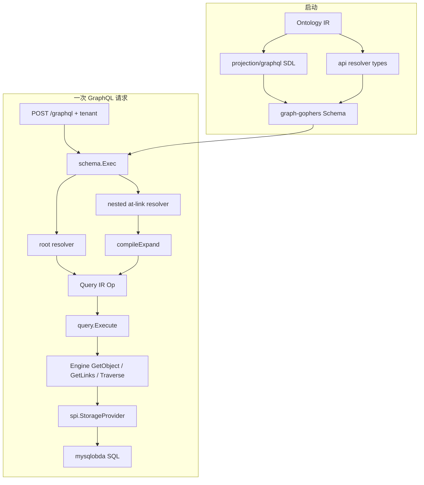

# Query-IR Layered Pipeline: GraphQL client request to mysql-obda execution

Track: architecture_pattern
Status: implemented in `runtime/` (Go Phase 6 Query IR + Expand SQL 优化)

Ontology IR 回答「有哪些类型」。Query IR 回答「针对这些类型执行哪一次读」。本文是 Ontology IR 管道文档的姊妹篇：把一次 GraphQL 读从客户端请求跟到 mysql-obda 落库，并标出 Query IR 在这条链上的边界。

mysql-obda 的映射编译、方言、物理表形状见 [mysql-obda Layered Pipeline](./go-runtime-mysql-obda-pipeline.md)。本文只写 Query IR **向它要什么**，以及为什么 SQL 形状进不了 Query IR。

## Context

`docs/design/draft.md` 把 Runtime 立成三种核心中间表示：Ontology IR（TBox）、Query IR（一次读）、Action IR（一次写，本阶段不做）。Ontology IR 管道（`docs/solutions/architecture-patterns/go-runtime-ir-first-pipeline.md`）已经把 ODL → parse → lower → `ir.Ontology` → 存储投影讲清。缺的是第二条线：客户端已经拿到一张从 Ontology IR 投影出来的 GraphQL SDL 之后，一次 query **怎么变成一次存储读**。

若没有 Query IR，每个 resolver 会各自打 Engine（或直接打 SPI）。Phase 6 origin 就是这样：嵌套 `@link` 逐字段 `GetLinks` + `GetObject`，REST 只有 GET by id，Query IR 被标为过早。后果是 2 跳走不完、中间对象拼不回选择树、GraphQL 与 REST 各有一套执行器。

产品规则在 `docs/brainstorms/2026-08-20-go-phase6-query-ir-traverse-requirements.md`：全部对外读先编成 Query IR；GraphQL 不暴露通用图查询；REST follow 承担通用图查询；1 跳叶子走 `GetLinks`，更深全路径走 `Traverse`。形状说明在 `docs/design/query-ir.md`。落地计划是 `docs/plans/2026-08-20-002-feat-go-phase6-query-ir-traverse-plan.md`，SQL 条数与超限语义由 `docs/plans/2026-09-14-001-perf-traverse-expand-sql-optimization-plan.md` 收口。

Query IR **不是**：

- GraphQL AST（SDL 来自 Ontology IR 投影，语义不在 query 文档里）
- 暴露给客户端的 SPI `TraversalPath`（路径词表是 `@link` 字段名，不是 link type + direction）
- OBDA `SemanticQueryPlan` / `PlanTraverse` 的 SQL AST（那是存储层产物，见 [mysql-obda Layered Pipeline](./go-runtime-mysql-obda-pipeline.md)）
- 整份 GraphQL 操作上的共享前缀优化器（v1 是每个 resolver 一个 tagged op）

## Guidance

这条管道有两个时间：

1. **启动时** Ontology IR 投影出 SDL 与 resolver 类型（Query IR 尚未出现）。
2. **请求时** 每个面向 Engine 的 resolver 构造一个 Query IR op，唯一出口是 `query.Execute` → Engine → SPI → mysql-obda。



投影层（`runtime/api`、`runtime/projection/graphql`）只构造 Op，不 import 存储包。`runtime/query` 依赖 Engine 与 Ontology IR，不 import `storage/mysqlobda`。mysql-obda **看不见** Expand：它只看见 SPI 动词与 `TraversalOptions`。

### Layer 1 — GraphQL SDL 是 Ontology IR 的投影，不是语义源

`runtime/api/schema.go:39-61` 的 `New` 从 Engine 上的 Ontology IR 启动：

```go
sdl := projgql.Generate(eng.Ontology(), eng.Capabilities())
root, err := s.buildQueryRoot()
schema, err := graphql.ParseSchema(sdl, root,
    graphql.UseFieldResolvers(),
    graphql.DisableIntrospection(),
)
```

`runtime/projection/graphql/sdl.go:32-34` 的 `Generate` 读 **FieldRole**，不读 ODL 指令袋。`writeObjectType`（`sdl.go:193-205`）把 `RoleLinkNav` 写成嵌套对象字段（例如 `branches: [Branch!]!`）；`writeQuery`（`sdl.go:305-338`）为每个 ObjectType 生成 `book(id)` / `books(...)` / `bookAggregate`，有全文检索能力时再加 `searchBooks`。根上 **没有** `traverse` / `follow`。

客户端走图的方式仍是嵌套 `@link`。这是 Query IR 的前置：query 文档里的字段名必须能在 Ontology IR 上解析为 `RoleLinkNav`，否则根本进不了 Expand。

### Layer 2 — HTTP 入口只注入租户与 Expand memo

`runtime/api/http.go:18-25`：

```go
mux.Handle("POST /graphql", s.withTenant(gql))
mux.Handle("GET /api/v1/{type}/{id}/follow", s.withTenant(...serveRESTFollow))
mux.Handle("GET /api/v1/{type}/{id}", s.withTenant(...serveRESTGet))
```

`withTenant` 要求 `X-OpenFoundry-Tenant`，写入 `spi.RequestContext`。`schema.go:68-73` 的 `withRC` 同时在 context 上挂一份 Expand memo——同一请求内，同一导航不得第二次 `GetLinks` / `Traverse`。

进程内金路径（`runtime/e2e/graphql_test.go:226-230`）不经 HTTP，直接 `srv.Exec(ctx, rc, query, nil)`，与 HTTP 共用同一条 Query IR 链。

### Layer 3 — 每个 resolver 构造恰好一个 tagged Op

`runtime/query/ir.go:27-34`：

```go
type Op struct {
    Get       *Get
    List      *List
    Aggregate *Aggregate
    Search    *Search
    Expand    *Expand
}
```

一个 Op 恰好一种。GraphQL 根字段与 REST 的对应关系：

| 入口 | Op |
|---|---|
| `book(id)` | `Get{Type, ID}` |
| `books(filter, …)` | `List`（filter/page 在投影层已转成 SPI 类型） |
| `bookAggregate` | `Aggregate` |
| `searchBooks` | `Search` |
| `@link` 字段 | `Expand`（按子选择集分类） |
| 对象型外键字段 | 对存着的 id 再 `Get`（不是 Expand） |
| REST `GET /api/v1/{type}/{id}` | `Get`，`Computed` 为空切片（全部 LAZY） |
| REST `GET .../follow?path=f1,f2` | `Expand`，**一律 Traverse** |

根 get 的构造在 `runtime/api/schema.go:126-139`：

```go
res, err := query.Execute(s.engine, rcFrom(ctx), query.Op{
    Get: &query.Get{Type: typ, ID: string(args.ID)},
})
```

找不到对象时 GraphQL 返回 `null`（吞掉 `ErrObjectNotFound`），REST 映射 404。

`@link` 字段不在这里分类。对象 resolver 由 `runtime/api/resolver_type.go:162-177` 按 Ontology IR 角色分成 `fieldLinkList` / `fieldLinkOne` / `fieldFK` / `fieldComputed` / `fieldScalar`。`makeObjFunc`（`resolver_type.go:252-280`）里：标量从已物化的 `OntologyObject` 取值；计算字段走 `Engine.ComputeField`；外键走 `resolveFK` → `Get`；导航走 `resolveLink`。

### Layer 4 — Expand：从选择集编译，而不是从 HTTP 跳数编译

`runtime/api/node.go:45-63` 的 `resolveLink`：

1. 用 `SelectedFieldNames` 做选择指纹，命中 memo 则不再 Execute。
2. 否则 `compileExpand` 产出 `query.Expand`，填 `StartID`，调用 `query.Execute`。
3. 把 `ExpandResult.Adjacency` 并入 memo，返回第一跳对象给 graph-gophers 继续下钻。

`runtime/api/compile.go:96-124` 的分类规则（产品 R6–R8）：

```text
对象 A 上的 @link 字段 f：
  若 f 的子选择集不含 RoleLinkNav  → ExpandGetLinks，Paths = [[f]]
  否则                              → ExpandTraverse，
                                      从 f 起每条线性 @link 全路径一条 Paths 项
```

| 选择集 | Op |
|---|---|
| `book { borrowers { name } }` | `ExpandGetLinks` `[[borrowers]]` |
| `book { branches { name readers { name } } }` | `ExpandTraverse` `[[branches, readers]]` |
| `a { b { c {…} d {…} } }` | 两次 Traverse：`a→b→c` 与 `a→b→d`（不共享前缀） |
| `a { b { name } c { d { name } } }` | `b` GetLinks；`c→d` Traverse |

REST follow **不用**上表：`http.go:90-97` 固定 `Mode: ExpandTraverse`，即使 path 只有一跳。非法字段名（标量、FK、link type 名、当前类型上不存在）在 Execute 里变成 `ErrInvalidFollowPath`，HTTP 400，不打 SPI。

路径词表是 Ontology IR 字段名。`runtime/query/expand.go:11-36` 的 `resolveSteps` 在当前跳类型上查找 `RoleLinkNav`，取出 `Field.Link.Type` + `Direction`，写成 `spi.TraversalStep`。Query IR 仍是语义图 API；SPI 才是图存储 API。

`Expand.Project`（`query/ir.go:82-84`）是按类型的中间字段清单，供 Traverse 在已 JOIN 的表上顺带投影。`IntermediateProject` 从同一份 `SelectedFieldNames` 提取，别名/片段行为与分类器一致。memo 键含选择指纹（`compile.go:189-196`）：同字段不同子选择不得复用半投影对象。

### Layer 5 — `query.Execute` 是投影到 Engine 的唯一门口

`runtime/query/execute.go:16-35`：空 Op 报错；五种非空指针各走一条。`query` 包不 import mysqlobda。

Expand 在这里做完产品规则，Engine 不再分类：

- 校验每条 path（失败关闭）。
- REST `CheckStart`：先 `GetObject`，缺失/软删/错租户与 GraphQL get 同一 not-found。memory 的 `Traverse` 不校验起点存在，follow 必须自己 Get。
- `ExpandGetLinks`：`Engine.GetLinks` + `SkipTotalCount`，`HasNextPage` 在 hop cap 上视为超限哨兵（含重复链接填满窗口），再 `hydrateByIDs` 一次批量 `QueryObjects`。
- `ExpandTraverse`：`Engine.Traverse`，选项固定为 `SkipTotalCount` + `StartConfirmed` + `Project`。`hydrateEdges` 跳过 `Project` 已覆盖的类型；空选区中间类型由边端点合成仅含身份的骨架（`expand.go:208-230`），避免 `neighbors()` 因缺对象剪枝。
- `assemblePath` 用 `nodes`（终点）+ `HopObjects`（已投影中间）+ 水合对象 + `edges` 重建邻接表。同 id 在两次 Traverse 中去重；**不要**因为某 id 在更早一跳出现过就折叠后续跳。

嵌套 `@link` 是普通 GraphQL 列表，从不读 `totalCount`；顶层 List 与惰性 `countLinks` 仍计数。零值选项保持「计数、校验起点」——conformance 与直连 SPI 的调用方不受 Expand 优化影响。

### Layer 6 — Engine 透传，不装配树

`runtime/engine/read.go:24-34`：

```go
func (e *Engine) GetLinks(...) (spi.LinkPage, error) {
    return e.storage.GetLinks(ctx, objectID, linkType, direction, options)
}
func (e *Engine) Traverse(...) (spi.TraversalResult, error) {
    return e.storage.Traverse(ctx, startID, path, options)
}
```

注释写明：分类与 GraphQL 树装配属于 query 包。`GetObjectOpts`（`engine/computed.go:27-36`）只在 Get 上按需合并 LAZY `@computed`——计算字段不是 Expand。

Engine 持有 `*ir.Ontology`（`engine.go:36-39` 的 `Ontology()`），让 API / query 读 TBox 而不再握一份 IR 指针。

### Layer 7 — SPI 是持久化边界；Query IR 到此结束

mysql-obda 实现的是 `spi.StorageProvider`，不是 Query IR。Traverse 的契约在 `runtime/spi/ontology.go:263-277`：

```go
type TraversalResult struct {
    Nodes      []OntologyObject // 仅最后一步
    Edges      []OntologyLink   // 走过的每一条边（按 link id 去重）
    TotalCount int
    HopObjects [][]OntologyObject // 仅当 Project 命名了该跳目标类型
}
```

默认形状是 **Nodes + Edges**，与 TS SPI 对齐。已退役的 `Visited` 不再存在：统一中间负载字段删掉，不等于「SQL 不得读取它已经 JOIN 的中间列」。`TraversalOptions.Project` 是 opt-in；不传则调用方按 Edges 水合，行为与投影感知之前一致。

超限哨兵 `spi.ErrTraversalLimitExceeded`：Traverse 在硬上限处用 `LIMIT cap+1` 探顶；一跳 Expand 消费 GetLinks 的 `HasNextPage`。GraphQL 进入 `errors[]`；REST follow 映射 422 `TRAVERSAL_LIMIT_EXCEEDED`。

### Layer 8 — mysql-obda 把 SPI Traverse 编成一条链式 JOIN

`runtime/storage/mysqlobda/links.go:375` 的 `Traverse`：把 `TraversalPath` 变成 `obda.TraverseHop`（junction 或 inline），若 `Project` 命中非终点类型则填 `MidSelect`，然后 `obda.PlanTraverse`（`runtime/obda/planner.go:369-375`）。

`PlanTraverse` 的 FROM 是起点对象表；每一跳 INNER JOIN 链接表再 JOIN 目标对象表。SELECT 是列桶：终点列、每跳边列、可选中间对象列。WHERE / ORDER / args 不随投影改变，args 仍是 `[tenant, startID]`。行扫描按桶偏移切片，重复列名（每桶都有 `id`）靠位置而不是全局列名。

Expand 路径上的 2 跳金查询因此是 **两条 SQL**（`runtime/e2e/sqlcount_test.go`）：根 `GetObject` + Traverse 数据页。COUNT 与起点重读被 `SkipTotalCount` / `StartConfirmed` 关掉；中间 `Branch.name` 来自 JOIN 上的 mid 桶，不再事后水合。未设这些选项的调用方仍走旧语义。

到这里 Query IR 的职责结束。映射如何把 `@link(AvailableAt)` 编到物理表、inline 与 junction 的 JOIN 形状、方言渲染，见 [mysql-obda Layered Pipeline](./go-runtime-mysql-obda-pipeline.md)。

## Why This Matters

1. **Query IR 把「读什么」从「怎么存」和「怎么展示」里抽出来。** Ontology IR 稳定 TBox；GraphQL SDL 只是一种投影；mysql-obda 只是一种 SPI 实现。新加 REST list 或将来的 SPARQL 前端应扩展 Execute，而不是再接一套 resolver。

2. **分类规则保护两条金路径。** 一律 Traverse 会烧掉 1 跳 `GetLinks`；把 SPI `TraversalPath` 挂到 GraphQL 根会把存储词表泄漏给客户端。REST follow 与 GraphQL 嵌套 `@link` 共享 Execute，但分类规则不同——这是有意的。

3. **SPI 契约与内部 SQL 投影解耦，才压得死死重 SQL。** 「没有 Visited」曾被执行成「SQL 不得投影中间列」，2 跳变成 6 条语句（根 Get、起点重读、两条 COUNT、数据页、水合页）。opt-in `Project` 让 JOIN 顺带带回中间字段，公共默认形状不变。

4. **超限必须可见。** 测试页上限静默截断会让 GraphQL/REST 返回残树且无错误。探顶硬错误把丢失变成 `errors[]` / 422，而不是看起来成功的部分数据。

## When to Apply

- 增加任何对外读：构造 Op 并 `Execute`，不要从 `runtime/api` 调用 SPI 或 import mysqlobda。
- 判断 `GetLinks` 还是 `Traverse`：看 GraphQL 子选择集是否还有 `@link`；REST follow 永远 Traverse。
- 对象型 FK 与 `@link` 同目标时：FK 走 Get，导航走 Expand。测试必须能区分「只有 FK」与「有 CreateLink」（`trackedProduct` vs `product`）。
- 给 Traverse JOIN 加列：扩展 `Project` / `HopObjects`，不要恢复统一 `Visited`。
- fan-out 超过 hop cap：失败，不要返回带截断标记的部分树。

不要把 Query IR 当成整份 query 文档的优化器，也不要把 `PlanTraverse` 的 SQL AST 当作 Query IR 的下一种形态。

## Examples

### 金路径：2 跳 `book { branches { readers } }`

library-pack（`domain-packs/library-pack/schema/book.odl:11`、`branch.odl:10`）：

```graphql
{ book(id: "<tb2>") { branches { name readers { name id } } } }
```

对应 e2e：`runtime/e2e/just_test.go:29-37`。链路：

1. **SDL 已有字段。** Ontology IR 上 `Book.branches` 是 `RoleLinkNav` / `AvailableAt` / OUTBOUND；`Branch.readers` 是 `RoleLinkNav` / `RegisteredAt` / INBOUND。`Generate` 把它们写成嵌套 GraphQL 字段，根上只有 `book(id)`。
2. **根 resolver。** `makeGet("Book")` 构造 `Get{Type: "Book", ID: tb2}` → Execute → `Engine.GetObjectOpts`（无 computed）→ mysqlobda `GetObject`：按 tenant + id 读 book 表一行。对象被 `wrap` 成 node。
3. **`branches` resolver。** `SelectedFieldNames` 含 `name`、`readers`、`readers.name`、`readers.id`。`readers` 是 `RoleLinkNav`，故 `compileExpand` 产出：

   ```text
   Expand{
     StartType: Book, StartID: tb2,
     Mode: ExpandTraverse,
     Paths: [[branches, readers]],
     Project: { Branch: [name] },
   }
   ```

4. **Execute。** `resolveSteps` → `[{AvailableAt, outbound}, {RegisteredAt, inbound}]`。`Traverse` 选项：`Limit=HopCap, SkipTotalCount, StartConfirmed, Project`。mysqlobda 编一条 `s0(book) ⋈ l0(AvailableAt) ⋈ s1(branch) ⋈ l1(RegisteredAt) ⋈ s2(reader)`，SELECT 含 reader 列、两跳边列、以及 Branch.name 的 mid 桶。
5. **装配。** 终点 Reader 来自 `Nodes`；Branch.name 来自 `HopObjects[0]`；父子来自 `Edges`。`hydrateEdges` 跳过 Branch。邻接写入 memo。
6. **下钻不再读库。** `branches.name` 是标量，从已投影对象取值。每个 Branch 上的 `readers` resolver 用同一指纹命中 memo，`GetLinks`/`Traverse` 计数不再增加。
7. **SQL 条数。** MySQL 后端恰好 2 条：root Get + traverse page。内存后端无 SQL，同树由 memory BFS `Traverse` + 同一套装配完成。

对照 1 跳叶子 `book { borrowers { name } }`（`just_test.go:16-18`）：子选择无 `@link` → `ExpandGetLinks` → 一次 `GetLinks(Borrows, inbound)` + 一次按 id 批量 `QueryObjects`，零次 Traverse。

### REST follow 与 GraphQL 2 跳比终点，不比树

```http
GET /api/v1/book/<tb2>/follow?path=branches,readers
X-OpenFoundry-Tenant: gold
```

同一 Execute、同一 `TraversalPath`，但 mode 在 HTTP 层就钉死为 Traverse（1 跳 `path=borrowers` 也是 Traverse）。响应只含终点对象。多条父层指向同一 Reader 时 REST `nodes` 去重，GraphQL 保留多条 Branch。

### 与 `docs/design/query-ir.md` 的实现差异

设计稿仍写 `TraversalResult.visited`（严格中间对象）以及 GetLinks「链接 → 对目标 GetObject」。落地后：

- `Visited` 删除；中间负载改为 opt-in `HopObjects`（由 `Project` 驱动），默认仍从 Edges 批量水合。
- GetLinks 邻居改为一次 `hydrateByIDs`（or-of-eq `QueryObjects`），不再 N 次 `GetObject`。
- 超限从「每跳截断 frontier」升级为硬错误哨兵。
- memo 键从 `(startId, fieldName)` 加上选择指纹，以匹配投影感知。

语义目标未变：Query IR 仍是唯一编译目标；路径仍是 `@link` 字段名；Engine 仍不装配 GraphQL 树。

## Related

- [IR-First Layered Pipeline](./go-runtime-ir-first-pipeline.md) — 姊妹篇：Ontology IR（TBox）从 ODL 降到存储投影。Query IR 绑定于它，不重读 SDL。
- [mysql-obda Layered Pipeline](./go-runtime-mysql-obda-pipeline.md) — 从 SPI 动词到参数化 MySQL：Compile、PhysicalSchema、planner、dialect、位置扫描。
- [traverse-nodes-edges-batch-hydration](./traverse-nodes-edges-batch-hydration.md) — SPI 收敛到 Nodes+Edges、列桶 JOIN、引擎层批量水合。其中「MaxPageLimit 临时为 10」与「中间对象一律从 Edges 水合」已被本管道的硬超限与 `Project` 取代。
- `docs/design/graphql-api.md` — GraphQL 服务：SDL 投影、统一对象类型、与 spec §8.1 的砍切。
- `docs/design/query-ir.md` — Query IR 代数与产品形状（`Visited` 表述以本文落地为准）。
- `docs/brainstorms/2026-08-20-go-phase6-query-ir-traverse-requirements.md`
- `docs/plans/2026-08-20-002-feat-go-phase6-query-ir-traverse-plan.md`
- `docs/plans/2026-09-14-001-perf-traverse-expand-sql-optimization-plan.md`
