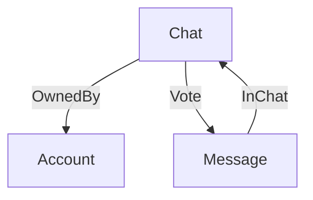

# Agent 案例

本文档是 Agent Domain Pack 的案例定义，描述当前 `domain-packs/agent-pack/` 中的模型与场景数据。只有一套案例：3 类型 / 3 关系，无约束、无 Action、无 `@computed` / `@function`。

ODL 声明（`@objectType`、`@linkType`、`@link`）、Link cardinality、Domain Pack 目录与 `pack.yaml`、以及 ObjectType / LinkType 到物理表的映射，分别由 `docs/open-foundry-spec-v2.md` 与 `docs/design/obda-spec-v3.md` 定义。本文档只定义案例语义，不重述也不另选这些机制。

范围：

- 不涉及 Sync Engine。
- 不涉及 Security and Governance（Authorisation、Permission、Audit）。
- 不编造本包没有的约束、Action、方法或第二套「正常版」模型。

---

## 类型与关系



命名空间：`example.agent`。

### 类型（3）

**Account**（账户）
- `email`, `passwordHash`, `name`, `emailVerified`, `image`, `isAnonymous`

**Chat**（会话）
- `title`
- `visibility`: `'PRIVATE' | 'PUBLIC'`

**Message**（消息）
- `role`: `'USER' | 'ASSISTANT' | 'SYSTEM'`
- `parts`, `attachments`

### 关系（3）

| 关系 | 方向 | 基数 | 属性 |
|---|---|---|---|
| OwnedBy | Chat → Account | MANY_TO_ONE | 无 |
| InChat | Message → Chat | MANY_TO_ONE | 无 |
| Vote | Chat → Message | MANY_TO_MANY | `isUpvoted`: boolean |

---

## 场景数据

图结构包含 3 种实体类型、3 种关系、7 个节点、6 条边。数据在 `seeds/simple.yaml`。

### 账户

```text
user_alice：alice@example.com，Alice，已验证，非匿名
user_bob：bob@example.com，Bob，未验证，非匿名
```

### 会话（归属）

```text
chat_weather：Weather，PRIVATE，OwnedBy → user_alice
chat_hello：Hello，PUBLIC，OwnedBy → user_bob
```

### 消息（所属会话）

```text
msg_weather_user：USER，「What is the weather in London?」，InChat → chat_weather
msg_weather_assistant：ASSISTANT，「18 C, partly cloudy.」，InChat → chat_weather
msg_hello_user：USER，「Hello」，InChat → chat_hello
```

### 投票

```text
chat_weather → Vote(isUpvoted: true) → msg_weather_assistant
```
