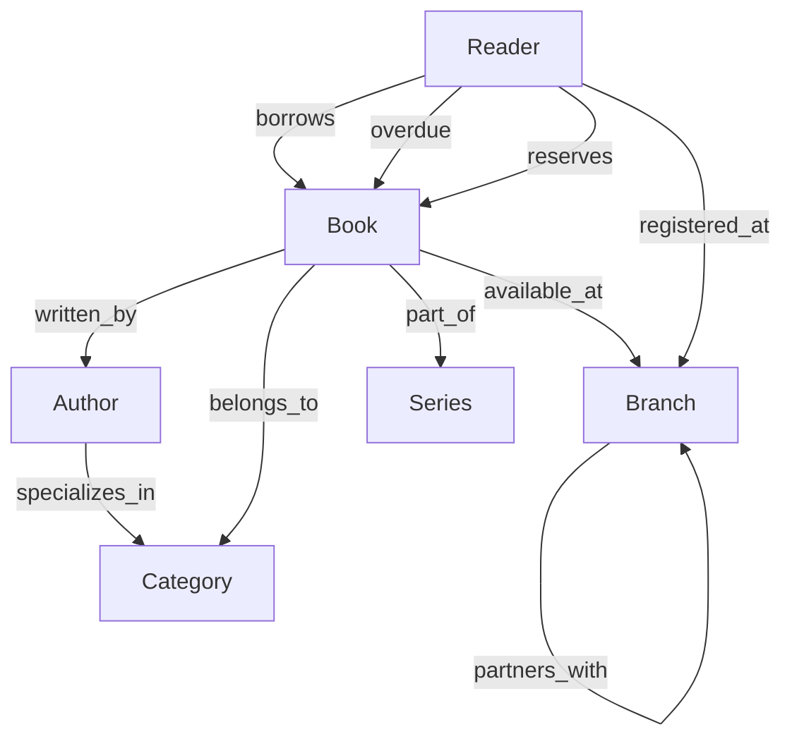
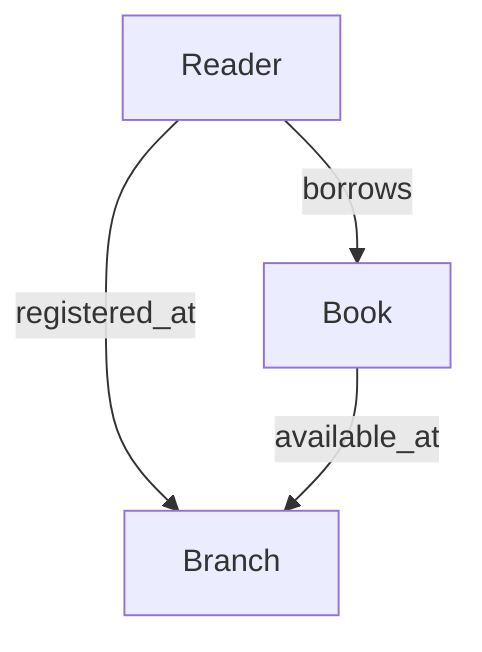
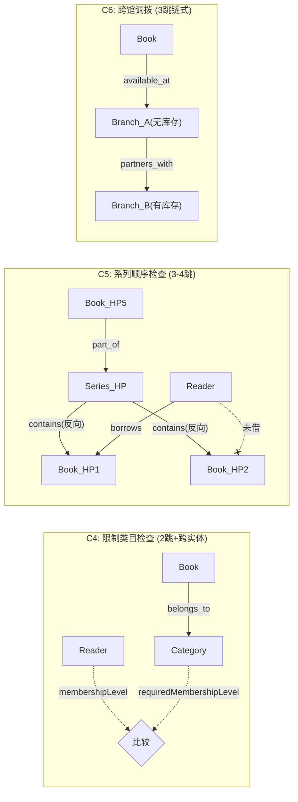

# 图书馆案例 — 正常版 + 简化版

本文档是图书馆 Domain Pack 的案例定义：保留完整案例（**正常版**），并构造一个与之**完全兼容**的子集（**简化版**）。两者共存于 `domain-packs/library-pack/`。

- **正常版**：人工测试 / 演示。6 类型 / 10 关系 / 8 约束。
- **简化版**：单元测试固定数据。3 类型 / 3 关系；是正常版的严格子集。

ODL 声明（`@objectType`、`@linkType`、`@link`、`@actionType`、`@computed`、`@function`）、Link cardinality、Domain Pack 目录与 `pack.yaml`、Action YAML、以及 ObjectType / LinkType 到物理表的映射，分别由 `docs/open-foundry-spec-v2.md` 与 `docs/design/obda-spec-v3.md` 定义。本文档只定义案例语义与两版本的包含关系，不重述也不另选这些机制。

本文档是确认稿。确认后再重构 `domain-packs/library-pack/` 下的 schema / actions / obda / seeds。

范围：

- 不展开 8 条约束如何落地为 Action precondition、`@computed` 或 `@function`。
- 不涉及 Sync Engine。
- 不涉及 Security and Governance（Authorisation、Permission、Audit）。现有 `permissions/` 尚未生效，本轮不改。

---

## 与现有 pack 的关系

`domain-packs/library-pack/` 当前是另一套教程模型（`Book` / `Member`，`BorrowedBy` / `OwnedBy`）。确认后将用本文档的图书馆案例替换该模型。`runtime/pack` 与 `runtime/bootstrap` 中通过 `LibraryPackDir()` 加载本包的测试，随重构一并调整。

---

## 版本对照

| | 正常版 | 简化版 |
|---|---|---|
| 用途 | 人工测试 / 演示 | 单元测试 fixture |
| 类型 | 6：Reader、Book、Branch、Author、Category、Series | 3：Reader、Book、Branch |
| 关系 | 10（见下） | 3：borrows、registered_at、available_at |
| 约束 | 8（C1–C8，见下；本轮不落地） | 结构上仅 C1、C3 的路径仍完整；本轮同样不落地 |
| 场景数据 | 完整图（约 21 节点 / 38 边） | 同一图去掉简化版不包含的类型与关系后的投影 |
| 命名空间 | `example.library` | 同左 |
| 兼容性 | 基线 | 严格子集：保留的类型、字段、方法、关系与正常版相同，不删减、不改写 |

简化版复用正常版中 Reader / Book / Branch 及三条关系的同一份定义，不另写一份「看起来一样」的 schema。

---

## 类型与关系

### 正常版关系图



### 简化版关系图



### 类型（6）

简化版保留的类型，字段与方法与正常版逐字相同（含仅在被省略关系/约束中用到的字段，例如 `Reader.membershipLevel`）。

**Reader**（读者）— 两版均有
- `membershipLevel`: `'gold' | 'silver' | 'basic'`（会员等级，决定是否可借限制类目）
- `currentBorrowCount`: number
- `registeredDays`: number（注册天数）
- methods: `checkBorrowEligibility(branchMaxBorrow)` — 需要先从 Branch 拿到上限

**Book**（书籍）— 两版均有
- `title`, `isbn`, `daysOnShelf`, `totalCopies`, `availableCopies`
- methods: `checkAvailability()` → 返回是否可借及在哪些分馆有库存

**Branch**（分馆）— 两版均有
- `name`, `maxBorrowPerReader`, `newBookProtectionDays`, `allowInterLibraryLoan`
- methods: `findAvailableCopyAt(bookId)` — 搜索本馆及合作馆库存

**Author**（作者）— 仅正常版
- `name`, `nationality`, `activeBookCount`
- methods: `getPopularityScore()` — 需要聚合其所有书的被借次数

**Category**（类目）— 仅正常版
- `name`, `isRestricted`（是否限制借阅）, `requiredMembershipLevel`: `'gold' | 'silver' | 'basic'`
- 关键：**借阅限制从 Category 级别控制，而非 Book 级别**

**Series**（系列丛书，如「哈利波特 1–7」）— 仅正常版
- `name`, `totalVolumes`
- methods: `checkReaderProgress(readerId)` — 需要遍历系列内所有书 + Reader 的借阅记录

### 关系（10）

| 关系 | 方向 | 正常版 | 简化版 |
|---|---|:---:|:---:|
| borrows | Reader → Book | ✅ | ✅ |
| registered_at | Reader → Branch | ✅ | ✅ |
| available_at | Book → Branch | ✅ | ✅ |
| overdue | Reader → Book | ✅ | — |
| reserves | Reader → Book | ✅ | — |
| written_by | Book → Author | ✅ | — |
| belongs_to | Book → Category | ✅ | — |
| part_of | Book → Series | ✅ | — |
| specializes_in | Author → Category | ✅ | — |
| partners_with | Branch → Branch（自引用） | ✅ | — |

---

## 约束（8 条规则）

约束是案例语义的一部分，列在这里便于对照场景。**本轮不设计、不落地**它们如何写成 Action / `@computed` / `@function`。

| ID | 规则 | 推理路径 | 跳数 |
|----|------|---------|------|
| C1 | 借阅上限：Reader.currentBorrowCount >= **Branch**.maxBorrowPerReader | Reader → registered_at → Branch | **2 跳** |
| C2 | 逾期阻断：Reader 有 overdue 边连接到任意 Book | Reader → overdue → Book（需遍历边） | 1 跳 |
| C3 | 新书保护：Book.daysOnShelf < **Branch**.newBookProtectionDays | Book → available_at → Branch | **2 跳** |
| C4 | 限制类目：Book.Category.isRestricted && Reader.membershipLevel < Category.requiredMembershipLevel | Book → belongs_to → Category **+** Reader 属性 | **2 跳 + 跨实体比较** |
| C5 | 系列顺序：Reader 未借完 Series 中前序 Book → 只能预约不能借 | Book → part_of → Series → contains(反向) → Books → Reader.borrows | **3-4 跳 + 集合比较** |
| C6 | 跨馆调拨：本馆无库存但合作馆有 → 建议馆际互借 | Book → available_at → Branch → partners_with → Branch | **3 跳链式** |
| C7 | 热门作者加权：Author 所有书的平均借阅量 > 阈值 → 优先放行 | Book → written_by → Author → (反向)written_by → Books → 聚合 | **2 跳 + 聚合** |
| C8 | 预约上限：Book 当前 reserves 关系数 > 5 → 拒绝新预约 | Book → (反向)reserves → Readers → count | **反向聚合** |

简化版结构上仍覆盖 C1、C3 的路径；C2 依赖 `overdue`，其余依赖 Author / Category / Series / `partners_with` / `reserves`。是否在简化版落地 C1/C3 留到约束阶段再定。

### 关键推理路径图示



---

## 场景数据

图结构包含 6 种实体类型、10 种关系、约 21 个节点、约 38 条边。简化版使用同一批实例，去掉不在子集中的类型与边。

### 分馆拓扑（Branch 自引用）

```text
branch_central（主馆） ←─ partners_with ─→ branch_west（西区馆）
```

简化版保留两个 Branch 节点，不含 `partners_with`。

### 类目体系 — 仅正常版

```text
cat_science：限制类目，需金卡（gold）
cat_fiction：开放类目，basic 即可
cat_history：开放类目，basic 即可
```

### 作者 → 类目专长 — 仅正常版

```text
author_liu（刘慈欣）→ specializes_in → cat_science
author_rowling（J.K.罗琳）→ specializes_in → cat_fiction
```

### 系列 — 仅正常版

```text
series_three_body（三体三部曲，3 卷）
series_hp（哈利波特，7 卷，但本馆仅有前 3 卷）
```

### 书籍 — 两版均有（书目与分馆库存）

```text
book_tb1（三体·卷1，科学类，100天，主馆+西馆）
book_tb2（三体·卷2，科学类，80天，主馆）
book_tb3（三体·卷3，科学类，50天，西馆）
book_hp1（HP·卷1，文学类，300天，主馆+西馆，4册/2可借）
book_hp2（HP·卷2，文学类，200天，主馆，2册/0可借←全借出）
book_hp3（HP·卷3，文学类，5天，西馆，新书保护期内）
book_quantum（量子纠缠导论，科学类，2天，主馆，新书+限制类目）
book_sapiens（人类简史，历史类，90天，主馆+西馆）
```

简化版保留书目、副本数、`daysOnShelf`、`available_at`；不含 `written_by` / `belongs_to` / `part_of`。

### 读者状态 — 两版均有（注册分馆与在借）

```text
xiao_ming：gold卡，已借2本（tb1+tb2），无逾期，主馆，注册365天
xiao_hong：basic卡，0借，无逾期，西馆，注册30天
lao_wang：silver卡，已借3本（hp1+sapiens+tb1），无逾期，主馆，注册720天
xiao_li：gold卡，已借1本（hp1），有逾期（hp2到期未还），西馆，注册180天
```

简化版保留读者属性、`registered_at`、`borrows`；不含 `overdue` / `reserves`。

### 测试场景对应关系

  S1  全部通过：xiao_hong 借 book_sapiens（2跳检查分馆限额）
  S2  借阅上限：lao_wang 借 book_sapiens（3借满，需从 Branch 获取上限）
  S3  逾期阻断：xiao_li 借 book_sapiens（需遍历 overdue 边确认）
  S4  限制类目：xiao_hong(basic) 借 book_tb1（科学类需 gold，2跳+跨实体比较）
  S5  新书保护：xiao_ming 借 book_hp3（5天 < 7天保护期，需从 Branch 获取保护天数）
  S6  系列顺序：xiao_ming 借 book_tb3（已有卷1+卷2，可借卷3；3-4跳集合推理）
  S7  跨馆调拨：xiao_hong 借 book_cosmos（仅主馆有货，西馆需通过 partners_with 发现）
  S8  热门作者：聚合刘慈欣所有书的借阅量后判断是否热门（2跳+聚合）
  S9  预约上限：book_hp3 预约数 > 5 → 拒绝新预约（反向计数聚合）
  S10 综合：xiao_hong(basic) 借 book_quantum（新书+限制类目双规则叠加）

S1、S2、S5 的路径落在简化版图上；其余依赖正常版才有的类型或关系。本轮都不落地为可执行规则。

---

## 暂缓

1. 8 条约束如何写成 Action / `@computed` / `@function`。
2. `permissions/`（Authorisation / Permission 按 CLAUDE.md 本轮忽略）。
3. 现有教程模型（`Book` / `Member`）替换后，`LibraryPackDir()` 相关测试的调整。

---

## 下一步

确认本文档后，按 `docs/open-foundry-spec-v2.md` 与 `docs/design/obda-spec-v3.md` 重构 `domain-packs/library-pack/` 的 ODL、Action YAML、OBDA mapping 与 seeds：正常版承载完整案例，简化版只加载子集，定义不重复。
