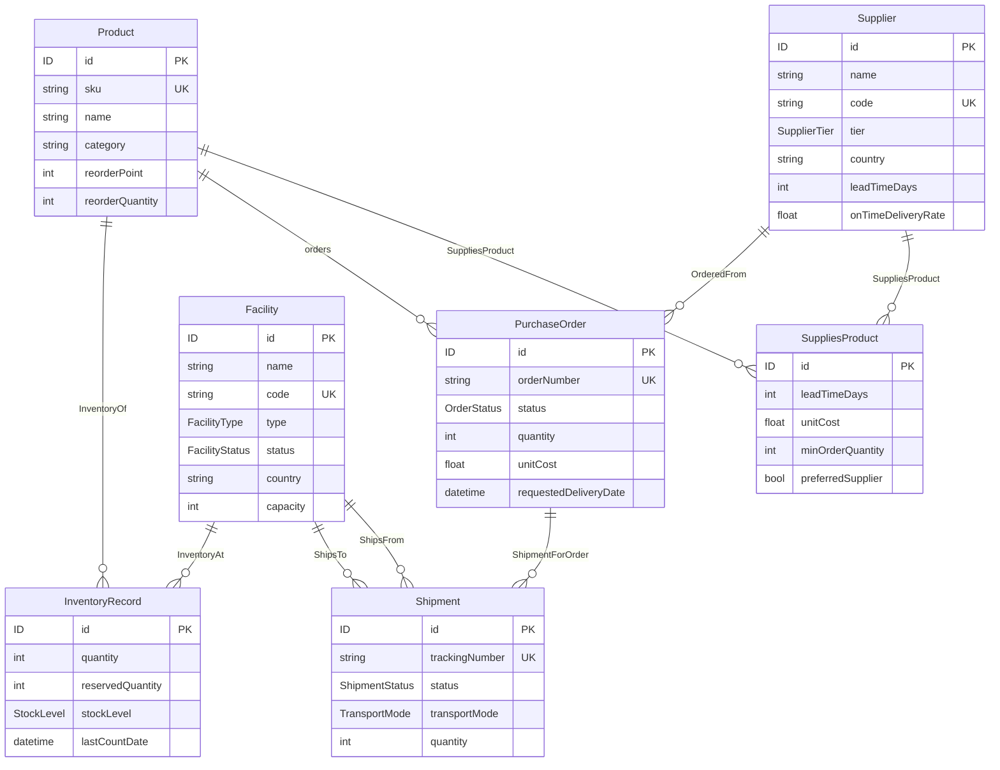
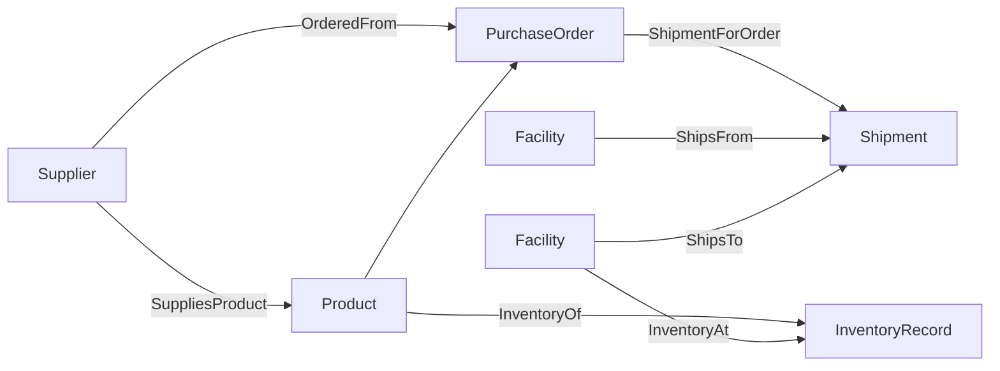

# Supply Chain Schema 概述

**Namespace:** `supply.chain` · **Version:** `0.1.0`

供应链控制塔领域包，覆盖供应商、产品、设施、采购、运输与库存的全链路可见性。

| 类别 | 数量 |
|------|------|
| ObjectType | 6 |
| LinkType | 7 |
| ActionType | 4 |
| Enum | 7 |

---

## 对象类型（ObjectType）

| 类型 | 说明 | 关键字段 |
|------|------|----------|
| **Supplier** | 供应商 | `code`（唯一）、`tier`、`country`、`leadTimeDays`、`onTimeDeliveryRate` |
| **Product** | 产品 | `sku`（唯一）、`category`、`reorderPoint`、`reorderQuantity` |
| **Facility** | 设施（工厂/仓库等） | `code`（唯一）、`type`、`status`、`capacity`；`currentUtilization` 为计算字段 |
| **PurchaseOrder** | 采购订单 | `orderNumber`（唯一、不可变）、`status`、引用 `supplier` / `product` |
| **Shipment** | 运输单 | `trackingNumber`、`status`、`transportMode`、引用 `order` / `origin` / `destination` |
| **InventoryRecord** | 库存记录 | `quantity`、`reservedQuantity`、`stockLevel`、引用 `product` / `facility` |

`PurchaseOrder`、`Shipment`、`InventoryRecord` 上的引用字段为**隐式外键**，由 link-sync 管道同步为图链接。

---

## 链接类型（LinkType）

| 链接 | From → To | 基数 | 管理方式 |
|------|-----------|------|----------|
| **SuppliesProduct** | Supplier → Product | M:N | **主动管理**（含商业条款） |
| **OrderedFrom** | PurchaseOrder → Supplier | M:1 | 隐式（FK 同步） |
| **ShipmentForOrder** | Shipment → PurchaseOrder | M:1 | 隐式 |
| **ShipsFrom** | Shipment → Facility | M:1 | 隐式（起运地） |
| **ShipsTo** | Shipment → Facility | M:1 | 隐式（目的地） |
| **InventoryOf** | InventoryRecord → Product | M:1 | 隐式 |
| **InventoryAt** | InventoryRecord → Facility | M:1 | 隐式 |

**SuppliesProduct** 附加属性：`leadTimeDays`、`unitCost`、`minOrderQuantity`、`preferredSupplier`。

---

## 枚举（Enum）

| 枚举 | 值 |
|------|-----|
| `SupplierTier` | STRATEGIC · PREFERRED · APPROVED · PROBATION |
| `FacilityType` | FACTORY · WAREHOUSE · DISTRIBUTION_CENTER · PORT |
| `FacilityStatus` | OPERATIONAL · MAINTENANCE · DISRUPTED · CLOSED |
| `OrderStatus` | DRAFT → SUBMITTED → CONFIRMED → IN_PRODUCTION → SHIPPED → DELIVERED · CANCELLED |
| `ShipmentStatus` | PENDING · IN_TRANSIT · DELAYED · CUSTOMS_HOLD · DELIVERED · LOST |
| `TransportMode` | SEA · AIR · ROAD · RAIL · MULTIMODAL |
| `StockLevel` | OVERSTOCKED · ADEQUATE · LOW · CRITICAL · STOCKOUT |

---

## 动作（ActionType）

| 动作 | 作用 |
|------|------|
| **CreateOrder** | 创建采购订单（指定 supplier、product、数量与交付日期） |
| **ShipOrder** | 为订单创建运输单（起运/目的地设施、运输方式） |
| **ReceiveShipment** | 签收运输并更新库存 |
| **CancelOrder** | 取消采购订单 |

运行时行为定义见 `actions/*.yaml`。

---

## ER 图

### 业务主链路

---

## 源文件

| 文件 | 内容 |
|------|------|
| `schema/enums.odl` | 枚举定义 |
| `schema/supplier.odl` | Supplier |
| `schema/product.odl` | Product |
| `schema/facility.odl` | Facility |
| `schema/purchase-order.odl` | PurchaseOrder |
| `schema/shipment.odl` | Shipment |
| `schema/inventory-record.odl` | InventoryRecord |
| `schema/links.odl` | 全部 LinkType |
| `schema/actions.odl` | 全部 ActionType |
