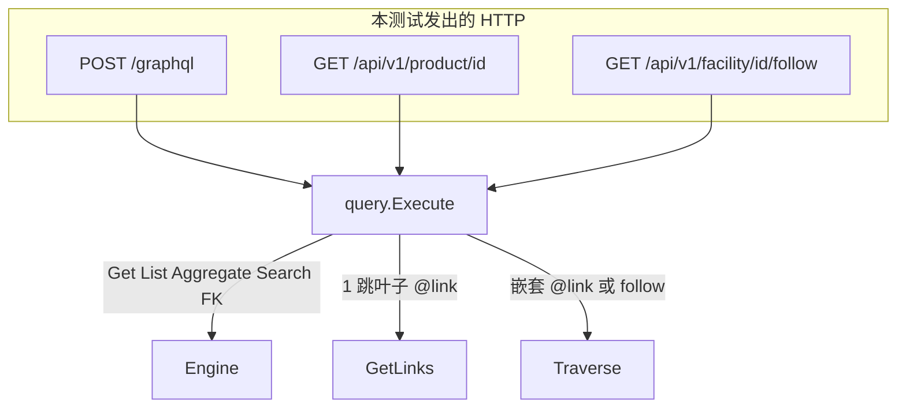

# `graphql_rest_test.go` 测试说明

对应文件：`runtime/e2e/graphql_rest_test.go`

本文件是 **supply-chain 金路径 HTTP e2e**：真的起 `httptest` 服务器，经 `POST /graphql` 与 `GET /api/v1/...` 打完整栈（pack → Ontology IR → Engine → Query IR → memory）。不 mock SPI，也不数 GetLinks/Traverse——计数在 `runtime/api` 的进程内 Exec 测试里锁死；这里锁的是 **对外响应形状** 和 **001 行为不回退**。

覆盖计划 U7，以及 001 留下的 AE1–AE7 金门。

唯一测试函数：`TestGoldPath_GraphQLREST_HTTP`。子测试用 `t.Run` 共用同一台服务器和同一份 `seedAll` 数据。

---

## 启动过程

```
pack.SupplyChainDir()          # domain-packs/supply-chain
        │
        ▼
pack.LoadDir                   # ODL → Ontology IR
        │
        ▼
projection.ProjectStorage      # IR → SPI schema
        │
        ▼
memory.ApplySchema             # 租户 gold
        │
        ▼
engine.New + seedAll           # 建对象 / 建链接
        │
        ▼
api.New → httptest.NewServer   # Handler: POST /graphql, GET /api/v1/{type}/{id}, GET .../follow
```

租户头一律 `X-OpenFoundry-Tenant`。GraphQL 还带 `Authorization: Bearer ignored`（本 Phase 鉴权忽略，只证明不挡读）。

跑法：

```bash
cd runtime && go test ./e2e/ -count=1
```

---


## 种子 `seedAll`

租户 `gold`。对象 + 链接如下。注意 **FK 字段** 和 `@link` **边** 是两套数据：没有 `CreateLink` 时图导航为空，FK 仍可读。

```
Supplier Acme ──SuppliesProduct──► Product Widget (sku=P1)
                                        ▲
Facility WH-1 ◄──InventoryAt── InventoryRecord qty=10
                      ▲                    │
                      │                    └──InventoryOf──► Product Widget
                      │
                      └──（无 InventoryAt）InventoryRecord qty=3  ← inventoryNoOf
                         仅 FK product / facility，无 InventoryOf
```

另外还有 `PurchaseOrder PO-1`（FK `supplier` / `product`）和 `Shipment`（FK `order` / `origin` / `destination`，起终点都是 WH-1）。


| `goldIDs`            | 对象             | 图边                               |
| -------------------- | -------------- | -------------------------------- |
| `supplier`           | Acme           | SuppliesProduct → product        |
| `product`            | Widget         | 被 SuppliesProduct、InventoryOf 指向 |
| `facility`           | WH-1           | 被 InventoryAt 指向                 |
| `inventory`          | qty=10         | InventoryAt + **InventoryOf**    |
| `inventoryNoOf`      | qty=3          | **无任何 CreateLink**，只有 FK         |
| `order` / `shipment` | PO-1 / PENDING | 无显式 link type 边，靠 FK             |


`inventoryNoOf` 故意不建 `InventoryAt`，这样 `facility { inventoryRecords }` 仍然只有一条（qty=10），2 跳断言 `len == 1` 才成立。

---


## 子测试


### AE1 get six types

对六个 ObjectType 各发一次 GraphQL get，只要不报错：

`product` / `supplier` / `facility` / `purchaseOrder` / `shipment` / `inventoryRecord`。

证明 IR 投影的 SDL 能 parse、get 根字段能绑上、种子对象能被读到。走 Query IR `Get`（无 computed 合并；computed 仍按字段选中再 `ComputeField`）。

### AE2 suppliers nested

```graphql
{ product(id: $product) { suppliers { name } } }
```

`Product.suppliers` 是 `@link(SuppliesProduct, INBOUND)`。子选择只有标量 `name`，没有嵌套 `@link` → GraphQL 分类为 **GetLinks**（本文件不计数，形状上要拿到 `Acme`）。

反例：`suppliers { sku }` 必须 schema error——`sku` 是 Product 字段，不是 Supplier 字段。用来防止「嵌套对象投影偷了父类型字段」。

### two hop inventoryRecords trackedProduct

金 2 跳，同时打 GraphQL 树和 REST follow：

```graphql
{
  facility(id: $facility) {
    inventoryRecords { quantity trackedProduct { name id } }
  }
}
```

```http
GET /api/v1/facility/{id}/follow?path=inventoryRecords,trackedProduct
```


| 侧           | 入口          | SPI（设计）                            | 响应                                        |
| ----------- | ----------- | ---------------------------------- | ----------------------------------------- |
| GraphQL     | 嵌套 `@link`  | 一条 Traverse（子选择含 `trackedProduct`） | 树：中间 InventoryRecord + 终点 Product         |
| REST follow | `path=` 字段名 | **一律 Traverse**（含 1 跳也是）           | 只有终点 `{ "nodes": [ { id, name, ... } ] }` |


断言：

- GraphQL：`inventoryRecords` 长度 1，`trackedProduct.name == Widget`
- REST 200，`nodes[0].id` **等于** GraphQL 终点 id

不比树同构，只比终点 id 集合（KTD-9）。多条 inventory 指向同一 Product 时 REST 会去重、GraphQL 保留多条父层——本种子只有一条，两边都是 1。

```mermaid
flowchart LR
    F[Facility WH-1] -->|@link inventoryRecords<br/>InventoryAt INBOUND| I[InventoryRecord qty=10]
    I -->|@link trackedProduct<br/>InventoryOf OUTBOUND| P[Product Widget]

    subgraph gql [GraphQL 响应树]
      G1[inventoryRecords]
      G2[trackedProduct]
    end
    subgraph rest [REST follow]
      N["nodes = 终点 Product"]
    end
    I --> G1
    P --> G2
    P --> N
```


路径词汇是 **已声明** `@link` **字段名**，不是 SPI `InventoryAt` / `OUTBOUND`。

### trackedProduct empty without InventoryOf

反假绿。查 `inventoryNoOf`：

```graphql
{
  inventoryRecord(id: $inventoryNoOf) {
    product { name }
    trackedProduct { name }
  }
}
```


| 字段               | Role                           | 数据来源                      | 期望         |
| ---------------- | ------------------------------ | ------------------------- | ---------- |
| `product`        | FK（`RoleProperty`，对象类型）        | 对象上存的 id → Query IR `Get` | `"Widget"` |
| `trackedProduct` | `@link(InventoryOf, OUTBOUND)` | 图边；本条没有 CreateLink        | `null`     |


如果有人把 FK 误当成 `@link` 实现，两条都会有值，本用例会红。

### list search aggregate

001 读动词不回退：

- `products(first: 1)` Relay 连接，`totalCount >= 1`
- `searchProducts(query: "Widget")` 命中
- `searchProducts(query: "  ")` 空白查询 **0 条**（不是 GraphQL 校验错误）
- `productAggregate` COUNT 成功

都走 Query IR 的 List / Search / Aggregate。

### nested lazy and FKs

两件事：

1. `inventoryRecord { facility { name currentUtilization } }`
  `facility` 是 **FK**，不是 `@link`。嵌套选中 LAZY computed `currentUtilization`（`countLinks(InventoryAt)`）。种子里只有 **一条** InventoryAt 指向 WH-1，所以利用率是 `1`。`inventoryNoOf` 没有 InventoryAt，不计入。
2. `shipment { order, origin, destination }`
  三条都是 FK。证明对象类型属性继续 `GetObject`，没有被改成 Expand。


### AE7 REST product

```http
GET /api/v1/product/{id}
GET /api/v1/product/missing
```

200 体含 `sku=P1` 且 `id`（不是 `_id`）。缺失 → 404 `OBJECT_NOT_FOUND`。REST GET 走 Query IR `Get`，`Computed: &[]string{}` 表示评估全部 LAZY（与 GraphQL get 按字段 ComputeField 不同，这是 001 REST 行为）。

### cross tenant

同一 URL，头改成 `other`：

- GraphQL get → `product: null`（不是 error）
- list / search → `totalCount == 0`
- REST GET → 404

memory 按 `_tenantId` 隔离；Query IR 没有另做租户逻辑。

### missing tenant and auth ignored

- REST 不带头或空白头 → 400 `MISSING_TENANT`（`withTenant` 中间件）
- GraphQL 带 `Authorization: Bearer ignored` 仍能读到 Widget——本 Phase 无鉴权

---


## HTTP 辅助函数


| 函数     | 方法   | 路径         | 行为                                                |
| ------ | ---- | ---------- | ------------------------------------------------- |
| `gql`  | POST | `/graphql` | JSON `{query}`；非 200 直接 Fatal；解 `data` / `errors` |
| `rest` | GET  | 调用方拼 URL   | 返回 `(status, body)`；可空 tenant 测缺头                 |


GraphQL 成功时 HTTP 仍是 200，业务错误在 `errors` 数组里（例如 `suppliers { sku }`）。

---


## 本文件不测什么（有意留给别层）


| 缺口                                    | 谁锁                                    |
| ------------------------------------- | ------------------------------------- |
| 1 跳 GetLinks 次数、2 跳 Traverse 次数、禁止双执行 | `runtime/api/resolvers_test.go`       |
| 1 跳 follow 也走 Traverse、非法 path 零 SPI  | `runtime/api/http_test.go`            |
| Execute 与 Engine 结果相等、分叉两次 Traverse   | `runtime/query/execute_test.go`       |
| 混排 / 分叉合成 IR                          | `TestExec_SyntheticForkAndMixed`（api） |


e2e 只证明：**真实 pack + HTTP** 上，1 跳嵌套仍绿、2 跳树有值、follow 终点对得上、FK 与 `@link` 不是同一条数据。

---


## 和 GraphQL / REST 实现的对应关系




公开 GraphQL **没有** 根字段 `follow` / `traverse`。REST `.../follow` 才是通用图查询；GraphQL 图导航只有嵌套 `@link`。