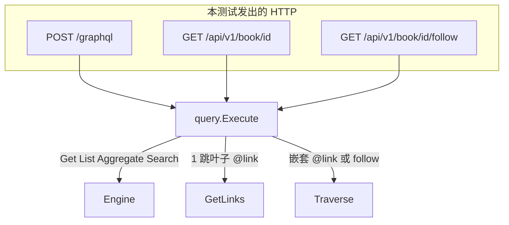

# `graphql_rest_test.go` 测试说明

对应文件：`runtime/e2e/graphql_rest_test.go`

本文件是 **图书馆简化版金路径 HTTP e2e**：真的起 `httptest` 服务器，经 `POST /graphql` 与 `GET /api/v1/...` 打完整栈（pack → Ontology IR → Engine → Query IR → storage）。不 mock SPI，也不数 GetLinks/Traverse——计数在 `runtime/api` 的进程内 Exec 测试里锁死；这里锁的是 **对外响应形状** 和 **001 行为不回退**。

案例固定为 `domain-packs/library-pack/library-pack.md` 的**简化版**：Reader / Book / Branch，关系只有 `Borrows` / `RegisteredAt` / `AvailableAt`。种子走 `seeds/simple.yaml`（正常版同一批实例的投影），不另造一套对象。

覆盖计划 U7，以及 001 留下的 AE1–AE7 金门。

唯一测试函数：`TestGoldPath_GraphQLREST_HTTP`。子测试用 `t.Run` 共用同一台服务器和同一份 `setupGoldHTTP` 数据。

存储后端由 `helper_test.go` 的 `setupGoldHTTP` 按环境选择：

- `TEST_DB_URL` **有值** → MySQL OBDA（隔离库 + `InitMappedSchema` + pack OBDA）
- **未设置** → memory

`.env` 由 helper 尽力加载（`go test` 直跑也能看到根目录 `TEST_DB_URL`）。

---

## 启动过程

```
setupGoldHTTP (helper_test.go)
        │
        ├─ pack.LibraryPackDir / LoadDir
        ├─ TEST_DB_URL? mysqlobda : memory
        ├─ ApplySchema (tenant gold)
        ├─ seedLibrary → seeds/simple.yaml
        └─ api.New → httptest.NewServer
```

租户头一律 `X-OpenFoundry-Tenant`。GraphQL 还带 `Authorization: Bearer ignored`（本 Phase 鉴权忽略，只证明不挡读）。

跑法：

```bash
cd runtime && go test ./e2e/ -count=1
# 或带 MySQL（需 .env / 环境里的 TEST_DB_URL）:
cd runtime && go test ./e2e/ -count=1 -run GraphQLREST
```

---

## 种子 `seedLibrary`

租户 `gold`。对象 + 链接来自简化版 `seeds/simple.yaml`：14 个对象、21 条边。测试只使用其中这些实例：

```
xiao_hong(小红, BASIC, 西区馆) ──RegisteredAt──► branch_west（西区馆）
xiao_ming(小明) ──Borrows──► book_tb1（三体·卷1）──AvailableAt──► 主馆 / 西区馆
lao_wang(老王)  ──Borrows──► book_tb1
xiao_ming / lao_wang ──RegisteredAt──► branch_central（主馆）
book_tb2（三体·卷2）──AvailableAt──► 主馆
book_sapiens（人类简史）──AvailableAt──► 主馆 / 西区馆
book_quantum（量子纠缠导论）无 Borrows 入边
```


| `libraryIDs` | 对象 | 图边 |
| ------------ | ---- | ---- |
| `xiaoHong` | 小红 | RegisteredAt → 西区馆；无 Borrows |
| `sapiens` | 人类简史 | AvailableAt → 主馆、西区馆 |
| `tb1` | 三体·卷1 | 被 小明、老王 Borrows |
| `tb2` | 三体·卷2 | AvailableAt → 主馆（主馆 readers = 小明、老王） |
| `quantum` | 量子纠缠导论 | **无 Borrows** |
| `west` | 西区馆 | 被 小红 RegisteredAt |


`book_quantum` 故意没有 `Borrows`，这样 `borrowers` 必须是空列表；`book_tb1` 有两条入边，用来证明 `@link` 不是靠书名字段猜出来的。

---

## 子测试

### AE1 get three types

对简化版三个 ObjectType 各发一次 GraphQL get，只要不报错：

`reader` / `book` / `branch`。

证明 IR 投影的 SDL 能 parse、get 根字段能绑上、种子对象能被读到。走 Query IR `Get`。

### AE2 borrowers nested

```graphql
{ book(id: $tb1) { borrowers { name } } }
```

`Book.borrowers` 是 `@link(Borrows, INBOUND)`。子选择只有标量 `name`，没有嵌套 `@link` → GraphQL 分类为 **GetLinks**（本文件不计数，形状上要拿到 `小明` 和 `老王`）。

反例：`borrowers { isbn }` 必须 schema error——`isbn` 是 Book 字段，不是 Reader 字段。用来防止「嵌套对象投影偷了父类型字段」。

### two hop branches readers

金 2 跳，同时打 GraphQL 树和 REST follow。**仅在 memory 后端断言**（`TEST_DB_URL` 未设置时）。

`mysqlobda.Traverse` 目前只返回终点 `Nodes`（`Edges` / `Visited` 为空），而 `query.assemblePath` 靠边重建中间层，因此 MySQL 下本子测试 `t.Skip`。

```graphql
{
  book(id: $tb2) {
    branches { name readers { name id } }
  }
}
```

```http
GET /api/v1/book/{id}/follow?path=branches,readers
```


| 侧 | 入口 | SPI（设计） | 响应 |
| -- | ---- | ---------- | ---- |
| GraphQL | 嵌套 `@link` | 一条 Traverse（子选择含 `readers`） | 树：中间 Branch + 终点 Reader |
| REST follow | `path=` 字段名 | **一律 Traverse**（含 1 跳也是） | 只有终点 `{ "nodes": [ { id, name, ... } ] }` |


断言：

- GraphQL：`branches` 长度 1，`name == 主馆`，`readers` 为 小明、老王
- REST 200，`nodes` 的 id **等于** GraphQL 终点 id 集合

不比树同构，只比终点 id 集合（KTD-9）。

```mermaid
flowchart LR
    B[Book 三体·卷2] -->|@link branches<br/>AvailableAt OUTBOUND| C[Branch 主馆]
    C -->|@link readers<br/>RegisteredAt INBOUND| R[Reader 小明 / 老王]

    subgraph gql [GraphQL 响应树]
      G1[branches]
      G2[readers]
    end
    subgraph rest [REST follow]
      N["nodes = 终点 Reader"]
    end
    C --> G1
    R --> G2
    R --> N
```

路径词汇是 **已声明** `@link` **字段名**，不是 SPI `AvailableAt` / `OUTBOUND`。

### borrowers empty without Borrows

反假绿。查 `book_quantum`：

```graphql
{
  book(id: $quantum) {
    title
    borrowers { name }
  }
}
```


| 字段 | Role | 数据来源 | 期望 |
| ---- | ---- | -------- | ---- |
| `title` | 标量 | 对象字段 | `"量子纠缠导论"` |
| `borrowers` | `@link(Borrows, INBOUND)` | 图边；本条没有 CreateLink | `[]` |


如果有人把书名字段误当成借阅关系，本用例会红。

### list search aggregate

001 读动词不回退：

- `books(first: 1)` Relay 连接，`totalCount >= 1`
- `searchBooks(query: "人类简史")` 命中
- `searchBooks(query: "  ")` 空白查询 **0 条**（不是 GraphQL 校验错误）
- `bookAggregate` COUNT 成功

都走 Query IR 的 List / Search / Aggregate。

### nested registered_at and borrows

两件事：

1. `reader { branch { name } borrowedBooks { title } }`
  `branch` 是 `@link(RegisteredAt, OUTBOUND)`。小红注册在西区馆、在借为 0。
2. `book { branches { name } }`
  `branches` 是 `@link(AvailableAt, OUTBOUND)`。人类简史在主馆 + 西区馆。

### AE7 REST book

```http
GET /api/v1/book/{id}
GET /api/v1/book/missing
```

200 体含 `title=人类简史` 且 `id`（不是 `_id`）。缺失 → 404 `OBJECT_NOT_FOUND`。REST GET 走 Query IR `Get`。

### cross tenant

同一 URL，头改成 `other`：

- GraphQL get → `book: null`（不是 error）
- list / search → `totalCount == 0`
- REST GET → 404

memory 按 `_tenantId` 隔离；Query IR 没有另做租户逻辑。

### missing tenant and auth ignored

- REST 不带头或空白头 → 400 `MISSING_TENANT`（`withTenant` 中间件）
- GraphQL 带 `Authorization: Bearer ignored` 仍能读到人类简史——本 Phase 无鉴权

---

## HTTP 辅助函数


| 函数 | 方法 | 路径 | 行为 |
| ---- | ---- | ---- | ---- |
| `gql` | POST | `/graphql` | JSON `{query}`；非 200 直接 Fatal；解 `data` / `errors` |
| `rest` | GET | 调用方拼 URL | 返回 `(status, body)`；可空 tenant 测缺头 |


GraphQL 成功时 HTTP 仍是 200，业务错误在 `errors` 数组里（例如 `borrowers { isbn }`）。

---

## 本文件不测什么（有意留给别层）


| 缺口 | 谁锁 |
| ---- | ---- |
| 1 跳 GetLinks 次数、2 跳 Traverse 次数、禁止双执行 | `runtime/api/resolvers_test.go` |
| 1 跳 follow 也走 Traverse、非法 path 零 SPI | `runtime/api/http_test.go` |
| Execute 与 Engine 结果相等、分叉两次 Traverse | `runtime/query/execute_test.go` |
| 混排 / 分叉合成 IR | `TestExec_SyntheticForkAndMixed`（api） |


e2e 只证明：**真实 library pack + HTTP** 上，1 跳嵌套仍绿、2 跳树有值、follow 终点对得上、没有 `Borrows` 边时 `borrowers` 为空。

---

## 和 GraphQL / REST 实现的对应关系



公开 GraphQL **没有** 根字段 `follow` / `traverse`。REST `.../follow` 才是通用图查询；GraphQL 图导航只有嵌套 `@link`。
