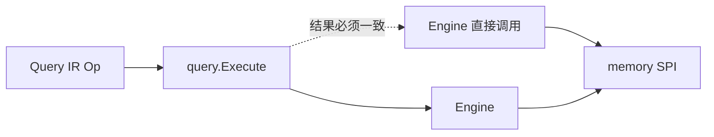
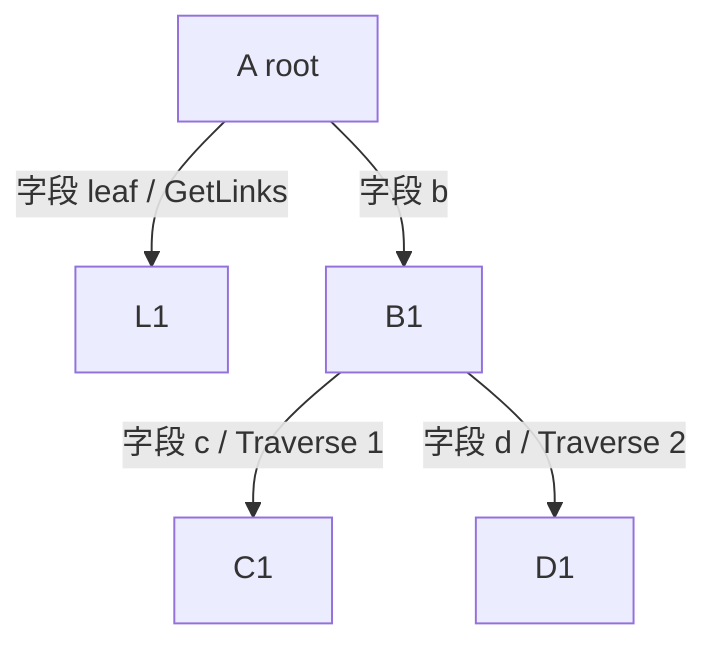
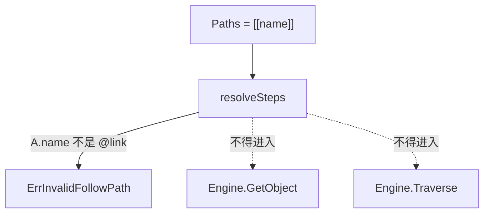

# `execute_test.go` 测试说明

对应文件：`runtime/query/execute_test.go`

本文件测的是 **Query IR 执行器** `query.Execute`：投影层只构造 tagged op，由 Execute 调 Engine。测试用合成本体（`navOntology`），不依赖 supply-chain 金 pack，也不 import `runtime/api`。

覆盖计划 U3：

| 测试函数 | 覆盖点 |
|---------|--------|
| `TestExecute_GetListAggregateSearch_MatchEngine` | Get / List / Aggregate / Search 与直接 Engine 调用结果一致 |
| `TestExecute_Expand_GetLinksVsTraverseVsFork` | 1 跳叶子 → GetLinks；2 跳 → 一次 Traverse；分叉 → 两次 Traverse |
| `TestExecute_Expand_UnknownField_NoStorage` | 非法字段名 → `ErrInvalidFollowPath`，且不打 SPI |

---

## 共享夹具

### 本体 `navOntology`

合成 IR，只为把 `@link` 字段名和 SPI link type 分开：客户端路径用字段名（`b`、`leaf`），Execute 再解析成 `AB` / `AL` 等。

| 对象类型 | 属性 | `@link` 导航字段 |
|---------|------|------------------|
| `A` | `name` | `b` → B（AB outbound）；`leaf` → L（AL outbound） |
| `B` | `name` | `c` → C（BC outbound）；`d` → D（BD outbound） |
| `C` | `name` | 无 |
| `D` | `name` | 无 |
| `L` | `name` | 无 |

| LinkType | From → To | 对应导航字段 |
|----------|-----------|--------------|
| `AB` | A → B | `A.b` |
| `AL` | A → L | `A.leaf` |
| `BC` | B → C | `B.c` |
| `BD` | B → D | `B.d` |

### 实例 `seedNav`

租户 `t`。先 `ApplySchema`（否则 memory 的 link `_fromType`/`_toType` 会是 `unknown`，Traverse 找不到对象），再 Engine 建点和建边。

```
A (name=root)
 ├── AB outbound ──► B (name=B1)
 │                    ├── BC outbound ──► C (name=C1)
 │                    └── BD outbound ──► D (name=D1)
 └── AL outbound ──► L (name=L1)
```

对应 GraphQL 选择集的形状（本文件不跑 GraphQL，只构造等价 Expand op）：

```text
a {
  leaf { name }          # 1 跳叶子
  b {
    c { name }           # 路径 A→B→C
    d { name }           # 路径 A→B→D（与上条构成分叉）
  }
}
```

### 计数包装 `countStore`

嵌入 `spi.UnimplementedStorageProvider`，把读写转给 memory，并计数：

| 计数器 | SPI 方法 | 用途 |
|--------|----------|------|
| `getObject` | `GetObject` | 非法路径不得先 Get 起点 |
| `getLinks` | `GetLinks` | 叶子 Expand 才应走这里 |
| `traverse` | `Traverse` | 深度 ≥2 或 REST follow 才应走这里 |

`seedNav` 建数据时会调用 `GetObject`（Engine `CreateLink` 校验端点），所以 Expand 用例在断言前会把计数器清零。

---

## `TestExecute_GetListAggregateSearch_MatchEngine`

对应：`execute_test.go:13`

### 测试目的

证明 Get / List / Aggregate / Search **只是 Engine 读动词的透传**：`Execute` 的结果与直接调 `Engine.GetObject` / `QueryObjects` / `AggregateObjects` / `SearchObjects` 一致。投影层不再自己碰 storage。

### 请求与断言

同一套 `seedNav` 数据，对类型 `A`、id = `ids.a`：

| Op | Execute 调用 | 对照 Engine | 断言 |
|----|--------------|-------------|------|
| `Get` | `{Type:"A", ID: ids.a}` | `GetObject("A", ids.a)` | `_id` 相同，`name == "root"` |
| `List` | `{Type:"A", Limit:10}` | `QueryObjects` 同样参数 | `TotalCount` 相同 |
| `Aggregate` | `count(*)` alias `n` | `AggregateObjects` 同样 query | `TotalGroups` 相同 |
| `Search` | `Query:"root", Limit:10` | `SearchObjects` 同样 query | `TotalCount` 相同 |

本测试不包 `countStore`：关心的是结果相等，不是走了哪条 SPI。



---

## `TestExecute_Expand_GetLinksVsTraverseVsFork`

对应：`execute_test.go:69`

### 测试目的

Expand 按 **mode + 字段名路径** 选 SPI 动词，并装配 `ExpandResult`：

1. **1 跳叶子**（子选择无 `@link`）→ 一次 `GetLinks`，零次 `Traverse`。
2. **一条 2 跳全路径** → 一次 `Traverse`，零次 `GetLinks`。
3. **分叉** `b { c, d }` → 两条全路径、两次 `Traverse`（不共享前缀调用）；第一跳 `B` 按 id 去重。

路径词汇是 Ontology IR **字段名**（`leaf` / `b` / `c`），不是 link type 名（`AL` / `AB`）。解析发生在 `resolveSteps`。

### 过程 1：叶子 `leaf`

```go
Execute(Op{Expand: &Expand{
    StartType: "A", StartID: ids.a,
    Mode: ExpandGetLinks,
    Paths: [][]string{{"leaf"}},
}})
```

`execExpand` → `expandGetLinks`：

1. `resolveSteps(A, ["leaf"])` → `{LinkType: AL, Direction: outbound}`
2. `Engine.GetLinks(start, AL, outbound, Limit=1000)`
3. 对每条 link 的对端 `GetObject("L", targetID)`
4. `FirstHop` = `Terminals` = `[L1]`；`Adjacency[ids.a]["leaf"]` = 同一批

| 断言 | 期望 |
|------|------|
| `getLinks` / `traverse` | `1` / `0` |
| `FirstHop` 长度与 `name` | `1`，`"L1"` |

### 过程 2：线性 2 跳 `b → c`

```go
Execute(Op{Expand: &Expand{
    StartType: "A", StartID: ids.a,
    Mode: ExpandTraverse,
    Paths: [][]string{{"b", "c"}},
}})
```

`expandTraverse`：

1. `resolveSteps(A, ["b","c"])` → `AB outbound` 然后 `BC outbound`
2. **一次** `Engine.Traverse(start, [AB, BC], Limit=1000)`
3. `assemblePath` 用 `Visited` + `Nodes` + `Edges` 填邻接表

SPI Traverse 语义（对照 memory）：`Nodes` = 终点 C；`Visited` = 中间 B；`Edges` = 两跳都在。Execute 再按字段名装配：

```
Adjacency[ids.a]["b"] = [B1]
Adjacency[ids.b]["c"] = [C1]
FirstHop = [B1]
Terminals = [C1]
```

| 断言 | 期望 |
|------|------|
| `getLinks` / `traverse` | `0` / `1` |
| `Terminals[0].name` | `"C1"` |
| `Adjacency[ids.b]["c"]` 长度 | `1` |

### 过程 3：分叉 `b → c` 与 `b → d`

```go
Execute(Op{Expand: &Expand{
    StartType: "A", StartID: ids.a,
    Mode: ExpandTraverse,
    Paths: [][]string{{"b", "c"}, {"b", "d"}},
}})
```

计划明确：**不共享前缀**。两条线性全路径各打一次 Traverse（`A→B→C` 与 `A→B→D`），共两次。装配时 `mergeAdj` 把两次结果并到同一张邻接表，第一跳 `B` 按 id 去重。

| 断言 | 期望 | 含义 |
|------|------|------|
| `traverse` | `2` | 分叉 = 两次全路径 Traverse |
| `getLinks` | `0` | 不含叶子 hop |
| `len(FirstHop)` | `1` | 共享的 `B` 只出现一次 |
| `Adjacency[ids.b]["c"]` 与 `["d"]` | 各 1 | 两个终点都挂在同一个 B 上 |



**关键语义：** GraphQL 子 resolver 只读 `Adjacency`（请求 memo），不应再打 SPI。本测试在 Execute 层锁死「分叉 = 两次 Traverse」，装配去重由 `unionByID` 完成。

---

## `TestExecute_Expand_UnknownField_NoStorage`

对应：`execute_test.go:124`

### 测试目的

非法路径必须 **编译期失败、不碰 SPI**。REST follow 把该错误映射为 `400 INVALID_FOLLOW_PATH`。本测试把 `name`（标量属性，不是 `@link`）当成路径，并打开 `CheckStart: true`（模拟 follow 会先 Get 起点），证明校验发生在 GetObject **之前**。

### 请求

```go
Execute(Op{Expand: &Expand{
    StartType: "A", StartID: ids.a,
    Mode: ExpandTraverse,
    Paths: [][]string{{"name"}},
    CheckStart: true,
}})
```

`execExpand` 先对每条 path 调 `resolveSteps`。`A.name` 的 Role 是 `RoleProperty`，不是 `RoleLinkNav`，立即返回 `ErrInvalidFollowPath`。`CheckStart` 的 `GetObject` 不会执行。

| 断言 | 期望 |
|------|------|
| `errors.Is(err, ErrInvalidFollowPath)` | true |
| `getObject` / `getLinks` / `traverse` | `0` / `0` / `0` |

同类非法输入（本文件未逐条测，由 HTTP 层补）：空 path、FK 名、link type 名（`AB`）、当前类型上不存在的导航字段。它们都走同一条 `resolveSteps` 失败路径。



---

## `Execute` 在本文件中的职责边界

| 会做 | 不会做 |
|------|--------|
| 把字段名解析成 `TraversalStep` | 读 GraphQL 选择集（那是 `api/compile.go`） |
| 按 mode 选 GetLinks 或 Traverse | import memory（测试可以，生产包不行） |
| 用 `Visited` + `Edges` 填 `Adjacency` | 把 SPI `TraversalPath` 暴露给客户端 |
| 非法字段名零 SPI | 鉴权、整文档共享前缀、DataLoader |

跑法：

```bash
cd runtime && go test ./query/ -count=1
```
