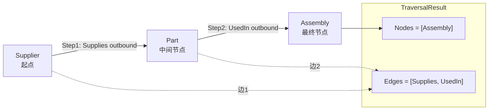

# TestTraverse_MultiStep_NodesAreFinalStep 测试说明

对应测试函数：`TestTraverse_MultiStep_NodesAreFinalStep`（`provider_link_extra_test.go:81`）

## 测试目的

验证 **多步图遍历（multi-step traverse）** 的语义：

1. **`Nodes` 只包含最后一步到达的节点**（final step），不包含中间步骤的节点。
2. **`Edges` 包含整个遍历路径上经过的所有边**（所有 hop 的 link 都会被收集）。
3. **`TotalCount` 等于最终步节点总数**（与 `Nodes` 长度一致，分页前）。

该测试覆盖 U6（Traverse 能力）与 AE8（图遍历结果语义）。

---

## 测试数据

### 本体 Schema

| 对象类型 | 说明 |
|---------|------|
| `Supplier` | 供应商 |
| `Part` | 零件 |
| `Assembly` | 装配体 |

| 链接类型 | From → To | 基数 |
|---------|-----------|------|
| `Supplies` | Supplier → Part | ManyToMany |
| `UsedIn` | Part → Assembly | ManyToMany |

### 实例与链接

```
Supplier (Acme)
    │
    │ Supplies (outbound)
    ▼
Part (P1)
    │
    │ UsedIn (outbound)
    ▼
Assembly (A1)
```

创建顺序：

1. `CreateObject("Supplier", {name: "Acme"})` → `s`
2. `CreateObject("Part", {sku: "P1"})` → `pt`
3. `CreateObject("Assembly", {name: "A1"})` → `asm`
4. `CreateLink("Supplies", s._id, pt._id)`
5. `CreateLink("UsedIn", pt._id, asm._id)`

---

## 遍历请求

```go
p.Traverse(a, s._id, spi.TraversalPath{
    Steps: []spi.TraversalStep{
        {LinkType: "Supplies", Direction: "outbound"},  // Step 1
        {LinkType: "UsedIn",   Direction: "outbound"},  // Step 2
    },
}, nil)
```

| 参数 | 值 | 含义 |
|------|-----|------|
| `startID` | Supplier 的 `_id` | 遍历起点 |
| `Steps[0]` | Supplies / outbound | 从 Supplier 沿 Supplies 出边走到 Part |
| `Steps[1]` | UsedIn / outbound | 从 Part 沿 UsedIn 出边走到 Assembly |
| `options` | `nil` | 默认：不含已删除对象/链接，无分页限制 |

---

## Traverse 查询过程

实现位于 `provider.go` 的 `Traverse` 方法。核心逻辑是 **按步迭代扩展 frontier**，每步重置 `stepNodes`，最终只输出最后一步的节点。

### 初始化

```
currentIDs  = { startID }           // 当前 frontier：Supplier
collectedEdges = {}                 // 累积所有步经过的边
stepNodes = {}                      // 当前步到达的节点（每步重置）
totalNodesSeen = 0
```

### Step 1：Supplies / outbound

对 `currentIDs` 中每个 `objectID`（即 Supplier），扫描全部 `p.links`：

| 过滤条件 | 说明 |
|---------|------|
| `_tenantId == ctx.TenantID` | 租户隔离 |
| `_type == "Supplies"` | 匹配本步 link 类型 |
| `_deletedAt == nil` | 排除已删除链接（默认） |
| `_fromId == objectID` | outbound：当前节点必须是边的起点 |

匹配到 Supplies 边：`Supplier → Part`

- 将边写入 `collectedEdges`
- 将 Part 写入 `stepNodes`（本步节点）
- 将 Part 的 `_id` 加入 `nextIDs`

**Step 1 结束状态：**

```
currentIDs  = { Part._id }
stepNodes   = { Part }
collectedEdges = { Supplies 边 × 1 }
```

> Part 存在于 Step 1 的 `stepNodes`，但会在 Step 2 开始时被 **清空**。

### Step 2：UsedIn / outbound

`stepNodes` 被重置为空。对 `currentIDs`（Part）重复同样流程：

| 过滤条件 | 值 |
|---------|-----|
| `_type` | `"UsedIn"` |
| `_fromId` | Part._id（outbound） |

匹配到 UsedIn 边：`Part → Assembly`

- 将边写入 `collectedEdges`
- 将 Assembly 写入 `stepNodes`
- 将 Assembly 的 `_id` 加入 `nextIDs`

**Step 2 结束状态：**

```
currentIDs  = { Assembly._id }
stepNodes   = { Assembly }          // 仅保留最后一步的节点
collectedEdges = { Supplies 边, UsedIn 边 }  // 两步的边都保留
```

### 组装结果

1. 将 `stepNodes` 中的对象 clone 后填入 `result.Nodes`
2. 将 `collectedEdges` 中的 link clone 后填入 `result.Edges`
3. `TotalCount = len(nodes)`（分页前总数）
4. 若 `options` 指定 `Offset`/`Limit`，仅对 `Nodes` 切片，**Edges 不受分页影响**

---

## 本测试的期望断言

| 断言 | 期望值 | 验证点 |
|------|--------|--------|
| `res.TotalCount` | `1` | 最终步只有 1 个节点 |
| `len(res.Nodes)` | `1` | Nodes 仅含最后一步 |
| `res.Nodes[0]._id` | `asm._id` | 最终节点是 Assembly，不是 Part |
| `len(res.Edges)` | `2` | 包含 Supplies 与 UsedIn 两条边 |

**关键语义总结：**

- Part 是 **中间节点**：参与 Step 1 → Step 2 的 frontier 传递，但 **不会出现在 `Nodes` 中**。
- Supplier 是 **起点**：不在任何步的 `stepNodes` 里（只有被遍历到的 target 才写入 `stepNodes`）。
- 两条 link 都是遍历过程中实际走过的边，因此 **全部出现在 `Edges` 中**。

---

## 流程图



---

## 相关边界行为（同文件其他测试）

| 测试 | 行为 |
|------|------|
| `TestTraverse_DepthExceedsMax_Errors` | 步数 > 10 时返回 error |
| `Capabilities().MaxTraversalDepth` | 最大深度为 10 |
| `Capabilities().SupportsGraphTraversal` | 内存 provider 支持图遍历 |

---

## 实现要点（provider.go）

```go
for _, step := range path.Steps {
    nextIDs := map[string]struct{}{}
    stepNodes = map[string]spi.OntologyObject{}  // 每步重置：Nodes 只反映最后一步

    for objectID := range currentIDs {
        for _, link := range p.links {
            // 租户、类型、方向、删除状态、Filter 过滤 ...
            collectedEdges[edgeKey] = link   // 边跨步累积
            stepNodes[nodeKey] = targetObj   // 节点仅当前步
            nextIDs[targetID] = struct{}{}
        }
    }
    currentIDs = nextIDs  // frontier 传递给下一步
}
```

`stepNodes` 在每一步开始时被清空，是「Nodes 仅含 final step」这一语义的根本来源。
