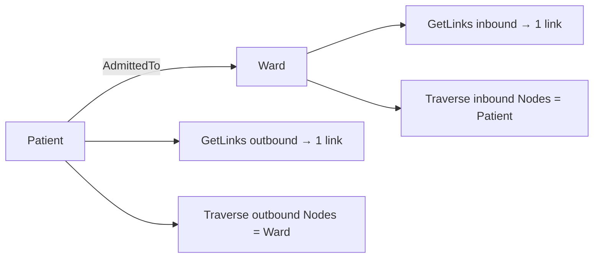
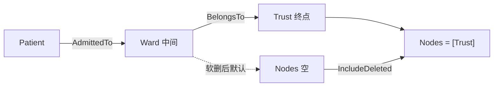
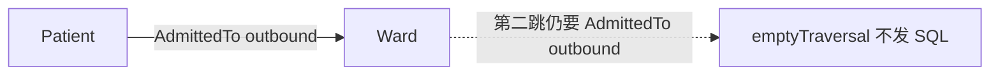

# `links_test.go` 测试说明

对应文件：`runtime/storage/sqliteobda/links_test.go`

本文件测 sqliteobda 的 link CRUD、`GetLinks` 单跳 JOIN、以及 `Traverse` 链式 JOIN（只交终点 `Nodes`）。Traverse 相关函数如下。

| 测试函数 | 覆盖点 |
|---------|--------|
| `TestGetLinksAndTraverse` | 一跳 GetLinks 双向；Traverse outbound / inbound；空 Steps 与入口错误 |
| `TestTraverseTwoHopTerminal` | Patient → Ward → Trust；`Nodes` 仅为 Trust；中间 Ward 软删 |
| `TestTraverseSoftDeletedHopLink` | 同一两跳路径；第一跳 link 软删 |
| `TestTraverseBrokenTypeChainEmpty` | 两跳类型链断裂 → 空 `Nodes`，不报错 |

JOIN 条数（`len(Joins)==4`）在 `runtime/obda/planner_test.go` 的 `TestPlanTraverseTwoHops`，不连库。

---

## 共享夹具

`activateHospital(t, card)`：编译 `testdata/hospital.obda.yaml`，`InitMappedSchema` 建表，再 `ApplySchema`。创建 Patient Ada 与 Ward A，租户 `t1`。

| 对象类型 | 业务表 | identity 列 |
|---------|--------|-------------|
| `Patient` | `patient` | `id` |
| `Ward` | `ward` | `id` |
| `Trust` | `trust` | `id` |

| 链接类型 | From → To | 业务表 | 端点列 | 基数 |
|---------|-----------|--------|--------|------|
| `AdmittedTo` | Patient → Ward | `admission` | `from_id` / `to_id` | 本文件 Traverse 金路径用 ManyToMany |
| `BelongsTo` | Ward → Trust | `ward_trust` | `from_id` / `to_id` | ManyToMany |

租户列均为 `tenant_id`；系统列 native（含 `deleted_at`）。对象 `_id` 为 `EncodeDirect` 全局 id，JOIN 时与业务表 `id` 对齐。

两跳图：

```
Patient (Ada)
    │ AdmittedTo outbound
    ▼
Ward (A)
    │ BelongsTo outbound
    ▼
Trust (NHS)
```

`Traverse`：先 `loadObject` 确认起点行，再 `PlanTraverse` **一条**链式 JOIN，只投影终点对象列。不逐步调用 `GetLinks`。成功路径 `assertTerminalOnly`：`Edges` / `Visited` 非 nil 且长度为 0。一跳两条 JOIN，两跳四条。起点表不加 `deleted_at` 谓词。

---

## `TestGetLinksAndTraverse`

对应：`links_test.go:156`

### 测试目的

验证 hospital 业务表上的 **单跳** 导航：

1. **`GetLinks` 双向对称**：同一条 `AdmittedTo` 行，从 Patient outbound 与从 Ward inbound 各得到 1 条 link。
2. **`Traverse` 只交终点 `Nodes`**：outbound 终点是 Ward，inbound 终点是 Patient。
3. **空路径与错误入口**：空 `Steps` 不报错且不查库；未知 link、起点类型不符、深度 > 8、坏 id、跨租户落到约定 sentinel。

本函数不创建 Trust / BelongsTo。

### 实例

1. `CreateObject("Patient", {name: "Ada"})` → `patientID`
2. `CreateObject("Ward", {name: "A"})` → `wardID`
3. `CreateLink("AdmittedTo", patientID, wardID, nil)`

### GetLinks

```go
p.GetLinks(ctx, patientID, "AdmittedTo", "outbound", nil)
p.GetLinks(ctx, wardID,   "AdmittedTo", "inbound",  nil)
```

实现：`PlanGetLinksJoin`。FROM `admission AS l`，INNER JOIN 对端对象表 `AS p`，SELECT **link 列**。

| 方向 | `l` 上的当前端点列 | JOIN 的对端表 | 对端 FK |
|------|-------------------|---------------|---------|
| outbound | `from_id = patientID` | `ward` | `to_id` |
| inbound | `to_id = wardID` | `patient` | `from_id` |

示意（outbound，非 SQL 快照）：

```text
FROM admission AS l
INNER JOIN ward AS p
  ON p.id = l.to_id AND p.tenant_id = l.tenant_id
WHERE l.tenant_id = ? AND l.from_id = ?
  AND l.deleted_at IS NULL AND p.deleted_at IS NULL
```

`GetLinks(..., IncludeDeleted: true)` 仍藏软删 peer，见 `TestGetLinksHidesDeletedPeer`。

### Traverse 一跳 outbound

```go
p.Traverse(ctx, patientID, spi.TraversalPath{
    Steps: []spi.TraversalStep{{LinkType: "AdmittedTo", Direction: "outbound"}},
}, nil)
```

`DecodeDirect(patientID)` 得 `Patient`，与 AdmittedTo outbound 的 from 一致。SELECT `s1`（Ward）列。

```text
FROM patient AS s0
INNER JOIN admission AS l0
  ON l0.from_id = s0.id AND l0.tenant_id = s0.tenant_id
INNER JOIN ward AS s1
  ON s1.id = l0.to_id AND s1.tenant_id = l0.tenant_id
WHERE s0.id = ? AND s0.tenant_id = ?
  AND l0.deleted_at IS NULL AND s1.deleted_at IS NULL
ORDER BY s1.id, l0.id
```

期望：`Nodes = [Ward]`。

### Traverse 一跳 inbound

起点必须是 AdmittedTo 的 **to**（Ward）。端点对调：`l0.to_id = s0.id`，目标表 `patient`。期望：`Nodes = [Patient]`。

### 空 Steps

`len(path.Steps)==0` 直接 `emptyTraversal()`，不 `loadObject`、不发 SQL。无 error，`Nodes` 空，仍 `assertTerminalOnly`。

### 错误入口

| 调用 | 触发点 | 期望 error |
|------|--------|------------|
| `LinkType: "NoSuch"` | `startTypeForPath` → `act.link` | `ErrLinkNotFound` |
| 起点 `wardID` + AdmittedTo **outbound** | Decode 得 Ward，outbound 要求 Patient | `ErrObjectNotFound` |
| 9 步 `AdmittedTo` | `len(Steps) > 8`（sqlite 上限 8，不是 memory 的 10） | `ErrUnsupportedCapability` |
| `startID: "missing"` | `DecodeDirect` 失败 | `ErrObjectNotFound` |
| `TenantID: "t2"` | 起点 `loadObject` 无行 | `ErrObjectNotFound` |

错类型发生在 JOIN 之前，不会退化成「JOIN 零行」。JOIN 零行应空 `Nodes` 且 `TotalCount=0`，不是 NotFound。

### 期望断言

| 断言 | 期望值 |
|------|--------|
| outbound / inbound `GetLinks` `len(Items)` | 各 `1` |
| outbound Traverse `Nodes[0]._id` | `wardID` |
| inbound Traverse `Nodes[0]._id` | `patientID` |
| `Edges` / `Visited` | 非 nil、长度 0 |
| 空 Steps `len(Nodes)` | `0` |

与 memory `TestTraverse_MultiStep_NodesAreFinalStep`：memory 的 `Nodes` 也是最后一步，但 **`Edges` 累积全路径**；sqliteobda 本轮不把 link 行装进 `Edges`。



---

## `TestTraverseTwoHopTerminal`

对应：`links_test.go:303`

### 测试目的

1. **`Nodes` 只含最后一跳对象**：两跳后是 Trust，不是中间 Ward。
2. **中间对象软删默认断路**：软删 Ward 后 INNER JOIN + `s1.deleted_at IS NULL` 使 JOIN 零行。
3. **`IncludeDeleted` 放开沿途未 omit 的软删谓词**（含中间对象），Trust 重新出现。
4. 成功路径仍 `assertTerminalOnly`（无 Edges）。

覆盖 chained-join AE2 / AE4 的中间 hop。

### 实例

1. `CreateObject("Trust", {name: "NHS"})` → `trustID`
2. `CreateLink("AdmittedTo", patientID, wardID)`
3. `CreateLink("BelongsTo", wardID, trustID)`

### 遍历请求

```go
path := spi.TraversalPath{Steps: []spi.TraversalStep{
    {LinkType: "AdmittedTo", Direction: "outbound"},
    {LinkType: "BelongsTo",  Direction: "outbound"},
}}
p.Traverse(ctx, patientID, path, nil)
```

| 参数 | 值 |
|------|-----|
| `startID` | Patient `_id` |
| Step 1 | AdmittedTo / outbound → Ward |
| Step 2 | BelongsTo / outbound → Trust |
| `options` | 先 `nil`，再 `IncludeDeleted: true` |

### 查询过程

Provider 校验相邻 hop：AdmittedTo 的 to 是 Ward，BelongsTo 的 from 是 Ward，类型链连续，于是发出一条四 JOIN 计划。SELECT 只取 `s2`（trust）列。

```text
FROM patient AS s0
INNER JOIN admission AS l0
  ON l0.from_id = s0.id AND l0.tenant_id = s0.tenant_id
INNER JOIN ward AS s1
  ON s1.id = l0.to_id AND s1.tenant_id = l0.tenant_id
INNER JOIN ward_trust AS l1
  ON l1.from_id = s1.id AND l1.tenant_id = s1.tenant_id
INNER JOIN trust AS s2
  ON s2.id = l1.to_id AND s2.tenant_id = l1.tenant_id
WHERE s0.id = ? AND s0.tenant_id = ?
  AND l0.deleted_at IS NULL AND s1.deleted_at IS NULL
  AND l1.deleted_at IS NULL AND s2.deleted_at IS NULL
ORDER BY s2.id, l1.id
```

默认路径：Ward 活着 → `Nodes = [Trust]`。

然后 `DeleteObject("Ward", wardID, "soft")`。`s1.deleted_at` 非空，默认谓词把行滤掉 → `len(Nodes)==0`（JOIN 零行，不是 NotFound）。

`IncludeDeleted: true` 时每跳 `OmitLinkDeleted` / `OmitTargetDeleted` 为 true，上述四条 `deleted_at IS NULL` 都去掉（`s0` 本来就没有）。Ward 软删仍能 JOIN 到 Trust → `Nodes = [Trust]`。

### 期望断言

| 阶段 | 断言 | 期望值 |
|------|------|--------|
| 默认 | `len(Nodes)` / `Nodes[0]._id` | `1` / `trustID` |
| 默认 | `Edges` / `Visited` | 空切片 |
| 软删 Ward 后默认 | `len(Nodes)` | `0` |
| `IncludeDeleted` | `Nodes[0]._id` | `trustID` |

Ward 是 **中间节点**：参与 JOIN，但不会出现在 `Nodes` 里。Patient 是起点，也不在 `Nodes` 里。



---

## `TestTraverseSoftDeletedHopLink`

对应：`links_test.go:450`

### 测试目的

与上例同一条两跳路径，但软删的是 **第一跳 link**（`admission` 行），不是中间 Ward。默认 `l0.deleted_at IS NULL` 断路；`IncludeDeleted` 后仍能走到 Trust。

### 实例

建 Trust、AdmittedTo、BelongsTo 后：

```go
p.DeleteLink(ctx, "AdmittedTo", link._id)
p.Traverse(ctx, patientID, path, nil)                          // 空 Nodes
p.Traverse(ctx, patientID, path, &spi.TraversalOptions{IncludeDeleted: true})  // Trust
```

对象行都还活着；只有 `admission.deleted_at` 被写下。INNER JOIN 仍能连上 Ward / Trust，但默认软删谓词把 `l0` 滤掉。

### 期望断言

| 阶段 | 期望 |
|------|------|
| 默认 | `len(Nodes)==0` |
| `IncludeDeleted` | `Nodes[0]._id == trustID` |

与 `TestTraverseTwoHopTerminal` 的差别：那边断的是 **中间对象表** `s1`，这边断的是 **沿途 link 表** `l0`。`IncludeDeleted` 两种都放开。

---

## `TestTraverseBrokenTypeChainEmpty`

对应：`links_test.go:413`

### 测试目的

第二跳的 from/to 与上一跳到达类型对不上时：**空 `Nodes`，`TotalCount=0`，不报错**。这不是未知 `LinkType`（那是 `ErrLinkNotFound`），也不是起点类型不符（那是 `ErrObjectNotFound`）。

### 请求

图上只有 Patient → AdmittedTo → Ward。路径却是：

```go
p.Traverse(ctx, patientID, spi.TraversalPath{Steps: []spi.TraversalStep{
    {LinkType: "AdmittedTo", Direction: "outbound"}, // 到达 Ward
    {LinkType: "AdmittedTo", Direction: "outbound"}, // 仍要求 from = Patient
}}, nil)
```

Step 1 合法：起点 Patient = AdmittedTo.from。Step 2 时期望 from 仍是 Patient，但 `prevType` 已是 Ward → 类型链断裂。

实现在拼 `TraverseHop` 时 `if want != prevType { return emptyTraversal() }`，**不发 SQL**。

### 期望断言

| 断言 | 期望值 |
|------|--------|
| `err` | `nil` |
| `len(Nodes)` / `TotalCount` | `0` / `0` |
| `Edges` / `Visited` | 非 nil 空切片 |

9 步超深是 `ErrUnsupportedCapability`（`TestGetLinksAndTraverse`）；这里两步合法深度，只是类型接不上。



---

## 其他边界（同文件、未展开）

| 测试 | 行为 |
|------|------|
| `TestTraverseDuplicateTerminalsAndPaging` | 同一终点两条 AdmittedTo 不去重；`Offset` 切终点行 |
| `TestTraverseLimitDefaultsAndCap` | `Limit 0` → 100；`Limit 1001` → 1000 |
| `TestTraverseSoftDeletedStartStillFound` | 软删 Patient 后仍能 Traverse 到 Ward（起点表无 `deleted_at` 谓词） |
| `TestTraverseHidesDeletedPeerUntilIncludeDeleted` | 一跳软删终点 Ward；对比 GetLinks 对 IncludeDeleted 仍藏 peer |
| `TestGetLinksHidesDeletedPeer` | GetLinks 默认与 IncludeDeleted 都不返回软删对端 |
| `TestHardDeleteCascadesLinks` | 硬删对象后 admission 行消失 |

---

## 实现要点

`GetLinks` 用 `PlanGetLinksJoin`（别名 `l`/`p`，投影 link 列）。`Traverse` 用 `PlanTraverse`（`s0`/`l0`/`s1`/…，投影终点对象列）。分页按 Binding identity：终点列 ASC，最后一跳 link identity ASC。`TotalCount` 为分页前 JOIN 行数，不去重。

```go
if len(path.Steps) == 0 {
    return emptyTraversal(), nil
}
if len(path.Steps) > 8 {
    return spi.TraversalResult{}, spi.ErrUnsupportedCapability
}
startType, err := startTypeForPath(act, startID, path.Steps[0])
// 相邻 hop want != prevType → emptyTraversal()
sel, args, err := obda.PlanTraverse(startModel.Binding(), hops, ctx.TenantID, startID)
```
